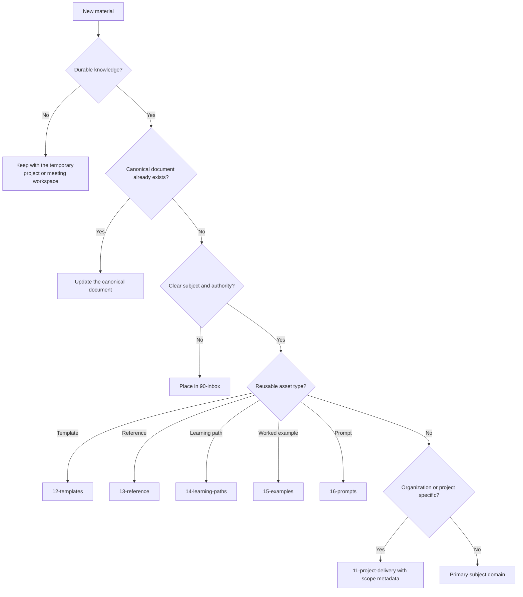

# Adding New Content

## Decision Tree

## Questions to Answer

1. Is the material durable knowledge or temporary project work?
2. Is it organized around a subject, technology, capability, or reusable asset?
3. Is it a guide, template, prompt, example, reference, runbook, or decision record?
4. Does a canonical document already cover the same purpose and audience?
5. Should the existing document be extended instead of creating a new file?
6. Is the content general, organization-specific, or project-specific?
7. Who can verify and maintain it?

When the answer remains unclear, use `90-inbox/` and create a review note rather than guessing.
