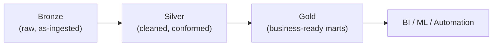
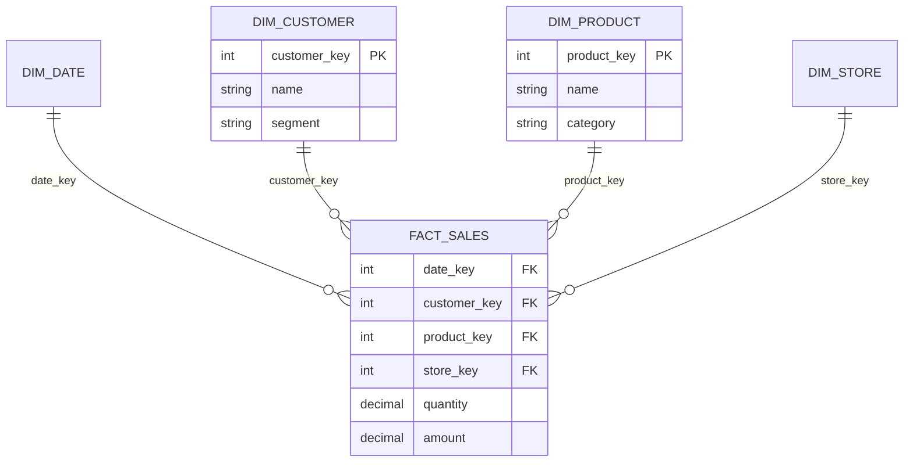
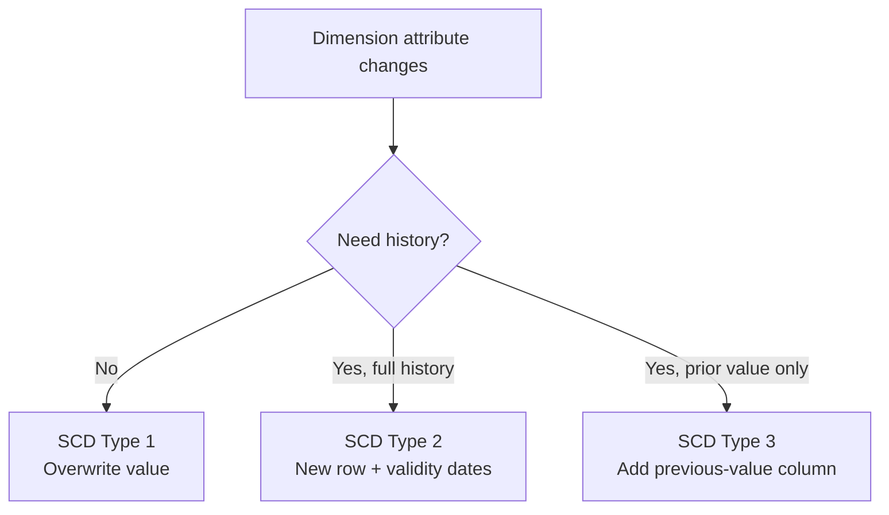

# Data Modeling — Repeatable Patterns

> Visual reference for the core modeling patterns used to build trusted, reusable analytics data: layered (medallion) architecture, dimensional (star) modeling, slowly changing dimensions, and getting the grain right.

## Layered (Medallion) Architecture

Organize transformations into progressive quality layers. Each layer has a clear contract.

| Layer | Contents | Rule of thumb |
|---|---|---|
| **Bronze** | Raw, append-only, source-shaped | Never overwrite; preserve history |
| **Silver** | Cleaned, typed, deduped, conformed | One version of each entity |
| **Gold** | Aggregated facts & dimensions | Modeled for consumption |

## Star Schema (Dimensional Model)

A central **fact** table (measures) surrounded by **dimension** tables (context). Optimized for analytics.

| Concept | Definition |
|---|---|
| **Fact** | Measurable events (sales, clicks) at a defined grain |
| **Dimension** | Descriptive context (who, what, where, when) |
| **Surrogate key** | System-generated key (e.g., `product_key`) independent of source IDs |
| **Conformed dimension** | Shared dimension reused across multiple facts |

## Star vs Snowflake

| Model | Dimensions | Trade-off |
|---|---|---|
| **Star** | Denormalized (flat) | Fewer joins, faster reads, simpler — usually preferred |
| **Snowflake** | Normalized (split into sub-dims) | Less redundancy, more joins, more complex |

## Fact Table Types

| Type | Grain | Example |
|---|---|---|
| **Transaction** | One row per event | Each sale line |
| **Periodic snapshot** | One row per entity per period | Daily account balance |
| **Accumulating snapshot** | One row per process, updated over time | Order lifecycle milestones |

## Slowly Changing Dimensions (SCD)

How to handle attribute changes in dimensions over time.

| Type | Behavior | Keeps history? |
|---|---|---|
| **Type 0** | Never changes (fixed) | N/A |
| **Type 1** | Overwrite in place | No |
| **Type 2** | Add new row with `valid_from`/`valid_to`/`is_current` | Yes (full) |
| **Type 3** | Add a "previous value" column | Partial |

## Getting the Grain Right

The **grain** is what one row represents. Declare it first — everything else follows.

- State the grain in plain language: "one row per order line per day".
- Never mix grains in one fact table (leads to double-counting).
- Additive measures sum across all dimensions; semi/non-additive measures do not.

## Naming Conventions

| Object | Convention | Example |
|---|---|---|
| Fact table | `fact_<process>` | `fact_sales` |
| Dimension | `dim_<entity>` | `dim_customer` |
| Surrogate key | `<entity>_key` | `customer_key` |
| Natural/business key | `<entity>_id` | `customer_id` |
| Staging model | `stg_<source>__<entity>` | `stg_shopify__orders` |

## Common Mistakes & Fixes

- **Undefined grain** — declare it before modeling; validate every measure against it.
- **Mixed grains in one fact** — split into separate fact tables.
- **Using source IDs as keys** — add surrogate keys to decouple from source changes.
- **Overwriting when history matters** — use SCD Type 2 for auditable attributes.
- **Over-normalizing analytics models** — prefer star over snowflake for BI.

## Red Flags

- Facts with text descriptions instead of foreign keys to dimensions.
- Dimensions with no surrogate key.
- Reports that double-count due to fan-out joins.
- No documented grain or lineage for a mart.

## Beginner-to-Pro Notes

| Level | Focus |
|---|---|
| Beginner | Tables, keys, relationships, normalization basics. |
| Advanced Beginner | Facts vs dimensions, star schema, grain. |
| Intermediate Practitioner | SCD types, conformed dimensions, snapshots. |
| Advanced Practitioner | Medallion layering, bridge tables, late-arriving data. |
| Enterprise Professional | Enterprise bus matrix, MDM, governance. |
| Architect / Strategic Lead | Modeling standards, semantic layer strategy. |
