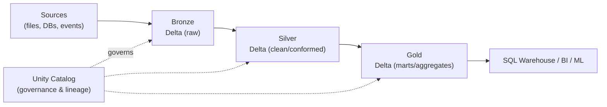
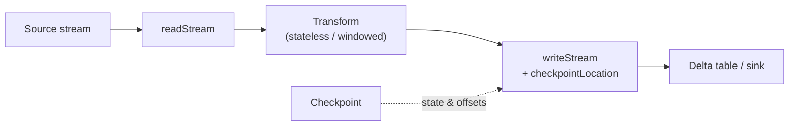

# Databricks — Repeatable Patterns

> Visual reference for building reliable data solutions on Databricks: the lakehouse/medallion layout, Delta Lake fundamentals, incremental ingestion with Auto Loader, streaming with Structured Streaming, Delta Live Tables, and cluster/job choices.

## Lakehouse & Medallion on Databricks

Databricks implements the lakehouse using **Delta Lake** tables organized into medallion layers, governed by **Unity Catalog**.



## Delta Lake Essentials

| Feature | Why it matters |
|---|---|
| ACID transactions | Safe concurrent reads/writes |
| Time travel | Query/restore prior versions (`VERSION AS OF`) |
| Schema enforcement | Rejects bad writes; `mergeSchema` to evolve |
| `MERGE INTO` | Upserts / SCD handling in one statement |
| `OPTIMIZE` + Z-ORDER | Compaction and data skipping for fast reads |
| `VACUUM` | Remove old files (mind retention window) |

```sql
-- Upsert pattern (SCD-friendly)
MERGE INTO silver.customers t
USING staging.customers s
ON t.customer_id = s.customer_id
WHEN MATCHED THEN UPDATE SET *
WHEN NOT MATCHED THEN INSERT *;
```

## Pattern 1: Incremental Ingestion with Auto Loader

**Use when:** continuously landing files (cloud storage) into Bronze without reprocessing everything.

```python
df = (spark.readStream
      .format("cloudFiles")
      .option("cloudFiles.format", "json")
      .option("cloudFiles.schemaLocation", "/chk/schema")
      .load("/landing/events"))

(df.writeStream
   .option("checkpointLocation", "/chk/bronze_events")
   .trigger(availableNow=True)
   .toTable("bronze.events"))
```

- Auto Loader tracks processed files via checkpoint — exactly-once, incremental.
- Use `trigger(availableNow=True)` for batch-like scheduled runs; omit for continuous.

## Pattern 2: Structured Streaming Backbone



- **Always** set `checkpointLocation` — it stores offsets and state for recovery.
- Pick output mode (`append` / `update` / `complete`) to match the query.
- Use watermarks for late data in windowed aggregations.

## Pattern 3: Delta Live Tables (DLT) Declarative Pipelines

**Use when:** you want managed, declarative pipelines with built-in quality and lineage.

```python
import dlt

@dlt.table
def bronze_events():
    return spark.readStream.format("cloudFiles")...

@dlt.table
@dlt.expect_or_drop("valid_id", "id IS NOT NULL")
def silver_events():
    return dlt.read_stream("bronze_events").where("id IS NOT NULL")
```

- `@dlt.expect*` defines data-quality constraints (warn / drop / fail).
- DLT manages dependencies, retries, and lineage automatically.

## Pattern 4: Idempotent, Restartable Jobs

| Technique | Benefit |
|---|---|
| Checkpoints (streaming/Auto Loader) | Resume without duplicates |
| `MERGE` instead of blind append | Safe re-runs |
| Partitioned overwrite by date | Reprocess a single day cleanly |
| Job `retries` + task dependencies | Resilient orchestration |

## Cluster & Compute Choices

| Compute | Use when |
|---|---|
| **Job cluster** | Scheduled/production jobs (ephemeral, cost-efficient) |
| **All-purpose cluster** | Interactive development/notebooks |
| **SQL Warehouse** | BI/SQL analytics on Gold |
| **Serverless** | Fast startup, managed scaling (where available) |
| Photon | Enable for vectorized SQL/DataFrame speedups |

## Governance with Unity Catalog

- Three-level namespace: `catalog.schema.table`.
- Grant at catalog/schema level; avoid table-by-table sprawl.
- Lineage and audit are automatic — use them for impact analysis.

## Common Mistakes & Fixes

- **No checkpoint on streams** — set `checkpointLocation` for every stream.
- **Blind appends causing duplicates** — use `MERGE` and idempotent keys.
- **Never running `OPTIMIZE`** — small-file problem slows reads; compact + Z-ORDER.
- **`VACUUM` with too-short retention** — can break time travel and running readers.
- **Interactive clusters for prod jobs** — use job clusters for cost and isolation.

## Red Flags

- Tables outside Unity Catalog (no lineage/governance).
- Full reloads where incremental (Auto Loader/MERGE) would work.
- Hard-coded storage paths instead of catalog tables/volumes.
- Unbounded state in streaming with no watermark.

## Beginner-to-Pro Notes

| Level | Focus |
|---|---|
| Beginner | Notebooks, DataFrames, read/write Delta tables. |
| Advanced Beginner | Medallion layers, `MERGE`, basic SQL warehouse. |
| Intermediate Practitioner | Auto Loader, Structured Streaming, checkpoints. |
| Advanced Practitioner | DLT, OPTIMIZE/Z-ORDER, performance tuning. |
| Enterprise Professional | Unity Catalog governance, job orchestration, cost. |
| Architect / Strategic Lead | Lakehouse strategy, multi-workspace, platform standards. |
