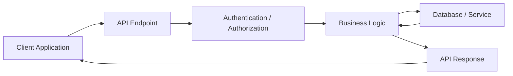
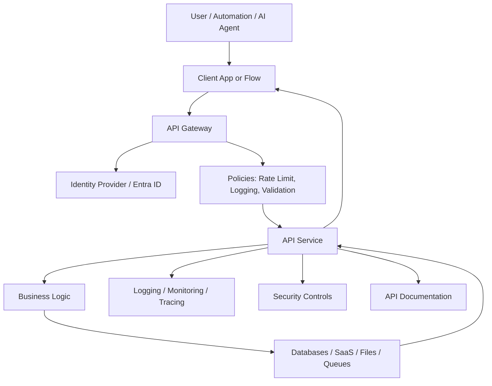
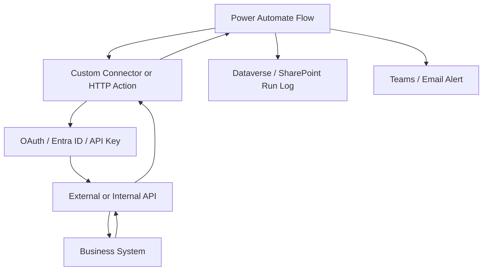
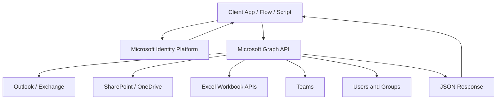

# APIs Reference Guide

---

## 1. Executive Summary

An **API**, or **Application Programming Interface**, is a structured way for one system to communicate with another system.

In plain terms, an API lets software ask another system to do something or return information.

Examples:

```text
Get the latest emails from Outlook.
Create a file in SharePoint.
Update a row in an Excel workbook.
Fetch policy data from Databricks.
Generate a PDF from a document service.
Send an approval request.
Create a ticket in Jira or ServiceNow.
```

For a technical professional, APIs are one of the most important concepts to master because they are the foundation of modern integration, automation, data movement, cloud applications, AI workflows, and enterprise architecture.

APIs help teams answer:

* How do systems exchange data?
* How do automations interact with business applications?
* How do we avoid manual copy/paste work?
* How do we securely expose business capabilities?
* How do we connect Power Platform, Databricks, SharePoint, Outlook, Excel, SQL, Azure, and third-party systems?
* How do we govern access, errors, rate limits, and sensitive data?

For enterprise automation and data work, APIs are not optional knowledge. They are a core professional skill.

---

## 2. Plain-English Explanation

Think of an API like a restaurant menu.

You do not walk into the kitchen and make the food yourself. You look at the menu, choose an item, place an order, and the kitchen returns the result.

An API works similarly:

```text
Client asks for something
   ↓
API receives the request
   ↓
System processes the request
   ↓
API returns a response
```

Example:

```http
GET /users/123
```

Plain-English meaning:

```text
Please get me information about user 123.
```

Response:

```json
{
  "id": "123",
  "displayName": "Dionne Artsen",
  "email": "dionne@example.com"
}
```

The API acts as a controlled front door into a system.

---

## 3. Business Context

APIs matter because most business processes depend on multiple systems.

A single workflow may involve:

* Outlook
* SharePoint
* Excel
* Dataverse
* Databricks
* SQL Server
* Power Automate
* UiPath
* ServiceNow
* Salesforce
* Azure Functions
* Power BI
* Custom internal applications
* Vendor platforms

Without APIs, teams often rely on:

* Manual exports
* Email attachments
* Copy/paste work
* Screen scraping
* Shared spreadsheets
* Fragile desktop automation
* Duplicate data entry

With APIs, teams can create structured, secure, repeatable integrations.

### Business Value of APIs

| Business Need | How APIs Help                                                     |
| ------------- | ----------------------------------------------------------------- |
| Automation    | APIs let workflows trigger actions across systems                 |
| Data access   | APIs expose data without direct database access                   |
| Security      | APIs control authentication, permissions, and scope               |
| Scalability   | APIs allow repeatable machine-to-machine communication            |
| Governance    | APIs create traceable, auditable integration points               |
| Speed         | APIs reduce manual handoffs and delays                            |
| Reliability   | APIs reduce dependency on fragile UI automation                   |
| AI enablement | APIs allow AI agents and copilots to safely call business systems |
| Reusability   | One API can support many applications and workflows               |

---

## 4. Core Concepts

---

### 4.1 API

An **API** defines how systems communicate.

It usually specifies:

* Available operations
* Required inputs
* Response format
* Authentication method
* Permissions
* Error messages
* Rate limits
* Versioning rules

---

### 4.2 Client

The **client** is the system making the API request.

Examples:

* Power Automate flow
* Power App
* Python script
* Azure Function
* UiPath bot
* Web application
* Mobile app
* Postman
* AI agent
* Custom connector

---

### 4.3 Server

The **server** is the system receiving the request and returning a response.

Examples:

* Microsoft Graph
* Databricks API
* SharePoint API
* ServiceNow API
* Salesforce API
* Internal enterprise API
* PDF generation API

---

### 4.4 Endpoint

An **endpoint** is a specific URL where an API operation is available.

Example:

```http
GET https://graph.microsoft.com/v1.0/me/messages
```

Plain-English meaning:

```text
Get messages for the signed-in Microsoft 365 user.
```

---

### 4.5 HTTP Methods

Most modern APIs use HTTP methods.

| Method   | Meaning                | Example                 |
| -------- | ---------------------- | ----------------------- |
| `GET`    | Read data              | Get emails              |
| `POST`   | Create or submit data  | Create a folder         |
| `PUT`    | Replace or upload data | Upload a file           |
| `PATCH`  | Partially update data  | Update an Excel range   |
| `DELETE` | Delete data            | Delete a file or record |

---

### 4.6 Request

A **request** is what the client sends to the API.

A request usually includes:

* Method
* URL
* Headers
* Query parameters
* Body

Example:

```http
GET https://graph.microsoft.com/v1.0/me/messages?$top=10
Authorization: Bearer {access_token}
Accept: application/json
```

---

### 4.7 Response

A **response** is what the API sends back.

Example:

```json
{
  "value": [
    {
      "subject": "Renewal Notice",
      "from": {
        "emailAddress": {
          "address": "broker@example.com"
        }
      },
      "receivedDateTime": "2026-07-04T13:45:00Z"
    }
  ]
}
```

---

### 4.8 Headers

**Headers** carry metadata about the request or response.

Common headers:

| Header                | Purpose                                                         |
| --------------------- | --------------------------------------------------------------- |
| `Authorization`       | Sends access token or credential                                |
| `Content-Type`        | Tells API the format of request body                            |
| `Accept`              | Tells API preferred response format                             |
| `Retry-After`         | Tells client when to retry after throttling                     |
| `workbook-session-id` | Used by Microsoft Graph Excel APIs to scope workbook operations |

---

### 4.9 Query Parameters

Query parameters refine the request.

Example:

```http
GET /messages?$top=10&$select=subject,from,receivedDateTime
```

Common Microsoft Graph query options:

| Query Option | Purpose                               |
| ------------ | ------------------------------------- |
| `$select`    | Return only specific fields           |
| `$filter`    | Filter records                        |
| `$top`       | Limit number of records               |
| `$orderby`   | Sort results                          |
| `$expand`    | Include related objects               |
| `$count`     | Return count metadata where supported |

---

### 4.10 Request Body

A **body** sends data to the API.

Example:

```json
{
  "name": "Renewal Notices",
  "folder": {},
  "@microsoft.graph.conflictBehavior": "rename"
}
```

---

### 4.11 Authentication

Authentication answers:

```text
Who are you?
```

Common authentication patterns:

| Pattern            | Description                                                |
| ------------------ | ---------------------------------------------------------- |
| API key            | Simple key passed with request                             |
| Bearer token       | Access token passed in `Authorization` header              |
| OAuth 2.0          | Standard authorization framework                           |
| Client credentials | App authenticates as itself                                |
| Authorization code | User signs in and grants access                            |
| Managed identity   | Azure-hosted resource authenticates without stored secrets |
| Certificate auth   | App proves identity using certificate                      |

---

### 4.12 Authorization

Authorization answers:

```text
What are you allowed to do?
```

Example:

A user may be authenticated but not authorized to read another user’s mailbox or update a SharePoint file.

Microsoft Graph uses delegated and application permission models. Delegated access means the app acts on behalf of a signed-in user, while app-only access means the app acts as itself without a signed-in user. Microsoft Graph exposes delegated permissions and application permissions to support these scenarios.

---

### 4.13 Status Codes

APIs return HTTP status codes to describe the result.

| Status Code                 | Meaning                               |
| --------------------------- | ------------------------------------- |
| `200 OK`                    | Request succeeded                     |
| `201 Created`               | Resource created                      |
| `202 Accepted`              | Request accepted for async processing |
| `204 No Content`            | Success with no body                  |
| `400 Bad Request`           | Request is malformed                  |
| `401 Unauthorized`          | Authentication failed or missing      |
| `403 Forbidden`             | Authenticated but not allowed         |
| `404 Not Found`             | Resource not found                    |
| `409 Conflict`              | Conflict with current state           |
| `429 Too Many Requests`     | Throttled or rate-limited             |
| `500 Internal Server Error` | Server error                          |
| `503 Service Unavailable`   | Service temporarily unavailable       |

---

### 4.14 Payload

A **payload** is the data sent to or returned from an API.

Most modern APIs use JSON.

Example:

```json
{
  "policyNumber": "POL123456",
  "insuredName": "ABC Construction LLC",
  "renewalDate": "2026-09-01"
}
```

---

### 4.15 Schema

A **schema** defines the expected shape of data.

Example:

```json
{
  "type": "object",
  "required": ["policyNumber", "insuredName"],
  "properties": {
    "policyNumber": { "type": "string" },
    "insuredName": { "type": "string" },
    "renewalDate": { "type": "string", "format": "date" }
  }
}
```

Schemas are important for validation, documentation, AI tool calling, and reliable integration.

---

### 4.16 REST API

A **REST API** exposes resources through URLs and standard HTTP methods.

Example:

```http
GET /policies/123
POST /policies
PATCH /policies/123
DELETE /policies/123
```

REST is common because it is simple, web-native, and widely supported.

---

### 4.17 GraphQL API

A **GraphQL API** lets the client specify exactly what fields it wants.

Example:

```graphql
query {
  policy(id: "123") {
    policyNumber
    insuredName
    premium
  }
}
```

GraphQL is useful when clients need flexible data retrieval, but it requires strong governance to avoid expensive queries.

---

### 4.18 Webhook

A **webhook** lets one system notify another system when something happens.

Example:

```text
When a new file is added to SharePoint,
send an HTTP request to a Power Automate flow.
```

Webhooks are event-driven.

---

### 4.19 Pagination

Pagination is how APIs return large results in smaller pages.

Example:

```json
{
  "value": [...],
  "@odata.nextLink": "https://graph.microsoft.com/v1.0/me/messages?$skip=10"
}
```

With Microsoft Graph mail APIs, do not manually extract and manipulate `$skip` from `@odata.nextLink`; Microsoft documents that the API uses `$skip` internally to count all items it has processed in the mailbox.

---

### 4.20 Throttling

**Throttling** happens when too many requests are made too quickly.

Microsoft Graph recommends detecting HTTP `429`, reading the `Retry-After` response header, waiting that many seconds, and retrying.

---

## 5. Architecture View

---

### 5.1 Basic API Architecture



---

### 5.2 Enterprise API Architecture



---

### 5.3 Power Platform API Architecture



---

### 5.4 Microsoft Graph Architecture



Microsoft Graph is the common API layer for many Microsoft 365 resources, including Outlook mail, SharePoint files, OneDrive files, Excel workbooks, Teams, users, and groups.

---

## 6. Data / Process Flow

A typical API process follows this sequence:

```text
1. Identify business need.
2. Identify source and target systems.
3. Determine API endpoint.
4. Register app or obtain credentials.
5. Request access token or API key.
6. Build request.
7. Send request.
8. Receive response.
9. Validate response.
10. Handle errors and retries.
11. Log the transaction.
12. Continue downstream process.
```

### Example Flow

```text
Power Automate receives request
   ↓
Gets access token
   ↓
Calls Microsoft Graph
   ↓
Reads Outlook messages
   ↓
Filters messages by subject
   ↓
Creates SharePoint file
   ↓
Updates Excel workbook
   ↓
Logs success or failure
```

---
