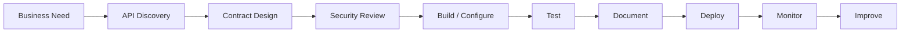

# API Governance, Lifecycle, and Reference

## 12. Governance

API governance ensures integrations are secure, supportable, reliable, and aligned with enterprise architecture.

---

### 12.1 API Ownership

Every API should have:

* Business owner
* Technical owner
* Support owner
* Data owner
* Security contact
* Documentation owner

---

### 12.2 Access Governance

Control:

* Who can call the API
* What app registrations exist
* Which permissions are granted
* Who approved admin consent
* Whether permissions are delegated or application-based
* Whether access is reviewed periodically
* Whether access is removed when no longer needed

---

### 12.3 Data Governance

Ask:

* What data is exposed?
* Is it sensitive?
* Is it regulated?
* Is it customer data?
* Can it leave the tenant?
* Is it logged?
* Is it encrypted?
* How long is it retained?

---

### 12.4 API Change Governance

Before changing an API:

* Identify consumers
* Check downstream dependencies
* Version breaking changes
* Notify stakeholders
* Update documentation
* Provide migration timeline
* Test in lower environment
* Monitor after release

---

### 12.5 Security Governance

Recommended controls:

* Least privilege
* Admin consent review
* Secret rotation
* Certificate-based auth where appropriate
* Managed identity where possible
* API gateway policies
* Logging and monitoring
* Rate limiting
* IP restrictions where appropriate
* DLP policies for Power Platform
* Periodic access reviews

---

### 12.6 Power Platform Governance for APIs

For Power Platform:

* Prefer custom connectors for reusable APIs.
* Use connection references in solutions.
* Use environment variables for endpoints.
* Avoid personal credentials for production flows.
* Govern HTTP connector usage with DLP policies.
* Log API calls for critical automations.
* Use service accounts or managed identity patterns where approved.
* Do not expose sensitive API payloads in unnecessary run history.

---

## 13. Continuous Improvement

APIs should be treated as products, not one-off technical endpoints.

---

### 13.1 API Metrics

Track:

| Metric                          | Why It Matters                 |
| ------------------------------- | ------------------------------ |
| Request count                   | Measures usage                 |
| Error rate                      | Measures reliability           |
| Latency                         | Measures performance           |
| Throttling rate                 | Shows scale pressure           |
| Authentication failures         | Shows credential/config issues |
| Authorization failures          | Shows permission issues        |
| Consumer count                  | Shows dependency footprint     |
| Breaking incidents              | Shows governance maturity      |
| Retry count                     | Shows instability              |
| Business transactions processed | Shows value                    |

---

### 13.2 Improvement Questions

Ask monthly:

* Which APIs fail most often?
* Which integrations are most business-critical?
* Which apps have over-privileged permissions?
* Which APIs lack documentation?
* Which APIs have no owner?
* Which consumers are still using old versions?
* Which API calls should be replaced by data pipelines?
* Which UI automations could be replaced by APIs?
* Which APIs should become custom connectors?

---

## 14. Development Lifecycle

A mature API lifecycle looks like this:



---

### 14.1 Lifecycle Stages

| Stage     | Activity                                    |
| --------- | ------------------------------------------- |
| Intake    | Define integration need                     |
| Discovery | Identify source system and API capability   |
| Design    | Define endpoint, payload, auth, permissions |
| Security  | Review access and data sensitivity          |
| Build     | Implement client, connector, or API         |
| Test      | Validate success and failure scenarios      |
| Deploy    | Move through dev/test/prod                  |
| Monitor   | Track usage, failures, performance          |
| Improve   | Optimize, version, retire, or scale         |

---

## 15. Frameworks

---

### 15.1 API Fit Framework

Use this to decide whether an API is the right pattern.

| Question                                   | Good API Candidate | Poor API Candidate  |
| ------------------------------------------ | ------------------ | ------------------- |
| Is the process repeatable?                 | Yes                | No                  |
| Is the system accessible programmatically? | Yes                | No                  |
| Is real-time or near-real-time needed?     | Yes                | No                  |
| Is volume moderate and transactional?      | Yes                | Huge bulk extract   |
| Are permissions manageable?                | Yes                | No clear ownership  |
| Is the payload structured?                 | Yes                | Highly unstructured |
| Is business logic clear?                   | Yes                | No                  |
| Is monitoring required?                    | Yes                | Unknown             |

---

### 15.2 API vs RPA Decision Framework

| Question                                | Prefer API  | Prefer RPA          |
| --------------------------------------- | ----------- | ------------------- |
| Does the system expose API access?      | Yes         | No                  |
| Is the UI unstable?                     | API         | RPA risky           |
| Is high volume expected?                | API         | RPA may struggle    |
| Is auditability important?              | API         | Possible but harder |
| Is user interface interaction required? | Not usually | Yes                 |
| Is integration reusable?                | API         | Less reusable       |

---

### 15.3 API Security Framework

```text
Identity
   ↓
Permission
   ↓
Scope
   ↓
Validation
   ↓
Logging
   ↓
Monitoring
   ↓
Review
```

Questions:

* Who is calling?
* What are they allowed to do?
* What data can they access?
* Is the request valid?
* Is the activity logged?
* Are failures monitored?
* Is access reviewed?

---

### 15.4 API Error Handling Framework

```text
Detect
   ↓
Classify
   ↓
Retry if safe
   ↓
Fail gracefully if not safe
   ↓
Log
   ↓
Alert
   ↓
Recover
```

Retry safe examples:

* `429 Too Many Requests`
* `503 Service Unavailable`
* temporary network timeout

Do not blindly retry:

* payment submissions
* record creation without idempotency
* email sends
* destructive updates
* API calls with side effects

---

### 15.5 API Documentation Framework

Every API should document:

```text
Purpose
Endpoint
Method
Authentication
Permissions
Headers
Parameters
Request body
Response body
Status codes
Examples
Limits
Owner
Support process
Version history
```

---

## 16. Tools

---

### 16.1 API Testing Tools

| Tool                     | Purpose                           |
| ------------------------ | --------------------------------- |
| Postman                  | Build, test, document APIs        |
| Insomnia                 | API testing client                |
| curl                     | Command-line API testing          |
| PowerShell               | Scripted API automation           |
| VS Code REST Client      | Test API calls from `.http` files |
| Microsoft Graph Explorer | Explore Microsoft Graph APIs      |
| Swagger UI               | Explore OpenAPI documentation     |
| Bruno                    | Git-friendly API client           |

---

### 16.2 API Development Tools

| Tool                 | Purpose                             |
| -------------------- | ----------------------------------- |
| Azure Functions      | Build lightweight APIs              |
| Azure API Management | API gateway and governance          |
| Azure Logic Apps     | Integration workflows               |
| Power Automate       | Low-code API orchestration          |
| Custom Connectors    | Reusable Power Platform API wrapper |
| Databricks APIs      | Data platform operations            |
| FastAPI              | Python API framework                |
| Express.js           | Node.js API framework               |
| .NET Web API         | Enterprise API development          |
| OpenAPI / Swagger    | API contract specification          |

---

### 16.3 API Monitoring Tools

| Tool                        | Purpose                       |
| --------------------------- | ----------------------------- |
| Application Insights        | Logs, traces, performance     |
| Azure Monitor               | Platform monitoring           |
| Power Platform Admin Center | Flow and connector monitoring |
| Dataverse logs              | Business transaction logs     |
| Power BI                    | API/automation reporting      |
| Splunk                      | Enterprise observability      |
| Datadog                     | Monitoring and tracing        |
| Grafana                     | Dashboards                    |

---

## 17. Quick Reference

---

### 17.1 HTTP Method Quick Reference

| Method   | Use For           |
| -------- | ----------------- |
| `GET`    | Read              |
| `POST`   | Create or submit  |
| `PUT`    | Replace or upload |
| `PATCH`  | Partial update    |
| `DELETE` | Delete            |

---

### 17.2 Common Headers

```http
Authorization: Bearer {access_token}
Content-Type: application/json
Accept: application/json
```

For Excel workbook sessions:

```http
workbook-session-id: {session-id}
```

---

### 17.3 Common Microsoft Graph Base URL

```http
https://graph.microsoft.com/v1.0
```

Use `v1.0` for production unless a specific feature requires beta and the risk is accepted.

---

### 17.4 Common Graph Endpoints

| Need                       | Endpoint Pattern                                                                                  |
| -------------------------- | ------------------------------------------------------------------------------------------------- |
| Read signed-in user emails | `GET /me/messages`                                                                                |
| Read user mailbox emails   | `GET /users/{id}/messages`                                                                        |
| Read Inbox messages        | `GET /users/{id}/mailFolders/Inbox/messages`                                                      |
| Get SharePoint site        | `GET /sites/{hostname}:/sites/{path}`                                                             |
| Upload file                | `PUT /sites/{site-id}/drive/root:/path/file.ext:/content`                                         |
| Create folder              | `POST /sites/{site-id}/drive/root:/path:/children`                                                |
| Create Excel session       | `POST /sites/{site-id}/drive/items/{item-id}/workbook/createSession`                              |
| List worksheets            | `GET /sites/{site-id}/drive/items/{item-id}/workbook/worksheets`                                  |
| Update Excel range         | `PATCH /sites/{site-id}/drive/items/{item-id}/workbook/worksheets/{sheet}/range(address='A1:B2')` |
| Add Excel table row        | `POST /sites/{site-id}/drive/items/{item-id}/workbook/tables/{table}/rows/add`                    |

---

### 17.5 Common Status Codes

```text
200 = OK
201 = Created
202 = Accepted
204 = No Content
400 = Bad Request
401 = Unauthorized
403 = Forbidden
404 = Not Found
409 = Conflict
429 = Too Many Requests
500 = Server Error
503 = Service Unavailable
```

---

### 17.6 API Design Rules

```text
Use least privilege.
Validate inputs.
Handle errors.
Handle pagination.
Handle throttling.
Avoid hardcoded secrets.
Log important calls.
Document contracts.
Version breaking changes.
Monitor usage.
```

---

## 18. Meeting Talking Points

---

### 18.1 API Discovery Questions

* What business process are we integrating?
* Which system owns the data?
* Which system needs the data?
* Is there an existing API?
* Is there existing documentation?
* Is this a read, write, or delete operation?
* Is the process real-time, scheduled, or event-driven?
* What volume do we expect?
* What is the SLA?
* Who owns the API?

---

### 18.2 Security Questions

* What authentication method is required?
* Does this need delegated or application permissions?
* Is admin consent required?
* Can access be scoped to a mailbox, site, folder, workbook, table, or specific API?
* What sensitive data is exposed?
* Where are secrets stored?
* How often are credentials rotated?
* Is activity logged?
* Who reviews access?

---

### 18.3 Microsoft Graph Questions

* Are we accessing Outlook, SharePoint, Excel, Teams, or users?
* Are we using `v1.0` or `beta`?
* What Graph permissions are needed?
* Are we using delegated or app-only access?
* Does the app need access to all mailboxes or one mailbox?
* Does the app need access to all sites or selected sites?
* Are we handling pagination?
* Are we handling throttling?
* Are we using workbook sessions for Excel?
* Are we logging Graph request failures?

---

### 18.4 Power Platform Questions

* Should this be a custom connector instead of raw HTTP?
* Will the connector be used by multiple flows or apps?
* Which environment should host it?
* Does DLP allow this connector?
* Should the flow use connection references?
* Are endpoint URLs stored in environment variables?
* Is run history safe for sensitive payloads?
* Who supports failures?

---
