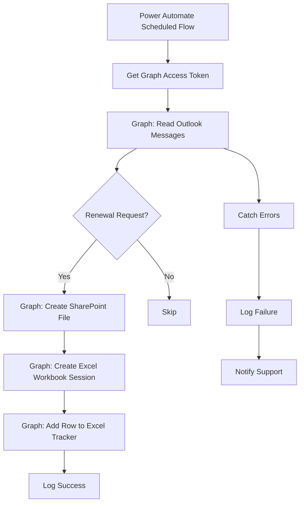

# API Worked Example and Learning Path

## 19. Example Scenario

# Scenario: Email Intake → SharePoint File → Excel Tracker

## Business Need

A shared mailbox receives renewal notice requests. The automation should:

1. Read recent Outlook messages.
2. Identify messages related to renewal notices.
3. Save a request summary file in SharePoint.
4. Update an Excel tracker with the processed status.
5. Log the API activity.

---

## Architecture



---

## API Sequence

```text
1. POST token endpoint
2. GET /users/{mailbox}/mailFolders/Inbox/messages
3. PUT /sites/{site-id}/drive/root:/Shared Documents/Requests/{file}.json:/content
4. POST /sites/{site-id}/drive/items/{workbook-id}/workbook/createSession
5. POST /sites/{site-id}/drive/items/{workbook-id}/workbook/tables/AutomationRunLog/rows/add
6. Write run log
```

---

## Example Request Summary File

```json
{
  "messageId": "AAMkAGVm...",
  "subject": "Renewal Notice Request - POL123456",
  "from": "broker@example.com",
  "receivedDateTime": "2026-07-04T13:45:00Z",
  "processedAtUtc": "2026-07-04T13:50:00Z",
  "status": "Processed"
}
```

---

## Example Excel Tracker Row

```json
{
  "values": [
    [
      "RUN-000123",
      "AAMkAGVm...",
      "Renewal Notice Request - POL123456",
      "broker@example.com",
      "Processed",
      "2026-07-04T13:50:00Z"
    ]
  ]
}
```

---

## Design Notes

Use this pattern when the volume is controlled and Excel is a lightweight tracker. If volume grows or the tracker becomes business-critical, replace Excel with Dataverse, SQL, or Databricks.

---

## 20. Beginner-to-Pro Learning Path

---

### Level 1: Beginner — Understand API Basics

Goal: Understand what an API is and how requests work.

Learn:

* What APIs are
* HTTP methods
* URLs and endpoints
* JSON
* Headers
* Status codes
* Postman basics

Practice:

```http
GET https://api.example.com/customers/123
```

You should be able to explain:

```text
A client sends a request.
The API processes it.
The server returns a response.
```

---

### Level 2: Advanced Beginner — Make Real API Calls

Goal: Call APIs safely using tools.

Learn:

* Postman
* curl
* Power Automate HTTP actions
* Query parameters
* Request bodies
* Basic authentication
* Bearer tokens

Practice:

```http
GET https://graph.microsoft.com/v1.0/me
Authorization: Bearer {access_token}
```

You should be able to:

* Send GET and POST requests
* Read JSON responses
* Troubleshoot 400/401/403 errors
* Use simple query parameters

---

### Level 3: Intermediate — Build Reliable Integrations

Goal: Use APIs in automations and applications.

Learn:

* OAuth 2.0
* Client credentials
* Pagination
* Error handling
* Retry logic
* Rate limits
* API contracts
* Logging
* Custom connectors

Practice:

```text
Build a Power Automate flow that calls Graph API, parses the response, and writes to a log table.
```

You should be able to:

* Register an app
* Request permissions
* Get tokens
* Call Microsoft Graph
* Handle failed API calls
* Log transactions

---

### Level 4: Advanced — Design Enterprise API Solutions

Goal: Design secure and scalable API integrations.

Learn:

* API gateways
* Azure API Management
* Managed identity
* Certificate authentication
* OpenAPI
* Versioning
* Idempotency
* Observability
* Governance
* DLP policies

You should be able to:

* Design API-based architecture
* Review API security
* Define API contracts
* Guide Power Platform custom connector design
* Lead API integration reviews

---

### Level 5: Pro — API Strategy and Architecture

Goal: Lead API strategy across teams.

Learn:

* API product management
* Domain-driven API design
* Enterprise integration patterns
* Event-driven architecture
* API lifecycle governance
* API catalogs
* Consumer onboarding
* AI tool/API design
* Zero-trust integration patterns

You should be able to:

* Define API standards
* Govern app permissions
* Create API intake models
* Mentor engineers and makers
* Align APIs with enterprise data and automation strategy

---

## 21. Repository Placement

Recommended placement in a knowledge repository:

```text
knowledge-repository/
└── engineering-foundations/
    └── apis/
        ├── README.md
        ├── api-reference-guide.md
        ├── api-quick-reference.md
        ├── api-troubleshooting.md
        ├── api-governance.md
        ├── microsoft-graph/
        │   ├── graph-overview.md
        │   ├── outlook-mail-examples.md
        │   ├── sharepoint-file-examples.md
        │   ├── excel-workbook-examples.md
        │   └── graph-permissions-guide.md
        ├── power-platform/
        │   ├── custom-connectors.md
        │   ├── power-automate-http-patterns.md
        │   └── api-dlp-considerations.md
        ├── templates/
        │   ├── api-design-document.md
        │   ├── api-contract-template.md
        │   ├── api-testing-checklist.md
        │   ├── api-security-review.md
        │   └── api-troubleshooting-runbook.md
        └── examples/
            ├── read-outlook-email.md
            ├── create-sharepoint-file.md
            ├── update-excel-workbook.md
            └── databricks-to-pdf-api.md
```

Recommended `README.md`:

```markdown
# APIs

This folder contains practical API guidance for technical professionals working with automation, data, cloud platforms, and enterprise integrations.

## Start Here

1. Read `api-reference-guide.md`
2. Use `api-quick-reference.md` for everyday commands and patterns
3. Use `api-troubleshooting.md` when calls fail
4. Review `microsoft-graph/` for Microsoft 365 examples
5. Use templates before designing or reviewing API integrations

## Key Topics

- REST APIs
- OAuth 2.0
- Microsoft Graph
- Power Automate HTTP actions
- Custom connectors
- API governance
- Error handling
- Throttling
- API documentation
```

---
