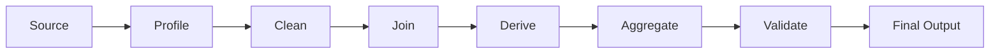

# Process and Automation Analytics

## Automation Run Summary

```sql
SELECT
    automation_name,
    CAST(started_at AS DATE) AS run_date,
    COUNT(*) AS total_runs,
    SUM(CASE WHEN status = 'completed' THEN 1 ELSE 0 END) AS successful_runs,
    SUM(CASE WHEN status = 'failed' THEN 1 ELSE 0 END) AS failed_runs,
    AVG(processing_seconds) AS average_processing_seconds,
    MAX(processing_seconds) AS maximum_processing_seconds
FROM automation_runs
GROUP BY
    automation_name,
    CAST(started_at AS DATE);
```

## SLA Compliance

```sql
SELECT
    automation_name,
    COUNT(*) AS total_transactions,
    SUM(
        CASE
            WHEN processing_seconds <= sla_seconds
            THEN 1
            ELSE 0
        END
    ) AS transactions_within_sla,
    100.0
        * SUM(
            CASE
                WHEN processing_seconds <= sla_seconds
                THEN 1
                ELSE 0
            END
        )
        / NULLIF(COUNT(*), 0) AS sla_compliance_pct
FROM automation_transactions
GROUP BY
    automation_name;
```

## Exception Aging

```sql
SELECT
    exception_id,
    exception_type,
    created_at,
    DATEDIFF(CURRENT_DATE, CAST(created_at AS DATE)) AS age_days,
    CASE
        WHEN DATEDIFF(CURRENT_DATE, CAST(created_at AS DATE)) >= 10
            THEN '10+ days'
        WHEN DATEDIFF(CURRENT_DATE, CAST(created_at AS DATE)) >= 5
            THEN '5–9 days'
        WHEN DATEDIFF(CURRENT_DATE, CAST(created_at AS DATE)) >= 2
            THEN '2–4 days'
        ELSE '0–1 days'
    END AS aging_band
FROM automation_exceptions
WHERE resolved_at IS NULL;
```

## Retry Analysis

```sql
SELECT
    retry_count,
    COUNT(*) AS transaction_count,
    SUM(CASE WHEN status = 'completed' THEN 1 ELSE 0 END) AS completed_count,
    SUM(CASE WHEN status = 'failed' THEN 1 ELSE 0 END) AS failed_count
FROM automation_transactions
GROUP BY
    retry_count
ORDER BY
    retry_count;
```

---

# Efficiency Patterns for Workflow Development

## 1. Filter Early

Apply high-value filters before large joins.

```sql
WITH recent_transactions AS (
    SELECT
        transaction_id,
        customer_id,
        amount
    FROM transactions
    WHERE transaction_date >= DATE '2026-01-01'
)

SELECT
    t.transaction_id,
    c.customer_name,
    t.amount
FROM recent_transactions t
LEFT JOIN customers c
    ON t.customer_id = c.customer_id;
```

## 2. Select Only Required Columns

Avoid carrying unused columns through every transformation.

## 3. Aggregate Before Joining

Reduce a many-row dataset to the required join grain first.

## 4. Calculate Once

If a complex expression is reused, calculate it in a CTE.

```sql
WITH calculated AS (
    SELECT
        policy_id,
        written_premium + fee_amount AS total_amount
    FROM policies
)

SELECT
    policy_id,
    total_amount,
    total_amount * 0.05 AS estimated_change
FROM calculated;
```

## 5. Separate Business Rules From Source Cleanup

```text
Source cleanup
    ↓
Reusable conformed attributes
    ↓
Business calculations
    ↓
Use-case filter
```

This prevents use-case-specific logic from becoming embedded in foundational data models.

## 6. Use Incremental Processing

Process only new or changed records when the platform and business process support it.

```sql
SELECT
    transaction_id,
    updated_at,
    status
FROM source_transactions
WHERE updated_at > :last_successful_watermark;
```

Use a reliable watermark and account for:

* late-arriving records
* clock differences
* updates to old records
* failed batches
* overlap windows
* idempotency

## 7. Use Idempotent Logic

An idempotent process can run more than once without creating unintended duplicates.

```sql
MERGE INTO target_transactions AS target
USING staged_transactions AS source
    ON target.transaction_id = source.transaction_id

WHEN MATCHED THEN
    UPDATE SET
        target.status = source.status,
        target.updated_at = source.updated_at

WHEN NOT MATCHED THEN
    INSERT (
        transaction_id,
        status,
        updated_at
    )
    VALUES (
        source.transaction_id,
        source.status,
        source.updated_at
    );
```

`MERGE` syntax varies by platform.

## 8. Use Control Tables

A control table can track:

* last successful execution
* last processed timestamp
* source batch ID
* target row count
* processing status
* error message
* retry count

```sql
SELECT
    workflow_name,
    last_successful_run_at,
    last_processed_watermark,
    status
FROM workflow_control
WHERE workflow_name = 'auto-renewal';
```

## 9. Separate Expected Exceptions From System Failures

```sql
CASE
    WHEN email_address IS NULL
        THEN 'business_exception'
    WHEN source_system_unavailable = TRUE
        THEN 'system_failure'
    ELSE 'processable'
END AS processing_classification
```

Business exceptions often require operational handling. System failures usually require technical recovery.

## 10. Publish Automation-Ready Outputs

An automation-facing output should generally have:

* stable grain
* stable column names
* explicit eligibility flag
* explicit exception reason
* no unexpected duplicates
* no ambiguous nulls
* deterministic ordering where needed
* freshness metadata
* source traceability

```sql
SELECT
    policy_id,
    policy_version,
    is_eligible,
    eligibility_reason,
    recipient_email,
    document_template_code,
    source_updated_at,
    CURRENT_TIMESTAMP AS model_built_at_utc
FROM curated.auto_renewal_candidates;
```

---

# Reusable Analytics Output Pattern

A reusable analytics model often follows this structure:



## Recommended Layer Responsibilities

| Layer                  | Responsibility                        | Example                      |
| ---------------------- | ------------------------------------- | ---------------------------- |
| Source/Staging         | Rename, cast, basic cleanup           | Standardize source fields    |
| Conformed/Intermediate | Reusable joins and derived attributes | Customer-policy relationship |
| Curated/Final          | Use-case filters and final grain      | Automation-ready candidates  |
| Reporting              | KPI aggregation and trend analysis    | Daily completion dashboard   |

## Join–Derive–Filter Pattern

```text
Join:
Combine reusable entities.

Derive:
Calculate reusable attributes and classifications.

Filter:
Apply use-case-specific eligibility or reporting scope.
```

This pattern prevents filtering too early and makes shared logic easier to reuse.

---
