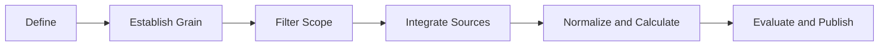
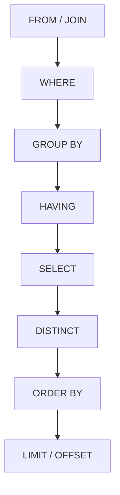
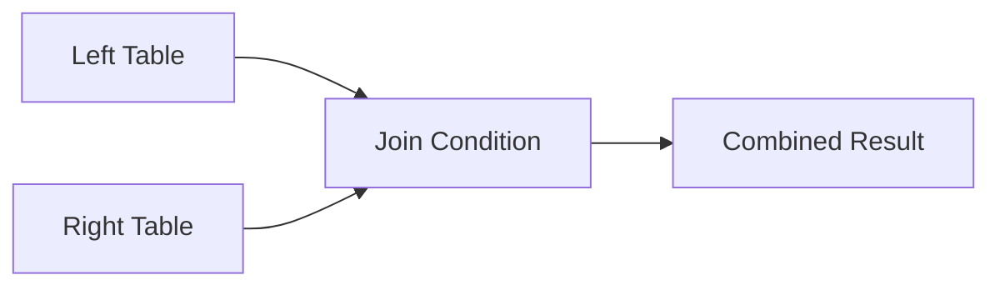

# SQL and Data Analytics Cheat Sheet
---

* quick-reference-sheets
* commands
* sql
* analytics
* data-quality
* reporting
* dbt
  related:
* ../


> Quick reference for everyday SQL and practical data analytics: query structure, joins, aggregation, window functions, CTEs, profiling, KPI design, time-series analysis, funnels, cohorts, segmentation, validation, and reusable workflow patterns.
>
> Syntax is ANSI-leaning. Dialect-specific notes are identified where useful.

---

## Quick Mental Model

A reliable analytics query usually answers six questions:

1. **What business question are we answering?**
2. **What does one row represent?**
3. **Which records are in scope?**
4. **Which calculations or classifications are required?**
5. **How will we validate the result?**
6. **How will the result be consumed?**


The most common reason an analytics query produces incorrect results is not bad SQL syntax. It is an unclear **grain** or an incorrect join.

---

# Reusable Analytics Workflow Pattern

Use this pattern for ad hoc analysis, dashboards, automation lookups, dbt models, and recurring reports.

## The DEFINE Pattern

| Step                            | Meaning                                           | Key Question                                       |
| ------------------------------- | ------------------------------------------------- | -------------------------------------------------- |
| **D — Define**                  | Define the business question and output           | What decision will this support?                   |
| **E — Establish Grain**         | State what one row represents                     | One row per customer, policy, transaction, or day? |
| **F — Filter Scope**            | Set time, status, geography, and business filters | Which records belong in the analysis?              |
| **I — Integrate Sources**       | Join and enrich required data                     | Which tables provide the needed attributes?        |
| **N — Normalize and Calculate** | Standardize values and calculate metrics          | Which transformations and business rules apply?    |
| **E — Evaluate and Publish**    | Validate results and expose the final output      | Are totals correct, and how will this be consumed? |



## Reusable CTE Structure

```sql
WITH source_data AS (

    -- 1. Select only required source columns.
    SELECT
        transaction_id,
        customer_id,
        transaction_date,
        status,
        amount
    FROM raw.transactions

),

filtered AS (

    -- 2. Apply source-level scope filters early.
    SELECT
        transaction_id,
        customer_id,
        transaction_date,
        status,
        amount
    FROM source_data
    WHERE transaction_date >= DATE '2026-01-01'
      AND status <> 'cancelled'

),

standardized AS (

    -- 3. Clean and standardize values.
    SELECT
        transaction_id,
        customer_id,
        CAST(transaction_date AS DATE) AS transaction_date,
        LOWER(TRIM(status)) AS status,
        COALESCE(amount, 0) AS amount
    FROM filtered

),

enriched AS (

    -- 4. Join required descriptive or classification data.
    SELECT
        s.transaction_id,
        s.customer_id,
        c.customer_segment,
        s.transaction_date,
        s.status,
        s.amount
    FROM standardized s
    LEFT JOIN conformed.customers c
        ON s.customer_id = c.customer_id

),

calculated AS (

    -- 5. Add reusable calculations and classifications.
    SELECT
        transaction_id,
        customer_id,
        customer_segment,
        transaction_date,
        status,
        amount,
        CASE
            WHEN amount >= 10000 THEN 'high'
            WHEN amount >= 1000  THEN 'medium'
            ELSE 'low'
        END AS value_band
    FROM enriched

),

validated AS (

    -- 6. Apply final business validity rules.
    SELECT
        transaction_id,
        customer_id,
        customer_segment,
        transaction_date,
        status,
        amount,
        value_band
    FROM calculated
    WHERE customer_id IS NOT NULL
      AND amount >= 0

),

final AS (

    -- 7. Publish at the intended grain.
    SELECT
        customer_id,
        customer_segment,
        COUNT(*) AS transaction_count,
        SUM(amount) AS total_amount,
        AVG(amount) AS average_amount
    FROM validated
    GROUP BY
        customer_id,
        customer_segment

)

SELECT
    customer_id,
    customer_segment,
    transaction_count,
    total_amount,
    average_amount
FROM final;
```

## Why This Pattern Is Efficient

* Each transformation step has one main purpose.
* Business rules are easier to review.
* Errors can be isolated to a specific CTE.
* Filters are applied early to reduce unnecessary processing.
* Final grain is visible.
* The pattern maps naturally to layered dbt models.
* Validation can be added without mixing it into source logic.
* Individual CTEs can later become reusable models.

---

# Logical Order of SQL Execution

SQL is written in one order but logically evaluated in another.



| Logical Step       | Purpose                          |
| ------------------ | -------------------------------- |
| `FROM` / `JOIN`    | Identify and combine source rows |
| `WHERE`            | Filter individual rows           |
| `GROUP BY`         | Form groups                      |
| `HAVING`           | Filter grouped results           |
| `SELECT`           | Calculate and return columns     |
| `DISTINCT`         | Remove duplicate result rows     |
| `ORDER BY`         | Sort the final result            |
| `LIMIT` / `OFFSET` | Restrict returned rows           |

## Why Aliases Often Fail in `WHERE`

This may fail in many SQL dialects:

```sql
SELECT
    amount * 1.10 AS adjusted_amount
FROM transactions
WHERE adjusted_amount > 1000;
```

`WHERE` is evaluated before `SELECT`, so the alias may not yet exist.

Use a CTE:

```sql
WITH calculated AS (
    SELECT
        amount,
        amount * 1.10 AS adjusted_amount
    FROM transactions
)

SELECT
    amount,
    adjusted_amount
FROM calculated
WHERE adjusted_amount > 1000;
```

---

# Core Query Skeleton

```sql
SELECT
    t.category,
    COUNT(*) AS record_count,
    SUM(t.amount) AS total_amount
FROM schema.transactions t
INNER JOIN schema.customers c
    ON t.customer_id = c.customer_id
WHERE t.status = 'active'
  AND t.transaction_date >= DATE '2026-01-01'
GROUP BY
    t.category
HAVING COUNT(*) > 5
ORDER BY
    total_amount DESC
LIMIT 100;
```

## Recommended Formatting Order

```text
SELECT
FROM
JOIN
WHERE
GROUP BY
HAVING
QUALIFY
ORDER BY
LIMIT
```

`QUALIFY` is available in platforms such as Databricks, Snowflake, and BigQuery, but is not universal ANSI SQL.

---

# Analytics Grain

**Grain** means what one row represents.

Examples:

| Dataset              | Grain                                     |
| -------------------- | ----------------------------------------- |
| Customer table       | One row per customer                      |
| Policy table         | One row per policy                        |
| Policy-version table | One row per policy version                |
| Transaction table    | One row per transaction                   |
| Coverage table       | One row per policy, version, and coverage |
| Daily dashboard      | One row per date and business unit        |
| Automation output    | One row per automation transaction        |

Always write the grain before building a complex query.

```sql
-- Grain: one row per customer per calendar month
```

## Grain Validation

```sql
SELECT
    customer_id,
    month_start,
    COUNT(*) AS row_count
FROM analytics.customer_monthly
GROUP BY
    customer_id,
    month_start
HAVING COUNT(*) > 1;
```

A correctly grained model should return zero rows unless duplicates are intentionally allowed.

---

# Selecting Columns

## Prefer Explicit Columns

```sql
SELECT
    policy_id,
    policy_number,
    effective_date,
    expiration_date,
    status
FROM policies;
```

Avoid production use of:

```sql
SELECT *
FROM policies;
```

Explicit columns improve:

* stability
* readability
* lineage
* performance
* schema-change safety
* downstream contract clarity

## Rename Columns Clearly

```sql
SELECT
    id AS transaction_id,
    created_at AS transaction_created_at,
    status AS transaction_status
FROM raw_transactions;
```

Avoid vague names such as:

```text
id
name
date
value
status
```

when multiple joined tables contain similar attributes.

---

# Filtering

| Pattern             | Example                                    |
| ------------------- | ------------------------------------------ |
| Equality            | `WHERE status = 'active'`                  |
| Multiple conditions | `WHERE status = 'active' AND amount > 100` |
| Range               | `WHERE amount BETWEEN 10 AND 20`           |
| Set membership      | `WHERE status IN ('active', 'pending')`    |
| Pattern match       | `WHERE customer_name LIKE 'A%'`            |
| Null check          | `WHERE deleted_at IS NULL`                 |
| Negation            | `WHERE status <> 'cancelled'`              |
| Existence           | `WHERE EXISTS (SELECT 1 FROM ...)`         |
| Date filter         | `WHERE created_at >= DATE '2026-01-01'`    |

## Inclusive Range Warning

`BETWEEN` includes both endpoints.

```sql
WHERE amount BETWEEN 10 AND 20
```

is equivalent to:

```sql
WHERE amount >= 10
  AND amount <= 20
```

## Safer Timestamp Filtering

Avoid:

```sql
WHERE created_at BETWEEN
    TIMESTAMP '2026-07-01 00:00:00'
    AND TIMESTAMP '2026-07-31 23:59:59';
```

Prefer a half-open range:

```sql
WHERE created_at >= TIMESTAMP '2026-07-01 00:00:00'
  AND created_at <  TIMESTAMP '2026-08-01 00:00:00';
```

This avoids precision problems with milliseconds or microseconds.

---

# Null Handling

`NULL` means missing, unknown, or not applicable. It is not equal to zero or an empty string.

## Null Checks

```sql
WHERE email_address IS NULL
```

```sql
WHERE email_address IS NOT NULL
```

Do not use:

```sql
WHERE email_address = NULL
```

## Replace Null Values

```sql
SELECT
    COALESCE(phone_number, 'Not Provided') AS phone_number
FROM customers;
```

## Null-Safe Calculation

```sql
SELECT
    COALESCE(premium_amount, 0)
    + COALESCE(fee_amount, 0) AS total_amount
FROM policies;
```

## Null Analytics

```sql
SELECT
    COUNT(*) AS total_rows,
    COUNT(email_address) AS populated_email_rows,
    SUM(CASE WHEN email_address IS NULL THEN 1 ELSE 0 END) AS missing_email_rows,
    100.0 * SUM(CASE WHEN email_address IS NULL THEN 1 ELSE 0 END)
        / NULLIF(COUNT(*), 0) AS missing_email_pct
FROM customers;
```

---

# Joins

| Join              | Returns                                      |
| ----------------- | -------------------------------------------- |
| `INNER JOIN`      | Rows with a match in both tables             |
| `LEFT JOIN`       | All left rows and matching right rows        |
| `RIGHT JOIN`      | All right rows and matching left rows        |
| `FULL OUTER JOIN` | All rows from both tables                    |
| `CROSS JOIN`      | Every left row combined with every right row |
| `SELF JOIN`       | A table joined to itself                     |



## Inner Join

```sql
SELECT
    o.order_id,
    o.customer_id,
    c.customer_name
FROM orders o
INNER JOIN customers c
    ON o.customer_id = c.customer_id;
```

## Left Join

```sql
SELECT
    c.customer_id,
    c.customer_name,
    o.order_id
FROM customers c
LEFT JOIN orders o
    ON c.customer_id = o.customer_id;
```

This retains customers even when they have no orders.

## Anti-Join: Find Missing Matches

```sql
SELECT
    c.customer_id,
    c.customer_name
FROM customers c
LEFT JOIN orders o
    ON c.customer_id = o.customer_id
WHERE o.customer_id IS NULL;
```

Using `NOT EXISTS` is often clearer:

```sql
SELECT
    c.customer_id,
    c.customer_name
FROM customers c
WHERE NOT EXISTS (
    SELECT 1
    FROM orders o
    WHERE o.customer_id = c.customer_id
);
```

## Semi-Join: Return Rows That Have a Match

```sql
SELECT
    c.customer_id,
    c.customer_name
FROM customers c
WHERE EXISTS (
    SELECT 1
    FROM orders o
    WHERE o.customer_id = c.customer_id
);
```

## Join Cardinality

Before joining, identify the relationship:

| Relationship | Example                                        | Risk                        |
| ------------ | ---------------------------------------------- | --------------------------- |
| One-to-one   | Customer to customer profile                   | Low                         |
| One-to-many  | Customer to orders                             | Left-side values repeat     |
| Many-to-one  | Orders to customer                             | Usually expected enrichment |
| Many-to-many | Policies to contacts through multiple mappings | High duplication risk       |

## Detect Join Multiplication

```sql
WITH before_join AS (
    SELECT COUNT(*) AS row_count
    FROM policies
),

after_join AS (
    SELECT COUNT(*) AS row_count
    FROM policies p
    LEFT JOIN policy_contacts pc
        ON p.policy_id = pc.policy_id
)

SELECT
    b.row_count AS before_count,
    a.row_count AS after_count,
    a.row_count - b.row_count AS additional_rows
FROM before_join b
CROSS JOIN after_join a;
```

A higher row count may be correct, but it must be intentional.

## Pre-Aggregate Before Joining

Instead of joining all transactions and then aggregating:

```sql
WITH transaction_totals AS (
    SELECT
        customer_id,
        SUM(amount) AS total_amount
    FROM transactions
    GROUP BY customer_id
)

SELECT
    c.customer_id,
    c.customer_name,
    COALESCE(t.total_amount, 0) AS total_amount
FROM customers c
LEFT JOIN transaction_totals t
    ON c.customer_id = t.customer_id;
```

This often prevents duplication and reduces processing.

---

# Aggregation

| Function                      | Purpose                      |
| ----------------------------- | ---------------------------- |
| `COUNT(*)`                    | Count rows                   |
| `COUNT(column)`               | Count non-null values        |
| `COUNT(DISTINCT column)`      | Count unique non-null values |
| `SUM(column)`                 | Total                        |
| `AVG(column)`                 | Arithmetic mean              |
| `MIN(column)`                 | Minimum                      |
| `MAX(column)`                 | Maximum                      |
| `STRING_AGG` / `GROUP_CONCAT` | Combine grouped text values  |

## Basic Aggregation

```sql
SELECT
    customer_segment,
    COUNT(*) AS customer_count,
    SUM(annual_revenue) AS total_revenue,
    AVG(annual_revenue) AS average_revenue
FROM customers
GROUP BY
    customer_segment;
```

## Group at the Intended Grain

```sql
SELECT
    DATE_TRUNC('month', transaction_date) AS transaction_month,
    business_unit,
    COUNT(*) AS transaction_count,
    SUM(amount) AS total_amount
FROM transactions
GROUP BY
    DATE_TRUNC('month', transaction_date),
    business_unit;
```

## Filter Aggregates With `HAVING`

```sql
SELECT
    customer_id,
    SUM(amount) AS total_amount
FROM transactions
GROUP BY
    customer_id
HAVING SUM(amount) > 10000;
```

---

# Conditional Logic

## CASE Expression

```sql
SELECT
    customer_id,
    annual_revenue,
    CASE
        WHEN annual_revenue >= 1000000 THEN 'enterprise'
        WHEN annual_revenue >= 100000  THEN 'mid-market'
        WHEN annual_revenue IS NULL    THEN 'unknown'
        ELSE 'small-business'
    END AS customer_segment
FROM customers;
```

## Conditional Aggregation

```sql
SELECT
    COUNT(*) AS total_transactions,
    SUM(CASE WHEN status = 'completed' THEN 1 ELSE 0 END) AS completed_count,
    SUM(CASE WHEN status = 'failed' THEN 1 ELSE 0 END) AS failed_count,
    SUM(CASE WHEN status = 'pending' THEN 1 ELSE 0 END) AS pending_count
FROM automation_transactions;
```

## Completion Rate

```sql
SELECT
    100.0
    * SUM(CASE WHEN status = 'completed' THEN 1 ELSE 0 END)
    / NULLIF(COUNT(*), 0) AS completion_rate_pct
FROM automation_transactions;
```

---
