# Claude by Anthropic

**Audience:** Beginner-to-pro technical professionals, automation engineers, data/AI practitioners, enterprise architects, technical leads, solution designers, and team members onboarding into Claude-based work.

**Last verified:** July 5, 2026  
**Scope:** Claude chat, Claude API, Claude Code, Claude Cowork, MCP, tool use, enterprise architecture, governance, agent workflows, and production readiness.

> **Current-state note:** Claude changes quickly. As of July 2026, Anthropic’s current model family includes Claude Fable 5, Claude Mythos 5, Claude Opus 4.8, Claude Sonnet 5, and Claude Haiku 4.5. Anthropic describes Claude as a platform for language, reasoning, analysis, coding, and more.

---

## 1. Executive Summary

Claude is Anthropic’s AI assistant and AI development platform. It can be used directly through chat-style products, integrated into enterprise workflows through APIs, embedded into software engineering workflows through Claude Code, and connected to tools and systems through tool use, MCP, connectors, and agent frameworks.

At a practical enterprise level, Claude should be understood as **three things at once**:

| View | Plain-English Meaning | Enterprise Use |
|---|---|---|
| Assistant | A conversational AI that helps users write, analyze, summarize, reason, and code | Knowledge work, drafting, analysis, meeting prep |
| API platform | A model interface developers can call from applications | Internal copilots, automation assistants, document processing, support bots |
| Agent runtime / workflow partner | A system that can use tools, read files, run commands, interact with codebases, and complete multi-step work | Software delivery, data analysis, business process automation, research workflows |

For enterprise teams, Claude is most valuable when it is not treated as a magic chatbot, but as a controlled AI capability inside a disciplined operating model:

```text
Business Problem
→ Use Case Intake
→ Risk Classification
→ Architecture Design
→ Prompt / Tool / Data Design
→ Evaluation
→ Human Approval
→ Deployment
→ Monitoring
→ Continuous Improvement
```

The main enterprise lesson is simple:

> Claude is strongest when paired with clear instructions, trusted context, controlled tools, strong human review, measurable evaluations, and governance.

---

## 2. Plain-English Explanation

Claude is an AI system that can understand instructions, reason over text, analyze files, write code, call tools, and help complete business or technical tasks.

A simple way to think about Claude:

> Claude is like a highly capable analyst, writer, developer, and workflow assistant — but it still needs clear instructions, trusted data, defined permissions, and human judgment.

Claude does **not** automatically know your company’s private systems, data definitions, process rules, security policies, or business context. You must provide that context through prompts, files, retrieval, tools, APIs, MCP servers, or approved connectors.

### What Claude Can Do

| Capability | Plain-English Explanation | Real Work Example |
|---|---|---|
| Summarization | Condense long content into useful takeaways | Summarize legal documents, support tickets, or meeting notes |
| Reasoning | Work through multi-step problems | Compare migration options or diagnose root causes |
| Coding | Generate, review, refactor, and explain code | Review a dbt model or generate API integration code |
| Tool use | Ask external systems for data or actions | Search Jira, call an internal policy API, query a database |
| File analysis | Read documents, PDFs, images, and datasets | Extract clauses from contracts or reconcile spreadsheets |
| Agentic work | Plan and execute multi-step tasks with tools | Analyze a repo, create a pull request, draft a report |
| Cowork-style delegation | Complete knowledge-work tasks across desktop files and apps | Assemble a report from local files and source documents |

---

## 3. Business Context

Claude is useful in enterprises because many business processes involve the same recurring pain points:

| Business Pain | Why It Matters | Claude-Enabled Pattern |
|---|---|---|
| Too much unstructured information | Employees spend hours reading emails, PDFs, notes, contracts, logs, or tickets | Summarization, extraction, classification |
| Manual decision support | People need to compare options, assess risks, and prepare recommendations | Structured analysis and decision memos |
| Repetitive technical work | Engineers repeatedly review code, generate docs, debug, and write tests | Claude Code, code review, test generation |
| Fragmented systems | Information lives in SharePoint, Jira, Slack, Databricks, GitHub, Outlook, etc. | MCP, connectors, tool use, retrieval |
| Slow onboarding | New team members need to learn architecture, terminology, and standards | Knowledge repository assistant, training guides |
| Inconsistent documentation | Teams build solutions without reusable templates | Documentation generation and review |
| Lack of operational visibility | AI outputs may be untracked, untested, or unmanaged | Governance, audit, evals, monitoring |

Claude’s business value comes from reducing time spent on low-value assembly work while keeping humans responsible for judgment, approval, and accountability.

### High-Value Enterprise Domains

| Domain | Example Use |
|---|---|
| Intelligent automation | Generate process designs, API flows, exception handling, support runbooks |
| Data engineering | Explain pipelines, review dbt models, generate lineage summaries |
| Analytics / BI | Draft metric definitions, summarize dashboard changes, generate Power BI migration checklists |
| Legal / compliance | Summarize documents, extract clauses, prepare issue lists |
| Customer operations | Classify emails, draft responses, summarize case history |
| Software engineering | Code review, refactoring, test generation, PR assistance |
| Knowledge management | Convert tribal knowledge into reusable documentation |

---

## 4. Core Concepts

### 4.1 Claude Models

A Claude model is the actual AI engine you call. Different models are optimized for different combinations of intelligence, speed, cost, and workload type.

| Model Tier | Practical Use | Tradeoff |
|---|---|---|
| Haiku | Fast, low-cost, high-volume tasks | May be less capable on complex reasoning |
| Sonnet | Balanced enterprise work, coding, agents | Good default for many production use cases |
| Opus | Hard reasoning, complex agentic tasks, deep code work | Higher cost |
| Fable / Mythos | Long-running or advanced frontier workflows | Validate availability, policy, and compliance before enterprise use |

#### Common Mistake

Do not pick the strongest model by default. Use evaluations to prove whether the workload actually needs it.

---

### 4.2 Messages API

The Messages API is the standard way developers send prompts to Claude and receive responses. It supports basic requests, multi-turn conversations, system instructions, tool use, vision, and other features.

Plain-English definition:

> The Messages API is how your application talks to Claude.

Basic shape:

```python
import anthropic

client = anthropic.Anthropic()

message = client.messages.create(
    model="claude-opus-4-8",
    max_tokens=1024,
    messages=[
        {"role": "user", "content": "Explain MCP in plain English."}
    ],
)

print(message.content)
```

#### Why It Matters

The Messages API gives your team control over:

| Area | What You Control |
|---|---|
| Prompt design | Instructions, context, examples, output format |
| Data handling | What context is sent and what is stored by your app |
| Tooling | Which APIs/tools Claude can request |
| Monitoring | Logs, usage, latency, errors, cost |
| Governance | Human review, access controls, approval gates |

---

### 4.3 Prompts and System Instructions

A prompt is the instruction or context you give Claude. A system instruction is a higher-priority instruction that defines Claude’s role, constraints, tone, and behavior.

Plain-English definition:

> A prompt tells Claude what to do. A system instruction tells Claude how it should behave while doing it.

Good prompt structure:

```text
Role:
You are a senior data engineer reviewing a dbt model.

Task:
Review the SQL for correctness, maintainability, and downstream impact.

Context:
This model supports automation lookups for renewal processing.

Output:
Return findings in a table with severity, issue, evidence, recommendation, and owner.

Rules:
Do not invent table meanings. If a dependency is unclear, say what must be verified.
```

#### Common Mistake

Vague prompt:

```text
Review this.
```

Better prompt:

```text
Review this SQL model for production readiness. Focus on join grain, null handling, test coverage, naming, downstream automation impact, and rollback risk.
```

---

### 4.4 Context Window

The context window is Claude’s working memory for a request. It includes your input, relevant prior messages, files, tool results, and the response Claude generates.

Plain-English definition:

> The context window is what Claude can “see” during a task.

#### Practical Guidance

| Situation | Good Practice |
|---|---|
| Long documents | Ask Claude to extract evidence first, then analyze |
| Large codebases | Use Claude Code, subagents, or targeted file selection |
| Repeated context | Use prompt caching where appropriate |
| Long-running agents | Use compaction or summarize intermediate state |
| Retrieval workflows | Send only relevant chunks, not everything |

---

### 4.5 Tokens, Cost, and Usage

Tokens are chunks of text used for billing and model processing. Inputs, outputs, tool definitions, tool results, images, PDFs, and thinking blocks can all affect token usage.

#### Cost Drivers

| Driver | Why It Costs More |
|---|---|
| Long prompts | More input tokens |
| Large documents | More content to process |
| Large tool schemas | Tool definitions count as input |
| Multi-step agents | Many model calls and tool calls |
| Extended thinking | Additional output-side reasoning tokens |
| Web search / code execution | Additional tool-specific charges |

---

### 4.6 Tool Use

Tool use allows Claude to call functions or tools. Some tools are client-side, meaning your application executes them. Others are server-side, meaning Anthropic runs them.

Plain-English definition:

> Tool use lets Claude ask for help from a system outside the model.

#### Tool Use Flow

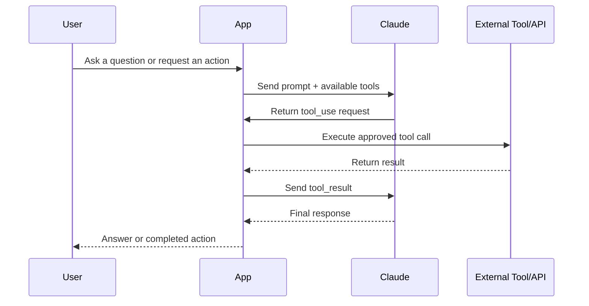

#### Examples of Tools

| Tool Type | Example |
|---|---|
| Lookup tool | Get policy details from an internal API |
| Action tool | Create a Jira ticket |
| Retrieval tool | Search SharePoint documents |
| Database tool | Query Databricks SQL |
| Code tool | Run Python analysis |
| Browser/computer tool | Interact with a desktop or web app under controls |

---

### 4.7 MCP — Model Context Protocol

MCP stands for Model Context Protocol. It is an open standard for connecting AI applications to external systems such as files, databases, APIs, tools, and workflows.

Plain-English definition:

> MCP is a standard way for Claude or another AI application to connect to tools and data sources without every integration being custom-built from scratch.

#### MCP Components

| Component | Plain-English Meaning | Example |
|---|---|---|
| MCP host | The AI app the user interacts with | Claude Code, desktop assistant, IDE |
| MCP client | The connector inside the host | Claude Code’s MCP integration |
| MCP server | The service exposing tools/data | Jira MCP server, GitHub MCP server, Databricks MCP server |
| Tools | Actions Claude can request | Create ticket, query table, fetch file |
| Resources | Data Claude can read | Documents, schemas, dashboards |
| Prompts | Reusable workflows/instructions | “Review this PR” or “Summarize incident” |

#### MCP Architecture

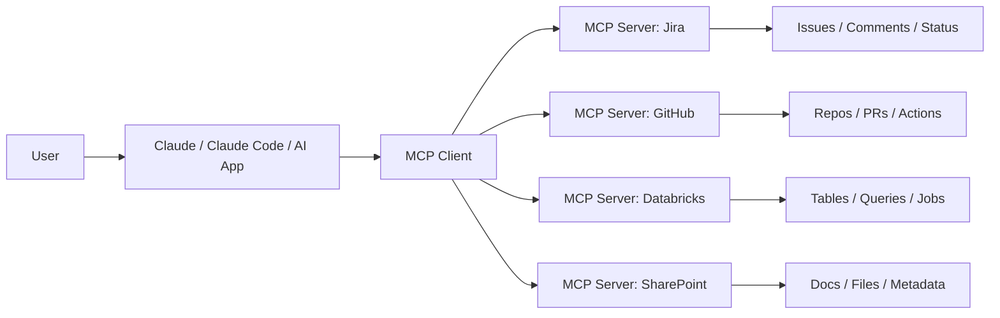

#### MCP Use Cases

| Use Case | Example |
|---|---|
| Developer productivity | Claude reads Jira issue, updates code, opens PR |
| Data analysis | Claude queries Databricks for approved metrics |
| Operations | Claude checks monitoring dashboards and incident tickets |
| Documentation | Claude reads repo files and generates architecture docs |
| Business workflow | Claude assembles a report using SharePoint, Excel, and email context |

#### MCP Risks

| Risk | Control |
|---|---|
| Excessive permissions | Use least-privilege service accounts |
| Tool misuse | Add approval gates for write actions |
| Prompt injection | Treat external content as untrusted |
| Data leakage | Restrict sensitive data access |
| Poor observability | Log tool calls, inputs, outputs, and user approvals |
| Tool sprawl | Maintain a registry and owner for each MCP server |

---

### 4.8 Claude Code

Claude Code is Anthropic’s agentic coding tool. It can read a codebase, edit files, run commands, and integrate with development tools.

Plain-English definition:

> Claude Code is Claude working inside your software development environment.

#### Good Claude Code Tasks

| Task | Example |
|---|---|
| Codebase exploration | “Explain the architecture of this repo.” |
| Impact analysis | “What breaks if we change this dbt model?” |
| Refactoring | “Refactor this module without changing behavior.” |
| Test generation | “Add unit tests for this edge case.” |
| Pull request assistance | “Review this PR for security, naming, and performance.” |
| Migration | “Update this API client to the new endpoint pattern.” |

#### Claude Code Architecture

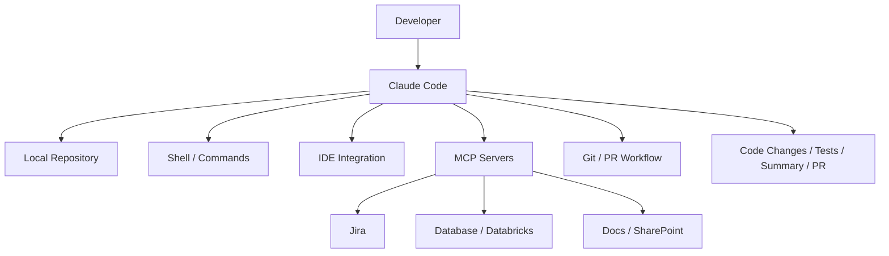

#### Practical Warning

Claude Code should not be given unrestricted access to sensitive repositories, production credentials, or write actions without approval controls. Treat it as a powerful junior-to-senior assistant that can move quickly, not as an unsupervised production engineer.

---

### 4.9 Claude Cowork

Claude Cowork is Anthropic’s agentic knowledge-work product for multi-step knowledge work across files and applications.

Plain-English definition:

> Claude Cowork is for delegating business tasks, not just asking chat questions.

#### Good Cowork Tasks

| Task | Example |
|---|---|
| Document assembly | Turn source files into a structured report |
| Research synthesis | Summarize multiple documents into findings |
| File organization | Rename, sort, deduplicate, or classify local files |
| Data extraction | Extract key fields from contracts, invoices, or records |
| Draft preparation | Create a memo, one-pager, or presentation draft |

#### Cowork vs Chat

| Chat | Cowork |
|---|---|
| You drive each prompt | You assign an outcome |
| Best for Q&A and drafting | Best for multi-step tasks |
| Works mostly in conversation | Works across files and apps |
| User coordinates steps | Claude coordinates more of the task |

#### Governance Warning

Cowork-style workflows can be powerful, but they may touch local files, applications, and business data. Use governed access, clear approval rules, and avoid regulated workloads unless your organization has validated coverage, retention, auditability, and compliance requirements.

---

### 4.10 Multi-Agent Workflows

A multi-agent workflow uses multiple specialized Claude instances or subagents to divide work. One agent may orchestrate, while others research, test, validate, summarize, or review.

#### Multi-Agent Pattern

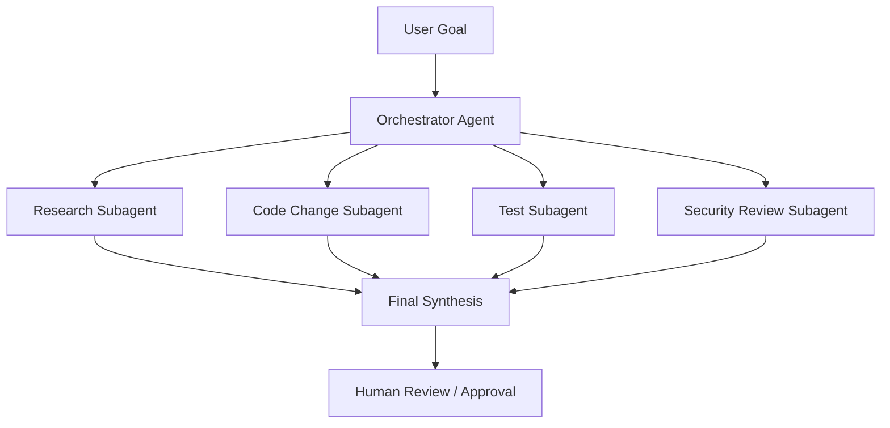

#### Example Agent Roles

| Agent | Responsibility |
|---|---|
| Orchestrator | Break down work, assign tasks, synthesize results |
| Research agent | Read docs, tickets, logs, or business context |
| Implementation agent | Modify code or configuration |
| Test agent | Run tests and validate outputs |
| Security agent | Review secrets, permissions, and risky behavior |
| Documentation agent | Produce README, runbook, or architecture notes |

#### Common Mistake

Do not create many agents just because it sounds advanced. Use multiple agents when work can be safely split and independently verified.

---

### 4.11 Computer Use

Claude’s computer use capability can allow Claude to interact with a desktop environment through screenshots, mouse, and keyboard actions. This should be sandboxed and carefully governed.

Plain-English definition:

> Computer use lets Claude operate a virtual desktop, but it must be isolated and governed.

#### Good Use Cases

| Use Case | Example |
|---|---|
| UI-only systems | Legacy app has no API |
| Testing | Validate a web workflow |
| Data extraction | Pull information from a controlled internal UI |
| Office workflow | Open files, inspect content, prepare output |

#### High-Risk Use Cases

| Use Case | Why Risky |
|---|---|
| Financial transactions | Consequential external action |
| Production admin consoles | Risk of destructive changes |
| Sensitive customer data | Data leakage risk |
| Open internet browsing | Prompt injection risk |
| Login credential handling | Credential exposure risk |

---

### 4.12 Prompt Caching and Batch Processing

Prompt caching lets repeated prompt prefixes be reused to reduce latency and cost. Batch processing is useful for high-volume asynchronous workloads.

| Feature | Use When | Avoid When |
|---|---|---|
| Prompt caching | Reusing long policies, schemas, docs, tool instructions | Every prompt is unique |
| Batch processing | Large offline jobs, document classification, nightly analysis | User needs instant response |
| Streaming | User-facing chat or long responses | Backend batch job |
| Token counting | Estimating cost before production | Never skip for high-volume jobs |

---

### 4.13 Evaluation

Evaluation means testing whether Claude produces acceptable outputs for your use case.

Plain-English definition:

> Evals are test cases for AI behavior.

#### What to Evaluate

| Evaluation Area | Example |
|---|---|
| Accuracy | Did it answer from the source correctly? |
| Grounding | Did it cite or use the provided evidence? |
| Format | Did it return valid JSON or the required table? |
| Safety | Did it refuse unsafe requests appropriately? |
| Business rules | Did it follow company policy? |
| Tool use | Did it call the right tool with correct parameters? |
| Cost | Did it stay within expected token/cost limits? |
| Latency | Was it fast enough for the workflow? |

---

## 5. Architecture View

### 5.1 High-Level Enterprise Architecture

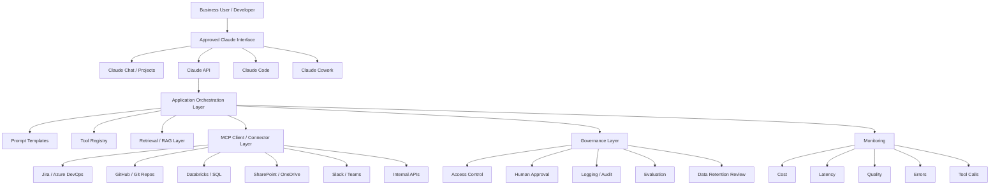

### 5.2 Reference Architecture Layers

| Layer | Purpose | Enterprise Owner |
|---|---|---|
| User experience | Chat, desktop, IDE, Slack, web app | Product / business owner |
| AI orchestration | Prompting, tool routing, memory, state | Engineering |
| Model layer | Claude model selection | AI platform / architecture |
| Data context | RAG, files, approved documents, metadata | Data governance / domain owners |
| Tool layer | APIs, MCP servers, function calls | Platform / application owners |
| Control layer | approvals, policy checks, access | Security / governance |
| Observability | logs, metrics, cost, errors, evals | Operations / platform |
| Support layer | runbooks, incident response, user support | Support / engineering |

---

## 6. Data / Process Flow

### 6.1 Basic Claude API Flow

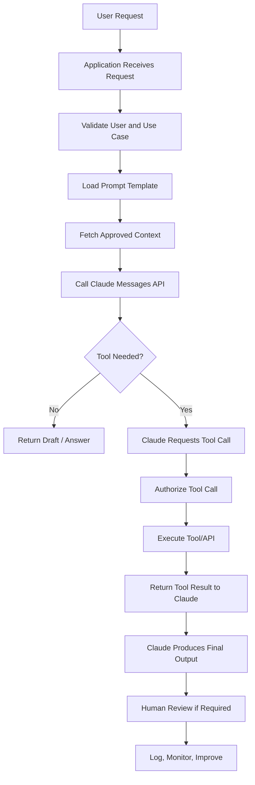

### 6.2 Enterprise AI Workflow Flow

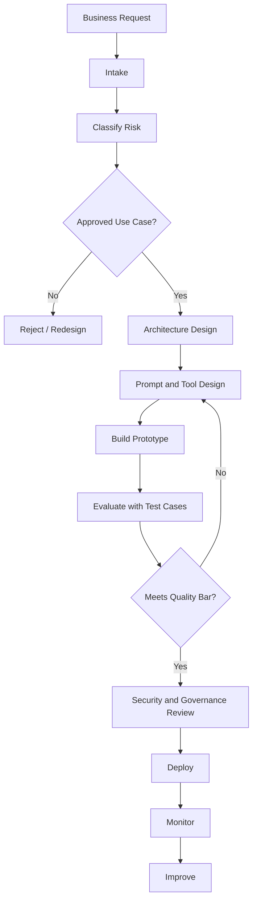

---

## 7. Common Use Cases

### 7.1 Business Use Cases

| Use Case | Description | Risk Level |
|---|---|---|
| Meeting preparation | Summarize context, prepare questions, create agenda | Low to medium |
| Document summarization | Summarize PDFs, contracts, requirements, transcripts | Medium |
| Email drafting | Draft professional responses | Low to medium |
| Research synthesis | Combine information from multiple sources | Medium |
| Data extraction | Extract structured fields from unstructured documents | Medium to high |
| Policy lookup assistant | Answer questions from approved internal docs | Medium |
| Support ticket triage | Classify, prioritize, and route tickets | Medium |
| Compliance review support | Identify missing documents or control gaps | High |
| Workflow automation design | Generate process flows and exception paths | Medium |
| Report generation | Create first drafts from approved data | Medium |

### 7.2 Technical Use Cases

| Use Case | Description | Claude Surface |
|---|---|---|
| Code review | Review code changes for bugs and maintainability | Claude Code |
| Repo onboarding | Explain folder structure, lineage, dependencies | Claude Code |
| API integration | Draft and test API calls | API / Claude Code |
| dbt model review | Analyze SQL grain, joins, tests, lineage | Claude Code |
| Data documentation | Generate catalog descriptions and lineage docs | API / Claude Code |
| Incident analysis | Summarize logs, changes, and likely causes | Claude Code + MCP |
| Test generation | Create unit/integration tests | Claude Code |
| PR automation | Respond to issue comments and create PRs | Claude Code + GitHub integration |
| Internal copilot | Build a governed assistant for teams | Messages API |
| Agent workflow | Execute multi-step business or engineering tasks | Managed Agents / Agent SDK / Claude Code |

---

## 8. Best Practices

### 8.1 Start with the Business Problem

Bad starting point:

```text
We need to use Claude.
```

Better starting point:

```text
We need to reduce the manual effort required to review renewal policy documents and create consistent downstream automation inputs.
```

### 8.2 Design the Human Role First

Before designing the AI, decide what the human owns.

| Decision | Human or Claude? |
|---|---|
| Final legal advice | Human |
| Production deployment approval | Human |
| Drafting first version | Claude |
| Summarizing source documents | Claude |
| Tool execution for read-only lookup | Claude can request |
| Tool execution for write actions | Human-approved |
| Exception handling | Shared, but human accountable |

### 8.3 Use Clear Prompt Structure

Recommended prompt sections:

```text
<role>
</role>

<task>
</task>

<context>
</context>

<input>
</input>

<constraints>
</constraints>

<output_format>
</output_format>

<quality_bar>
</quality_bar>
```

### 8.4 Prefer Grounded Answers

For enterprise work, Claude should answer from:

| Source Type | Example |
|---|---|
| Provided files | Requirements document, SDD, runbook |
| Approved knowledge base | Internal policy docs |
| Database query | Databricks SQL result |
| API result | Policy lookup API |
| Tool output | Jira issue, GitHub PR diff |
| Human-provided context | Meeting notes or business rules |

### 8.5 Use Structured Outputs for Systems

If a downstream system needs JSON, do not rely only on “please output JSON.” Use schema-based outputs where possible.

Example JSON schema goal:

```json
{
  "policy_number": "string",
  "renewal_status": "string",
  "missing_fields": ["string"],
  "recommended_action": "string",
  "confidence": "high | medium | low"
}
```

### 8.6 Treat Tools Like Production APIs

Every tool should have:

| Requirement | Why |
|---|---|
| Owner | Someone must support it |
| Description | Claude needs to know when to use it |
| Input schema | Prevent malformed calls |
| Authentication | Protect systems |
| Authorization | Limit user/tool access |
| Logging | Auditability |
| Rate limits | Prevent overload |
| Error handling | Recover safely |
| Test cases | Validate behavior |

### 8.7 Keep Sensitive Data Out Unless Approved

Before sending data to Claude, verify:

| Question | Why |
|---|---|
| Is this data confidential? | Protect company information |
| Is it regulated? | HIPAA, financial, legal, privacy obligations |
| Is it necessary? | Minimize exposure |
| Is ZDR or retention coverage required? | Retention varies by feature |
| Does this feature store files or context? | Some features require storage |
| Is there a BAA or enterprise agreement? | Required for PHI workflows |

---

## 9. Common Mistakes

| Mistake | Why It Happens | Better Practice |
|---|---|---|
| Treating Claude like a database | Users expect exact facts without giving data | Connect approved sources or require citations |
| Overloading prompts | Too many mixed instructions | Separate role, task, context, rules, output |
| No evaluation set | Prototype seems good on one example | Build representative test cases |
| No owner for prompts | Prompts drift and break | Version prompts in source control |
| Too many tools | Claude may choose poorly or waste tokens | Use tool registry and tool selection rules |
| Unclear permissions | Tool can do too much | Least privilege |
| No human approval | AI actions become uncontrolled | Require approval for consequential actions |
| Ignoring cost | Long prompts and tools become expensive | Track tokens and cache reusable context |
| No rollback plan | AI-assisted changes can break systems | Use branches, PRs, tests, rollback |
| Weak logging | Cannot troubleshoot failures | Log requests, tool calls, outputs, decisions |
| Using Cowork or computer use on sensitive tasks too early | Agent has broad local/app access | Start in sandbox, classify risk, validate audit needs |

---

## 10. Troubleshooting Guide

### 10.1 Output Is Wrong or Hallucinated

| Symptom | Likely Cause | Fix |
|---|---|---|
| Claude invents facts | No grounding source | Provide source documents or retrieval |
| Claude overstates confidence | Prompt encourages completion over honesty | Tell Claude to say “I don’t know” |
| Claude cites irrelevant evidence | Retrieval quality issue | Improve chunking, ranking, filters |
| Claude mixes old and new data | Context conflict | Label sources with dates and authority |
| Claude makes unsupported claims | No evidence requirement | Require claims + supporting quotes |

### 10.2 Tool Calls Fail

| Symptom | Likely Cause | Fix |
|---|---|---|
| Wrong tool selected | Tool descriptions are vague | Improve descriptions and examples |
| Invalid parameters | Schema unclear | Tighten input schema |
| Permission denied | Token/service account lacks access | Check IAM and scopes |
| Tool loops repeatedly | No stopping condition | Add max tool calls and completion rules |
| Tool returns too much data | Query too broad | Add filters and pagination |
| Tool exposes sensitive info | Permission too broad | Reduce scope and mask outputs |

### 10.3 Claude Code Makes Bad Changes

| Symptom | Likely Cause | Fix |
|---|---|---|
| Edits too many files | Prompt too broad | Tell Claude exact files and boundaries |
| Breaks tests | No test-first instruction | Require test plan and test execution |
| Misunderstands architecture | No repo orientation | Ask for analysis before edits |
| Deletes useful code | No approval gate | Use branch, diff review, checkpoints |
| Misses downstream impact | No lineage context | Provide dependency graph or ask it to inspect |

### 10.4 Cost Is Too High

| Cause | Fix |
|---|---|
| Re-sending long documents | Use prompt caching or Files API where appropriate |
| Too many tools in every call | Dynamically load relevant tools |
| Large context every turn | Summarize, compact, or retrieve only needed chunks |
| Using Opus for simple work | Evaluate Haiku or Sonnet |
| Long-running agents without limits | Add budgets, max turns, and stop conditions |

### 10.5 Latency Is Too High

| Cause | Fix |
|---|---|
| Model too large | Test smaller model |
| Too many sequential tool calls | Parallelize independent lookups |
| Prompt too long | Trim or cache context |
| Output too verbose | Set concise output requirements |
| Repeated reasoning | Use templates and structured instructions |

---

## 11. Governance

Governance is the operating system around Claude. It defines who can use it, what data can be sent, which tools it can access, how outputs are reviewed, and how risk is monitored.

### 11.1 Governance Operating Model

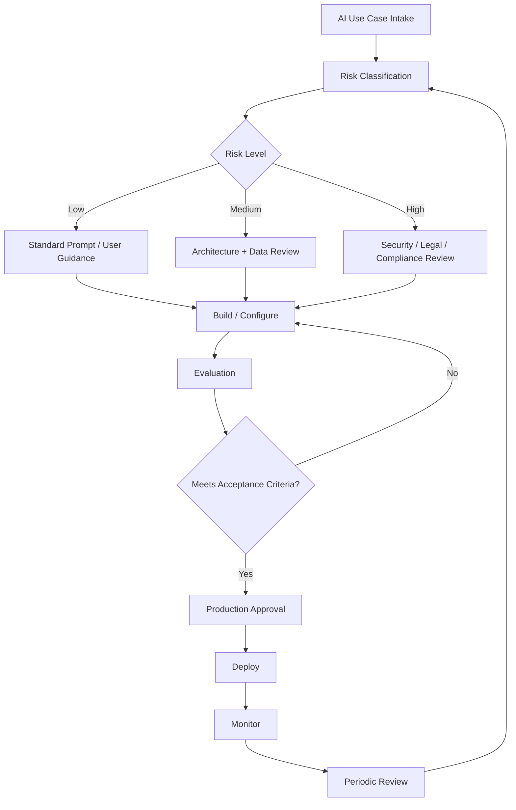

### 11.2 Governance Checklist

| Area | Question | Required Control |
|---|---|---|
| Use case | What business problem is being solved? | Intake record |
| Data | What data will Claude see? | Data classification |
| Retention | Is ZDR required? | Feature-level retention review |
| Access | Who can use it? | RBAC / SSO |
| Tools | What can Claude call? | Tool allowlist |
| Actions | Can Claude write, send, delete, approve, or transact? | Human approval |
| Accuracy | How will output quality be measured? | Evals |
| Security | Could prompt injection or data leakage occur? | Threat model |
| Audit | Can we reconstruct what happened? | Logs |
| Support | Who owns failures? | Runbook |
| Change control | How are prompts/tools updated? | Versioning and review |

### 11.3 Risk Classification

| Risk Level | Example | Control Level |
|---|---|---|
| Low | Draft an internal meeting agenda | User review |
| Medium | Summarize internal docs | Approved source + human review |
| High | Generate customer-facing response | QA + approval |
| Very high | Legal, medical, financial, employment, regulated decisions | Specialist review, compliance approval |
| Restricted | Autonomous production changes, payments, credential access | Usually not allowed without strict controls |

---

## 12. Continuous Improvement

Claude solutions should improve through measurement, not opinion.

### 12.1 Improvement Loop

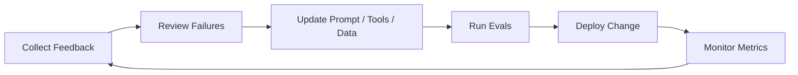

### 12.2 Metrics to Track

| Metric | Why It Matters |
|---|---|
| Accuracy rate | Measures correctness |
| Human edit rate | Shows how much rework is needed |
| Escalation rate | Shows when Claude cannot complete task |
| Tool success rate | Measures integration reliability |
| Tool error rate | Highlights API or permission issues |
| Latency | Impacts user adoption |
| Cost per task | Supports ROI decisions |
| Token usage | Helps optimize prompts and context |
| Policy violation rate | Governance and safety |
| User satisfaction | Adoption and trust |

### 12.3 Review Cadence

| Cadence | Activity |
|---|---|
| Weekly | Review errors, cost spikes, user feedback |
| Monthly | Refresh eval set, update prompts, review incidents |
| Quarterly | Reassess model choice, data access, governance controls |
| Major release | Re-run regression evals against new Claude models |

---

## 13. Development Lifecycle

### 13.1 Lifecycle Diagram

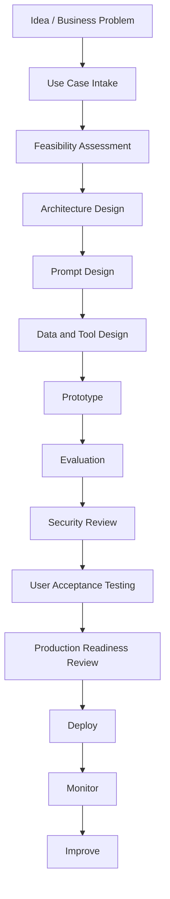

### 13.2 Lifecycle Details

| Phase | Key Questions | Deliverables |
|---|---|---|
| Intake | What problem are we solving? Who owns it? | Intake form |
| Feasibility | Is Claude the right fit? | Feasibility note |
| Architecture | What systems, tools, and data are involved? | Architecture diagram |
| Prompt design | What role, rules, and output are needed? | Prompt template |
| Tool design | What APIs can Claude call? | Tool specs |
| Evaluation | What does good look like? | Eval dataset |
| Security | What can go wrong? | Threat model |
| UAT | Do users trust and understand it? | Signoff |
| Production | Is it supportable? | Runbook |
| Monitoring | Is it working over time? | Metrics dashboard |

---

## 14. Frameworks

### 14.1 RAG — Retrieval-Augmented Generation

RAG means retrieving trusted information and giving it to Claude so it can answer from that context.

Plain-English:

> RAG is how Claude answers from your documents instead of guessing.

Use RAG when:

| Use RAG When | Example |
|---|---|
| Knowledge changes | Policy documents, procedures |
| Answers need evidence | Legal summaries, compliance notes |
| Data is private | Internal documentation |
| You need citations | Audit-friendly answers |

Avoid weak RAG patterns:

| Weak Pattern | Better Pattern |
|---|---|
| Dump entire document library | Retrieve relevant chunks |
| No source metadata | Include title, date, owner, version |
| No citation requirement | Require evidence per claim |
| No stale-data check | Include source freshness |

### 14.2 Tool-Augmented Generation

Tool-augmented generation means Claude can request external actions or data.

Use when:

| Need | Example |
|---|---|
| Current data | Search latest status |
| Private data | Query internal API |
| Action | Create ticket |
| Calculation | Run code |
| System interaction | Use MCP or controlled computer use |

### 14.3 Agentic Workflow Framework

An agentic workflow gives Claude a goal, tools, memory/context, and a loop for planning and acting.

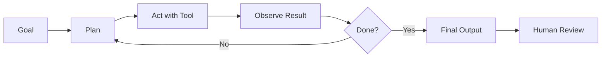

### 14.4 Human-in-the-Loop Framework

| Decision Type | Human Role |
|---|---|
| Informational | Review if needed |
| Internal draft | Edit and approve |
| Customer-facing | Approve before send |
| Financial/legal/regulated | Specialist approval |
| Destructive system action | Explicit approval or block |

### 14.5 DRAG Framework for Practical AI Work

Use this lightweight framework for enterprise AI tasks:

| Step | Meaning | Example |
|---|---|---|
| Define | Define the business problem and output | “Create a renewal exception summary.” |
| Retrieve | Provide approved context | Policy data, SOP, exception rules |
| Analyze | Claude reasons over the context | Identify missing fields and risk |
| Govern | Apply controls and approval | Human review, logging, escalation |

---

## 15. Tools

### 15.1 Anthropic / Claude Tools

| Tool | Use |
|---|---|
| Claude Chat | Interactive writing, analysis, brainstorming |
| Claude Projects | Persistent workspaces with files and context |
| Claude API | Build custom applications |
| Claude Console | Test prompts, evaluate, manage API work |
| Messages API | Fine-grained model interactions |
| Managed Agents | Long-running/asynchronous agent infrastructure |
| Claude Code | Codebase work, terminal/IDE agent |
| Claude Cowork | Multi-step knowledge work across files/apps |
| MCP Connector | Connect Claude to remote MCP servers |
| Computer use | Controlled desktop interaction |
| Code execution | Run sandboxed analysis and file generation |
| Web search / web fetch | Retrieve current information with citations |
| Prompt caching | Reduce cost/latency for repeated context |
| Batch API | Process high-volume asynchronous jobs |

### 15.2 Enterprise Tools Claude Often Connects To

| System | Typical Claude Use |
|---|---|
| Jira / Azure DevOps | Read tickets, create implementation plans |
| GitHub / Azure Repos | Review PRs, inspect code, generate docs |
| Databricks | Query governed data and metadata |
| SharePoint / OneDrive | Retrieve business documents |
| Slack / Teams | Summarize threads, coordinate work |
| ServiceNow / Zendesk | Triage tickets |
| Power Platform | Explain flows, generate API integration patterns |
| Power BI | Explain datasets, metric definitions, migration plans |
| Confluence | Knowledge base retrieval |
| SQL Server / Postgres | Query operational data through approved tools |

### 15.3 Supporting Engineering Tools

| Tool | Use |
|---|---|
| Git | Version prompts, code, MCP configs |
| CI/CD | Run tests and deploy safely |
| OpenTelemetry | Agent observability |
| Secrets manager | Protect API keys and tokens |
| Feature flags | Roll out AI features gradually |
| Data catalog | Govern source definitions |
| SIEM | Monitor security events |
| Cost dashboards | Track usage and spend |

---

## 16. Quick Reference

### 16.1 Claude Surface Decision Rules

| Need | Use |
|---|---|
| Ask questions, draft, summarize | Claude Chat |
| Team workspace with reusable docs | Claude Projects |
| Build an app or workflow | Claude API |
| Codebase work | Claude Code |
| Multi-step knowledge task across files/apps | Claude Cowork |
| Connect external tools/data | MCP or tool use |
| Long-running autonomous workflow | Managed Agents or Agent SDK |
| High-volume offline work | Batch API |
| Repeated long context | Prompt caching |

### 16.2 Model Selection Rules

| Workload | Starting Point |
|---|---|
| Simple classification | Haiku |
| Standard enterprise assistant | Sonnet |
| Complex coding / architecture | Sonnet or Opus |
| Hard reasoning / agent orchestration | Opus |
| Long-running frontier agent work | Validate advanced models |
| Cost-sensitive high volume | Haiku + evals |
| Unclear workload | Start with Sonnet, evaluate alternatives |

### 16.3 Prompt Checklist

```text
[ ] Role is clear
[ ] Task is specific
[ ] Context is provided
[ ] Output format is defined
[ ] Constraints are explicit
[ ] Source of truth is identified
[ ] Unknowns must be stated
[ ] Risks must be surfaced
[ ] Human approval point is clear
```

### 16.4 API Request Skeleton

```python
import anthropic

client = anthropic.Anthropic()

response = client.messages.create(
    model="claude-sonnet-5",
    max_tokens=2000,
    system="You are a careful enterprise automation architect.",
    messages=[
        {
            "role": "user",
            "content": "Review this automation design and identify risks."
        }
    ],
)

print(response.content)
```

### 16.5 Tool Design Skeleton

```json
{
  "name": "lookup_policy",
  "description": "Look up approved policy attributes by policy number. Use only when the user asks for policy-specific facts.",
  "input_schema": {
    "type": "object",
    "properties": {
      "policy_number": {
        "type": "string",
        "description": "The policy number to look up."
      }
    },
    "required": ["policy_number"]
  }
}
```

### 16.6 MCP Design Rules

| Rule | Practical Meaning |
|---|---|
| One server per domain when possible | Keep ownership clear |
| Use least privilege | Do not expose admin tools by default |
| Separate read and write tools | Easier approval design |
| Describe tools clearly | Claude chooses tools based on descriptions |
| Log every call | Required for support and audit |
| Add approval for write actions | Prevent unwanted changes |
| Version tool contracts | Avoid breaking agents |
| Test malicious inputs | Prompt injection is a real risk |

### 16.7 Claude Code Starter Commands

```bash
# macOS, Linux, WSL
curl -fsSL https://claude.ai/install.sh | bash
```

```powershell
# Windows PowerShell
irm https://claude.ai/install.ps1 | iex
```

### 16.8 Production Readiness Rule of Thumb

```text
If Claude can affect a customer, employee, legal position, financial transaction,
production system, or regulated record, it needs documented controls, testing,
logging, and human approval.
```

---

## 17. Meeting Talking Points

### 17.1 Questions to Ask Anthropic / Vendor / Internal AI Platform Team

| Topic | Question |
|---|---|
| Model selection | Which model should we start with for our workload and why? |
| Data retention | Which features are ZDR eligible and which are not? |
| Compliance | Are our use cases covered under our enterprise agreement? |
| MCP | Which MCP servers are approved or supported? |
| Tool governance | How do we restrict read vs write actions? |
| Auditability | Can we see user prompts, outputs, tool calls, and approvals? |
| Cost | How should we estimate and cap spend? |
| Evals | What evaluation approach is recommended before production? |
| Security | How do we handle prompt injection from external tools/documents? |
| Claude Code | What permissions should developers grant locally? |
| Cowork | What workloads should not use Cowork yet? |
| Support | Who handles incidents, model behavior issues, and integration failures? |
| Change management | How are model upgrades tested before rollout? |

### 17.2 Executive Talking Points

- Claude is not just a chatbot; it is an AI platform for reasoning, analysis, coding, tool use, and multi-step work.
- The safest enterprise path is to start with low-risk internal use cases, define controls, then expand.
- The value comes from combining Claude with trusted data, approved tools, measurable evals, and human approval.
- MCP can reduce integration friction, but it introduces new governance requirements around permissions, tool ownership, and auditability.
- Claude Code can accelerate engineering, but it should operate through branches, tests, PRs, and review.
- Cowork can help business teams complete multi-step document and file work, but sensitive or regulated workloads require extra review.
- AI outputs should be treated as drafts or recommendations unless the workflow has been formally validated.

### 17.3 Architecture Review Talking Points

- What is the source of truth?
- What data does Claude receive?
- What tools can Claude call?
- Which actions are read-only versus write-enabled?
- Where does human approval happen?
- How are prompts and tool definitions versioned?
- What happens when Claude is wrong?
- How do we measure quality?
- What logs are retained?
- What is the rollback process?

---

## 18. Example Scenario

### Scenario: Enterprise Policy Renewal Assistant

#### Business Problem

An insurance operations team manually reviews renewal-related policy records, supporting documents, email context, and exception rules. The process is slow, inconsistent, and difficult to scale. The team wants Claude to help identify missing policy attributes, summarize renewal readiness, draft exception notes, and recommend next actions.

#### Technical Solution

Build a governed Claude-powered renewal assistant that:

1. Accepts a policy number or batch of policies.
2. Retrieves approved policy attributes from Databricks through a read-only API or SQL service.
3. Retrieves relevant SOP rules from a governed knowledge base.
4. Uses Claude to analyze readiness and generate a structured output.
5. Requires human approval before any downstream action.
6. Logs prompts, retrieved sources, tool calls, outputs, user approvals, and exceptions.

#### Example Architecture

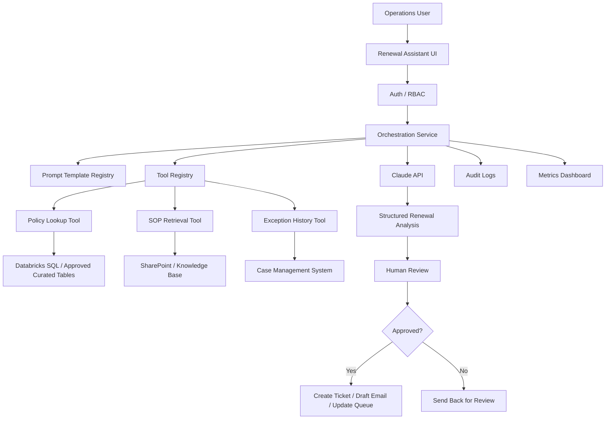

#### Step-by-Step Process

| Step | Description |
|---|---|
| 1 | User enters policy number |
| 2 | App validates user permissions |
| 3 | App calls policy lookup tool |
| 4 | App retrieves SOP rules relevant to renewal |
| 5 | Claude receives only approved context |
| 6 | Claude returns structured readiness analysis |
| 7 | User reviews recommendations |
| 8 | User approves or rejects downstream action |
| 9 | System logs full trace |
| 10 | Metrics feed improvement dashboard |

#### Example Output Schema

```json
{
  "policy_number": "string",
  "renewal_readiness": "ready | blocked | needs_review",
  "missing_attributes": ["string"],
  "risk_flags": ["string"],
  "source_evidence": [
    {
      "source": "string",
      "quote_or_field": "string"
    }
  ],
  "recommended_next_action": "string",
  "requires_human_approval": true,
  "confidence": "high | medium | low"
}
```

#### Risks

| Risk | Mitigation |
|---|---|
| Claude uses stale rules | Retrieve only current approved SOP content |
| Claude invents missing facts | Require evidence per claim |
| Incorrect policy lookup | Validate tool output and policy ID |
| Sensitive data leakage | Send minimum necessary fields |
| Unauthorized action | Require approval for write tools |
| Cost growth | Use token budgets, caching, and model evaluation |
| Poor adoption | Provide clear UI, training, and override paths |

#### Governance Considerations

| Area | Control |
|---|---|
| Data access | Read-only service principal |
| Human approval | Required before ticket/email/update |
| Audit | Log prompt version, tool calls, sources, output |
| Evaluation | Test known renewal scenarios |
| Security | Prompt injection checks on retrieved documents |
| Change control | Version prompt and SOP retrieval logic |
| Support | Runbook for tool/API/model failures |

#### Monitoring Approach

| Metric | Target |
|---|---|
| Analysis accuracy | 95%+ against sampled human review |
| Missing-field detection | High recall for required fields |
| Human override rate | Track by rule/category |
| Average processing time | Lower than manual baseline |
| Cost per policy | Within approved budget |
| Tool error rate | Below agreed threshold |
| Escalation rate | Reviewed weekly |

---

## 19. Beginner-to-Pro Learning Path

### Level 1: Beginner

| Area | Details |
|---|---|
| Learn | What Claude is, what prompts are, how to ask clear questions |
| Practice | Summarize documents, draft emails, explain code snippets |
| Be able to do | Use Claude as a personal productivity assistant |
| Avoid | Trusting outputs without review, vague prompts, sharing sensitive data |

### Level 2: Advanced Beginner

| Area | Details |
|---|---|
| Learn | Prompt structure, system instructions, context, output formats |
| Practice | Create reusable prompts for meeting prep, documentation, code review |
| Be able to do | Produce consistent outputs with clear instructions |
| Avoid | Overly long prompts, undefined success criteria, no examples |

### Level 3: Intermediate

| Area | Details |
|---|---|
| Learn | Messages API, model selection, tokens, structured outputs, tool use |
| Practice | Build a small Claude-powered app or API workflow |
| Be able to do | Integrate Claude into a controlled application |
| Avoid | Hardcoding model assumptions, skipping error handling, ignoring cost |

### Level 4: Advanced

| Area | Details |
|---|---|
| Learn | MCP, RAG, Claude Code, evals, prompt caching, batch processing |
| Practice | Build a retrieval assistant, connect one approved tool, create eval tests |
| Be able to do | Design governed enterprise Claude workflows |
| Avoid | Tool sprawl, weak permissions, no monitoring, poor grounding |

### Level 5: Pro / Enterprise Architect

| Area | Details |
|---|---|
| Learn | Multi-agent systems, managed agents, security architecture, governance, observability |
| Practice | Design an enterprise AI operating model and production support process |
| Be able to do | Lead Claude adoption across teams with standards and controls |
| Avoid | Vendor hype, unmanaged autonomy, lack of auditability, no ROI measurement |

---

## 20. Repository Placement

Recommended folder structure:

```text
knowledge-repository/
└── artificial-intelligence/
    └── claude-anthropic/
        ├── README.md
        ├── reference-guide.md
        ├── quick-reference.md
        ├── architecture.md
        ├── api-patterns.md
        ├── prompt-engineering.md
        ├── mcp.md
        ├── claude-code.md
        ├── claude-cowork.md
        ├── multi-agent-workflows.md
        ├── troubleshooting.md
        ├── governance.md
        ├── security-and-risk.md
        ├── evaluation.md
        ├── templates/
        │   ├── use-case-intake.md
        │   ├── design-document.md
        │   ├── prompt-template.md
        │   ├── mcp-server-design.md
        │   ├── production-readiness.md
        │   ├── code-review-checklist.md
        │   ├── support-runbook.md
        │   └── architecture-review.md
        └── examples/
            ├── policy-renewal-assistant.md
            ├── document-extraction-agent.md
            ├── claude-code-repo-review.md
            └── mcp-databricks-lookup.md
```

### Suggested README.md

```markdown
# Claude by Anthropic

This folder contains enterprise-ready learning, architecture, governance, and implementation guidance for Claude.

## Start Here

1. Read `reference-guide.md`
2. Review `quick-reference.md`
3. Use `templates/use-case-intake.md` for new ideas
4. Use `governance.md` before production use
5. Use `examples/` for implementation patterns

## Key Topics

- Claude models
- Messages API
- Prompt engineering
- Tool use
- MCP
- Claude Code
- Claude Cowork
- Multi-agent workflows
- Governance
- Evaluation
- Production readiness
```

---

## 21. Reusable Templates

### 21.1 Use Case Intake Template

```markdown
# Claude Use Case Intake

## 1. Business Problem
What problem are we solving?

## 2. Current Process
How is the work done today?

## 3. Proposed Claude Role
What should Claude do?

- [ ] Summarize
- [ ] Classify
- [ ] Draft
- [ ] Extract
- [ ] Reason
- [ ] Call tools
- [ ] Modify code
- [ ] Perform multi-step workflow

## 4. Users
Who will use this?

## 5. Data Involved
What data will Claude see?

## 6. Data Classification
- [ ] Public
- [ ] Internal
- [ ] Confidential
- [ ] Regulated
- [ ] Restricted

## 7. Systems Involved
List APIs, databases, documents, repositories, or tools.

## 8. Output
What should Claude produce?

## 9. Human Approval
Where is human review required?

## 10. Risks
What could go wrong?

## 11. Success Metrics
How will we measure success?

## 12. Owner
Business owner:
Technical owner:
Support owner:
```

---

### 21.2 Design Document Template

````markdown
# Claude Solution Design Document

## 1. Overview
Briefly describe the solution.

## 2. Business Objective
State the measurable business goal.

## 3. Scope
### In Scope
### Out of Scope

## 4. Users and Personas

## 5. Architecture

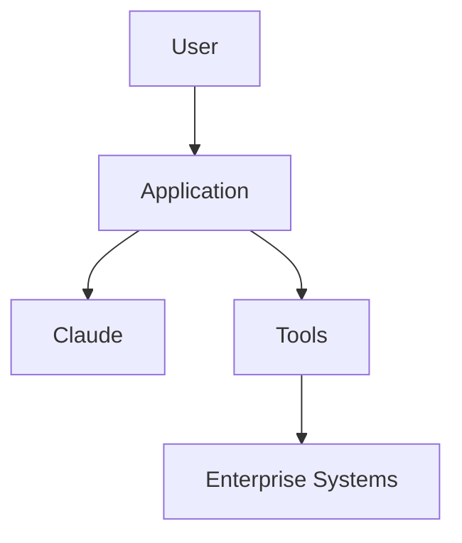

## 6. Data Flow

## 7. Prompt Design
Include prompt template, variables, and examples.

## 8. Tool Design
List tools, owners, permissions, and schemas.

## 9. Model Selection
Chosen model:
Reason:
Fallback model:

## 10. Evaluation Plan
Test cases:
Acceptance criteria:

## 11. Security and Governance
Data classification:
Retention:
Access controls:
Approval gates:

## 12. Monitoring
Metrics:
Logs:
Alerts:

## 13. Deployment Plan

## 14. Rollback Plan

## 15. Support Model
Owner:
Runbook:
Escalation:
````

---

### 21.3 Prompt Template

```markdown
# Prompt Template

## Role
You are a [role].

## Task
Your task is to [specific task].

## Context
Use the following context:
[context]

## Inputs
[input variables]

## Rules
- Do not invent facts.
- Use only the provided sources.
- State unknowns clearly.
- Flag risks and assumptions.
- Ask for approval before consequential actions.

## Output Format
Return:

| Field | Description |
|---|---|
| Summary | Brief answer |
| Evidence | Source-backed facts |
| Risks | Issues or uncertainties |
| Recommendation | Next best action |
| Confidence | High / Medium / Low |

## Quality Bar
A good answer is accurate, concise, sourced, actionable, and clear about uncertainty.
```

---

### 21.4 MCP Server Design Template

```markdown
# MCP Server Design

## 1. Server Name

## 2. Business Domain
Example: Jira, Databricks, SharePoint, Policy Admin

## 3. Owner
Technical owner:
Business owner:

## 4. Purpose
What data or tools does this expose?

## 5. Tools Exposed

| Tool | Read/Write | Description | Approval Required |
|---|---|---|---|

## 6. Resources Exposed

| Resource | Description | Sensitivity |
|---|---|---|

## 7. Authentication

## 8. Authorization

## 9. Rate Limits

## 10. Logging

## 11. Error Handling

## 12. Security Controls
- Least privilege
- Input validation
- Output filtering
- Prompt injection handling
- Audit logging

## 13. Test Cases

## 14. Production Readiness Decision
Approved / Not approved:
Approver:
Date:
```

---

### 21.5 Troubleshooting Checklist

```markdown
# Claude Troubleshooting Checklist

## Problem
Describe the issue.

## Symptoms
- [ ] Wrong answer
- [ ] Missing data
- [ ] Invalid JSON
- [ ] Tool failure
- [ ] Timeout
- [ ] High cost
- [ ] Security concern
- [ ] User complaint

## Recent Changes
Prompt changed?
Model changed?
Tool changed?
Data source changed?
Permissions changed?

## Evidence
Request ID:
Prompt version:
Model:
Tool calls:
Input sources:
Output:
Error message:

## Diagnosis
Likely cause:

## Fix
Immediate fix:
Long-term fix:

## Follow-Up
Update evals?
Update prompt?
Update tool schema?
Update runbook?
Notify users?
```

---

### 21.6 Governance Checklist

```markdown
# Claude Governance Checklist

## Use Case
Name:
Owner:
Risk level:

## Data
- [ ] Data classified
- [ ] Sensitive fields minimized
- [ ] Retention reviewed
- [ ] Source system approved

## Access
- [ ] User authentication
- [ ] Role-based access
- [ ] Least privilege
- [ ] Service account reviewed

## Tools
- [ ] Tool owner assigned
- [ ] Tool schema documented
- [ ] Read/write separated
- [ ] Write actions require approval
- [ ] Logs enabled

## Evaluation
- [ ] Test cases created
- [ ] Accuracy threshold defined
- [ ] Failure examples tested
- [ ] Regression test process defined

## Production
- [ ] Monitoring enabled
- [ ] Cost tracking enabled
- [ ] Support owner assigned
- [ ] Rollback plan documented
- [ ] Human review process documented
```

---

### 21.7 Production Readiness Checklist

```markdown
# Claude Production Readiness Checklist

## Architecture
- [ ] Architecture diagram completed
- [ ] Data flow documented
- [ ] Tool flow documented
- [ ] Failure paths documented

## Security
- [ ] Secrets protected
- [ ] Access reviewed
- [ ] Sensitive data minimized
- [ ] Prompt injection risks reviewed

## Quality
- [ ] Eval suite passed
- [ ] Human review completed
- [ ] Output format validated
- [ ] Edge cases tested

## Operations
- [ ] Logs available
- [ ] Dashboard available
- [ ] Alerts configured
- [ ] Runbook published
- [ ] Support owner assigned

## Change Control
- [ ] Prompt versioned
- [ ] Tool versioned
- [ ] Model version documented
- [ ] Rollback tested

## Approval
Business owner:
Technical owner:
Security:
Compliance:
Go-live date:
```

---

### 21.8 Code Review Checklist for Claude-Assisted Work

```markdown
# Claude-Assisted Code Review Checklist

## Scope
- [ ] Change matches requested scope
- [ ] No unrelated files changed
- [ ] No generated clutter added

## Correctness
- [ ] Tests pass
- [ ] Edge cases handled
- [ ] Error handling included
- [ ] No broken dependencies

## Security
- [ ] No secrets exposed
- [ ] No unsafe permissions added
- [ ] Inputs validated
- [ ] Logs do not expose sensitive data

## Maintainability
- [ ] Naming is clear
- [ ] Comments are useful
- [ ] Code follows project conventions
- [ ] Documentation updated

## AI-Specific Review
- [ ] Claude assumptions reviewed
- [ ] Generated code manually inspected
- [ ] Prompt/output saved if required
- [ ] Risks documented
```

---

### 21.9 Meeting Agenda Template

```markdown
# Claude Use Case Review Meeting

## Objective
Review the proposed Claude use case and decide next steps.

## Agenda
1. Business problem
2. Current process pain points
3. Proposed Claude role
4. Data and systems involved
5. Tool/MCP requirements
6. Risk classification
7. Human approval points
8. Evaluation approach
9. Architecture review
10. Decision and next steps

## Decisions Needed
- Proceed / pause / redesign
- Risk level
- Required approvals
- MVP scope
- Owner assignments
```

---

### 21.10 Support Runbook Template

```markdown
# Claude Solution Support Runbook

## System Name

## Owner
Business:
Technical:
Support:

## What It Does

## Common Failures

| Failure | Cause | Resolution |
|---|---|---|

## Monitoring

| Metric | Alert Threshold | Owner |
|---|---|---|

## Logs
Where to find logs:

## Escalation
Level 1:
Level 2:
Security:
Vendor:

## Rollback
Steps:

## Known Limitations

## Last Reviewed
Date:
Reviewer:
```

---

## 22. Final Mental Model

Think of Claude as a **reasoning engine inside a governed enterprise workflow**.

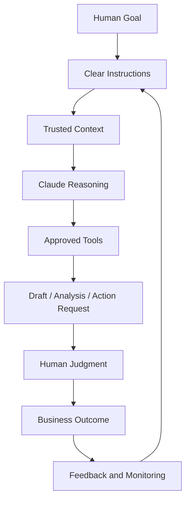

The practical mental model:

```text
Claude is not the process owner.
Claude is not the source of truth.
Claude is not the approval authority.

Claude is the reasoning and execution assistant.

The enterprise system around Claude must provide:
- the goal,
- the trusted context,
- the allowed tools,
- the rules,
- the evaluation,
- the approval path,
- the logs,
- and the continuous improvement loop.
```

The best Claude implementations are not the flashiest ones. They are the ones that are clear, measurable, secure, supportable, and useful enough that people actually trust them in real work.
