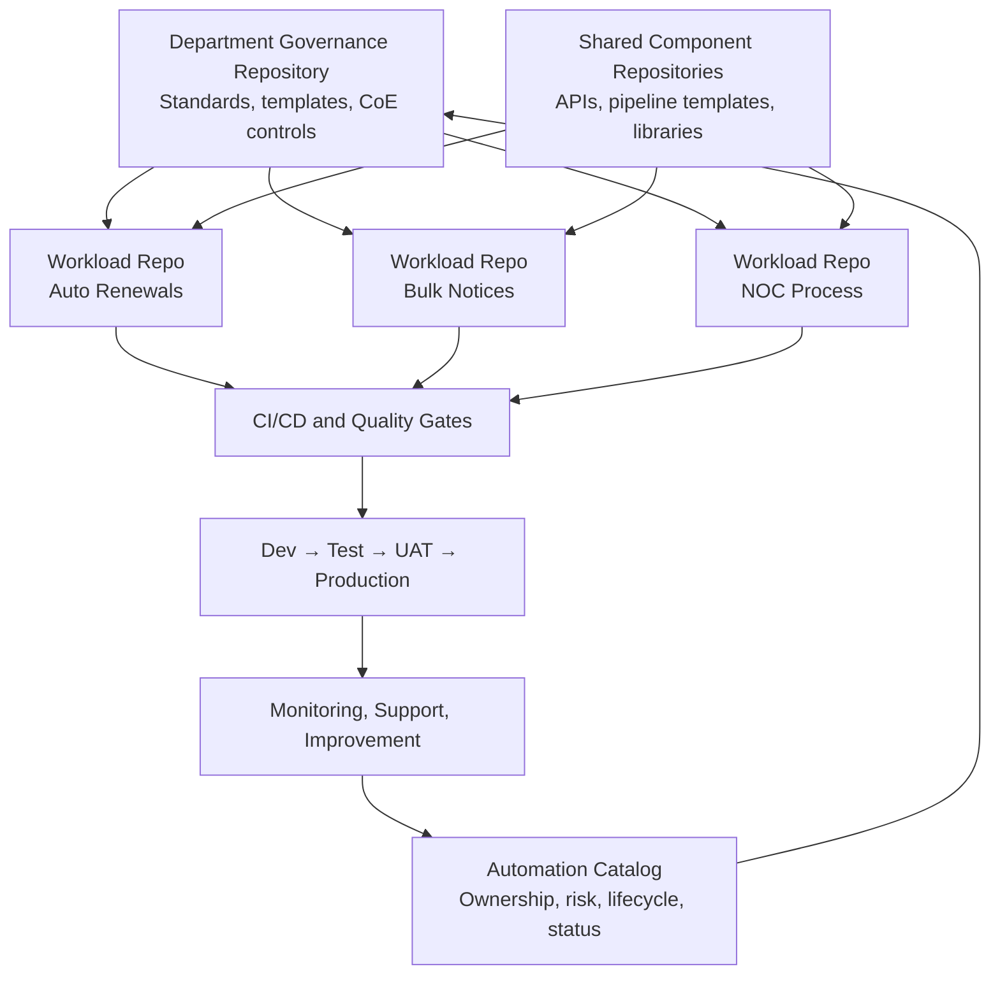
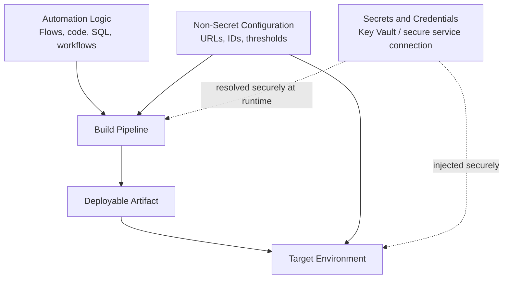
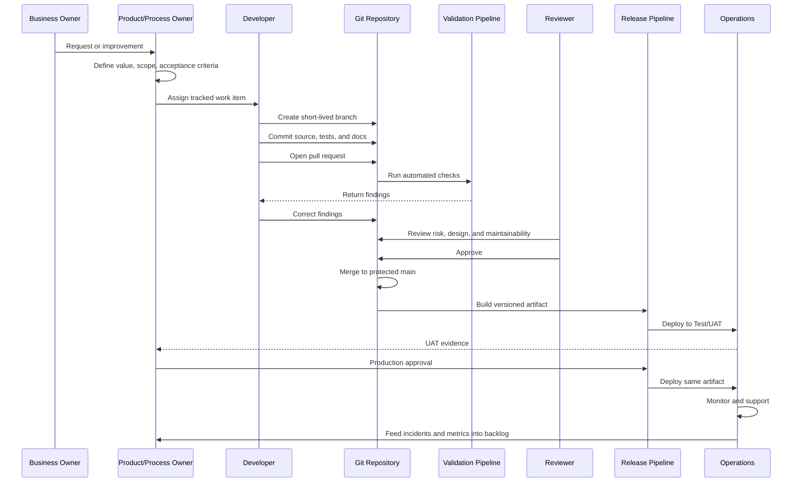
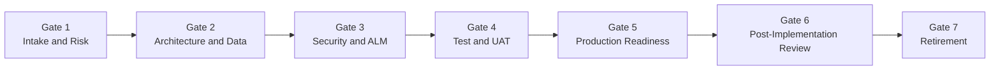
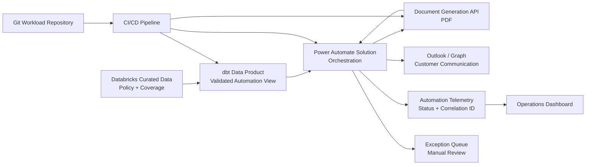
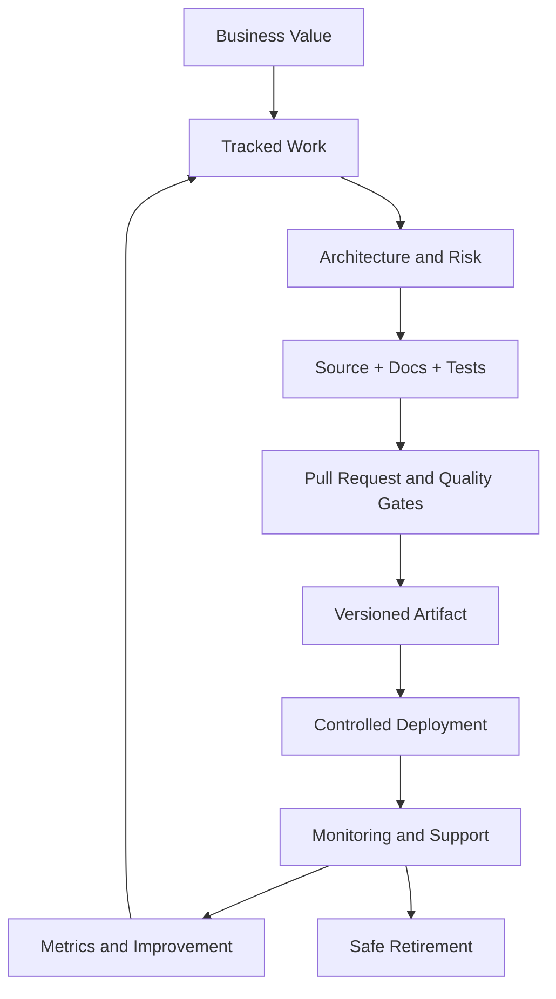

# Setting Up a Git Repository for a Maturing Intelligent Automation Department

> **Audience:** Beginner-to-pro technical professionals building practical mastery over time  
> **Primary context:** Microsoft Power Platform, Azure DevOps, Databricks/dbt, APIs, UiPath, and related enterprise automation tooling  
> **Purpose:** Establish a scalable, governed, secure, and maintainable source-control operating model for an Intelligent Automation department  
> **Recommended platform example:** Azure DevOps Repos, Boards, Pipelines, and Artifacts  
> **Last reviewed:** July 2026

---

## Table of Contents

1. [Executive Summary](#executive-summary)
2. [Plain-English Explanation](#plain-english-explanation)
3. [Business Context](#business-context)
4. [Guiding Principles](#guiding-principles)
5. [Core Concepts](#core-concepts)
6. [Recommended Repository Operating Model](#recommended-repository-operating-model)
7. [CoE Standards Alignment](#coe-standards-alignment)
8. [Well-Architected Framework Alignment](#well-architected-framework-alignment)
9. [Architecture View](#architecture-view)
10. [Data and Process Flow](#data-and-process-flow)
11. [Repository Structure](#repository-structure)
12. [Branching and Pull Request Strategy](#branching-and-pull-request-strategy)
13. [Development Lifecycle](#development-lifecycle)
14. [Platform-Specific Source-Control Standards](#platform-specific-source-control-standards)
15. [CI/CD and Release Management](#cicd-and-release-management)
16. [Security and Secrets Management](#security-and-secrets-management)
17. [Governance](#governance)
18. [Common Use Cases](#common-use-cases)
19. [Best Practices](#best-practices)
20. [Common Mistakes](#common-mistakes)
21. [Troubleshooting](#troubleshooting)
22. [Continuous Improvement](#continuous-improvement)
23. [Frameworks](#frameworks)
24. [Tools](#tools)
25. [Quick Reference](#quick-reference)
26. [Meeting Talking Points](#meeting-talking-points)
27. [Realistic Enterprise Scenario](#realistic-enterprise-scenario)
28. [Beginner-to-Pro Learning Path](#beginner-to-pro-learning-path)
29. [Repository Placement](#repository-placement)
30. [Reusable Templates](#reusable-templates)
31. [Implementation Roadmap](#implementation-roadmap)
32. [Final Mental Model](#final-mental-model)
33. [Official Reference Material](#official-reference-material)

---

# Executive Summary

A Git repository for an Intelligent Automation department should be more than a place to store files. It should act as the department’s controlled system of record for:

- automation source files
- architecture decisions
- Power Platform solution source
- UiPath project source
- dbt and SQL models
- API definitions
- deployment pipelines
- environment configuration
- tests
- operating procedures
- release history
- governance evidence
- ownership and support information

The recommended target model is a **hybrid repository structure**:

1. A department-level repository for governance, standards, templates, and the automation catalog.
2. Separate workload repositories for production automations or closely related automation products.
3. Shared-component repositories for reusable APIs, libraries, pipeline templates, and connectors.

This model provides central consistency without forcing every automation into one large repository with a shared release cycle.

The repository should enforce these foundational controls:

- no direct changes to the protected `main` branch
- short-lived feature branches
- mandatory pull requests
- linked work items
- automated validation
- risk-based review requirements
- no credentials or secrets in source control
- immutable build artifacts promoted through environments
- documented owners, support procedures, and rollback plans
- traceability from business request to production release

For Microsoft Power Platform workloads, use solutions as the ALM unit, store solution source in Git, externalize configuration through environment variables and connection references, and promote managed solutions to downstream environments. Microsoft now recommends the YAML source-control format for new Power Platform projects; the classic XML format is mainly for existing repositories or legacy tooling. [Microsoft: Source control with solution files](https://learn.microsoft.com/en-us/power-platform/alm/use-source-control-solution-files)

A current governance consideration is that the Microsoft Power Platform CoE Starter Kit is no longer actively maintained. Its core inventory, usage, monitoring, and governance scenarios are now available through the Power Platform admin center. The department should continue applying CoE principles, but should prefer current native platform capabilities over building a new dependency on the discontinued kit. [Microsoft: CoE Starter Kit transition](https://learn.microsoft.com/en-us/power-platform/guidance/coe/starter-kit)

---

# Plain-English Explanation

Git is a structured history of changes.

A Git repository answers questions such as:

- What changed?
- Who changed it?
- Why did they change it?
- Who reviewed it?
- Did it pass testing?
- Which version is in production?
- Can we restore the previous version?
- Which business process does this automation support?
- Who owns and supports it?

Without Git, an automation may exist only inside a platform environment, a developer laptop, a shared drive, or a production robot. That makes the automation difficult to review, recover, transfer, audit, and improve.

A mature workflow looks like this:

```text
Business request
    ↓
Tracked work item
    ↓
Design and risk review
    ↓
Developer branch
    ↓
Source changes
    ↓
Automated checks
    ↓
Pull request and review
    ↓
Approved version on main
    ↓
Build artifact
    ↓
Test deployment
    ↓
Production approval
    ↓
Production deployment
    ↓
Monitoring and improvement
```

The key mental shift is:

> Git is not merely a backup. It is the controlled path through which a change becomes an approved production release.

---

# Business Context

Intelligent Automation departments mature differently from traditional software teams because their workloads often combine several technologies.

A single business automation might include:

- a Power Automate cloud flow
- a Power App
- a Dataverse solution
- a UiPath or desktop automation
- a Databricks or SQL data model
- an API or Azure Function
- a custom PDF-generation service
- SharePoint configuration
- Microsoft Graph integration
- service accounts and connection references
- operational dashboards
- runbooks and support procedures

This creates several risks.

| Business Risk | What Happens Without Repository Standards |
|---|---|
| Key-person dependency | Only one developer understands the automation |
| Production instability | Changes are made directly in production |
| Weak auditability | The team cannot prove who approved a release |
| Credential exposure | Passwords or API keys are stored in scripts |
| Environment drift | Development, test, and production contain different logic |
| Duplicate work | Developers rebuild components that already exist |
| Slow onboarding | New team members cannot understand the architecture |
| Failed recovery | The team cannot recreate the deployed solution |
| Uncontrolled citizen development | Business-critical apps have no ownership or lifecycle |
| Vendor dependency | Deliverables cannot be maintained internally |
| Data-quality risk | Automations consume unvalidated or undocumented data |
| Operational blind spots | There is no runbook, alerting model, or support owner |

A well-designed Git operating model reduces these risks by establishing one visible, repeatable delivery process.

---

# Guiding Principles

## 1. Organize Around Workloads, Not Individual Flows

A workload is a business capability that may contain several technical components.

Example:

```text
Auto-Renewal Workload
├── Databricks policy lookup model
├── Power Automate orchestration flow
├── PDF-generation API integration
├── Outlook notification
├── operational monitoring
└── support runbook
```

Do not create unrelated repositories named after isolated technical objects such as:

```text
send-email-flow
pdf-script
sql-query-2
```

Prefer:

```text
ia-auto-renewal
ia-bulk-notices
ia-noc-process
```

## 2. The Repository Is the Approved Source

Production should be reproducible from:

- approved source
- approved configuration
- approved pipeline
- approved build artifact

Do not treat an undocumented production environment as the master copy.

## 3. Environments Are Not Branches

Use branches to manage proposed source changes.

Use environments to manage runtime stages:

```text
Development → Test → UAT → Production
```

Avoid long-lived branches named:

```text
dev
test
uat
prod
```

Those branches commonly drift and encourage environment-specific code.

## 4. Promote the Same Artifact

Build once, then promote the same package through test and production.

Do not rebuild a different production package from different source after testing.

## 5. Configuration Is Separate From Logic

Store non-secret environment configuration in controlled files or deployment settings.

Examples:

- environment URLs
- SharePoint site names
- Dataverse table names
- feature flags
- queue names
- timeout thresholds

Store secrets outside Git.

Examples:

- passwords
- client secrets
- API keys
- private certificates
- tokens

## 6. Every Production Workload Has an Owner

Each workload must identify:

- business owner
- technical owner
- product or process owner
- data owner
- production support group
- platform administrator
- recovery decision-maker

## 7. Controls Should Match Risk

A low-risk internal reminder flow does not need the same approval model as an automation that sends legal notices or changes financial data.

Use risk tiers to scale:

- review depth
- test depth
- security review
- release approval
- monitoring
- documentation

## 8. Prefer Clear Standards Over Clever Structures

A repository should be predictable to a beginner.

A new developer should quickly find:

- source
- configuration
- tests
- architecture
- pipelines
- deployment instructions
- runbooks
- ownership

---

# Core Concepts

| Concept | Plain-English Meaning | Intelligent Automation Example |
|---|---|---|
| Repository | A controlled folder with complete change history | The source and documentation for Auto Renewals |
| Commit | A saved set of related changes | Add policy-version validation |
| Branch | A temporary workspace for a proposed change | `feature/IA-482-policy-validation` |
| Pull request | A formal request to review and merge changes | Review the new validation logic |
| Merge | Combine approved branch changes into `main` | Add the feature to the approved code line |
| Tag | A permanent label for a version | `v1.4.0` |
| Release | A named version prepared for deployment | Auto Renewal 1.4.0 |
| Artifact | A packaged output created by the build | Managed solution ZIP |
| Pipeline | Automated validation, build, and deployment steps | Export, check, pack, and deploy a solution |
| Work item | A ticket describing the business or technical need | Azure Boards item IA-482 |
| Environment | A separated runtime space | Development, Test, UAT, Production |
| Solution | Power Platform ALM package | Auto Renewal managed solution |
| Configuration | Values that vary by environment | Production SharePoint URL |
| Secret | Sensitive authentication material | API client secret |
| Service connection | Secure pipeline identity for a target platform | Azure DevOps connection to Power Platform |
| Code owner | Person or team required to review an area | Data team reviews `/src/data/` |
| Build validation | Automated checks required before merge | YAML validation and solution checker |
| ADR | Architecture Decision Record | Decision to use a shared PDF API |
| Runbook | Instructions for supporting a production workload | Restart, replay, and escalation steps |
| Technical debt | A known compromise requiring future work | Temporary UI automation because no API exists |

---

# Recommended Repository Operating Model

## Three Repository Layers

### Layer 1: Department Operating Model Repository

Example:

```text
ia-department-governance
```

Contains:

- engineering standards
- CoE operating procedures
- risk-tier definitions
- naming standards
- reusable documentation templates
- development lifecycle
- review checklists
- architecture principles
- automation catalog schema
- onboarding material
- approved tool guidance
- deprecation standards
- reusable Mermaid diagrams

This repository changes less frequently and has broad departmental ownership.

### Layer 2: Workload Repositories

Examples:

```text
ia-auto-renewal
ia-bulk-notices
ia-media-auto-renewal-tickets
ia-noc-process
```

Each production workload has its own source, documentation, tests, pipelines, and release history.

### Layer 3: Shared Component Repositories

Examples:

```text
ia-shared-pipeline-templates
ia-document-generation-api
ia-power-platform-components
ia-observability-library
ia-databricks-data-products
```

Use shared repositories only when a component is:

- genuinely reusable
- independently versioned
- independently deployable
- owned by a defined team
- supported as a product

Do not create a shared repository merely because two automations contain similar code.

## Operating Model Diagram



## Repository Topology Decision Table

| Model | Strength | Weakness | Use When |
|---|---|---|---|
| One large monorepo | Easy discovery and shared standards | Coupled releases, broad permissions, noisy history | Small team with a few tightly related workloads |
| Repository per platform | Easy platform ownership | Business workload is split across many repositories | Platform teams own releases independently |
| Repository per workload | Clear ownership and release history | Shared components need careful management | Production automations represent distinct business capabilities |
| Hybrid model | Balances governance, ownership, and reuse | Requires naming and catalog discipline | Recommended for a maturing IA department |

## When to Split a Workload Into Its Own Repository

Split when one or more are true:

- it has an independent production release schedule
- it has a separate business owner
- it requires different access permissions
- it has a distinct support team
- it carries a different risk classification
- it contains a separately deployable service
- its build and test process differs materially
- its repository has become difficult to navigate or release safely

Keep components together when:

- they always deploy together
- they implement one business capability
- they share the same owners and support model
- separating them would create coordination overhead without reducing risk

---

# CoE Standards Alignment

## Current Microsoft CoE Position

The Power Platform CoE Starter Kit is no longer actively maintained. Microsoft directs organizations toward native Power Platform admin center capabilities such as Inventory, Usage, Monitor, and Actions. Continue using CoE as an **operating model**—strategy, governance, administration, support, and adoption—but prefer native current capabilities for new implementations. [Microsoft: CoE Starter Kit transition](https://learn.microsoft.com/en-us/power-platform/guidance/coe/starter-kit)

## CoE Capability Mapping

| CoE Area | Repository Standard | Operational Evidence |
|---|---|---|
| Strategy | Department vision, principles, roadmap | `/governance/strategy/` |
| Governance | Risk tiers, required gates, approved connectors | `/governance/policies/` |
| Administration | Environment and identity standards | `/platform/power-platform/` |
| Inventory | Every workload registered in the automation catalog | `automation-catalog.yaml` or catalog system |
| Monitoring | Monitoring design and runbooks required | `/operations/monitoring/` |
| Security | Secrets, identities, DLP, and access documented | `/security/` |
| ALM | Source, PRs, pipelines, release artifacts | `/pipelines/`, tags, releases |
| Nurture and adoption | Templates, examples, onboarding | `/templates/`, `/learning/` |
| Support | Owner, SLA, recovery, escalation | `/operations/runbooks/` |
| Continuous improvement | Metrics and review cadence | `/governance/metrics/` |
| Decommissioning | Retirement checklist and data-retention plan | `/operations/retirement/` |

## CoE Minimum Control Set

Every production workload should have:

- [ ] named business owner
- [ ] named technical owner
- [ ] named support group
- [ ] risk classification
- [ ] architecture diagram
- [ ] system design document
- [ ] data classification
- [ ] source repository
- [ ] protected `main` branch
- [ ] pull-request review
- [ ] automated validation
- [ ] deployment method
- [ ] environment configuration inventory
- [ ] service identity inventory
- [ ] runbook
- [ ] monitoring and alerting
- [ ] rollback or recovery plan
- [ ] release history
- [ ] retirement criteria

## Native Power Platform Governance Capabilities

Managed Environments provide enterprise administration capabilities such as environment groups, sharing controls, usage insights, data policies, pipelines, solution checker, and export to Application Insights. Licensing and organizational requirements should be evaluated before enabling them broadly. [Microsoft: Managed Environments overview](https://learn.microsoft.com/en-us/power-platform/admin/managed-environment-overview)

Data policies act as guardrails for connector use and can reduce the risk of organizational data being exposed through inappropriate connectors. [Microsoft: Power Platform data policies](https://learn.microsoft.com/en-us/power-platform/admin/wp-data-loss-prevention)

Repository documentation should not duplicate every administrative setting. Instead, it should record:

- the approved policy
- the owner of the policy
- the scope
- the rationale
- exceptions
- the authoritative administrative location
- evidence or review date

---

# Well-Architected Framework Alignment

Microsoft Power Platform Well-Architected is organized around five pillars: Reliability, Security, Operational Excellence, Performance Efficiency, and Experience Optimization. [Microsoft: Power Platform Well-Architected pillars](https://learn.microsoft.com/en-us/power-platform/well-architected/pillars)

## Repository Controls by Pillar

| Pillar | Repository Controls | Example Evidence |
|---|---|---|
| Reliability | Recovery design, retry rules, idempotency tests, rollback plan, dependency inventory | `recovery-plan.md`, integration tests |
| Security | No secrets, least privilege, threat model, data classification, protected branches | secret scan, security review |
| Operational Excellence | PR workflow, automated deployment, observability, runbooks, ownership | pipeline YAML, runbook |
| Performance Efficiency | Performance targets, volume assumptions, load tests, API limits, queue design | `nonfunctional-requirements.md` |
| Experience Optimization | User-centered requirements, accessible app design, actionable error messages, support communications | UAT results, UX checklist |

## IA-Specific Well-Architected Questions

### Reliability

- Can the automation safely retry?
- Will retrying create duplicate emails, payments, tickets, or documents?
- What happens if an upstream system is unavailable?
- Can failed transactions be replayed?
- Is the automation state stored?
- Is there a manual fallback?
- Are recovery time and recovery point expectations defined?

### Security

- Which identity executes each step?
- Are personal accounts used in production?
- Does the identity have more access than required?
- What data enters logs?
- Are secrets stored outside Git?
- Are connector and API endpoints permitted by policy?
- Is sensitive output retained longer than necessary?

### Operational Excellence

- Is each deployment traceable to a PR?
- Can the workload be recreated from source?
- Are alerts routed to an accountable team?
- Does the runbook explain common recovery actions?
- Are operational metrics linked to business outcomes?
- Can the team deploy safely without the original developer?

### Performance Efficiency

- What is the expected daily and peak volume?
- What are connector, API, queue, and database limits?
- Is work batched or parallelized safely?
- Are expensive queries optimized?
- Is UI automation being used for high-volume work that needs an API?
- Has the workload been tested with production-like volumes?

### Experience Optimization

- Are business users told what happened and what they need to do?
- Are errors understandable?
- Are manual exception steps clear?
- Are approval experiences usable on supported devices?
- Does the automation reduce work, or merely move complexity to another team?

## Cost and Licensing Overlay

Although cost is not one of the five Power Platform pillars, the department should also document:

- license assumptions
- premium connector usage
- unattended automation licensing
- infrastructure cost
- API consumption
- Dataverse capacity
- Databricks compute
- third-party service cost
- support cost
- cost per transaction where useful

Store this in:

```text
/docs/architecture/cost-and-licensing.md
```

---

# Architecture View

## Enterprise Delivery Architecture

```mermaid
flowchart LR
    subgraph Demand["Demand and Governance"]
        IDEA["Business Idea"]
        INTAKE["Intake and Risk Tier"]
        BOARD["Azure Boards / Backlog"]
        ARCH["Architecture and Security Review"]
    end

    subgraph Git["Git and Engineering"]
        BR["Feature Branch"]
        SRC["Source + Documentation"]
        PR["Pull Request"]
        CHECKS["Automated Checks"]
        MAIN["Protected Main Branch"]
        TAG["Version Tag"]
    end

    subgraph Delivery["Build and Delivery"]
        BUILD["Build Once"]
        ART["Immutable Artifact"]
        TEST["Test / UAT"]
        APPROVAL["Release Approval"]
        PROD["Production"]
    end

    subgraph Operations["Operations"]
        OBS["Monitoring and Alerts"]
        RUN["Runbook and Support"]
        METRICS["Metrics and Improvement"]
        RETIRE["Retirement"]
    end

    IDEA --> INTAKE --> BOARD --> ARCH --> BR
    BR --> SRC --> PR --> CHECKS --> MAIN --> TAG
    TAG --> BUILD --> ART --> TEST --> APPROVAL --> PROD
    PROD --> OBS --> RUN --> METRICS
    METRICS --> BOARD
    PROD --> RETIRE
```



## Separation of Responsibilities



---

# Data and Process Flow

## End-to-End Change Flow



## Traceability Chain

Every production change should be traceable through:

```text
Business objective
  → Work item
  → Branch
  → Commits
  → Pull request
  → Review and checks
  → Main-branch commit
  → Version tag
  → Build artifact
  → Deployment record
  → Production monitoring
```

A break in this chain is a governance gap.

---

# Repository Structure

## Department Governance Repository

```text
ia-department-governance/
├── README.md
├── CONTRIBUTING.md
├── CODE_OF_CONDUCT.md
├── CHANGELOG.md
├── governance/
│   ├── strategy/
│   │   ├── ia-vision.md
│   │   ├── operating-model.md
│   │   └── maturity-roadmap.md
│   ├── policies/
│   │   ├── source-control-standard.md
│   │   ├── branching-standard.md
│   │   ├── secrets-standard.md
│   │   ├── environment-standard.md
│   │   ├── data-classification-standard.md
│   │   ├── citizen-development-standard.md
│   │   └── retirement-standard.md
│   ├── risk/
│   │   ├── risk-tier-model.md
│   │   └── control-matrix.md
│   ├── metrics/
│   │   ├── engineering-metrics.md
│   │   └── quarterly-review-template.md
│   └── exceptions/
│       └── exception-template.md
├── architecture/
│   ├── principles.md
│   ├── reference-architectures/
│   ├── decision-records/
│   └── diagrams/
├── platform/
│   ├── power-platform/
│   ├── uipath/
│   ├── databricks-dbt/
│   ├── azure/
│   └── api-integration/
├── templates/
│   ├── repository/
│   ├── pull-request/
│   ├── architecture/
│   ├── testing/
│   ├── operations/
│   └── release/
├── catalog/
│   ├── automation-catalog-schema.yaml
│   ├── sample-catalog-entry.yaml
│   └── lifecycle-statuses.md
├── onboarding/
│   ├── developer-onboarding.md
│   ├── reviewer-onboarding.md
│   └── support-onboarding.md
└── learning/
    ├── beginner/
    ├── intermediate/
    └── advanced/
```

## Workload Repository

```text
ia-auto-renewal/
├── README.md
├── CONTRIBUTING.md
├── CHANGELOG.md
├── SECURITY.md
├── OWNERS.yaml
├── .gitignore
├── .editorconfig
├── azure-pipelines.yml
├── .azuredevops/
│   ├── pull_request_template.md
│   └── work-item-templates/
├── docs/
│   ├── business/
│   │   ├── business-case.md
│   │   ├── process-definition.md
│   │   └── acceptance-criteria.md
│   ├── architecture/
│   │   ├── solution-design.md
│   │   ├── context-diagram.md
│   │   ├── data-flow.md
│   │   ├── security-design.md
│   │   ├── nonfunctional-requirements.md
│   │   ├── cost-and-licensing.md
│   │   └── decisions/
│   ├── testing/
│   │   ├── test-strategy.md
│   │   ├── test-cases.md
│   │   └── uat-evidence/
│   ├── release/
│   │   ├── deployment-guide.md
│   │   ├── rollback-plan.md
│   │   └── release-notes/
│   └── operations/
│       ├── runbook.md
│       ├── monitoring.md
│       ├── support-model.md
│       └── retirement-plan.md
├── src/
│   ├── power-platform/
│   │   ├── solutions/
│   │   └── deployment-settings/
│   ├── uipath/
│   ├── data/
│   │   ├── dbt/
│   │   └── sql/
│   ├── api/
│   │   ├── openapi/
│   │   └── functions/
│   └── shared/
├── config/
│   ├── dev/
│   ├── test/
│   ├── uat/
│   ├── prod/
│   └── README.md
├── tests/
│   ├── unit/
│   ├── integration/
│   ├── contract/
│   ├── smoke/
│   └── test-data/
├── pipelines/
│   ├── templates/
│   ├── validate.yml
│   ├── build.yml
│   └── deploy.yml
├── scripts/
│   ├── bootstrap/
│   ├── validation/
│   └── deployment/
└── operations/
    ├── dashboards/
    ├── alerts/
    └── queries/
```

## What Belongs in Git

- source files
- unpacked or synchronized Power Platform solution source
- workflow project definitions
- dbt SQL and YAML
- API specifications
- pipeline YAML
- test definitions
- non-secret configuration
- documentation
- Mermaid diagrams
- deployment scripts
- runbooks
- sample payloads that contain no sensitive data
- schema definitions
- reusable templates

## What Usually Does Not Belong in Git

- passwords
- API keys
- tokens
- private certificates
- production data
- real customer payloads
- personal information
- environment exports used only as temporary files
- large logs
- generated packages that are already stored as pipeline artifacts
- local virtual environments
- IDE caches
- compiled files
- robot execution screenshots containing sensitive information
- duplicate copies of third-party installers

---

# Branching and Pull Request Strategy

## Recommended Branching Model

Use lightweight trunk-based development:

```text
main
 ├── feature/IA-482-policy-validation
 ├── fix/IA-510-null-email-handling
 └── hotfix/IA-527-production-timeout
```

### Branch Types

| Branch | Purpose | Expected Lifetime |
|---|---|---|
| `main` | Approved, releasable source | Permanent |
| `feature/<id>-<description>` | New capability | Hours to a few days |
| `fix/<id>-<description>` | Non-emergency defect | Hours to a few days |
| `hotfix/<id>-<description>` | Urgent production correction | As short as safely possible |
| `experiment/<description>` | Time-boxed research | Delete or convert after decision |

Avoid long-lived developer branches.

## Branch Protection

Azure Repos branch policies can require pull requests, reviewers, linked work items, resolved comments, and successful build validation. Protected branches can also reject direct changes. [Microsoft: Azure Repos branch policies](https://learn.microsoft.com/en-us/azure/devops/repos/git/branch-policies)

Recommended `main` policies:

- [ ] direct pushes blocked
- [ ] pull request required
- [ ] minimum one reviewer for low-risk workloads
- [ ] minimum two reviewers for high-risk workloads
- [ ] author cannot be the only approver
- [ ] linked work item required
- [ ] all comments resolved
- [ ] validation pipeline must succeed
- [ ] security or platform reviewer required for sensitive paths
- [ ] force push disabled
- [ ] branch deletion tightly controlled
- [ ] stale approvals reset when meaningful changes are added
- [ ] merge strategy standardized

## Suggested Path-Based Review Ownership

| Path | Required Reviewer |
|---|---|
| `/src/data/` | Data engineering owner |
| `/src/power-platform/` | Power Platform technical owner |
| `/src/uipath/` | UiPath technical owner |
| `/src/api/` | API or integration owner |
| `/pipelines/` | DevOps or platform owner |
| `/security/` | Security representative |
| `/docs/architecture/decisions/` | Solution architect or lead engineer |

## Commit Standard

Use small, meaningful commits.

Format:

```text
<type>(<area>): <description>
```

Examples:

```text
feat(renewals): add policy-version eligibility check
fix(email): prevent send when recipient is blank
docs(runbook): add replay procedure
test(api): add PDF-service timeout case
refactor(dbt): split policy joins from filtering
chore(pipeline): update validation template
```

Recommended types:

```text
feat
fix
docs
test
refactor
chore
security
perf
revert
```

## Pull Request Size

Prefer a PR that reviewers can understand in one sitting.

Split large initiatives into independently understandable increments:

1. architecture and scaffolding
2. data model
3. orchestration
4. integration
5. monitoring
6. production hardening

Do not split a change in a way that leaves `main` broken.

## Pull Request Quality Questions

- What business need does this address?
- What changed?
- What did not change?
- What is the risk?
- How was it tested?
- Are environment-specific values externalized?
- Is the change backward compatible?
- Can it safely retry?
- What monitoring changed?
- What is the rollback path?
- Were documentation and runbooks updated?

---

# Development Lifecycle

## Stage 1: Intake

Required outputs:

- business problem
- expected value
- process owner
- affected users
- data involved
- urgency
- risk tier
- proposed automation type
- success measures

## Stage 2: Discovery

Capture:

- current process
- exceptions
- volumes
- seasonal peaks
- systems involved
- API availability
- data quality
- regulatory or legal concerns
- manual fallback
- upstream and downstream owners

## Stage 3: Architecture

Create:

- context diagram
- component diagram
- data-flow diagram
- identity design
- environment design
- failure and recovery design
- nonfunctional requirements
- ADRs for major choices
- cost and licensing estimate

## Stage 4: Repository Bootstrap

- create the repository from the approved template
- set owners and permissions
- enable branch policies
- connect the work-item project
- configure service connections
- configure secure variables
- create baseline pipeline
- add the catalog entry
- confirm naming and versioning

## Stage 5: Development

- create a feature branch
- implement source changes
- add tests
- update documentation
- run local validation
- commit in logical units
- keep the branch current with `main`

## Stage 6: Pull Request

- link the work item
- explain the change
- attach test evidence where necessary
- run automated checks
- resolve comments
- obtain risk-based approvals
- merge only when the repository is releasable

## Stage 7: Build

- read source from the approved main-branch commit
- validate dependencies
- run platform checks
- assign a version
- package the deployable artifact
- publish the artifact
- produce release metadata

## Stage 8: Test and UAT

- deploy the approved artifact
- resolve environment configuration securely
- run smoke tests
- run integration tests
- run business UAT
- record evidence
- document accepted residual risks

## Stage 9: Production Release

- verify approval
- verify rollback readiness
- deploy the same tested artifact
- execute smoke tests
- confirm monitoring
- publish release notes
- update the catalog

## Stage 10: Operate and Improve

- monitor technical and business outcomes
- review failures
- track technical debt
- update the backlog
- rehearse recovery where appropriate
- review ownership periodically
- retire obsolete workloads safely

---

# Platform-Specific Source-Control Standards

## Power Platform

### Required Standards

- Create production workloads inside solutions.
- Use unmanaged solutions in development.
- Deploy managed solutions downstream unless an approved exception exists.
- Use connection references for solution-aware connector bindings.
- Use environment variables for environment-specific configuration.
- Do not hardcode production URLs, email addresses, IDs, or credentials.
- Store solution source in Git.
- Run solution checker as part of validation.
- Document dependencies and required connectors.
- Keep production changes out of direct maker editing.
- Establish an authoritative source synchronization method.

Solutions are the primary Power Platform mechanism for ALM. [Microsoft: Power Platform solution concepts](https://learn.microsoft.com/en-us/power-platform/alm/solution-concepts-alm)

### Source Format

For new projects, prefer the YAML source-control format. Microsoft states that native Dataverse Git integration stores solutions in YAML and recommends YAML for new projects, while XML remains appropriate for existing repositories or legacy tooling. [Microsoft: Solution source-control format](https://learn.microsoft.com/en-us/power-platform/alm/use-source-control-solution-files)

### Choose One Authoritative Synchronization Pattern

#### Pattern A: Native Dataverse Git Integration

Use when:

- the feature is approved in your tenant
- Azure DevOps integration fits the operating model
- makers need an integrated source-control experience
- the team understands solution or environment binding

Microsoft supports connecting solutions to a Git repository and folder, viewing changes, and committing from the solution source-control experience. Multiple development environments can synchronize with the same Git location when binding settings are consistent. [Microsoft: Dataverse Git integration](https://learn.microsoft.com/en-us/power-platform/alm/git-integration/connecting-to-git)

#### Pattern B: PAC CLI or Azure DevOps Build Tools

Use when:

- the team needs pipeline-controlled export, unpack, pack, and deployment
- source synchronization is centrally automated
- advanced pipeline controls are required
- native Git integration is not being used

Power Platform CLI supports environment, authentication, Dataverse, and solution-package operations. [Microsoft: Power Platform CLI](https://learn.microsoft.com/en-us/power-platform/developer/cli/introduction)

Power Platform Build Tools version 2 is PAC CLI-based and supports tasks for source synchronization, artifact generation, deployment, environment management, and solution checking. [Microsoft: Power Platform Build Tools](https://learn.microsoft.com/en-us/power-platform/alm/devops-build-tools)

### Do Not Mix Patterns Casually

Avoid a process where:

- makers commit through native Git integration
- a separate job exports and overwrites the same folder
- developers manually unpack another copy
- multiple processes claim to be authoritative

Document the approved synchronization path in:

```text
/docs/release/source-control-process.md
```

## UiPath and Desktop Automation

Recommended repository controls:

- commit editable project source
- exclude local caches, output files, screenshots with sensitive data, and temporary packages
- document runtime dependencies
- document browser, application, and extension assumptions
- isolate reusable libraries
- store package outputs in the artifact repository, not as repeated Git binaries
- version libraries independently when they are consumed by multiple workloads
- document selectors, queues, assets, credentials, and machine requirements
- treat Orchestrator configuration as controlled environment configuration
- include manual fallback and recovery steps for UI changes

## Databricks and dbt

Recommended repository controls:

- store SQL, Python, YAML, tests, macros, and documentation as source
- define model ownership
- require grain and key documentation
- separate joins, derivations, and filters where practical
- use source freshness and quality tests
- avoid committing secrets or personal access tokens
- treat generated artifacts such as logs and compiled targets as build outputs
- define promotion between development, test, and production
- document the data contract consumed by the automation
- prevent automations from relying on undocumented columns

Suggested path:

```text
src/data/dbt/
├── models/
│   ├── staging/
│   ├── conformed/
│   └── curated/
├── macros/
├── seeds/
├── snapshots/
├── tests/
├── dbt_project.yml
└── packages.yml
```

## APIs and Custom Services

Store:

- OpenAPI definitions
- source code
- schema examples
- contract tests
- deployment configuration
- dependency lock files
- threat model
- retry and timeout guidance
- versioning policy

Do not let an automation call an undocumented internal endpoint.

## Shared Scripts

Shared scripts should have:

- a clear owner
- input validation
- error handling
- logging
- tests
- versioning
- usage examples
- backward-compatibility guidance
- deprecation policy

---

# CI/CD and Release Management

## Pipeline Stages

```mermaid
flowchart LR
    PR["Pull Request"]
    VALIDATE["Validate"]
    SCAN["Security and Quality Checks"]
    BUILD["Build and Package"]
    ART["Publish Artifact"]
    TEST["Deploy to Test"]
    SMOKE["Smoke and Integration Tests"]
    UAT["UAT Approval"]
    PROD["Deploy to Production"]
    VERIFY["Post-Deployment Verification"]

    PR --> VALIDATE --> SCAN --> BUILD --> ART
    ART --> TEST --> SMOKE --> UAT --> PROD --> VERIFY
```



## Validation Stage

Possible checks:

- Markdown linting
- YAML parsing
- JSON schema validation
- Power Platform solution checker
- dbt compile and tests
- SQL linting
- API contract tests
- unit tests
- script tests
- secret scanning
- prohibited-file checks
- required-document checks
- version validation
- dependency vulnerability scanning
- naming-standard checks

The Power Apps checker service performs static analysis against best-practice rules, and Power Platform Build Tools include a checker task suitable for CI. [Microsoft: Power Platform checker](https://learn.microsoft.com/en-us/power-platform/alm/checker-api/overview)  
[Microsoft: Build Tools checker task](https://learn.microsoft.com/en-us/power-platform/alm/devops-build-tool-tasks)

## Build Stage

The build should:

1. Start from a specific approved commit.
2. Install pinned tool versions.
3. restore dependencies
4. run validation
5. package source
6. assign a version
7. create checksums or metadata where required
8. publish an immutable artifact
9. retain logs and test results
10. link the artifact to the commit and work item

## Deployment Stage

The deployment should:

- use a non-human pipeline identity
- retrieve secrets securely
- apply target-environment configuration
- deploy the approved artifact
- execute validation
- run smoke tests
- record the result
- update release status
- notify support and stakeholders

Power Platform pipelines automate solution movement between environments. Microsoft began enabling Managed Environments for pipeline target environments that were not already managed starting in February 2026, so licensing and environment-governance implications should be reviewed. [Microsoft: Pipelines in Power Platform](https://learn.microsoft.com/en-us/power-platform/alm/pipelines)

## Illustrative Azure Pipeline Skeleton

```yaml
trigger:
  branches:
    include:
      - main

pr:
  branches:
    include:
      - main

stages:
  - stage: Validate
    jobs:
      - job: RepositoryChecks
        steps:
          - script: echo "Run formatting, schema, test, and security checks"

  - stage: Build
    dependsOn: Validate
    jobs:
      - job: Package
        steps:
          - script: echo "Create versioned, immutable artifacts"

  - stage: Deploy_Test
    dependsOn: Build
    jobs:
      - deployment: Test
        environment: ia-test
        strategy:
          runOnce:
            deploy:
              steps:
                - script: echo "Deploy approved artifact and run smoke tests"

  - stage: Deploy_Production
    dependsOn: Deploy_Test
    jobs:
      - deployment: Production
        environment: ia-production
        strategy:
          runOnce:
            deploy:
              steps:
                - script: echo "Deploy the same approved artifact"
```

This is a structural example, not a copy-and-run production pipeline.

## Release Versioning

Recommended workload version:

```text
MAJOR.MINOR.PATCH
```

- **MAJOR:** breaking business or technical change
- **MINOR:** backward-compatible feature
- **PATCH:** backward-compatible defect correction

Example:

```text
v2.3.1
```

Power Platform solution versions use four numeric parts. Establish a mapping such as:

```text
Workload release: 2.3.1
Solution version: 2.3.1.0
```

Document the rule and automate it where feasible.

## Release Tags

Examples:

```text
v1.0.0
v1.2.0
v1.2.1
```

For a repository with multiple independently released packages:

```text
power-platform/v1.4.0
data-model/v2.1.0
pdf-api/v1.3.2
```

---

# Security and Secrets Management

## Secret Rule

> No credential should be committed to Git, even temporarily.

If a secret is committed:

1. Treat it as exposed.
2. Revoke or rotate it immediately.
3. remove it from the active branch
4. assess whether history must be rewritten
5. review access logs where possible
6. document the incident
7. add preventive scanning

Deleting a secret in a later commit does not remove it from previous history.

## Approved Storage Examples

- Azure Key Vault
- Azure DevOps secure variable groups
- Azure DevOps service connections
- Power Platform connection references
- Power Platform environment variables with appropriate secret handling
- UiPath Orchestrator assets or credentials
- managed identity
- workload identity federation
- approved enterprise password vault

For Power Platform Build Tools, Microsoft recommends service-principal authentication through workload identity federation where available. [Microsoft: Power Platform Build Tools authentication](https://learn.microsoft.com/en-us/power-platform/alm/devops-build-tools)

## Security Checklist

- [ ] no personal production accounts
- [ ] no secrets in Git
- [ ] service identities are named and owned
- [ ] least privilege applied
- [ ] production deployment permission separated from development
- [ ] branch-policy bypass restricted
- [ ] sensitive paths require specialist review
- [ ] logs exclude unnecessary sensitive data
- [ ] sample data is synthetic or anonymized
- [ ] dependencies are pinned and scanned
- [ ] external endpoints are approved
- [ ] data policies are documented
- [ ] credential rotation ownership is defined
- [ ] break-glass process is documented
- [ ] departed-user access is removed promptly

## Example `.gitignore`

```gitignore
# Secrets and local environment files
.env
.env.*
*.secret
*.secrets
*.pfx
*.pem
*.key

# Python
.venv/
venv/
__pycache__/
*.pyc

# Node
node_modules/

# dbt
target/
logs/
dbt_packages/

# Test and coverage output
coverage/
test-results/

# IDE and operating system
.vscode/settings.json
.idea/
.DS_Store
Thumbs.db

# Temporary packages and exports
out/
dist/
tmp/
*.zip
*.nupkg

# Runtime logs
*.log
```

Do not ignore a package or file type that is the approved editable source format.

---

# Governance

## Risk-Tier Model

| Tier | Example | Required Controls |
|---|---|---|
| Tier 1: Low | Internal reminder with no sensitive data | One reviewer, basic tests, owner, runbook |
| Tier 2: Moderate | Department workflow using business data | Two-stage environment flow, integration tests, business UAT, monitoring |
| Tier 3: High | Legal notice, financial transaction, customer communication, regulated data | Architecture and security review, two reviewers, segregation of duties, formal UAT, rollback rehearsal, enhanced monitoring |
| Tier 4: Critical | Enterprise-wide or safety/financially critical automated decision | Formal governance board, threat model, resilience testing, controlled release window, incident exercise, executive owner |

## Governance Gates



## RACI Example

| Activity | Business Owner | Process Owner | Lead IA Engineer | Developer | Platform Admin | Security/Data | Support |
|---|---|---|---|---|---|---|---|
| Approve business need | A | R | C | I | I | C | I |
| Classify risk | C | R | A | C | C | C | I |
| Approve architecture | I | C | A/R | C | C | C | I |
| Build change | I | C | A | R | C | C | I |
| Review PR | I | C | A/R | R | C | C | I |
| Approve UAT | A | R | C | C | I | I | I |
| Approve production | A | R | C | I | R | C | C |
| Operate workload | I | C | A | C | C | I | R |
| Approve retirement | A | R | C | I | C | C | C |

Legend:

- **R:** Responsible
- **A:** Accountable
- **C:** Consulted
- **I:** Informed

## Repository Permission Groups

Use groups rather than assigning individuals directly where possible.

Example:

```text
IA-Repo-Readers
IA-Repo-Contributors
IA-Repo-Reviewers
IA-Repo-Admins
IA-Production-Approvers
IA-Service-Connections-Admins
```

Separate:

- contribution rights
- branch-policy administration
- pipeline modification
- secret management
- production deployment approval

## Governance Evidence

Evidence should be easy to retrieve.

Examples:

- linked work items
- approved PRs
- pipeline logs
- test reports
- release tags
- UAT records
- ADRs
- risk classification
- service-account inventory
- deployment approvals
- exception approvals
- runbook review dates

## Exception Management

An exception must include:

- standard being bypassed
- business reason
- risk created
- compensating controls
- accountable owner
- expiration date
- remediation plan
- approval

No permanent exception should exist without periodic review.

---

# Common Use Cases

## 1. New Automation

Use the approved workload template, assign owners, classify risk, establish environments, and enable baseline controls before development starts.

## 2. Existing Automation With No Source Control

Perform a controlled onboarding:

1. identify the production version
2. export or retrieve editable source
3. create baseline documentation
4. inventory identities and dependencies
5. commit a tagged baseline
6. establish pipelines
7. compare the rebuilt artifact with production
8. move future changes through the repository

## 3. Automation Migration

Example:

```text
Dataverse data source → Databricks data product
```

The repository should contain:

- current architecture
- target architecture
- mapping and data contract
- migration plan
- dual-run test
- cutover procedure
- rollback criteria
- decommissioning tasks

## 4. Emergency Hotfix

- create a hotfix work item
- branch from the current production source tag
- make the smallest safe correction
- run required checks
- obtain emergency approvals
- deploy
- merge the correction back to `main`
- perform a post-incident review

Do not edit production and promise to update Git later.

## 5. Shared Component

Create a separate shared repository only when the component needs independent ownership, versioning, testing, and release.

## 6. Audit Request

Use the traceability chain to show:

```text
Requirement → PR → Approval → Artifact → Deployment → Monitoring
```

## 7. Developer Onboarding

A new developer should be able to:

- clone the repo
- understand the workload
- configure a local or development environment
- run validation
- make a test change
- open a compliant PR
- locate support documentation

---

# Best Practices

## Repository Design

- Keep the root directory understandable.
- Use standard folder names across workloads.
- Place a useful `README.md` at the root.
- Document the business process before technical detail.
- Keep generated artifacts separate from editable source.
- Use relative links inside documentation.
- Render Mermaid diagrams in the repository platform.
- archive obsolete documents rather than leaving conflicting guidance
- Keep filenames lowercase with hyphens unless tooling requires otherwise.

## Change Management

- Link every change to a work item.
- Keep branches short-lived.
- Rebase or merge `main` frequently according to team policy.
- Use PRs for all production-bound changes.
- Review source, documentation, tests, and operational impact together.
- Use feature flags where appropriate.
- Tag releases.
- Never overwrite or reuse an artifact version.

## Documentation

- Document why, not only what.
- Use ADRs for meaningful architecture choices.
- Put operational instructions in the runbook, not only in email.
- Include diagrams that can be updated as text.
- Record assumptions and constraints.
- Add review dates and owners to critical documents.
- Keep a changelog or generated release notes.

## Testing

- Test normal processing.
- Test invalid input.
- Test duplicates.
- Test retry behavior.
- Test partial failure.
- Test unavailable dependencies.
- Test timeouts.
- Test production-like volume.
- Test permission failure.
- Test rollback or replay.
- Test the manual fallback.

## Operations

- Monitor business outcomes, not only technical execution.
- Separate expected business exceptions from system failures.
- Include correlation IDs.
- retain enough diagnostic context without exposing sensitive data
- Route alerts to an owned support queue.
- Review recurring failures for permanent remediation.
- Define support hours and escalation.

---

# Common Mistakes

| Mistake | Why It Fails | Better Approach |
|---|---|---|
| One repository for every department file | Becomes unsearchable and tightly coupled | Use governance, workload, and shared-component layers |
| One repository per individual flow | Creates fragmentation | Organize around business workloads |
| `dev`, `test`, and `prod` branches | Branches drift and become environment copies | Use protected `main` plus deployment stages |
| Direct production edits | Source and production no longer match | Require emergency hotfix flow |
| Committing solution ZIPs only | Changes are difficult to compare | Store editable solution source; publish ZIP as artifact |
| Storing secrets in YAML | Exposes credentials through history | Use secure stores and service connections |
| Personal account in pipeline | Fails when the employee changes role or leaves | Use owned service identity |
| Manual deployment with no record | Weak reproducibility and auditability | Use pipeline or controlled release record |
| One giant PR | Reviewers miss defects | Deliver small, coherent increments |
| Copying shared code into many repos | Fixes must be repeated | Create a supported versioned component when justified |
| Creating shared libraries too early | Adds dependency and ownership overhead | Duplicate briefly until reuse is proven |
| No runbook | Support depends on the original developer | Require operational documentation |
| Real production data in test files | Creates privacy and security risk | Use synthetic or anonymized test data |
| Ignoring generated-file conflicts | Power Platform source becomes corrupted | Coordinate component ownership and use supported tooling |
| No retirement process | Unused connections and identities remain active | Include decommissioning in the lifecycle |

---

# Troubleshooting

| Symptom | Likely Cause | Corrective Action |
|---|---|---|
| Local source differs from production | Direct environment changes or missed export/sync | Establish authoritative source, baseline production, stop direct edits |
| Power Platform changes are missing from Git | Solution was not synchronized or exported | Run the approved source synchronization process |
| Repeated merge conflicts in generated solution files | Developers changed the same component or mixed source patterns | Use isolated dev environments, coordinate component ownership, standardize one sync method |
| Pipeline cannot authenticate | Expired secret, incorrect federation, missing application user, insufficient role | Validate identity, environment assignment, service connection, and role |
| Deployment uses wrong endpoint | Configuration hardcoded or mapped incorrectly | Externalize and validate environment configuration |
| Secret appears in commit history | Secret was committed before `.gitignore` or scanning | Rotate immediately, remove from source, assess history rewrite |
| PR checks do not run | Trigger or branch policy misconfigured | Review pipeline path and branch filters; test with a small PR |
| Build passes locally but fails in CI | Unpinned tool version or undeclared dependency | Pin versions and create repeatable bootstrap scripts |
| Repository grows rapidly | Packages, logs, media, or generated outputs committed | Remove and store them in artifact/log systems |
| Production release cannot be recreated | No version tag or artifact retention | Tag releases and retain immutable artifacts |
| Hotfix is lost after next release | Fix was made only in production or release branch | Merge the fix back into `main` immediately |
| Reviewer cannot understand change | PR lacks context or is too large | Improve template, link design, split coherent changes |
| dbt model breaks automation lookup | Uncontrolled schema or grain change | Establish data contract and contract tests |
| Flow imports but will not enable | Missing connection reference or environment value | Validate deployment settings before release |
| Branch policy is bypassed frequently | Admin rights too broad or controls too burdensome | Restrict bypass and fix the process causing workarounds |

## Safe Recovery Questions

Before changing Git history, ask:

1. Has the branch been pushed?
2. Are others using it?
3. Is a production release based on it?
4. Does the commit contain a secret?
5. Is reverting safer than rewriting?

Prefer `git revert` for shared history.

---

# Continuous Improvement

## Engineering Metrics

| Metric | What It Reveals |
|---|---|
| Deployment frequency | Ability to deliver small changes safely |
| Lead time for change | Time from approved work to production |
| Change failure rate | Percentage of releases causing incidents or rollback |
| Mean time to restore | Recovery capability |
| PR review time | Review bottlenecks |
| PR size | Whether work is being delivered in reviewable increments |
| Build success rate | Pipeline and source quality |
| Automated-control coverage | How many required checks are automated |
| Escaped defects | Defects found after release |
| Manual deployment steps | Remaining release fragility |
| Orphaned workloads | Ownership gaps |
| Technical-debt age | Whether known risk is being addressed |
| Automation success rate | Runtime health |
| Business exception rate | Process and data quality |
| Hours saved or capacity created | Business value |
| Cost per successful transaction | Efficiency where measurable |

Do not use metrics to punish individuals. Use them to improve the system.

## Review Cadence

### Monthly

- failed deployments
- recurring runtime failures
- orphaned repos
- stale branches
- outdated dependencies
- secret-scan results
- technical debt

### Quarterly

- Well-Architected review
- ownership validation
- service identity review
- repository permission review
- risk-tier validation
- runbook review
- pipeline-control coverage
- unused workload review

### Annually

- department repository strategy
- platform/tool standard
- disaster recovery exercise
- architecture principles
- retention and retirement policy
- CoE maturity assessment

Microsoft’s Well-Architected assessment supports milestone-based review so teams can compare workload posture over time. [Microsoft: Implementing Well-Architected recommendations](https://learn.microsoft.com/en-us/power-platform/well-architected/implementing-recommendations)

## Maturity Levels

| Level | Characteristics |
|---|---|
| 1. Ad hoc | Files on laptops, direct production edits, personal accounts |
| 2. Repeatable | Repositories exist, but standards vary |
| 3. Defined | Templates, PRs, risk tiers, documented lifecycle |
| 4. Measured | Automated gates, metrics, catalog integration, reliable releases |
| 5. Optimizing | Reusable platforms, policy as code, continuous assessment, self-service with guardrails |

---

# Frameworks

## 1. CoE Operating Model

Use for:

- strategy
- governance
- administration
- adoption
- support
- monitoring
- community enablement

The CoE is not only a team or tool. It is the mechanism through which the organization balances innovation and control.

## 2. Power Platform Well-Architected

Use the five pillars to review each workload:

```text
Reliability
Security
Operational Excellence
Performance Efficiency
Experience Optimization
```

## 3. Application Lifecycle Management

Use ALM to manage:

```text
Plan → Build → Validate → Release → Operate → Improve → Retire
```

Power Platform ALM covers governance, development, and maintenance, and solutions are its primary transport mechanism. [Microsoft: Power Platform ALM](https://learn.microsoft.com/en-us/power-platform/alm/)

## 4. DevSecOps

Security is part of every stage:

```text
Design → Code → Review → Build → Deploy → Monitor
```

It is not a final approval added after development.

## 5. Product and Workload Ownership

Treat important automations as products with:

- roadmap
- owner
- users
- service expectations
- lifecycle
- metrics
- technical debt
- support

## 6. Architecture Decision Records

Use ADRs for decisions such as:

- Power Automate versus UiPath
- API versus user-interface automation
- shared component versus workload-local component
- Dataverse versus Databricks source
- synchronous versus queued processing
- native pipeline versus custom Azure DevOps pipeline

## 7. Risk-Based Governance

Apply stronger controls where failure has greater impact.

Avoid both extremes:

- no governance
- identical heavy governance for every automation

---

# Tools

| Tool | Primary Use |
|---|---|
| Git | Distributed source control |
| Azure Repos | Enterprise Git hosting and branch policies |
| Azure Boards | Work-item and backlog traceability |
| Azure Pipelines | CI/CD |
| Azure Artifacts | Package and artifact management |
| Visual Studio Code | Source editing, Git, Mermaid, CLI use |
| Power Platform CLI | Environment, authentication, and solution operations |
| Power Platform Build Tools v2 | Azure DevOps tasks based on PAC CLI |
| Power Platform admin center | Inventory, usage, monitoring, actions, governance |
| Managed Environments | Scaled Power Platform administration and governance |
| Power Platform Pipelines | Native solution deployment |
| Power Apps checker | Static analysis of solution customizations |
| Azure Key Vault | Secret and certificate storage |
| Mermaid | Diagrams as text |
| dbt | Versioned data transformation, tests, and documentation |
| Databricks | Data engineering and governed data products |
| UiPath tooling | Workflow development, packaging, and orchestration |
| OpenAPI | API contract documentation |
| Postman or equivalent approved client | API testing |
| Markdown linting | Documentation quality |
| YAML/JSON schema validation | Configuration quality |
| SARIF viewer | Review static-analysis results |

---

# Quick Reference

## New Repository Checklist

- [ ] workload name approved
- [ ] repository created from template
- [ ] business and technical owners assigned
- [ ] risk tier recorded
- [ ] root README completed
- [ ] branch policies enabled
- [ ] contributor and reviewer groups assigned
- [ ] pipeline service identity configured
- [ ] secret store configured
- [ ] baseline validation pipeline passing
- [ ] automation catalog entry created
- [ ] environment strategy documented
- [ ] first ADR added
- [ ] runbook placeholder created
- [ ] retirement owner identified

## Everyday Git Commands

```bash
# Clone
git clone <repository-url>
cd <repository-folder>

# Get the latest main branch
git switch main
git pull --ff-only

# Create a feature branch
git switch -c feature/IA-482-policy-validation

# Review changes
git status
git diff

# Stage and commit
git add src tests docs
git commit -m "feat(renewals): add policy-version validation"

# Update branch with latest main
git fetch origin
git rebase origin/main

# Push branch
git push -u origin feature/IA-482-policy-validation
```

## Stash Only Selected Files

```bash
git stash push -m "WIP selected dbt models" -- \
  models/model_a.sql \
  models/model_a.yml \
  models/model_b.sql
```

## Restore a Stash

```bash
git stash list
git stash apply stash@{0}
```

Use `apply` when you want to keep the stash until the changes are confirmed.

## Undo a Shared Commit Safely

```bash
git revert <commit-sha>
```

## Tag a Release

```bash
git switch main
git pull --ff-only
git tag -a v1.4.0 -m "Auto Renewal release 1.4.0"
git push origin v1.4.0
```

## Branch Naming

```text
feature/IA-123-description
fix/IA-123-description
hotfix/IA-123-description
experiment/description
```

## File Naming

```text
lowercase-kebab-case.md
lowercase_snake_case.sql
```

Follow platform conventions where they differ.

---

# Meeting Talking Points

1. Are we organizing repositories around business workloads or individual technical objects?
2. Which repository is the authoritative source for department standards?
3. Which production automations still have no source-controlled baseline?
4. Can every production version be recreated from an approved commit and artifact?
5. Are any production pipelines or connections owned by personal accounts?
6. Which branch policies are mandatory for every production repository?
7. How do controls change by workload risk tier?
8. Are Power Platform changes synchronized through one approved Git pattern?
9. Where are secrets stored, and who owns rotation?
10. How are data contracts between automations and Databricks governed?
11. What evidence is required before a production deployment?
12. Who can bypass branch policies or production approvals?
13. Which components are truly reusable and deserve independent repositories?
14. How are incidents, technical debt, and monitoring findings fed into the backlog?
15. What is the process for retiring an automation and removing its identities and connections?
16. Are we using current Power Platform admin-center governance rather than creating new dependency on the retired CoE Starter Kit?
17. Have we assessed key workloads against the five Well-Architected pillars?
18. What repository health metrics will management review quarterly?
19. What is our transition plan for existing automations that were built outside solutions or Git?
20. What support and onboarding documentation is required before ownership transfer?

---

# Realistic Enterprise Scenario

## Scenario: Auto-Renewal Communication Workload

### Business Need

An insurance automation prepares renewal communications.

The workload:

1. reads policy and coverage data from a Databricks curated model
2. calculates eligibility and rate-change information
3. creates a customized PDF through an internal API
4. sends an email through Power Automate
5. records processing status
6. routes exceptions to an operational queue
7. reports success and failure metrics

### Architecture



### Repository

```text
ia-auto-renewal/
├── docs/
│   ├── business/
│   ├── architecture/
│   ├── testing/
│   ├── release/
│   └── operations/
├── src/
│   ├── power-platform/solutions/auto-renewal/
│   ├── data/dbt/
│   └── api/openapi/
├── config/
│   ├── dev/
│   ├── test/
│   ├── uat/
│   └── prod/
├── tests/
│   ├── contract/
│   ├── integration/
│   └── smoke/
├── pipelines/
└── scripts/
```

## Step-by-Step Implementation

### Step 1: Register the Workload

Create a catalog record containing:

- workload ID
- business name
- business owner
- technical owner
- risk tier
- systems used
- data classification
- deployment environments
- support group
- lifecycle status

### Step 2: Define the Workload Boundary

Decide that the following deploy together and belong in one workload repository:

- Power Platform solution
- dbt automation-facing data model
- PDF API contract
- deployment configuration
- runbook

The shared PDF API implementation may live in a separate repository if it is independently owned and consumed by several workloads.

### Step 3: Create the Repository

Create from the standard workload template.

Configure:

- contributor group
- reviewer group
- branch protection
- validation pipeline
- service connection
- artifact retention
- production approval

### Step 4: Create Architecture Evidence

Add:

- context diagram
- data-flow diagram
- data contract
- retry and duplicate-prevention design
- identity design
- environment-variable inventory
- connection-reference inventory
- monitoring design
- rollback plan

### Step 5: Build the Data Contract

The dbt model should explicitly define:

- grain
- primary key
- required columns
- null rules
- effective-date logic
- freshness expectation
- accepted values
- policy-version behavior
- coverage aggregation rules

Add tests that fail when the contract is violated.

### Step 6: Build in a Feature Branch

Example:

```bash
git switch -c feature/IA-842-auto-renewal-eligibility
```

The developer updates:

- dbt SQL and YAML
- flow solution source
- API schema
- automated tests
- design documentation
- runbook

### Step 7: Validate the Change

The PR pipeline runs:

- Markdown and YAML validation
- secret scanning
- dbt compile and tests
- API schema validation
- Power Platform solution checker
- required-file validation
- unit and contract tests

### Step 8: Review the Pull Request

Required reviewers:

- lead IA engineer
- data owner for dbt changes
- Power Platform reviewer for solution changes
- security reviewer when identity or sensitive data changes

### Step 9: Build Once

After merge:

- assign release version
- package the managed Power Platform solution
- package or reference the API version
- publish dbt deployment artifact or approved source reference
- publish one immutable release bundle
- attach build metadata

### Step 10: Deploy to Test

Resolve:

- test Databricks endpoint
- test connection references
- test mailbox
- test PDF endpoint
- test status table
- synthetic test data

Run:

- successful policy test
- ineligible policy test
- missing email test
- duplicate request test
- PDF timeout test
- mailbox permission test
- upstream-data delay test

### Step 11: Business UAT

Business users confirm:

- correct policies are selected
- calculations are correct
- PDF content is correct
- communication wording is approved
- exceptions are actionable
- status reporting is useful

### Step 12: Production Readiness

Confirm:

- production connections use enterprise-owned identities
- production configuration is approved
- runbook is current
- alert routing works
- manual fallback is available
- rollback is understood
- support team is notified

### Step 13: Production Deployment

Deploy the same tested artifact.

Perform:

- smoke test
- sample transaction validation
- monitoring verification
- release-note publication
- catalog update

### Step 14: Operate and Improve

Track:

- transactions attempted
- successful communications
- business exceptions
- system failures
- retry count
- duplicate-prevention events
- PDF-generation latency
- data freshness
- manual effort
- business hours saved

Feed recurring issues into Azure Boards and deliver fixes through the same Git process.

---

# Beginner-to-Pro Learning Path

## Level 1: Beginner — Use Git Safely

Learn:

- repository
- branch
- commit
- pull
- push
- merge
- pull request
- `.gitignore`
- basic Markdown

Practice:

- clone a training repo
- create a feature branch
- update a README
- commit
- push
- open a PR
- resolve a simple review comment

Outcome:

> You can make a safe, traceable change without modifying `main` directly.

## Level 2: Developing Practitioner — Work in a Team

Learn:

- branch policies
- linked work items
- merge conflicts
- rebasing
- commit quality
- PR review
- tags
- release notes
- repository structure

Practice:

- resolve a controlled conflict
- review another developer’s PR
- tag a test release
- use a PR template
- update a runbook with a code change

Outcome:

> You can collaborate and produce reviewable changes.

## Level 3: Intermediate — Apply ALM

Learn:

- build artifacts
- CI/CD
- environment configuration
- secret management
- service identities
- automated tests
- solution packaging
- rollback

Practice:

- create a validation pipeline
- publish an artifact
- deploy to a test environment
- externalize configuration
- add secret scanning

Outcome:

> You can move a workload through environments repeatably.

## Level 4: Advanced — Design Repository Architecture

Learn:

- monorepo versus multi-repo
- reusable component versioning
- contract testing
- policy as code
- workload ownership
- risk-based governance
- Well-Architected reviews
- dependency management

Practice:

- design a multi-technology workload repo
- build path-based validation
- create an ADR
- define a risk-tier control matrix
- implement a shared pipeline template

Outcome:

> You can design standards that scale beyond one project.

## Level 5: Professional — Lead the Department

Learn:

- CoE operating model
- platform governance
- enterprise identity
- audit evidence
- engineering metrics
- architecture governance
- organizational change
- technical-debt strategy
- product operating model

Practice:

- establish a repository template program
- onboard legacy automations
- create quarterly repository-health reporting
- run architecture reviews
- coach reviewers
- implement self-service with guardrails

Outcome:

> You can make safe delivery the easiest way for the department to work.

---

# Repository Placement

## Recommended Azure DevOps Project

```text
Organization
└── Intelligent-Automation
    ├── Boards
    │   ├── Epics
    │   ├── Features
    │   ├── User Stories
    │   ├── Bugs
    │   └── Technical Debt
    ├── Repos
    │   ├── ia-department-governance
    │   ├── ia-workload-template
    │   ├── ia-shared-pipeline-templates
    │   ├── ia-shared-components
    │   ├── ia-auto-renewal
    │   ├── ia-bulk-notices
    │   ├── ia-media-auto-renewal-tickets
    │   └── ia-noc-process
    ├── Pipelines
    │   ├── validation
    │   ├── build
    │   └── release
    └── Artifacts
        ├── shared-libraries
        └── deployment-packages
```

## Repository Naming Standard

Format:

```text
ia-<business-capability>
```

Examples:

```text
ia-auto-renewal
ia-bulk-notices
ia-claims-intake
ia-policy-document-generation
```

Shared repositories:

```text
ia-shared-<capability>
ia-template-<purpose>
ia-governance
```

Avoid:

```text
dionnes-repo
automation-new
flow-stuff
test123
final-version-2
```

## Recommended Root README Order

1. business purpose
2. current status
3. owners
4. architecture
5. repository structure
6. local or development setup
7. validation
8. deployment
9. support
10. security
11. contributing
12. related systems and repositories

---

# Reusable Templates

## Root README Template

```markdown
# <Workload Name>

## Purpose

<Explain the business problem and the outcome this workload provides.>

## Status

- Lifecycle: <Discovery | Development | UAT | Production | Retiring>
- Risk tier: <1–4>
- Production version: <version>
- Last release: <date>

## Ownership

| Role | Owner |
|---|---|
| Business owner | <name/team> |
| Process owner | <name/team> |
| Technical owner | <name/team> |
| Data owner | <name/team> |
| Production support | <team/queue> |

## Architecture

<Insert or link to Mermaid diagram.>

## Main Components

| Component | Technology | Purpose |
|---|---|---|
| <name> | <platform> | <purpose> |

## Repository Structure

<Explain major folders.>

## Development Setup

<Prerequisites and setup steps.>

## Validation

<Commands or pipeline used to validate changes.>

## Deployment

<Link to deployment guide and pipeline.>

## Configuration

<List non-secret configuration sources. Never include secret values.>

## Support

<Link to runbook, dashboard, and escalation process.>

## Security

<Link to security design and vulnerability reporting process.>

## Contributing

<Link to CONTRIBUTING.md.>
```

## Pull Request Template

```markdown
## Summary

<What changed and why?>

## Related Work Item

- Work item: <ID and link>

## Business Impact

<Who or what is affected?>

## Technical Changes

- <change>
- <change>

## Risk

- Risk tier: <1–4>
- Failure impact:
- Data/security impact:
- Backward compatibility:

## Testing

- [ ] Unit validation
- [ ] Integration validation
- [ ] Negative-path validation
- [ ] Retry/duplicate validation
- [ ] Smoke test
- [ ] Documentation reviewed

Evidence:

<Provide results or links.>

## Deployment

- Configuration changes:
- Connection or identity changes:
- Data migration:
- Expected downtime:

## Rollback

<Explain how to restore service.>

## Documentation

- [ ] README updated
- [ ] Architecture updated
- [ ] ADR added or updated
- [ ] Runbook updated
- [ ] Release notes updated

## Reviewer Notes

<Call out files, decisions, or risks needing special attention.>
```

## Architecture Decision Record Template

```markdown
# ADR-<Number>: <Decision Title>

- Status: <Proposed | Accepted | Superseded | Rejected>
- Date: <YYYY-MM-DD>
- Owners: <team or roles>
- Related work item: <ID>

## Context

<What problem or decision is being addressed?>

## Decision Drivers

- <driver>
- <driver>

## Options Considered

### Option 1: <Name>

Benefits:
- <benefit>

Risks:
- <risk>

### Option 2: <Name>

Benefits:
- <benefit>

Risks:
- <risk>

## Decision

<State the selected option clearly.>

## Rationale

<Explain why this choice best fits the context.>

## Consequences

Positive:
- <consequence>

Negative:
- <consequence>

## Follow-Up Actions

- [ ] <action>
```

## Runbook Template

```markdown
# <Workload> Production Runbook

## Service Summary

<Purpose, users, schedule, and criticality.>

## Ownership and Escalation

| Level | Team/Contact | When to Use |
|---|---|---|
| L1 | <team> | <condition> |
| L2 | <team> | <condition> |
| L3 | <team/vendor> | <condition> |

## Dependencies

- <system>
- <identity>
- <queue>
- <API>
- <data source>

## Normal Operation

<Expected schedule, volume, and success behavior.>

## Monitoring

| Signal | Location | Threshold | Owner |
|---|---|---|---|
| <signal> | <dashboard/log> | <threshold> | <owner> |

## Common Failures

### Failure: <Name>

Symptoms:
- <symptom>

Checks:
1. <check>
2. <check>

Recovery:
1. <action>
2. <action>

Escalate when:
- <condition>

## Replay Procedure

<Explain how to replay safely and prevent duplicates.>

## Manual Fallback

<Explain temporary manual process.>

## Rollback

<Link to or explain rollback procedure.>

## Review History

| Date | Reviewer | Result |
|---|---|---|
| <date> | <name/team> | <result> |
```

## Automation Catalog Entry Template

```yaml
workload_id: IA-000
name: example-workload
display_name: Example Workload
description: >
  Brief description of the business capability.

lifecycle:
  status: development
  production_version: null
  retirement_target: null

ownership:
  business_owner: Business Team
  process_owner: Operations Team
  technical_owner: Intelligent Automation
  support_team: IA Support
  data_owner: Data Product Team

risk:
  tier: 2
  data_classification: internal
  customer_communication: false
  financial_impact: false
  regulatory_impact: false

technology:
  - power-platform
  - databricks
  - api

repository:
  platform: azure-devops
  name: ia-example-workload

environments:
  - development
  - test
  - uat
  - production

operations:
  schedule: event-driven
  monitoring: <dashboard-reference>
  runbook: docs/operations/runbook.md
  recovery_objective: <target>

review:
  last_architecture_review: YYYY-MM-DD
  last_access_review: YYYY-MM-DD
  last_runbook_review: YYYY-MM-DD
```

## Production Readiness Checklist

```markdown
# Production Readiness Checklist

## Ownership
- [ ] Business owner confirmed
- [ ] Technical owner confirmed
- [ ] Support team trained
- [ ] Escalation path confirmed

## Architecture
- [ ] Architecture approved
- [ ] Data flow documented
- [ ] Dependencies documented
- [ ] Failure modes reviewed
- [ ] Cost and licensing reviewed

## Security
- [ ] Data classification complete
- [ ] Least privilege confirmed
- [ ] No personal production account
- [ ] No secrets in repository
- [ ] DLP/data policy alignment confirmed
- [ ] Logging reviewed for sensitive data

## ALM
- [ ] Main branch protected
- [ ] Release built from approved source
- [ ] Artifact versioned and retained
- [ ] Environment configuration approved
- [ ] Production approval recorded

## Testing
- [ ] Unit checks passed
- [ ] Integration tests passed
- [ ] Negative paths tested
- [ ] Retry and duplicate behavior tested
- [ ] Production-like volume tested
- [ ] UAT approved

## Operations
- [ ] Monitoring enabled
- [ ] Alert routing tested
- [ ] Runbook approved
- [ ] Replay procedure tested
- [ ] Manual fallback documented
- [ ] Rollback plan validated
- [ ] Support notification completed
```

## Repository Exception Template

```markdown
# Repository Standard Exception

- Exception ID:
- Workload:
- Owner:
- Requested date:
- Expiration date:

## Standard Being Bypassed

<Identify the exact standard.>

## Business Reason

<Explain why compliance is not currently possible.>

## Risk

<Describe the risk introduced.>

## Compensating Controls

- <control>
- <control>

## Remediation Plan

| Action | Owner | Due Date |
|---|---|---|
| <action> | <owner> | <date> |

## Approval

- Business owner:
- Technical owner:
- Security/platform approver:
```

---

# Implementation Roadmap

## Phase 1: Foundation — Weeks 1–4

- establish the Azure DevOps project
- create the department governance repository
- create the workload repository template
- define naming, branching, and ownership standards
- protect `main`
- create PR and README templates
- define risk tiers
- establish secret-management rules
- select one pilot workload

## Phase 2: Pilot — Weeks 5–8

- onboard one moderate-risk automation
- create baseline architecture and runbook
- establish validation pipeline
- build and retain an artifact
- deploy through test and production
- capture lessons
- improve templates

## Phase 3: Standardize — Months 3–4

- onboard active production workloads
- establish automation catalog integration
- add platform-specific validation
- create shared pipeline templates
- train developers and reviewers
- define repository health reporting
- restrict direct production changes

## Phase 4: Scale — Months 5–8

- enable risk-based approvals
- add security scanning
- add contract tests for APIs and data
- introduce reusable components where proven
- integrate monitoring findings with the backlog
- add quarterly Well-Architected reviews
- formalize decommissioning

## Phase 5: Optimize — Months 9–12

- automate repository creation
- automate policy validation
- automate catalog updates
- measure deployment and recovery performance
- reduce manual deployment steps
- implement self-service patterns with guardrails
- review repo boundaries and shared-component health

---

# Final Mental Model

Think of the repository as the center of a controlled automation product lifecycle.



The simplest durable mental model is:

```text
Business capability
    ↓
Owned workload
    ↓
Standard repository
    ↓
Short-lived branch
    ↓
Reviewed and tested change
    ↓
Protected main branch
    ↓
Immutable versioned artifact
    ↓
Controlled environment promotion
    ↓
Observable production operation
    ↓
Measured improvement or safe retirement
```

A mature Intelligent Automation department does not depend on individual memory, manual deployment, or platform environments as undocumented source.

It creates a repeatable system in which:

- standards are visible
- ownership is explicit
- changes are reviewable
- releases are reproducible
- risks are proportionately controlled
- production is supportable
- knowledge survives team changes
- improvement is continuous

---

# Official Reference Material

## Power Platform Governance and CoE

- [Microsoft Power Platform CoE Starter Kit transition to Power Platform admin center](https://learn.microsoft.com/en-us/power-platform/guidance/coe/starter-kit)
- [Managed Environments overview](https://learn.microsoft.com/en-us/power-platform/admin/managed-environment-overview)
- [Power Platform environments overview](https://learn.microsoft.com/en-us/power-platform/admin/environments-overview)
- [Power Platform data policies](https://learn.microsoft.com/en-us/power-platform/admin/wp-data-loss-prevention)
- [Power Platform security overview](https://learn.microsoft.com/en-us/power-platform/admin/security/security-overview)

## Well-Architected

- [Power Platform Well-Architected](https://learn.microsoft.com/en-us/power-platform/well-architected/)
- [Power Platform Well-Architected pillars](https://learn.microsoft.com/en-us/power-platform/well-architected/pillars)
- [Implementing Well-Architected recommendations](https://learn.microsoft.com/en-us/power-platform/well-architected/implementing-recommendations)

## Power Platform ALM and Source Control

- [Application lifecycle management with Power Platform](https://learn.microsoft.com/en-us/power-platform/alm/)
- [Power Platform solution concepts](https://learn.microsoft.com/en-us/power-platform/alm/solution-concepts-alm)
- [Source control with solution files](https://learn.microsoft.com/en-us/power-platform/alm/use-source-control-solution-files)
- [Dataverse Git integration setup](https://learn.microsoft.com/en-us/power-platform/alm/git-integration/connecting-to-git)
- [Power Platform CLI](https://learn.microsoft.com/en-us/power-platform/developer/cli/introduction)
- [Power Platform Build Tools for Azure DevOps](https://learn.microsoft.com/en-us/power-platform/alm/devops-build-tools)
- [Power Platform pipelines](https://learn.microsoft.com/en-us/power-platform/alm/pipelines)
- [Power Apps checker API](https://learn.microsoft.com/en-us/power-platform/alm/checker-api/overview)

## Azure Repos

- [Azure Repos branch policies](https://learn.microsoft.com/en-us/azure/devops/repos/git/branch-policies)
- [Azure Repos pull requests](https://learn.microsoft.com/en-us/azure/devops/repos/git/pull-requests)
- [Azure Repos repository settings and policies](https://learn.microsoft.com/en-us/azure/devops/repos/git/repository-settings)
