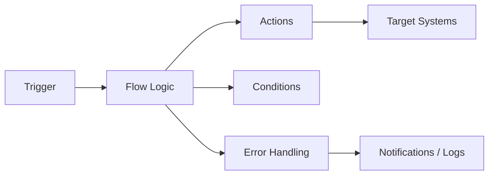
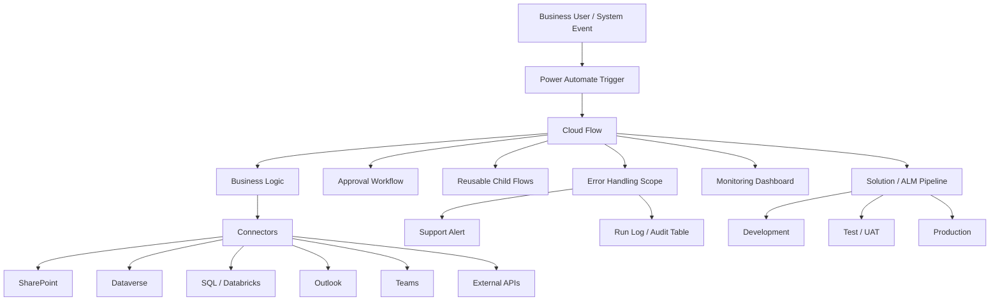
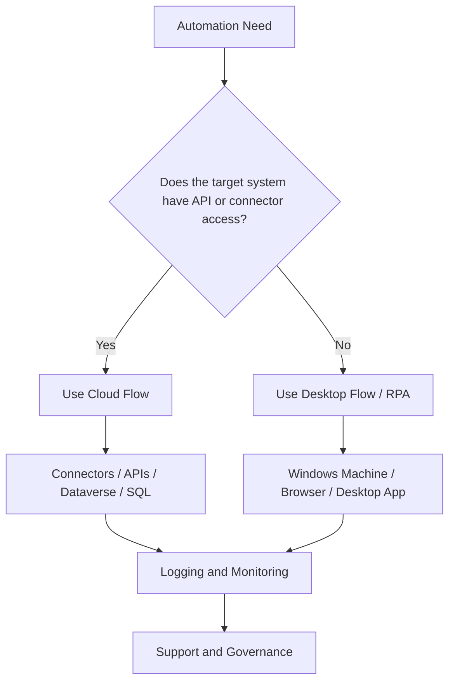
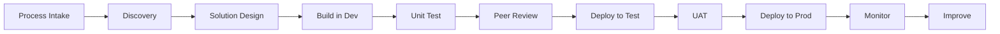
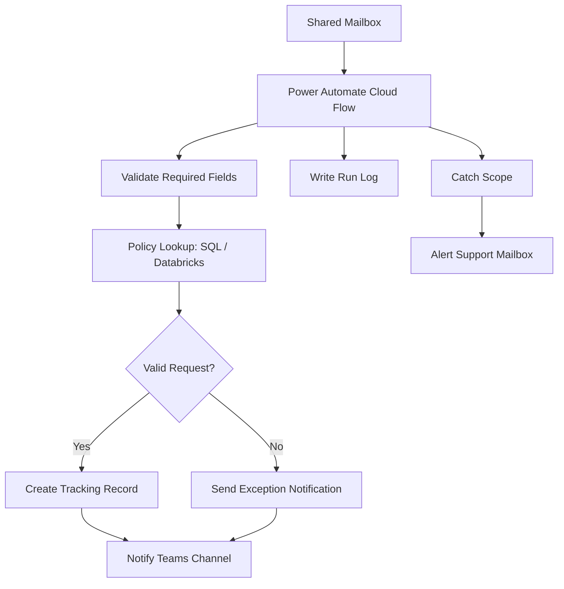

# Power Automate Reference Guide

## 1. Executive Summary

Microsoft Power Automate is a low-code automation platform within Microsoft Power Platform. It helps individuals and organizations automate repetitive tasks, connect systems, orchestrate business processes, trigger approvals, move data between applications, and support intelligent automation at scale.

In plain terms, Power Automate helps teams answer:

* What task is repetitive enough to automate?
* What event should trigger the automation?
* What systems need to exchange data?
* What approvals or decisions are required?
* What should happen if something fails?
* Who owns and supports the automation?
* How do we move the automation safely from development to production?

Power Automate supports several automation patterns, including cloud flows, desktop flows, business process flows, process mining, and AI-assisted automation. Microsoft’s 2026 Power Automate release wave describes the platform as spanning low-code cloud flows, RPA through desktop flows, process mining, and integration with Copilot and Copilot Studio.

For enterprise teams, Power Automate is not just a productivity tool. It is part of a broader automation operating model involving governance, security, ALM, monitoring, ownership, support, and business process improvement.

---

## 2. Plain-English Explanation

Power Automate lets you build “if this happens, then do that” workflows across business systems.

Simple example:

```text
When an email arrives with an attachment,
save the attachment to SharePoint,
send a Teams notification,
create a tracking record,
and notify the requester.
```

A Power Automate flow usually has:

```text
Trigger  ->  Conditions  ->  Actions  ->  Error Handling  ->  Logging / Notification
```

A simple mental model:

```text
Event happens
   ↓
Power Automate wakes up
   ↓
It checks rules and conditions
   ↓
It performs actions across systems
   ↓
It logs the result or alerts someone if it fails
```

Power Automate is useful when the business process is repeatable, rule-driven, and connected to systems that expose connectors, APIs, emails, files, databases, or user interfaces.

---

## 3. Business Context

Power Automate matters because organizations often have many manual, repetitive, and error-prone processes spread across email, Excel, SharePoint, Teams, Dataverse, SQL, APIs, legacy applications, and line-of-business systems.

Common business pain points include:

* Employees copying and pasting between systems
* Manual approvals through email
* Missed follow-ups
* Duplicate data entry
* No audit trail
* Delayed handoffs
* Inconsistent business rules
* Lack of process visibility
* High operational dependency on key individuals

Power Automate helps reduce these problems by creating structured, repeatable workflows.

### Business Value of Power Automate

| Business Need               | How Power Automate Helps                                                      |
| --------------------------- | ----------------------------------------------------------------------------- |
| Reduce manual work          | Automates repetitive tasks and handoffs                                       |
| Improve speed               | Triggers actions immediately or on schedule                                   |
| Improve consistency         | Applies the same business rules every time                                    |
| Improve visibility          | Provides run history, logs, and notifications                                 |
| Improve governance          | Uses environments, solutions, DLP, and ALM                                    |
| Connect systems             | Uses connectors, APIs, Dataverse, SharePoint, SQL, and more                   |
| Support citizen development | Enables business users and technical makers to build automations              |
| Scale automation            | Supports cloud flows, desktop flows, process mining, and managed environments |

### Enterprise View

In an enterprise environment, Power Automate is commonly connected to:

* SharePoint
* Outlook
* Teams
* Dataverse
* Excel
* SQL Server
* Azure SQL
* Databricks SQL endpoints
* Azure DevOps
* ServiceNow
* Salesforce
* UiPath
* APIs
* Power Apps
* Power BI
* Copilot Studio
* On-premises data gateway
* Legacy desktop or web applications through desktop flows

---

## 4. Core Concepts

---

### 4.1 Flow

A **flow** is an automation workflow created in Power Automate.

A flow usually contains:

* One trigger
* One or more actions
* Conditions
* Loops
* Variables
* Error handling
* Notifications
* Logging

Example:

```text
Trigger: When a file is created in SharePoint
Action: Read file metadata
Condition: Is the file type PDF?
Action: Send approval
Action: Update tracking list
```

---

### 4.2 Trigger

A **trigger** starts the flow.

Common trigger types:

| Trigger Type | Example                                   |
| ------------ | ----------------------------------------- |
| Automated    | When an email arrives                     |
| Instant      | Manually trigger a flow                   |
| Scheduled    | Run every day at 8 AM                     |
| HTTP/API     | When an external system sends a request   |
| Dataverse    | When a row is added, modified, or deleted |
| SharePoint   | When an item or file changes              |
| Power Apps   | When a user clicks a button in an app     |

Microsoft describes cloud flows as workflows that connect apps and services and can be triggered by events, such as an email arriving, or by a specific time of day.

---

### 4.3 Action

An **action** is a step that the flow performs after the trigger.

Examples:

* Send an email
* Create a SharePoint item
* Update a Dataverse row
* Call an API
* Start an approval
* Post a Teams message
* Run a child flow
* Execute a SQL query
* Start a desktop flow

---

### 4.4 Connector

A **connector** is a prebuilt integration between Power Automate and another service.

Examples:

* Outlook connector
* SharePoint connector
* Teams connector
* Dataverse connector
* SQL Server connector
* Azure DevOps connector
* HTTP connector
* OneDrive connector

Connectors are powerful, but they also create governance and security concerns because they control how data moves between systems.

---

### 4.5 Connection

A **connection** is the authenticated link between a connector and a user or service account.

Example:

```text
Connector: SharePoint
Connection: automation.service@company.com
```

The connector defines what system is being used.
The connection defines whose credentials are being used.

---

### 4.6 Connection Reference

A **connection reference** is a solution component that points to a connection. In solution-aware apps and flows, operations bind to a connection reference rather than directly to an individual connection, which helps when moving solutions between environments.

Plain-English explanation:

```text
Connection = actual login
Connection reference = reusable pointer to that login
```

Connection references are important for enterprise ALM because they help move flows from development to test to production without rebuilding every connection manually.

---

### 4.7 Environment Variable

An **environment variable** stores values that differ across environments.

Examples:

| Variable             | Dev Value   | Prod Value                 |
| -------------------- | ----------- | -------------------------- |
| SharePoint site URL  | Dev site    | Production site            |
| API base URL         | Test API    | Production API             |
| Notification email   | Dev mailbox | Production support mailbox |
| Dataverse table name | Test table  | Production table           |

Microsoft explains that environment variables support ALM scenarios where the application stays the same while external references differ between source and destination environments.

---

### 4.8 Solution

A **solution** is a package used to group and move Power Platform components.

A solution can include:

* Cloud flows
* Power Apps
* Dataverse tables
* Connection references
* Environment variables
* Security roles
* Custom connectors
* Business process flows

For enterprise work, flows should generally be solution-aware instead of being created as isolated personal flows.

---

### 4.9 Cloud Flow

A **cloud flow** runs in the Power Automate cloud service.

Cloud flows are usually used for:

* Email-based workflows
* SharePoint automation
* Dataverse automation
* Approvals
* Notifications
* API orchestration
* Scheduled jobs
* Data movement between cloud systems

Microsoft groups cloud flow creation around automations triggered automatically, instantly, or on a schedule.

---

### 4.10 Desktop Flow

A **desktop flow** is used for robotic process automation, or RPA.

Desktop flows automate actions on a computer, such as:

* Clicking buttons
* Opening applications
* Reading screens
* Entering data
* Downloading files
* Interacting with legacy systems
* Automating websites or desktop apps

Desktop flows are especially useful when the target application does not have a clean API or connector.

---

### 4.11 Business Process Flow

A **business process flow** guides users through a defined business process. Microsoft describes business process flows as providing a streamlined user experience that leads people through organization-defined processes.

Examples:

* Sales qualification process
* Claims review process
* Customer onboarding process
* Case escalation process
* Compliance review process

Business process flows are more about guiding people than silently automating tasks.

---

### 4.12 Process Mining

**Process mining** helps organizations understand how real processes actually operate and identify opportunities for improvement, automation, and digitalization.

It can help answer:

* Where are the bottlenecks?
* Which steps are repeated unnecessarily?
* Where do exceptions occur?
* Which process variations exist?
* Which tasks are good automation candidates?

---

### 4.13 Approval

An **approval** is a human decision step inside a flow.

Examples:

* Manager approval
* Legal approval
* Finance approval
* Compliance approval
* Exception approval

Approvals are useful when the process should not be fully automated without human judgment.

---

### 4.14 Child Flow

A **child flow** is a reusable flow called by another flow.

Use child flows for:

* Shared logging
* Shared error handling
* Reusable API calls
* Common notification logic
* Standard validation routines

Child flows help reduce duplication and improve maintainability.

---

## 5. Architecture View

### 5.1 Basic Power Automate Architecture



---

### 5.2 Enterprise Power Automate Architecture



---

### 5.3 Cloud Flow vs Desktop Flow Architecture



---

## 6. Data / Process Flow

A Power Automate flow usually follows this process:

```text
1. Trigger occurs
2. Flow starts
3. Input data is captured
4. Variables or configuration values are initialized
5. Data is retrieved from source systems
6. Business rules are applied
7. Actions are performed
8. Exceptions are handled
9. Results are logged
10. Notifications are sent
11. Flow run completes
```

### Example Data Flow

```text
SharePoint item created
   ↓
Power Automate trigger starts
   ↓
Get item details
   ↓
Validate required fields
   ↓
Look up related policy data in SQL
   ↓
If valid, create automation task
   ↓
If invalid, send exception notification
   ↓
Write result to monitoring table
```

---

## 7. Common Use Cases

---

### 7.1 Email Automation

Examples:

* Save attachments from emails
* Route requests from shared mailbox
* Send follow-up reminders
* Generate notification emails
* Parse structured email content

Good fit when:

* Email is a primary intake channel
* Rules are predictable
* Attachments or metadata need to be captured

Poor fit when:

* Email content is highly unstructured
* Decisions require deep judgment
* Attachments vary heavily without standards

---

### 7.2 SharePoint Automation

Examples:

* Trigger flow when item is created
* Update list records
* Route documents for approval
* Move files between libraries
* Track document status

Good fit when:

* SharePoint is used as a business intake or tracking tool
* Lists and libraries are structured
* Permissions are well-managed

---

### 7.3 Approval Workflows

Examples:

* Expense approval
* Contract approval
* Exception approval
* Document review
* Access request approval

Good fit when:

* Human decision-making is required
* Approval history matters
* Escalations are needed

---

### 7.4 Dataverse Automation

Examples:

* Trigger when row changes
* Update related records
* Start approval from model-driven app
* Sync data to another system
* Enforce process rules

Good fit when:

* The business process is built on Power Platform
* Data model and security roles are mature
* Records need auditability

---

### 7.5 Scheduled Jobs

Examples:

* Daily reconciliation
* Weekly report distribution
* Monthly data cleanup
* Hourly status check
* Periodic API pull

Good fit when:

* Timing is predictable
* Batch processing is acceptable
* Volumes are manageable

---

### 7.6 API Orchestration

Examples:

* Call internal APIs
* Submit data to external service
* Retrieve customer or policy information
* Trigger downstream automation
* Integrate with Azure Functions

Good fit when:

* APIs are available
* Authentication is well-defined
* Response handling is predictable

---

### 7.7 Desktop Automation / RPA

Examples:

* Legacy application automation
* Website automation without API
* File download/upload automation
* Repetitive data entry
* Report extraction

Good fit when:

* No API exists
* Manual UI work is stable and repetitive
* Business value justifies RPA fragility

Poor fit when:

* UI changes frequently
* Process volume is very high
* API access can be created instead

---

### 7.8 Intelligent Automation

Examples:

* AI-assisted email triage
* Document extraction
* Sentiment classification
* Summarization
* Human-in-the-loop exception handling
* Copilot-assisted flow creation

Good fit when:

* Rules alone are not enough
* Human review remains in the loop
* Accuracy can be validated
* Data sensitivity is governed

---

## 8. Best Practices

---

### 8.1 Start With the Process, Not the Tool

Before building a flow, document:

* Process name
* Business owner
* Trigger
* Inputs
* Outputs
* Decision rules
* Exceptions
* Systems involved
* Expected volume
* SLA
* Support owner

Do not automate a bad process without understanding it.

---

### 8.2 Use Solutions for Enterprise Flows

For production-grade flows, build inside a Power Platform solution.

Benefits:

* Better ALM
* Easier deployment
* Connection references
* Environment variables
* Component grouping
* Cleaner ownership
* Better governance

---

### 8.3 Use Service Accounts Carefully

Production flows should usually avoid being owned only by an individual employee account.

Consider using:

* Service accounts
* Application users where appropriate
* Shared ownership
* Dedicated automation accounts
* Proper licensing
* Clear access reviews

Risk of personal ownership:

* Flow breaks when user leaves
* Password or MFA changes impact flow
* Permissions are unclear
* Support team lacks visibility

---

### 8.4 Use Environment Variables

Avoid hardcoding:

* URLs
* email addresses
* API endpoints
* list names
* site paths
* thresholds
* environment-specific values

Better:

```text
Environment variable: SupportMailbox
Dev value: automation-dev@company.com
Prod value: automation-support@company.com
```

---

### 8.5 Use Connection References

Connection references make deployments cleaner and reduce manual rework between environments.

Use them for:

* SharePoint
* Dataverse
* Outlook
* SQL
* Teams
* Custom connectors
* HTTP connections when applicable

---

### 8.6 Design for Failure

Every important flow should include error handling.

Recommended structure:

```text
Initialize
   ↓
Try Scope
   ↓
Catch Scope
   ↓
Finally / Logging Scope
```

Microsoft guidance recommends robust error handling using strategies such as retry policies and configuring “Run after” settings.

---

### 8.7 Log Important Runs

Do not rely only on Power Automate run history for critical business processes.

Create an operational log when needed.

Example log fields:

| Field          | Description                            |
| -------------- | -------------------------------------- |
| Flow name      | Name of automation                     |
| Run ID         | Unique run identifier                  |
| Start time     | When run started                       |
| End time       | When run completed                     |
| Status         | Success, failed, skipped               |
| Business key   | Policy number, request ID, customer ID |
| Error message  | Failure details                        |
| Retry count    | Number of retries                      |
| Environment    | Dev, test, prod                        |
| Trigger source | Email, SharePoint, API, schedule       |

---

### 8.8 Keep Flows Small and Modular

Avoid giant flows with hundreds of actions.

Better:

* Parent flow for orchestration
* Child flow for reusable logic
* Separate flow for logging
* Separate flow for notifications
* Separate flow for exception handling

---

### 8.9 Use Trigger Conditions

Trigger conditions prevent unnecessary runs.

Example:

```text
Only run when Status = "Ready for Processing"
```

Benefits:

* Reduces wasted flow runs
* Lowers request consumption
* Improves performance
* Avoids accidental loops

Microsoft’s pipeline extensibility guidance also notes that trigger conditions can help flows run only when specific conditions are met and reduce request consumption.

---

### 8.10 Understand Platform Limits

Power Platform request limits exist to maintain service levels, availability, and platform quality. Power Automate also has specific limits for automated, scheduled, and instant flows depending on license type.

Design flows with limits in mind:

* Avoid unnecessary loops
* Avoid excessive polling
* Use trigger conditions
* Batch where possible
* Filter early
* Avoid repeatedly calling APIs inside loops
* Use child flows thoughtfully
* Monitor throttling

Microsoft guidance warns that flows violating limits can be throttled and, if continuously throttled, can be turned off.

---

## 9. Common Mistakes

---

### Mistake 1: Building Before Understanding the Process

Problem:

```text
The automation reproduces a broken manual process.
```

Better:

```text
Map the process first.
Remove unnecessary steps.
Then automate the improved process.
```

---

### Mistake 2: Creating Production Flows Outside Solutions

Risk:

* Harder deployments
* Poor ownership
* Manual connection fixes
* No clean ALM
* Difficult environment promotion

Better:

```text
Build production flows inside solutions.
Use connection references and environment variables.
```

---

### Mistake 3: Hardcoding Values

Bad:

```text
Send email to john.smith@company.com
Use SharePoint site URL directly in every action
Use production API endpoint inside dev flow
```

Better:

```text
Use environment variables.
Use security groups or shared mailboxes.
Use configurable settings.
```

---

### Mistake 4: No Error Handling

Problem:

```text
Flow fails silently or sends confusing failure emails.
```

Better:

```text
Use Try / Catch / Finally scopes.
Log errors.
Notify support with useful details.
```

---

### Mistake 5: Ignoring Licensing and Limits

Problem:

```text
The flow works in testing but fails or throttles in production volume.
```

Better:

```text
Estimate volume.
Check request limits.
Use the correct license.
Monitor usage.
```

---

### Mistake 6: Using Personal Accounts for Production Connections

Problem:

```text
The flow depends on one person’s mailbox, password, MFA, or permissions.
```

Better:

```text
Use approved service accounts or managed ownership patterns.
```

---

### Mistake 7: Creating Infinite Loops

Example:

```text
Flow triggers when SharePoint item is modified.
Flow updates the same item.
Update triggers the flow again.
```

Better:

```text
Use trigger conditions.
Use status fields.
Use change tracking.
Avoid unnecessary writes.
```

---

### Mistake 8: Not Documenting Business Rules

Problem:

```text
Nobody remembers why the flow excludes certain records.
```

Better:

```text
Document rules in the flow notes, README, and solution design document.
```

---

### Mistake 9: Making One Giant Flow

Problem:

```text
The flow is too large to understand, test, or troubleshoot.
```

Better:

```text
Break reusable logic into child flows.
Separate orchestration from validation and logging.
```

---

### Mistake 10: No Operational Monitoring

Problem:

```text
The business only discovers failures after customers or users complain.
```

Better:

```text
Create failure alerts, run logs, dashboards, and support procedures.
```

---

## 10. Troubleshooting Guide

---

### 10.1 First Question: Did the Flow Trigger?

Check:

* Was the trigger condition met?
* Is the flow turned on?
* Is the connection valid?
* Did the triggering event actually happen?
* Was the trigger filtered?
* Is the trigger polling interval delayed?
* Is the flow suspended?

---

### 10.2 Check Run History

Use run history to inspect:

* Start time
* Trigger payload
* Action inputs
* Action outputs
* Failed step
* Error message
* Retry attempts
* Duration

---

### 10.3 Common Failure: Invalid Connection

Symptoms:

```text
Unauthorized
Invalid connection
Connection not found
Sign in required
```

Possible causes:

* Password changed
* MFA issue
* Account disabled
* Permissions changed
* Connection reference not mapped correctly
* Service account lacks access

Fix:

```text
Reauthenticate connection.
Confirm account permissions.
Check connection reference mapping.
Use approved service account.
```

---

### 10.4 Common Failure: Missing Permissions

Symptoms:

```text
Access denied
Forbidden
User does not have permission
```

Possible causes:

* Flow owner lacks access
* Connection account lacks access
* SharePoint permissions changed
* Dataverse security role missing
* SQL permissions missing

Fix:

```text
Confirm which connection is used.
Check target system permissions.
Validate environment security role.
```

---

### 10.5 Common Failure: Bad Data

Symptoms:

```text
Null value error
Invalid format
Required field missing
Expression failed
```

Possible causes:

* Source data missing
* Field renamed
* Unexpected data type
* Empty array
* API response changed

Fix:

```text
Add validation.
Use null checks.
Use coalesce expressions.
Log bad records.
Send exception notification.
```

---

### 10.6 Common Failure: Loop or Recursion

Symptoms:

```text
Flow runs repeatedly
High request usage
Duplicate updates
Unexpected repeated notifications
```

Possible causes:

* Flow updates the same item that triggers it
* No trigger condition
* Status field not controlled
* Multiple flows listening to same event

Fix:

```text
Add trigger conditions.
Use status flags.
Only update when values actually changed.
Separate intake and processing steps.
```

---

### 10.7 Common Failure: Throttling

Symptoms:

```text
Too many requests
429 error
Flow delayed
Flow disabled after repeated throttling
```

Fix:

```text
Reduce unnecessary actions.
Avoid API calls inside large loops.
Use pagination carefully.
Use batching where available.
Filter data earlier.
Check license and request limits.
```

---

### 10.8 Common Failure: Approval Not Received

Check:

* Was the approval action reached?
* Was the recipient correct?
* Did the approval go to Teams or email?
* Is the user licensed?
* Was the approval reassigned?
* Did the flow time out?
* Was the approval environment correct?

---

### 10.9 Common Failure: Desktop Flow Fails

Check:

* Is the machine online?
* Is the machine registered?
* Is the user session available?
* Did the UI change?
* Did screen resolution change?
* Did credentials expire?
* Did an application pop-up interrupt execution?
* Is the gateway or machine runtime healthy?

---

### 10.10 Troubleshooting Checklist

```markdown
# Power Automate Troubleshooting Checklist

## Trigger

- [ ] Flow is turned on
- [ ] Trigger event occurred
- [ ] Trigger condition passed
- [ ] Trigger connection is valid

## Data

- [ ] Required fields are present
- [ ] Data types are correct
- [ ] Arrays are not empty
- [ ] API response shape is expected

## Permissions

- [ ] Connection account has access
- [ ] Environment role is correct
- [ ] Target system permissions are valid

## Logic

- [ ] Conditions are correct
- [ ] Loops are bounded
- [ ] Variables are initialized
- [ ] Expressions are valid

## Error Handling

- [ ] Failed action identified
- [ ] Retry behavior reviewed
- [ ] Error logged
- [ ] Support notified

## Platform

- [ ] No throttling
- [ ] License supports volume
- [ ] Connector is available
- [ ] DLP policy allows connector use
```

---

## 11. Governance

Power Automate governance is about ensuring automations are secure, supportable, compliant, and aligned with business value.

---

### 11.1 Environment Strategy

Common environment structure:

```text
Personal Productivity Environment
Development Environment
Test / UAT Environment
Production Environment
Sandbox Environment
```

Recommended approach:

| Environment        | Purpose                                |
| ------------------ | -------------------------------------- |
| Personal / Default | Lightweight personal productivity only |
| Development        | Build and unit test                    |
| Test / UAT         | Business validation                    |
| Production         | Stable production automations          |
| Sandbox            | Experimentation and proof of concept   |

Avoid building critical production flows in the default environment without governance.

---

### 11.2 DLP Policies

Data loss prevention policies control how connectors can be used together. Microsoft describes Power Platform data policies as guardrails that help reduce the risk of users unintentionally exposing organizational data, and admins can control connector access in various ways.

Example connector grouping:

| Group        | Examples                                                 |
| ------------ | -------------------------------------------------------- |
| Business     | SharePoint, Dataverse, SQL Server, Outlook               |
| Non-business | Twitter/X, Dropbox, Gmail                                |
| Blocked      | Unapproved custom connectors, risky third-party services |

DLP matters because a flow can accidentally move sensitive business data into an unmanaged location.

---

### 11.3 Managed Environments

Managed Environments provide additional governance and administrative controls for Power Platform environments.

Useful for:

* Production environments
* Citizen developer programs
* Enterprise adoption
* Visibility and control
* Data policy management
* Environment-level governance

---

### 11.4 Ownership Model

Every production flow should have:

* Business owner
* Technical owner
* Support owner
* Backup owner
* Approved service account or ownership pattern
* Documentation owner

Ownership questions:

```text
Who approves changes?
Who fixes failures?
Who receives alerts?
Who validates business rules?
Who owns the data?
Who pays for licensing?
```

---

### 11.5 Production Readiness

Before production deployment, confirm:

* Flow is in a solution
* Connection references are used
* Environment variables are configured
* Service account is approved
* DLP policy allows required connectors
* Error handling exists
* Logging exists
* Support alerting exists
* Runbook exists
* UAT is complete
* Rollback plan is defined

---

### 11.6 Security

Security considerations:

* Least privilege access
* Service account governance
* Connector restrictions
* Secret management
* Environment permissions
* Dataverse security roles
* Audit logging
* Sensitive data handling
* Data retention
* Guest user controls

Never store sensitive secrets directly in flow actions when a safer secret management pattern is available.

---

## 12. Continuous Improvement

Power Automate should not be treated as “build once and forget.”

Microsoft’s monitoring guidance states that flows are not “set it and forget it” solutions and should be monitored regularly for correctness, efficiency, and security.

---

### 12.1 Metrics to Track

| Metric               | Why It Matters              |
| -------------------- | --------------------------- |
| Run count            | Measures usage              |
| Success rate         | Measures reliability        |
| Failure rate         | Identifies instability      |
| Average duration     | Tracks performance          |
| Retry count          | Indicates dependency issues |
| Manual interventions | Shows remaining friction    |
| Exceptions by type   | Helps prioritize fixes      |
| Business hours saved | Shows value                 |
| Volume processed     | Shows scale                 |
| SLA compliance       | Shows business reliability  |

---

### 12.2 Improvement Questions

Ask monthly:

* Which flows fail most often?
* Which flows are slowest?
* Which flows have unclear ownership?
* Which flows have repeated manual exceptions?
* Which flows need better logging?
* Which flows should be retired?
* Which flows should be rebuilt as APIs or data pipelines?
* Which flows should be promoted to enterprise automation ownership?

---

### 12.3 Automation Maturity

Power Automate maturity grows through stages:

```text
Ad hoc personal flow
   ↓
Team-owned flow
   ↓
Solution-aware flow
   ↓
Governed production flow
   ↓
Monitored enterprise automation
   ↓
Continuously improved automation product
```

---

## 13. Development Lifecycle

A mature Power Automate lifecycle follows this flow:



---

### 13.1 Lifecycle Stages

| Stage     | Activity                                              |
| --------- | ----------------------------------------------------- |
| Intake    | Capture automation idea and business problem          |
| Discovery | Map process, systems, rules, exceptions               |
| Design    | Define architecture, ownership, security, data flow   |
| Build     | Create solution-aware flow in dev                     |
| Test      | Validate happy path, exceptions, permissions, volume  |
| Review    | Peer review logic, naming, governance, error handling |
| Deploy    | Move through solution pipeline                        |
| Monitor   | Track run history, failures, alerts, volume           |
| Improve   | Tune, refactor, retire, or scale                      |

---

### 13.2 ALM and Pipelines

Power Platform ALM covers governance, development, and maintenance. Microsoft defines ALM as including disciplines such as requirements management, software architecture, development, testing, maintenance, change management, deployment, release management, and governance.

Power Platform pipelines bring ALM automation and CI/CD capabilities into the service in a way intended to be approachable for makers, admins, and developers.

Recommended enterprise flow:

```text
Development Solution
   ↓
Export / Pipeline
   ↓
Test Environment
   ↓
UAT Approval
   ↓
Managed Solution Import
   ↓
Production Environment
```

---

## 14. Frameworks

---

### 14.1 Automation Suitability Framework

Use this to decide whether Power Automate is a good fit.

| Question                        | Good Candidate | Poor Candidate    |
| ------------------------------- | -------------- | ----------------- |
| Is the process repeatable?      | Yes            | No                |
| Are rules clear?                | Yes            | No                |
| Are systems accessible?         | Yes            | No                |
| Is volume manageable?           | Yes            | Unknown / extreme |
| Are exceptions understood?      | Yes            | No                |
| Is ownership clear?             | Yes            | No                |
| Is data sensitivity manageable? | Yes            | No                |
| Is business value measurable?   | Yes            | No                |

---

### 14.2 Cloud Flow vs Desktop Flow Decision Framework

| Question                        | Prefer Cloud Flow | Prefer Desktop Flow          |
| ------------------------------- | ----------------- | ---------------------------- |
| Is there an API or connector?   | Yes               | No                           |
| Is the system web/desktop only? | No                | Yes                          |
| Does UI change often?           | Cloud preferred   | Desktop risky                |
| Is high volume required?        | Cloud preferred   | Desktop may struggle         |
| Is the process screen-based?    | Not ideal         | Better fit                   |
| Is unattended execution needed? | Possible          | Requires RPA setup/licensing |

---

### 14.3 Human-in-the-Loop Framework

Use human approval when:

* Decision has financial risk
* Legal/compliance judgment is needed
* AI output needs validation
* Exception is ambiguous
* Data quality is poor
* Customer impact is high

Automation should assist judgment, not blindly replace it where risk is high.

---

### 14.4 Error Handling Framework

Recommended pattern:

```text
Scope: Initialize
Scope: Try
Scope: Catch
Scope: Finally
```

Catch scope should:

* Capture error
* Log run details
* Notify support
* Mark business record as failed
* Provide enough context to retry safely

---

### 14.5 Monitoring Framework

Monitor at four levels:

| Level               | What to Monitor                           |
| ------------------- | ----------------------------------------- |
| Flow health         | Success, failure, duration                |
| Business outcome    | Records processed, approvals completed    |
| Dependency health   | API failures, SharePoint/Dataverse issues |
| Operational support | Alerts, retries, unresolved exceptions    |

---

## 15. Tools

### 15.1 Core Power Automate Tools

| Tool                        | Purpose                                  |
| --------------------------- | ---------------------------------------- |
| Power Automate portal       | Create and manage flows                  |
| Power Platform Admin Center | Manage environments, policies, analytics |
| Power Automate Desktop      | Build desktop/RPA flows                  |
| Solutions                   | Package and deploy components            |
| Environment variables       | Manage environment-specific values       |
| Connection references       | Manage connections across environments   |
| Approvals                   | Human approval workflows                 |
| Process mining              | Discover and analyze business processes  |

---

### 15.2 Supporting Microsoft Tools

| Tool                   | Purpose                                    |
| ---------------------- | ------------------------------------------ |
| Power Apps             | Build user interfaces for workflows        |
| Dataverse              | Secure structured data platform            |
| SharePoint             | Lists, files, intake, lightweight tracking |
| Teams                  | Notifications and collaboration            |
| Outlook                | Email-based automation                     |
| Power BI               | Monitoring and reporting                   |
| Azure DevOps           | Work tracking and CI/CD                    |
| Azure Functions        | Custom code extensions                     |
| Azure Key Vault        | Secret management                          |
| SQL Server / Azure SQL | Structured data source                     |
| Databricks             | Enterprise data platform                   |
| Copilot Studio         | Conversational and agent experiences       |

---

## 16. Quick Reference

---

### 16.1 Flow Types

| Flow Type             | Use When                                       |
| --------------------- | ---------------------------------------------- |
| Automated cloud flow  | Something should happen after an event         |
| Instant cloud flow    | A user manually starts the flow                |
| Scheduled cloud flow  | The flow runs at a specific time or frequency  |
| Desktop flow          | UI automation is needed                        |
| Business process flow | Users need guided process stages               |
| Child flow            | Reusable logic should be called by other flows |

---

### 16.2 Common Building Blocks

| Component            | Purpose                        |
| -------------------- | ------------------------------ |
| Trigger              | Starts the flow                |
| Action               | Performs work                  |
| Condition            | Branches logic                 |
| Switch               | Handles multiple cases         |
| Apply to each        | Loops through records          |
| Scope                | Groups actions                 |
| Variable             | Stores temporary value         |
| Compose              | Stores expression output       |
| Parse JSON           | Structures API response        |
| Delay                | Waits before continuing        |
| Approval             | Gets human decision            |
| Connection reference | Points to connector connection |
| Environment variable | Stores configurable value      |

---

### 16.3 Common Expressions

| Need               | Expression Pattern                       |
| ------------------ | ---------------------------------------- |
| Current time       | `utcNow()`                               |
| Empty check        | `empty(value)`                           |
| Null fallback      | `coalesce(value, 'fallback')`            |
| Convert to string  | `string(value)`                          |
| Convert to integer | `int(value)`                             |
| Get first item     | `first(array)`                           |
| Get length         | `length(array)`                          |
| Format date        | `formatDateTime(utcNow(), 'yyyy-MM-dd')` |
| Check contains     | `contains(text, 'value')`                |

---

### 16.4 Common Design Rules

```text
Use solutions for production.
Use connection references.
Use environment variables.
Use service accounts carefully.
Use trigger conditions.
Use error handling scopes.
Log important runs.
Avoid giant flows.
Avoid hardcoded values.
Avoid personal ownership.
Monitor after deployment.
```

---

## 17. Meeting Talking Points

Use these when discussing Power Automate with stakeholders, engineers, managers, governance teams, or business owners.

---

### 17.1 Process Discovery Questions

* What business problem are we solving?
* What triggers the process today?
* What are the inputs and outputs?
* What systems are involved?
* What decisions are rule-based?
* What decisions require human judgment?
* What exceptions happen most often?
* What is the expected volume?
* What is the SLA?
* Who owns the process?

---

### 17.2 Architecture Questions

* Should this be a cloud flow, desktop flow, or API-based solution?
* Are connectors available for all systems?
* Do we need an on-premises data gateway?
* Should we use Dataverse, SharePoint, SQL, or another data store?
* Do we need child flows?
* How will errors be logged?
* How will retries be handled?
* What happens if a downstream system is unavailable?

---

### 17.3 Governance Questions

* Which environment should this live in?
* Is the flow solution-aware?
* Are connection references used?
* Are environment variables used?
* Does a DLP policy allow these connectors together?
* Who owns the flow?
* Who supports it after hours?
* What is the rollback plan?
* What licensing is required?
* Is production monitoring in place?

---

### 17.4 Data and AI Questions

* What data does the flow read?
* What data does the flow write?
* Is any sensitive data involved?
* Is AI being used for classification, extraction, or generation?
* Does AI output require human review?
* Is there a validation layer?
* Are decisions auditable?
* Are prompts or AI outputs logged safely?

---

## 18. Example Scenario

### Scenario: Automating Policy Renewal Exception Intake

A business team receives renewal exception requests through a shared mailbox. Each request includes a policy number, broker information, requested action, and sometimes attachments.

The goal is to automate intake, validation, routing, and tracking.

---

### 18.1 Process Flow

```text
Email arrives in shared mailbox
   ↓
Power Automate cloud flow triggers
   ↓
Extract email metadata and attachments
   ↓
Validate required fields
   ↓
Look up policy data in SQL / Databricks
   ↓
If valid, create tracking record
   ↓
If missing data, send exception notice
   ↓
Notify automation support channel
   ↓
Log run result
```

---

### 18.2 Architecture



---

### 18.3 Good Design Choices

* Use shared mailbox, not personal mailbox
* Use solution-aware cloud flow
* Use connection references
* Use environment variables for mailbox, SQL endpoint, and support channel
* Use service account connection
* Add validation before creating records
* Log every run
* Add support notification on failure
* Create a runbook
* Track business outcome metrics

---

## 19. Beginner-to-Pro Learning Path

---

### Level 1: Beginner — Basic Flow Builder

Goal: Understand simple triggers and actions.

Learn:

* What Power Automate is
* Flow types
* Triggers
* Actions
* Conditions
* Dynamic content
* Run history
* Basic expressions

Practice:

```text
Create a flow that sends a Teams message when a SharePoint item is created.
```

You should be able to:

* Create a simple flow
* Test a flow
* View run history
* Fix basic errors
* Use dynamic content

---

### Level 2: Advanced Beginner — Practical Automation Maker

Goal: Build useful team automations.

Learn:

* Conditions
* Switch statements
* Apply to each
* Variables
* Compose
* Approvals
* SharePoint and Outlook connectors
* Basic error handling

Practice:

```text
Create an approval flow for a SharePoint request list.
```

You should be able to:

* Build multi-step flows
* Add approval logic
* Handle common errors
* Notify users
* Update records

---

### Level 3: Intermediate — Enterprise-Ready Builder

Goal: Build supportable production flows.

Learn:

* Solutions
* Connection references
* Environment variables
* Service accounts
* Child flows
* Try/Catch scopes
* Logging
* Trigger conditions
* DLP basics

Practice:

```text
Create a solution-aware flow that logs success and failure to a tracking table.
```

You should be able to:

* Build flows inside solutions
* Move flows between environments
* Design error handling
* Create reusable child flows
* Avoid hardcoded values

---

### Level 4: Advanced — Automation Engineer

Goal: Design scalable and governed automation solutions.

Learn:

* ALM
* Pipelines
* Custom connectors
* HTTP/API actions
* Power Platform CLI
* Dataverse integration
* On-premises data gateway
* Licensing and request limits
* Monitoring dashboards
* Desktop flows and RPA patterns

Practice:

```text
Design a production automation with dev/test/prod environments, logging, exception handling, and deployment controls.
```

You should be able to:

* Choose the right automation pattern
* Design for scale
* Integrate APIs
* Build support dashboards
* Lead technical reviews
* Advise on governance

---

### Level 5: Pro — Enterprise Automation Architect

Goal: Lead automation strategy and operating model.

Learn:

* Center of Excellence practices
* Environment strategy
* Automation intake models
* Governance frameworks
* Process mining
* AI and Copilot integration
* Risk management
* Automation portfolio management
* Enterprise monitoring
* Cost and value tracking

You should be able to:

* Define Power Automate standards
* Build enterprise automation frameworks
* Mentor makers and engineers
* Govern citizen development
* Design automation lifecycle controls
* Align automation with business strategy

---

## 20. Repository Placement

For a personal or team knowledge repository, place this guide here:

```text
knowledge-repository/
└── power-platform/
    └── power-automate/
        ├── README.md
        ├── power-automate-reference-guide.md
        ├── quick-reference.md
        ├── troubleshooting.md
        ├── governance.md
        ├── alm-and-solutions.md
        ├── error-handling-patterns.md
        ├── flow-design-standards.md
        ├── templates/
        │   ├── flow-design-document.md
        │   ├── production-readiness-checklist.md
        │   ├── troubleshooting-runbook.md
        │   ├── support-handoff-template.md
        │   └── automation-intake-template.md
        └── examples/
            ├── approval-flow-example.md
            ├── sharepoint-intake-flow.md
            ├── dataverse-trigger-flow.md
            ├── desktop-flow-pattern.md
            └── child-flow-logging-pattern.md
```

Recommended `README.md`:

```markdown
# Power Automate

This folder contains practical Power Automate guidance for technical professionals, automation engineers, and enterprise makers.

## Start Here

1. Read `power-automate-reference-guide.md`
2. Use `quick-reference.md` for daily building
3. Use `troubleshooting.md` when flows fail
4. Use `governance.md` before production deployment
5. Use templates before submitting flows for review

## Key Topics

- Cloud flows
- Desktop flows
- Connectors
- Solutions
- Connection references
- Environment variables
- Error handling
- ALM
- Monitoring
- Governance
```

---

## 21. Reusable Templates

---

### 21.1 Automation Intake Template

```markdown
# Automation Intake

## Process Name

`<process-name>`

## Requester

`<name / team>`

## Business Problem

Describe the problem being solved.

## Current Manual Process

Describe how the process works today.

## Desired Future State

Describe what should happen after automation.

## Trigger

What starts the process?

## Inputs

- Input 1
- Input 2
- Input 3

## Outputs

- Output 1
- Output 2
- Output 3

## Systems Involved

- System 1
- System 2
- System 3

## Business Rules

- Rule 1
- Rule 2
- Rule 3

## Exceptions

- Exception 1
- Exception 2
- Exception 3

## Volume

Expected daily / weekly / monthly volume.

## SLA

Expected completion time.

## Risk Level

- [ ] Low
- [ ] Medium
- [ ] High

## Data Sensitivity

- [ ] Public
- [ ] Internal
- [ ] Confidential
- [ ] Regulated / sensitive

## Business Owner

`<name>`

## Technical Owner

`<name>`

## Support Owner

`<name>`
```

---

### 21.2 Flow Design Document Template

```markdown
# Flow Design Document

## Flow Name

`<flow-name>`

## Purpose

Explain what this flow does.

## Business Context

Explain why the flow exists.

## Flow Type

- [ ] Automated cloud flow
- [ ] Instant cloud flow
- [ ] Scheduled cloud flow
- [ ] Desktop flow
- [ ] Business process flow
- [ ] Child flow

## Trigger

Describe the trigger.

## Trigger Conditions

List any trigger conditions.

## Systems and Connectors

| System | Connector | Connection Reference |
|---|---|---|
| SharePoint | SharePoint | `<connection-reference>` |
| Dataverse | Dataverse | `<connection-reference>` |

## Environment Variables

| Variable | Purpose |
|---|---|
| `<variable-name>` | `<purpose>` |

## Process Logic

Describe the major steps.

## Error Handling

Describe Try / Catch / Finally structure.

## Logging

Describe what is logged and where.

## Notifications

Describe success and failure notifications.

## Security

Describe account, permission, and data sensitivity considerations.

## Testing

Describe test scenarios.

## Deployment

Describe movement from dev to test to prod.

## Support Notes

Describe how to troubleshoot and support this flow.
```

---

### 21.3 Production Readiness Checklist

```markdown
# Power Automate Production Readiness Checklist

## Design

- [ ] Business owner identified
- [ ] Technical owner identified
- [ ] Support owner identified
- [ ] Process documented
- [ ] Business rules documented
- [ ] Exceptions documented

## Build

- [ ] Flow is inside a solution
- [ ] Connection references are used
- [ ] Environment variables are used
- [ ] No hardcoded production values
- [ ] Flow actions are clearly named
- [ ] Flow is modular where appropriate

## Security

- [ ] Approved connections used
- [ ] Service account or ownership model approved
- [ ] Permissions validated
- [ ] Sensitive data reviewed
- [ ] DLP policy reviewed

## Testing

- [ ] Happy path tested
- [ ] Exception path tested
- [ ] Permission failure tested
- [ ] Missing data tested
- [ ] Volume tested
- [ ] Retry behavior tested

## Monitoring

- [ ] Run logging configured
- [ ] Failure alerts configured
- [ ] Support mailbox or channel configured
- [ ] Dashboard created if needed

## Deployment

- [ ] Deployed through approved process
- [ ] Environment variables set
- [ ] Connection references mapped
- [ ] Flow turned on in production
- [ ] Smoke test completed

## Support

- [ ] Runbook created
- [ ] Support team briefed
- [ ] Rollback plan documented
- [ ] Known issues documented
```

---

### 21.4 Troubleshooting Runbook Template

```markdown
# Troubleshooting Runbook

## Flow Name

`<flow-name>`

## Business Purpose

Explain what the flow supports.

## Common Failure Scenarios

| Failure | Likely Cause | Resolution |
|---|---|---|
| Flow did not trigger | Trigger condition not met | Check trigger payload and conditions |
| Access denied | Connection lacks permission | Validate service account access |
| Null value error | Missing source data | Add validation or correct source record |
| Approval not sent | Recipient invalid | Check approval action inputs |
| Throttling | Too many requests | Reduce calls or review license limits |

## First Checks

- [ ] Is the flow turned on?
- [ ] Did the trigger event occur?
- [ ] Is the connection valid?
- [ ] Did a DLP policy block the connector?
- [ ] Did the failed action return a clear error?

## Escalation Path

| Issue Type | Escalate To |
|---|---|
| Business rule issue | Business owner |
| Permission issue | Platform admin |
| Connector issue | Power Platform admin |
| Data issue | Data owner |
| Production outage | Support lead |

## Recovery Steps

1. Identify failed run.
2. Capture error message.
3. Validate source data.
4. Correct issue.
5. Retry or resubmit if safe.
6. Log support note.
7. Notify business owner.
```

---

### 21.5 Error Handling Pattern Template

```markdown
# Error Handling Pattern

## Recommended Flow Structure

1. Initialize variables
2. Try scope
3. Catch scope
4. Finally scope

## Try Scope

Contains the main business logic.

## Catch Scope

Runs when Try fails, times out, or is skipped.

Actions:

- Capture error details
- Log failed run
- Notify support
- Update business record status
- Include run URL if available

## Finally Scope

Runs after success or failure.

Actions:

- Write completion status
- Release locks if used
- Send final notification if required

## Error Log Fields

| Field | Description |
|---|---|
| FlowName | Name of flow |
| RunId | Run identifier |
| Status | Failed / Succeeded |
| ErrorMessage | Error detail |
| BusinessKey | Related record ID |
| Timestamp | Failure time |
| Environment | Dev/Test/Prod |
```

---

### 21.6 Naming Standards Template

```markdown
# Power Automate Naming Standards

## Flow Names

Format:

`<Area> - <Process> - <Action>`

Examples:

- `IA - Renewal Notices - Intake Request`
- `Claims - FNOL - Send Approval`
- `Finance - Invoice - Validate Vendor`

## Child Flow Names

Format:

`Child - <Reusable Function>`

Examples:

- `Child - Write Run Log`
- `Child - Send Failure Alert`
- `Child - Validate Required Fields`

## Environment Variables

Format:

`<SolutionPrefix>_<Purpose>`

Examples:

- `IA_SupportMailbox`
- `IA_SharePointSiteUrl`
- `IA_ApiBaseUrl`

## Connection References

Format:

`cr_<connector>_<purpose>`

Examples:

- `cr_sharepoint_automation`
- `cr_dataverse_core`
- `cr_sql_policylookup`
```

---

## 22. Recommended Personal Practice Routine

### Daily

* Check failed runs for flows you own.
* Review new errors or retries.
* Validate that production flows are healthy.
* Document any changes made.

### Weekly

* Review flow success rates.
* Clean up unused test flows.
* Review stale approvals.
* Check high-volume flows for throttling risk.
* Update documentation when logic changes.

### Monthly

* Review ownership and service account access.
* Review DLP and connector usage.
* Review environment variable values.
* Review flow inventory.
* Identify flows that should be retired, refactored, or promoted.
* Report business value and hours saved.

---

## 23. Final Mental Model

Power Automate is not just a low-code workflow builder.

It is an automation platform that can support personal productivity, team workflows, enterprise integration, robotic process automation, and intelligent automation.

At the beginner level, Power Automate helps you automate simple tasks.

At the intermediate level, it helps you build reliable business workflows.

At the advanced level, it helps you integrate systems and manage exceptions.

At the enterprise level, it becomes part of an automation operating model involving governance, ALM, security, monitoring, support, and continuous improvement.

The core flow is:

```text
Process Need
   ↓
Automation Design
   ↓
Build Flow
   ↓
Test
   ↓
Deploy
   ↓
Monitor
   ↓
Improve
```

The goal is not just to make flows work.

The goal is to make automations that are useful, safe, supportable, scalable, and trusted.
