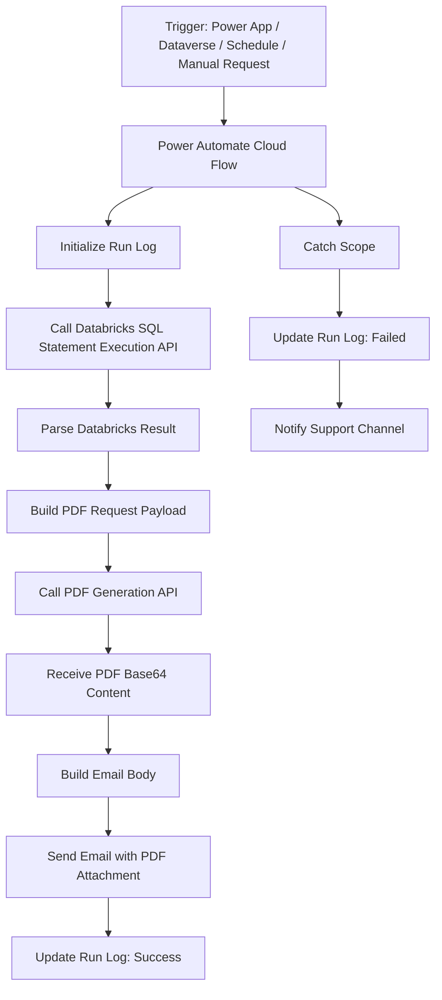

# Power Platform Solution Mockup

## Databricks Data Fetch → API PDF Generation → Email with Custom PDF Attachment

---

# 1. Solution Summary

## Solution Name

```text
IA - Databricks PDF Email Automation
```

## Business Purpose

This solution generates custom business PDFs using curated data from Databricks and emails those PDFs to brokers, customers, internal teams, or process owners.

Example use cases:

* Renewal notice generation
* Policy summary packets
* Broker notification letters
* Exception letters
* Claims status summaries
* Compliance notices
* Invoice or billing summaries
* Automated reporting packets

## Preferred Pattern

```text
Power Automate Cloud Flow
   ↓
Databricks SQL Statement Execution API
   ↓
PDF Generation API
   ↓
Office 365 Outlook Email with PDF Attachment
   ↓
Dataverse / SharePoint Logging
```

This design uses API-based PDF generation instead of trying to build PDFs directly inside Power Automate. That is the better enterprise pattern because Power Automate is good at orchestration, but not ideal for complex document rendering.

---

# 2. High-Level Architecture



---

# 3. Recommended Architecture Decision

## Recommended Design

Use **Power Automate as the orchestrator**, not as the document-rendering engine.

Power Automate should:

* Receive or schedule the request
* Call Databricks
* Call the PDF API
* Send the email
* Log the outcome
* Notify support if something fails

The PDF API should:

* Accept structured JSON
* Apply the correct PDF template
* Render the PDF
* Return the file name, MIME type, and Base64 file content

Databricks should:

* Serve curated, automation-ready data
* Enforce permissions through service principal or controlled token access
* Return only the fields required for the PDF/email process

---

# 4. Platform Components

## 4.1 Power Platform Solution Components

```text
Solution: IA - Databricks PDF Email Automation
```

| Component                                     | Purpose                                                    |
| --------------------------------------------- | ---------------------------------------------------------- |
| Cloud Flow                                    | Main orchestration flow                                    |
| Child Flow: Write Run Log                     | Standardized success/failure logging                       |
| Child Flow: Send Support Alert                | Standardized failure notification                          |
| Connection Reference: Office 365 Outlook      | Sends email                                                |
| Connection Reference: HTTP / Custom Connector | Calls Databricks and PDF API                               |
| Environment Variables                         | Stores URLs, warehouse IDs, catalog names, email addresses |
| Dataverse Table: IA Automation Run Log        | Tracks flow execution                                      |
| Dataverse Table: IA PDF Request               | Optional request queue                                     |
| Dataverse Table: IA PDF Template Config       | Optional template routing                                  |
| Security Role                                 | Grants automation account only required permissions        |

Microsoft recommends connection references for solution-aware flows because flows in solutions bind to connection references rather than directly to individual connections, which helps when importing solutions into target environments.

Environment variables should be used for values that change between environments, such as URLs, keys, tables, and connections, instead of hardcoding those values inside flows.

---

# 5. Example Business Scenario

## Scenario: Renewal Notice PDF

The business wants to generate a renewal notice PDF for each policy that is ready for notification.

The flow should:

1. Receive a policy number or request ID.
2. Query Databricks for policy, insured, broker, coverage, and renewal data.
3. Send that data to a PDF API.
4. Receive a finished PDF.
5. Email the PDF to the broker.
6. Log the run result.
7. Notify support if the run fails.

---

# 6. Data Flow

```text
Request ID / Policy Number
   ↓
Power Automate
   ↓
Databricks SQL Statement Execution API
   ↓
Curated automation-ready data
   ↓
PDF request payload
   ↓
PDF Generation API
   ↓
Base64 PDF content
   ↓
Office 365 Outlook connector
   ↓
Email with PDF attachment
   ↓
Run log / audit record
```

---

# 7. Trigger Options

## Option A: Manual Button Trigger

Good for testing and controlled execution.

```text
Trigger: Manually trigger a flow
Input: PolicyNumber
Input: RecipientEmail
Input: TemplateCode
```

## Option B: Power Apps Trigger

Good when users initiate document generation from a custom app.

```text
Power App button:
"Generate and Email Renewal Notice"
```

## Option C: Dataverse Row Trigger

Good for queue-based processing.

```text
When a row is added to IA PDF Request table
Status = Ready
```

## Option D: Scheduled Trigger

Good for batch generation.

```text
Every weekday at 7:00 AM
Find all renewal notices ready to send
Generate PDFs
Send emails
Log results
```

For enterprise use, I would prefer **Dataverse queue-based processing** or **scheduled batch processing**, because it gives better tracking, retry, and support visibility.

---

# 8. Recommended Solution Design

## 8.1 Main Flow Name

```text
IA - Renewal Notice - Generate PDF and Email
```

## 8.2 Flow Type

```text
Automated Cloud Flow
```

## 8.3 Trigger

Recommended production trigger:

```text
When a row is added, modified, or selected in Dataverse table: IA PDF Request
```

Alternative testing trigger:

```text
Manually trigger a flow
```

---

# 9. Environment Variables

Use environment variables so the same solution can move from Dev to Test to Prod without editing the flow manually.

| Environment Variable       | Example Value                               | Purpose                           |
| -------------------------- | ------------------------------------------- | --------------------------------- |
| `IA_DatabricksHost`        | `https://adb-xxxx.azuredatabricks.net`      | Databricks workspace host         |
| `IA_DatabricksWarehouseId` | `<warehouse-id>`                            | SQL warehouse ID                  |
| `IA_DatabricksCatalog`     | `<approved_ia_catalog>`                     | Unity Catalog catalog             |
| `IA_DatabricksSchema`      | `curated_intelligent_automation_operations` | Curated automation schema         |
| `IA_PdfApiBaseUrl`         | `https://api.company.com/pdf`               | PDF service base URL              |
| `IA_PdfTemplateCode`       | `RENEWAL_NOTICE_V1`                         | Default PDF template              |
| `IA_SupportMailbox`        | `automation-support@company.com`            | Failure notifications             |
| `IA_FromMailbox`           | `renewals@company.com`                      | Sending mailbox                   |
| `IA_RunLogTable`           | `ia_automation_run_log`                     | Logging table                     |
| `IA_MaxDatabricksRows`     | `1`                                         | Prevents accidental large queries |

---

# 10. Connection References

| Connection Reference              | Connector                | Purpose                            |
| --------------------------------- | ------------------------ | ---------------------------------- |
| `cr_office365_outlook_automation` | Office 365 Outlook       | Send email                         |
| `cr_dataverse_automation`         | Dataverse                | Read/write request and log records |
| `cr_http_databricks`              | HTTP or Custom Connector | Call Databricks API                |
| `cr_http_pdf_api`                 | HTTP or Custom Connector | Call PDF generation API            |
| `cr_teams_support_alerts`         | Microsoft Teams          | Optional support notification      |

A custom connector is a wrapper around a REST API that lets Power Automate, Power Apps, Logic Apps, or Copilot Studio communicate with that API. Microsoft supports defining a connector through OpenAPI, Postman collections, or from scratch in the connector portal.

For a production solution, I would prefer **custom connectors** over raw HTTP actions for Databricks and the PDF API because custom connectors are easier to reuse, document, secure, and govern.

---

# 11. Dataverse Tables

## 11.1 Table: `IA PDF Request`

This table acts as the request queue.

| Column           | Type           | Example                         |
| ---------------- | -------------- | ------------------------------- |
| `RequestId`      | Text / GUID    | `REQ-000123`                    |
| `PolicyNumber`   | Text           | `POL123456`                     |
| `TemplateCode`   | Choice/Text    | `RENEWAL_NOTICE_V1`             |
| `RecipientEmail` | Email          | `broker@company.com`            |
| `CcEmail`        | Text           | `team@company.com`              |
| `Status`         | Choice         | Ready, Processing, Sent, Failed |
| `RequestedBy`    | User           | User who submitted request      |
| `RequestedAt`    | DateTime       | Request timestamp               |
| `LastError`      | Multiline Text | Error message                   |
| `PdfFileName`    | Text           | `RenewalNotice_POL123456.pdf`   |
| `EmailSentAt`    | DateTime       | Timestamp                       |

---

## 11.2 Table: `IA Automation Run Log`

| Column             | Type           | Purpose                  |
| ------------------ | -------------- | ------------------------ |
| `RunId`            | Text           | Flow run ID              |
| `RequestId`        | Text           | Business request ID      |
| `FlowName`         | Text           | Name of flow             |
| `PolicyNumber`     | Text           | Business key             |
| `Status`           | Choice         | Success, Failed, Skipped |
| `StartedAt`        | DateTime       | Run start                |
| `CompletedAt`      | DateTime       | Run end                  |
| `DatabricksStatus` | Text           | SQL API result           |
| `PdfApiStatus`     | Text           | PDF API result           |
| `EmailStatus`      | Text           | Email action result      |
| `ErrorMessage`     | Multiline Text | Failure detail           |
| `Environment`      | Text           | Dev/Test/Prod            |

---

## 11.3 Optional Table: `IA PDF Template Config`

| Column                     | Type           | Example                                    |
| -------------------------- | -------------- | ------------------------------------------ |
| `TemplateCode`             | Text           | `RENEWAL_NOTICE_V1`                        |
| `TemplateName`             | Text           | Renewal Notice                             |
| `PdfApiTemplateId`         | Text           | `renewal-notice-v1`                        |
| `DefaultSubject`           | Text           | `Renewal Notice for Policy {PolicyNumber}` |
| `DefaultEmailBodyTemplate` | Multiline Text | HTML email body                            |
| `Active`                   | Yes/No         | Yes                                        |

---

# 12. Databricks API Pattern

## 12.1 Recommended Databricks API

Use the **Databricks SQL Statement Execution API** to run parameterized SQL against a Databricks SQL warehouse.

Databricks documents that the Statement Execution API can run SQL statements on Databricks SQL warehouses and fetch results.

Databricks also recommends parameterized SQL statements because dynamically generated SQL can create SQL injection risk.

---

## 12.2 Databricks HTTP Action

### Action Name

```text
HTTP - Execute Databricks SQL Statement
```

### Method

```text
POST
```

### URI

```text
@{variables('DatabricksHost')}/api/2.0/sql/statements/
```

### Headers

```json
{
  "Authorization": "Bearer @{variables('DatabricksToken')}",
  "Content-Type": "application/json"
}
```

For production, do **not** hardcode the token in the flow. Use an approved secure secret pattern such as Azure Key Vault, a secured custom connector, or managed identity-supported middleware where available.

### Body

```json
{
  "warehouse_id": "@{variables('DatabricksWarehouseId')}",
  "catalog": "@{variables('DatabricksCatalog')}",
  "schema": "@{variables('DatabricksSchema')}",
  "format": "JSON_ARRAY",
  "disposition": "INLINE",
  "wait_timeout": "30s",
  "statement": "SELECT policy_number, insured_name, broker_name, broker_email, renewal_effective_date, premium_amount, risk_carrier, line_of_business FROM fact_renewal_notice_pdf WHERE policy_number = :policy_number LIMIT 1",
  "parameters": [
    {
      "name": "policy_number",
      "value": "@{triggerBody()?['PolicyNumber']}",
      "type": "STRING"
    }
  ]
}
```

For small, one-document requests, use inline JSON results. Databricks notes that inline result payloads are limited, and larger results should use external links instead.

---

## 12.3 Example Databricks Response

The exact shape can vary, but conceptually the flow needs to extract the first row returned.

```json
{
  "statement_id": "01ef-example-statement-id",
  "status": {
    "state": "SUCCEEDED"
  },
  "manifest": {
    "schema": {
      "columns": [
        { "name": "policy_number", "type_text": "STRING" },
        { "name": "insured_name", "type_text": "STRING" },
        { "name": "broker_name", "type_text": "STRING" },
        { "name": "broker_email", "type_text": "STRING" },
        { "name": "renewal_effective_date", "type_text": "DATE" },
        { "name": "premium_amount", "type_text": "DECIMAL" },
        { "name": "risk_carrier", "type_text": "STRING" },
        { "name": "line_of_business", "type_text": "STRING" }
      ]
    }
  },
  "result": {
    "data_array": [
      [
        "POL123456",
        "ABC Construction LLC",
        "Smith Brokerage Group",
        "broker@smithbrokerage.com",
        "2026-09-01",
        "15800.00",
        "Hiscox Insurance Company Inc.",
        "General Liability"
      ]
    ]
  }
}
```

---

# 13. Databricks Query Design

## 13.1 Recommended Databricks View or Table

Create a curated automation-ready object like this:

```sql
CREATE OR REPLACE VIEW curated_intelligent_automation_operations.fact_renewal_notice_pdf AS
SELECT
    policy_number,
    policy_version_number,
    insured_name,
    insured_address_line_1,
    insured_address_city,
    insured_address_state,
    insured_address_zip,
    broker_name,
    broker_email,
    broker_phone,
    renewal_effective_date,
    expiration_date,
    premium_amount,
    risk_carrier,
    line_of_business,
    coverage_summary,
    notice_type,
    generated_at_utc
FROM curated_intelligent_automation_operations.fact_auto_renewal_process
WHERE notice_ready_flag = true;
```

## 13.2 Why This Matters

Power Automate should not own complex policy joins.

Better pattern:

```text
Databricks owns data shaping.
Power Automate owns orchestration.
PDF API owns document rendering.
```

This keeps the flow simple, testable, and supportable.

---

# 14. PDF Generation API Pattern

## 14.1 Recommended PDF API Responsibility

The PDF API should accept JSON and return a rendered PDF.

Example API endpoint:

```text
POST https://api.company.com/pdf/generate
```

## 14.2 PDF API Request

```json
{
  "templateCode": "RENEWAL_NOTICE_V1",
  "outputFileName": "RenewalNotice_POL123456.pdf",
  "metadata": {
    "requestId": "REQ-000123",
    "policyNumber": "POL123456",
    "sourceSystem": "PowerAutomate",
    "environment": "PROD"
  },
  "data": {
    "policyNumber": "POL123456",
    "insuredName": "ABC Construction LLC",
    "brokerName": "Smith Brokerage Group",
    "brokerEmail": "broker@smithbrokerage.com",
    "renewalEffectiveDate": "2026-09-01",
    "expirationDate": "2026-08-31",
    "premiumAmount": "15800.00",
    "riskCarrier": "Hiscox Insurance Company Inc.",
    "lineOfBusiness": "General Liability",
    "coverageSummary": [
      {
        "coverageName": "General Liability",
        "limit": "1,000,000",
        "premium": "12,500.00"
      },
      {
        "coverageName": "Professional Liability",
        "limit": "500,000",
        "premium": "3,300.00"
      }
    ]
  }
}
```

---

## 14.3 PDF API Response

Preferred response shape:

```json
{
  "success": true,
  "fileName": "RenewalNotice_POL123456.pdf",
  "contentType": "application/pdf",
  "contentBytes": "JVBERi0xLjQKJcfs...",
  "documentId": "DOC-987654",
  "generatedAtUtc": "2026-07-04T12:30:00Z"
}
```

The important field for Power Automate is:

```text
contentBytes
```

That value should be the Base64-encoded PDF content.

---

# 15. Email Attachment Pattern

## 15.1 Send Email Action

Use:

```text
Office 365 Outlook - Send an email (V2)
```

Microsoft’s Office 365 Outlook connector documentation references using an array variable for attachments when sending emails with multiple attachments, and each attachment should be appended to the array before being used in the email action.

Even for one PDF, I recommend building an attachment array because it scales cleanly if the process later needs multiple files.

---

## 15.2 Attachment Array Variable

Initialize variable:

```text
Name: varEmailAttachments
Type: Array
Value: []
```

Append to array variable:

```json
{
  "Name": "@{body('HTTP_-_Generate_PDF')?['fileName']}",
  "ContentBytes": "@{body('HTTP_-_Generate_PDF')?['contentBytes']}"
}
```

Then pass `varEmailAttachments` into the email action’s attachment field.

---

## 15.3 Email Subject

```text
Renewal Notice for Policy @{variables('PolicyNumber')}
```

## 15.4 Email Body

```html
<p>Hello @{variables('BrokerName')},</p>

<p>Please find attached the renewal notice for policy <strong>@{variables('PolicyNumber')}</strong>.</p>

<p><strong>Insured:</strong> @{variables('InsuredName')}<br/>
<strong>Effective Date:</strong> @{variables('RenewalEffectiveDate')}<br/>
<strong>Line of Business:</strong> @{variables('LineOfBusiness')}</p>

<p>If you have questions, please contact the renewal support team.</p>

<p>Thank you,<br/>
Renewals Team</p>
```

## 15.5 Recipient

```text
To: broker email from Databricks
Cc: optional internal mailbox
From: shared mailbox or automation mailbox
```

---

# 16. Main Flow Step-by-Step Mockup

## Flow Name

```text
IA - Renewal Notice - Generate PDF and Email
```

---

## Step 1: Trigger

```text
Trigger: When a Dataverse row is added or modified
Table: IA PDF Request
Condition: Status = Ready
```

---

## Step 2: Initialize Variables

```text
varRunId
varRequestId
varPolicyNumber
varTemplateCode
varRecipientEmail
varDatabricksHost
varDatabricksWarehouseId
varDatabricksCatalog
varDatabricksSchema
varPdfApiBaseUrl
varEmailAttachments
```

---

## Step 3: Update Request Status

```text
Update IA PDF Request
Status = Processing
```

---

## Step 4: Create Run Log

```text
Create IA Automation Run Log
Status = Started
PolicyNumber = trigger PolicyNumber
RequestId = trigger RequestId
StartedAt = utcNow()
```

---

## Step 5: Call Databricks SQL Statement API

```text
HTTP - Execute Databricks SQL Statement
```

Request body uses parameterized SQL:

```json
{
  "warehouse_id": "@{variables('varDatabricksWarehouseId')}",
  "catalog": "@{variables('varDatabricksCatalog')}",
  "schema": "@{variables('varDatabricksSchema')}",
  "format": "JSON_ARRAY",
  "disposition": "INLINE",
  "wait_timeout": "30s",
  "statement": "SELECT policy_number, insured_name, broker_name, broker_email, renewal_effective_date, premium_amount, risk_carrier, line_of_business FROM fact_renewal_notice_pdf WHERE policy_number = :policy_number LIMIT 1",
  "parameters": [
    {
      "name": "policy_number",
      "value": "@{variables('varPolicyNumber')}",
      "type": "STRING"
    }
  ]
}
```

---

## Step 6: Validate Databricks Result

Validation checks:

```text
Status = SUCCEEDED
Row count > 0
broker_email is not null
insured_name is not null
policy_number is not null
```

If invalid:

```text
Set request status = Failed
Log error
Send support alert
Terminate flow as Failed
```

---

## Step 7: Map Databricks Row to Object

Example mapped object:

```json
{
  "policyNumber": "POL123456",
  "insuredName": "ABC Construction LLC",
  "brokerName": "Smith Brokerage Group",
  "brokerEmail": "broker@smithbrokerage.com",
  "renewalEffectiveDate": "2026-09-01",
  "premiumAmount": "15800.00",
  "riskCarrier": "Hiscox Insurance Company Inc.",
  "lineOfBusiness": "General Liability"
}
```

---

## Step 8: Build PDF Request Payload

```json
{
  "templateCode": "@{variables('varTemplateCode')}",
  "outputFileName": "RenewalNotice_@{variables('varPolicyNumber')}.pdf",
  "metadata": {
    "requestId": "@{variables('varRequestId')}",
    "flowRunId": "@{variables('varRunId')}",
    "source": "PowerAutomate"
  },
  "data": {
    "policyNumber": "@{variables('varPolicyNumber')}",
    "insuredName": "@{variables('varInsuredName')}",
    "brokerName": "@{variables('varBrokerName')}",
    "brokerEmail": "@{variables('varBrokerEmail')}",
    "renewalEffectiveDate": "@{variables('varRenewalEffectiveDate')}",
    "premiumAmount": "@{variables('varPremiumAmount')}",
    "riskCarrier": "@{variables('varRiskCarrier')}",
    "lineOfBusiness": "@{variables('varLineOfBusiness')}"
  }
}
```

---

## Step 9: Call PDF Generation API

```text
HTTP - Generate PDF
```

### Method

```text
POST
```

### URI

```text
@{variables('varPdfApiBaseUrl')}/generate
```

### Headers

```json
{
  "Authorization": "Bearer @{variables('PdfApiToken')}",
  "Content-Type": "application/json"
}
```

### Body

Use the PDF request payload from Step 8.

---

## Step 10: Validate PDF API Response

Validation checks:

```text
success = true
fileName is not null
contentBytes is not null
contentType = application/pdf
```

If invalid:

```text
Set request status = Failed
Log PDF generation error
Notify support
Terminate as Failed
```

---

## Step 11: Build Attachment Array

Initialize array:

```json
[]
```

Append:

```json
{
  "Name": "@{body('HTTP_-_Generate_PDF')?['fileName']}",
  "ContentBytes": "@{body('HTTP_-_Generate_PDF')?['contentBytes']}"
}
```

---

## Step 12: Send Email

```text
Office 365 Outlook - Send an email (V2)
```

### To

```text
@{variables('varBrokerEmail')}
```

### Subject

```text
Renewal Notice for Policy @{variables('varPolicyNumber')}
```

### Body

```html
<p>Hello @{variables('varBrokerName')},</p>

<p>Please find attached the renewal notice for policy <strong>@{variables('varPolicyNumber')}</strong>.</p>

<p>Thank you,<br/>
Renewals Team</p>
```

### Attachments

```text
varEmailAttachments
```

---

## Step 13: Update Request and Run Log

Update request:

```text
Status = Sent
PdfFileName = fileName from PDF API
EmailSentAt = utcNow()
```

Update run log:

```text
Status = Success
DatabricksStatus = Succeeded
PdfApiStatus = Succeeded
EmailStatus = Sent
CompletedAt = utcNow()
```

---

# 17. Error Handling Design

Use three scopes:

```text
Scope - Try
Scope - Catch
Scope - Finally
```

## 17.1 Try Scope

Contains:

* Databricks API call
* Data validation
* PDF API call
* Email send
* Success logging

## 17.2 Catch Scope

Runs if Try fails.

Actions:

* Capture failed action name
* Capture error message
* Update request status to Failed
* Update run log to Failed
* Notify support mailbox or Teams channel

## 17.3 Finally Scope

Runs after success or failure.

Actions:

* Write completion timestamp
* Clean up temporary values if needed
* Send final operational event if required

---

# 18. Support Alert Example

## Teams or Email Alert

```text
Subject: Power Automate PDF Email Failure - Policy POL123456
```

```html
<p><strong>Flow:</strong> IA - Renewal Notice - Generate PDF and Email</p>
<p><strong>Policy:</strong> POL123456</p>
<p><strong>Request ID:</strong> REQ-000123</p>
<p><strong>Status:</strong> Failed</p>
<p><strong>Failed Step:</strong> HTTP - Generate PDF</p>
<p><strong>Error:</strong> PDF API returned empty contentBytes.</p>
<p><strong>Time:</strong> 2026-07-04T12:30:00Z</p>
```

---

# 19. API Contract for PDF Service

## 19.1 Endpoint

```text
POST /pdf/generate
```

## 19.2 Request Schema

```json
{
  "type": "object",
  "required": ["templateCode", "outputFileName", "data"],
  "properties": {
    "templateCode": {
      "type": "string"
    },
    "outputFileName": {
      "type": "string"
    },
    "metadata": {
      "type": "object"
    },
    "data": {
      "type": "object"
    }
  }
}
```

## 19.3 Response Schema

```json
{
  "type": "object",
  "required": ["success", "fileName", "contentType", "contentBytes"],
  "properties": {
    "success": {
      "type": "boolean"
    },
    "fileName": {
      "type": "string"
    },
    "contentType": {
      "type": "string"
    },
    "contentBytes": {
      "type": "string"
    },
    "documentId": {
      "type": "string"
    },
    "generatedAtUtc": {
      "type": "string"
    },
    "errorMessage": {
      "type": "string"
    }
  }
}
```

---

# 20. Recommended PDF API Implementation Options

## Option 1: Azure Function PDF API

Recommended enterprise option.

```text
Power Automate
   ↓
Azure Function HTTP endpoint
   ↓
HTML template engine
   ↓
PDF rendering library
   ↓
Return Base64 PDF
```

Pros:

* Full control
* API-first
* Reusable
* Easier to version
* Can use enterprise authentication
* Keeps rendering logic outside Power Automate

Cons:

* Requires developer support
* Requires hosting and monitoring

---

## Option 2: Internal Document Generation Microservice

Best for mature enterprise teams.

```text
POST /documents/generate
```

Supports:

* Multiple templates
* Versioned templates
* Audit logging
* Document storage
* PDF rendering
* Watermarks
* Branding
* Localization

Pros:

* Most scalable
* Reusable across automations
* Strong governance

Cons:

* Requires platform investment

---

## Option 3: Third-Party PDF API

Examples:

* Adobe PDF Services API
* Encodian
* Plumsail
* Muhimbi
* Docmosis
* PSPDFKit/Nutrient

Pros:

* Faster implementation
* Less custom code
* Strong document features

Cons:

* Licensing cost
* Data-sharing review required
* Vendor risk
* DLP/security review required

---

# 21. Security and Governance

## 21.1 Authentication

Recommended:

```text
Power Automate → Custom Connector → Secured API
```

Avoid exposing tokens directly inside individual flow steps.

For Databricks, the caller needs authentication and appropriate access to the SQL warehouse and data objects. Databricks notes that callers must be authenticated, must have CAN USE access to the SQL warehouse, and must have permissions on the queried data objects.

---

## 21.2 DLP Policy

The HTTP connector should be governed carefully. Microsoft documents that HTTP, HTTP Webhook, and “When an HTTP request is received” can be classified in Power Platform data policies, and that HTTP connector grouping may affect child flows.

Recommended DLP grouping:

| Connector                             | Classification                   |
| ------------------------------------- | -------------------------------- |
| Dataverse                             | Business                         |
| Office 365 Outlook                    | Business                         |
| SharePoint                            | Business                         |
| Teams                                 | Business                         |
| HTTP / Custom Connector to Databricks | Business, restricted environment |
| HTTP / Custom Connector to PDF API    | Business, restricted environment |
| Consumer file-sharing connectors      | Blocked or Non-Business          |

---

## 21.3 Data Sensitivity

PDF generation can expose sensitive data.

Control:

* Who can trigger PDF creation
* Which records can be queried
* Who receives the email
* Whether PDFs are stored or only emailed
* How long generated PDFs are retained
* Whether the PDF API logs payload content
* Whether support alerts include sensitive data

---

# 22. Production Readiness Checklist

```markdown
# Production Readiness Checklist

## Solution Design

- [ ] Flow is inside a managed Power Platform solution
- [ ] Uses connection references
- [ ] Uses environment variables
- [ ] Uses approved service account or managed connection pattern
- [ ] Uses custom connector or approved HTTP connector pattern
- [ ] Uses Dataverse request queue or approved trigger pattern

## Databricks

- [ ] Uses curated automation-ready table/view
- [ ] Uses parameterized SQL
- [ ] Limits returned rows
- [ ] Service identity has least-privilege access
- [ ] SQL warehouse access approved
- [ ] Unity Catalog permissions validated

## PDF API

- [ ] API contract documented
- [ ] Template versioning defined
- [ ] Returns Base64 PDF content
- [ ] Handles invalid input cleanly
- [ ] Logs document generation outcome
- [ ] Does not over-log sensitive data

## Email

- [ ] Uses shared mailbox or approved sender
- [ ] Recipient validation exists
- [ ] Attachment content validated
- [ ] Email body approved by business
- [ ] Failed sends are logged

## Error Handling

- [ ] Try/Catch/Finally scopes implemented
- [ ] Failed runs update request status
- [ ] Support alert includes run ID and business key
- [ ] Retry process documented

## Monitoring

- [ ] Run log table populated
- [ ] Dashboard or report available
- [ ] Failure alert configured
- [ ] SLA metrics defined

## Governance

- [ ] DLP policy reviewed
- [ ] Premium connector licensing confirmed
- [ ] Data sensitivity reviewed
- [ ] Support owner assigned
- [ ] Rollback plan documented
```

---

# 23. Example Folder / Repository Placement

```text
power-platform/
└── solutions/
    └── ia-databricks-pdf-email/
        ├── README.md
        ├── solution-design.md
        ├── flow-specification.md
        ├── databricks-sql/
        │   └── fact_renewal_notice_pdf.sql
        ├── api-contracts/
        │   ├── databricks-statement-api-example.json
        │   └── pdf-generation-api-contract.json
        ├── templates/
        │   ├── renewal-notice-template.html
        │   └── email-body-template.html
        ├── governance/
        │   ├── production-readiness-checklist.md
        │   └── support-runbook.md
        └── diagrams/
            └── architecture.md
```

---

# 24. Simple End-to-End Mock Example

## Input

```json
{
  "requestId": "REQ-000123",
  "policyNumber": "POL123456",
  "templateCode": "RENEWAL_NOTICE_V1",
  "recipientEmail": "broker@smithbrokerage.com"
}
```

## Databricks Output

```json
{
  "policyNumber": "POL123456",
  "insuredName": "ABC Construction LLC",
  "brokerName": "Smith Brokerage Group",
  "brokerEmail": "broker@smithbrokerage.com",
  "renewalEffectiveDate": "2026-09-01",
  "premiumAmount": "15800.00",
  "riskCarrier": "Hiscox Insurance Company Inc.",
  "lineOfBusiness": "General Liability"
}
```

## PDF API Output

```json
{
  "success": true,
  "fileName": "RenewalNotice_POL123456.pdf",
  "contentType": "application/pdf",
  "contentBytes": "JVBERi0xLjQKJcfs..."
}
```

## Email Output

```text
To: broker@smithbrokerage.com
Subject: Renewal Notice for Policy POL123456
Attachment: RenewalNotice_POL123456.pdf
```

## Run Log Output

```text
RequestId: REQ-000123
PolicyNumber: POL123456
Status: Success
DatabricksStatus: Succeeded
PdfApiStatus: Succeeded
EmailStatus: Sent
```

---

# 25. Recommended Final Pattern

For your use case, I would recommend this pattern:

```text
Dataverse Request Queue
   ↓
Power Automate Cloud Flow
   ↓
Custom Connector: Databricks Query API
   ↓
Curated Databricks View
   ↓
Custom Connector: PDF Generation API
   ↓
Office 365 Outlook Email
   ↓
Dataverse Run Log
   ↓
Power BI Monitoring Dashboard
```

## Why This Is the Best Pattern

| Design Choice           | Reason                                             |
| ----------------------- | -------------------------------------------------- |
| Dataverse request queue | Better tracking, retry, and auditability           |
| Databricks curated view | Keeps complex joins out of Power Automate          |
| Parameterized SQL       | Safer and reusable                                 |
| PDF API                 | Cleaner document generation                        |
| Base64 PDF response     | Easy to attach to email                            |
| Outlook shared mailbox  | Better ownership than personal mailbox             |
| Run log table           | Supports monitoring and support                    |
| Environment variables   | Enables clean Dev/Test/Prod deployment             |
| Connection references   | Supports solution-based ALM                        |
| Custom connectors       | Cleaner than raw HTTP actions for enterprise reuse |

The key enterprise principle is:

```text
Power Automate orchestrates.
Databricks prepares the data.
The PDF API renders the document.
Outlook sends the communication.
Dataverse logs the operation.
```
