# Power Automate — Repeatable Solution Patterns

---


> A reusable pattern library for designing reliable, scalable, observable, secure, and maintainable Power Automate cloud flows.
>
> Each pattern explains when to use it, how it works, the main building blocks, common risks, and how it fits into an enterprise delivery model.

---

# Quick Mental Model

A production-ready Power Automate solution is not simply:

```text
Trigger
    ↓
Actions
```

It is a controlled workflow with:

```text
Selective Trigger
    ↓
Configuration and Context
    ↓
Input Validation
    ↓
Duplicate Protection
    ↓
Business Logic
    ↓
Error Handling and Recovery
    ↓
Telemetry
    ↓
Explicit Outcome
```

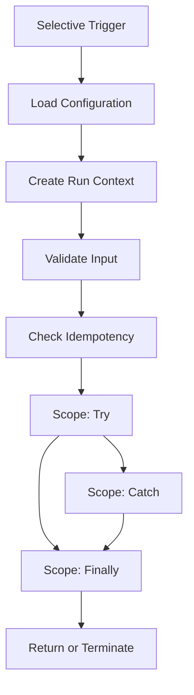

The main principle is:

> A flow is not complete when the happy path works. It is complete when it behaves predictably during success, failure, retry, duplicate delivery, timeout, and support investigation.

---

# Reusable TRACE Pattern

Use the **TRACE pattern** as the default structure for production cloud flows.

| Step                        | Meaning                                     | Main Responsibility                               |
| --------------------------- | ------------------------------------------- | ------------------------------------------------- |
| **T — Trigger Selectively** | Start only when required                    | Trigger conditions, source filtering, recurrence  |
| **R — Resolve Context**     | Load configuration and identify the run     | Environment variables, correlation ID, timestamps |
| **A — Assert Validity**     | Validate inputs and prevent duplicate work  | Guard clauses, schema checks, idempotency         |
| **C — Carry Out Logic**     | Execute the business process safely         | Try/Catch/Finally, child flows, retry policies    |
| **E — Emit Outcome**        | Log, notify, respond, and terminate clearly | Telemetry, status, response contract, alerts      |

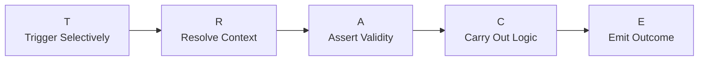

## TRACE Parent Flow Structure

```text
Trigger

Scope: Initialize
├── Read configuration
├── Generate correlation ID
├── Record start time
└── Normalize trigger values

Scope: Validate
├── Validate required values
├── Validate business eligibility
├── Check duplicate-processing store
└── Terminate or return when invalid

Scope: Try
├── Call reusable child flows
├── Read or update business systems
├── Generate documents
├── Send communications
└── Record business result

Scope: Catch
├── Inspect Try results
├── Classify error
├── Create technical exception
├── Notify support when required
└── Set failed outcome

Scope: Finally
├── Calculate duration
├── Write run telemetry
├── Update control record
└── Release temporary resources

Response or Terminate
```

## TRACE Skeleton Diagram

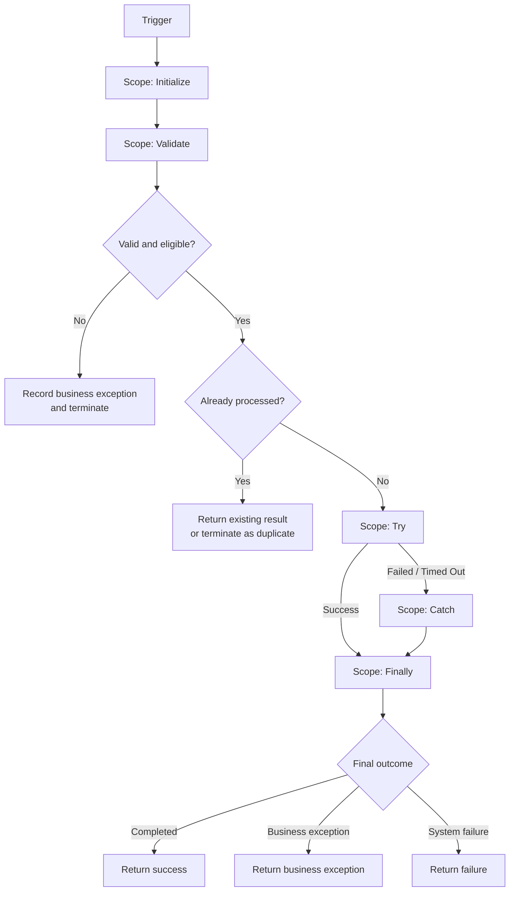

---

# Anatomy of a Well-Built Flow

## Standard Flow Sections

| Section               | Purpose                                            |
| --------------------- | -------------------------------------------------- |
| Trigger               | Starts the workflow only when required             |
| Initialize            | Establishes configuration and run context          |
| Validate              | Stops invalid or ineligible requests early         |
| Idempotency           | Prevents repeated business effects                 |
| Try                   | Contains primary business logic                    |
| Catch                 | Handles failed, skipped, or timed-out actions      |
| Finally               | Executes logging and cleanup regardless of outcome |
| Response or Terminate | Produces an explicit final status                  |

## Recommended Flow Variables

Avoid creating variables without a clear purpose. Common run-level values include:

| Variable             | Example Purpose                                     |
| -------------------- | --------------------------------------------------- |
| `varCorrelationId`   | Trace one transaction across systems                |
| `varFlowStartUtc`    | Calculate duration                                  |
| `varOutcomeStatus`   | Completed, failed, duplicate, or business exception |
| `varOutcomeCode`     | Stable machine-readable result                      |
| `varOutcomeMessage`  | Human-readable summary                              |
| `varBusinessKey`     | Policy ID, transaction ID, or request ID            |
| `varRetryable`       | Whether the failure can safely be retried           |
| `varEnvironmentName` | Development, test, UAT, or production               |

Prefer Compose actions over variables for values that do not change.

---

# Standard Outcome Model

Every reusable flow should return or record a predictable result.

## Recommended Status Categories

| Status               | Meaning                                                                       |
| -------------------- | ----------------------------------------------------------------------------- |
| `Succeeded`          | Processing completed as intended                                              |
| `BusinessException`  | Request was valid technically but could not be processed under business rules |
| `SystemFailure`      | A technical system, connection, timeout, or connector failure occurred        |
| `Duplicate`          | The request was already processed                                             |
| `Rejected`           | Input failed initial validation                                               |
| `Pending`            | Processing has not completed                                                  |
| `PartiallySucceeded` | Some independent operations succeeded and others failed                       |

## Reusable Response Contract

```json
{
  "success": true,
  "status": "Succeeded",
  "code": "RENEWAL_NOTICE_CREATED",
  "message": "The renewal notice was generated and sent.",
  "correlationId": "c1d98f76-2d35-4479-82f6-6dcd866b0132",
  "businessKey": "POL-100482",
  "retryable": false,
  "completedAtUtc": "2026-07-11T20:15:32Z",
  "data": {
    "documentId": "DOC-88271",
    "notificationId": "MSG-62882"
  }
}
```

## Standard Failure Contract

```json
{
  "success": false,
  "status": "SystemFailure",
  "code": "DOCUMENT_API_TIMEOUT",
  "message": "The document generation service did not respond before the timeout.",
  "correlationId": "c1d98f76-2d35-4479-82f6-6dcd866b0132",
  "businessKey": "POL-100482",
  "retryable": true,
  "completedAtUtc": "2026-07-11T20:16:14Z",
  "data": {}
}
```

Stable response contracts make parent flows, APIs, dashboards, and support processes easier to maintain.

---

# Pattern 1: Selective Trigger

**Use when:** a trigger source generates more events than the flow should process.

Examples:

* SharePoint item changes
* Dataverse row updates
* email arrival
* file creation
* scheduled processing
* HTTP webhook delivery

Trigger conditions reduce unnecessary flow runs and Power Platform request consumption by preventing the flow from starting when the conditions are not met.

## Pattern

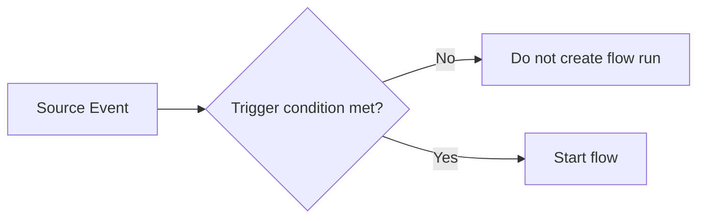

## Example Trigger Condition

Start only when status becomes ready:

```text
@equals(triggerBody()?['status'], 'Ready')
```

Start only when required fields are present:

```text
@and(
    not(empty(triggerBody()?['policyId'])),
    not(empty(triggerBody()?['recipientEmail']))
)
```

## Dataverse Trigger Optimization

Where supported, configure:

* change type
* table
* scope
* filter rows
* select columns
* trigger conditions

Dataverse can evaluate the trigger after each qualifying row update, including repeated updates, so filtering and duplicate protection remain important.

## Avoid

```text
Trigger every update
    ↓
Start flow
    ↓
Check condition
    ↓
Terminate most runs
```

Prefer:

```text
Trigger condition
    ↓
Create a run only when needed
```

---

# Pattern 2: Guard Clauses and Early Termination

**Use when:** requests may be invalid, incomplete, ineligible, or unnecessary.

Guard clauses evaluate requirements before expensive processing begins.

## Pattern

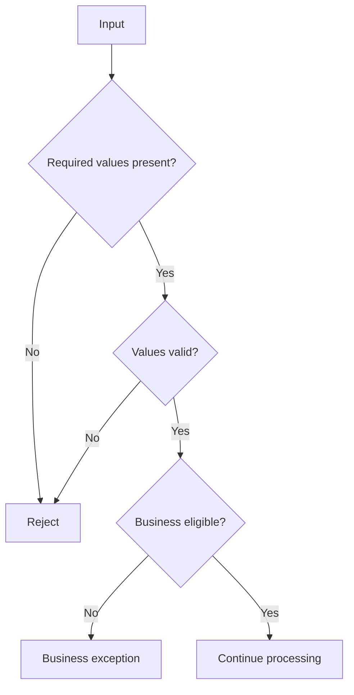

## Example Validation Checks

* required ID exists
* email address is populated
* amount is non-negative
* status is approved
* effective date is valid
* source record still exists
* requesting user is authorized
* document type is supported
* transaction has not already completed

## Common Expressions

Required value:

```text
not(empty(triggerBody()?['policyId']))
```

Allowed value:

```text
contains(
    createArray('Pending', 'Approved', 'Completed'),
    triggerBody()?['status']
)
```

Positive amount:

```text
greater(
    float(coalesce(triggerBody()?['amount'], 0)),
    0
)
```

## Recommendation

Set the final outcome before terminating:

```text
Status: Rejected
Code: REQUIRED_POLICY_ID_MISSING
Message: A policy identifier is required.
Retryable: false
```

---

# Pattern 3: Try / Catch / Finally

**Use when:** any flow interacts with external systems, updates data, sends communications, or must not fail silently.

Microsoft supports configuring actions to run after previous actions succeed, fail, time out, or are skipped.

## Scope Configuration

| Scope      | Configure Run After                   | Purpose           |
| ---------- | ------------------------------------- | ----------------- |
| Initialize | Normal execution                      | Establish context |
| Validate   | Initialize succeeded                  | Validate request  |
| Try        | Validate succeeded                    | Main processing   |
| Catch      | Try failed, timed out, or skipped     | Handle failure    |
| Finally    | Try and Catch completed in any status | Log and clean up  |

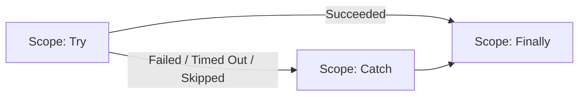

## Catch Scope Responsibilities

* capture failed action information
* classify the failure
* decide whether it is retryable
* set the final status
* create an exception record
* alert the correct support channel
* avoid exposing sensitive information

## Error Classification

| Category                | Example                          | Typical Handling                      |
| ----------------------- | -------------------------------- | ------------------------------------- |
| Business exception      | Missing recipient email          | Route for operational correction      |
| Validation failure      | Invalid request schema           | Reject without retry                  |
| Authentication          | Expired or invalid connection    | Alert platform support                |
| Authorization           | Service account lacks access     | Alert application owner               |
| Not found               | File or row no longer exists     | Recheck business state                |
| Throttling              | HTTP 429                         | Back off and retry                    |
| Timeout                 | External service did not respond | Retry when safe                       |
| Server failure          | HTTP 5xx                         | Retry or queue                        |
| Permanent request error | HTTP 400                         | Correct payload; do not retry blindly |
| Conflict                | Record changed during processing | Re-read and evaluate                  |

---

# Pattern 4: Structured Error Extraction

**Use when:** support teams need to know which action failed and why.

The `result()` expression can be used with a scope name to inspect child action results.

## Conceptual Expression

```text
result('Scope_-_Try')
```

A Filter array can isolate failed or timed-out actions.

## Example Filter Logic

From:

```text
result('Scope_-_Try')
```

Keep entries where:

```text
item()?['status']
```

equals:

```text
Failed
```

or:

```text
TimedOut
```

## Suggested Error Log Fields

| Field           | Purpose                          |
| --------------- | -------------------------------- |
| Correlation ID  | Connect related events           |
| Flow name       | Identify workflow                |
| Environment     | Identify runtime                 |
| Business key    | Identify transaction             |
| Failed scope    | Identify process area            |
| Failed action   | Identify action                  |
| Status code     | Connector or HTTP code           |
| Error code      | Stable technical classification  |
| Message         | Sanitized error                  |
| Retryable       | Control replay                   |
| Run start/end   | Duration analysis                |
| Flow run URL    | Support navigation               |
| Input reference | Reference, not sensitive payload |
| Created UTC     | Audit timestamp                  |

Do not place passwords, tokens, full customer payloads, or sensitive document contents in error logs.

---

# Pattern 5: Retry With Backoff

**Use when:** a failure is temporary and retrying is safe.

Examples:

* network interruption
* HTTP 408 timeout
* HTTP 429 throttling
* temporary HTTP 5xx response
* short-lived service outage

Power Automate supports fixed and exponential retry policies on supported actions. Microsoft recommends exponential retry for many transient-failure scenarios because delays increase between attempts.

## Pattern

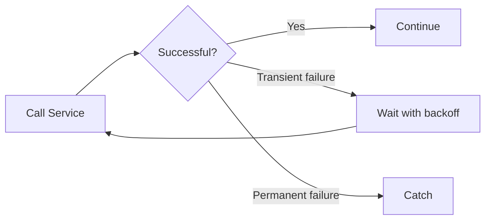

## Retry Decision Table

| Failure               |                          Retry? | Reason                                         |
| --------------------- | ------------------------------: | ---------------------------------------------- |
| HTTP 408              |                         Usually | Temporary timeout                              |
| HTTP 429              |                         Usually | Throttling                                     |
| HTTP 500–503          |                         Usually | Temporary server condition                     |
| HTTP 400              |                      Usually no | Invalid request                                |
| HTTP 401              | Not until identity is corrected | Authentication problem                         |
| HTTP 403              |   Not until access is corrected | Authorization problem                          |
| HTTP 404              |                         Depends | Resource may be delayed or permanently missing |
| Invalid business data |                              No | Retry will not correct data                    |

## Important Rule

Do not retry an action unless it is:

* naturally read-only, or
* idempotent, or
* protected by a duplicate key, or
* paired with a reliable status check

Retrying a payment, email, file creation, ticket creation, or legal notice without duplicate protection can create unintended business effects.

Current retry behavior and limits depend on the flow performance profile and connector, so confirm the applicable platform guidance instead of assuming one retry count for every flow.

---

# Pattern 6: Idempotency and Duplicate Prevention

**Use when:** a trigger, webhook, retry, or replay may deliver the same request more than once.

**Idempotent** means that processing the same request again does not create an unintended additional business effect.

## Pattern

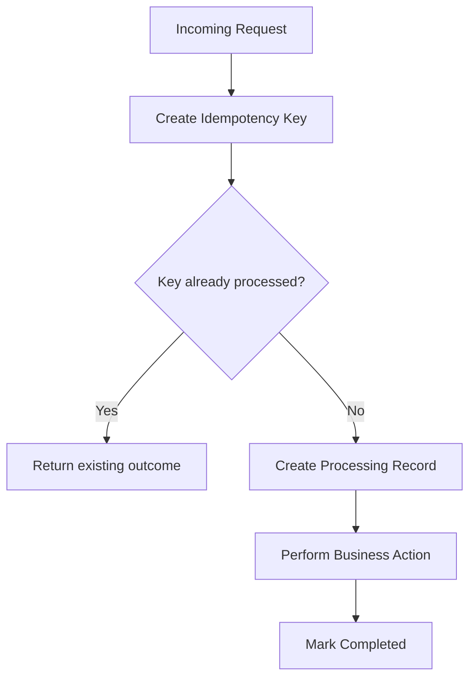

## Example Idempotency Keys

```text
SourceSystem + TransactionId
PolicyId + PolicyVersion + NoticeType
InvoiceId + PaymentType
FileId + FileVersion
CustomerId + CommunicationType + EffectiveDate
```

## Deterministic Key Expression

```text
concat(
    triggerBody()?['policyId'],
    '|',
    string(triggerBody()?['policyVersion']),
    '|',
    triggerBody()?['noticeType']
)
```

For systems requiring a compact value, hash the deterministic source string through an approved service or platform capability.

## Idempotency Store Fields

| Field              | Purpose                         |
| ------------------ | ------------------------------- |
| Idempotency key    | Unique request identifier       |
| Status             | Processing, completed, failed   |
| Correlation ID     | Trace current execution         |
| First received UTC | Initial receipt                 |
| Last attempted UTC | Latest attempt                  |
| Attempt count      | Retry tracking                  |
| Result reference   | Existing document or message ID |
| Expires UTC        | Optional retention control      |

## Concurrency Warning

Two runs can check for a key at nearly the same time and both find nothing.

Prefer a store that enforces uniqueness at write time, such as:

* Dataverse alternate key
* database unique constraint
* API-managed idempotency key
* queue with duplicate detection
* transactional locking service

Trigger concurrency set to one can help order-sensitive processes, but it reduces throughput and should not be the only duplicate control.

---

# Pattern 7: Correlation ID

**Use when:** one transaction crosses multiple flows, APIs, queues, desktop automations, or data systems.

## Pattern

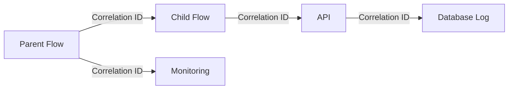

## Create a Correlation ID

```text
guid()
```

If the calling system already provides a valid correlation ID, reuse it.

## Standard Correlation Fields

```text
correlationId
parentCorrelationId
businessKey
flowRunId
sourceSystem
sourceEventId
```

## Recommended Header for HTTP Calls

```text
x-correlation-id
```

The same identifier should appear in:

* parent flow telemetry
* child flow inputs
* API request headers
* Dataverse or SQL transaction logs
* exception records
* support notifications

---

# Pattern 8: Configuration Through Environment Variables

**Use when:** values differ among development, test, UAT, and production.

Environment variables support moving the same solution between environments while replacing environment-specific values.

## Good Environment Variable Candidates

* base URLs
* SharePoint site URLs
* mailbox addresses
* queue names
* API resource identifiers
* timeout thresholds
* feature flags
* support team address
* document library name
* Dataverse table configuration
* batch size
* maximum retry count
* notification routing

## Do Not Store as Plain Configuration

* passwords
* access tokens
* unprotected API secrets
* private certificates
* personal credentials

## Naming Pattern

```text
ev_<Area>_<Purpose>
```

Examples:

```text
ev_IA_DocumentApiBaseUrl
ev_IA_SupportMailbox
ev_AutoRenewal_BatchSize
ev_AutoRenewal_FeatureEnabled
```

## Configuration Child Flow

For complex solutions, create a child flow that returns normalized configuration.

Input:

```json
{
  "solutionName": "Auto Renewal",
  "environment": "Production"
}
```

Output:

```json
{
  "supportMailbox": "ia-support@example.com",
  "batchSize": 100,
  "documentApiBaseUrl": "https://approved-api-host",
  "featureEnabled": true
}
```

This is useful when configuration requires:

* validation
* defaults
* multiple variables
* versioning
* centralized logging

---

# Pattern 9: Connection References and Enterprise Identity

**Use when:** cloud flows are deployed through solutions.

Solution flows can use connection references so the flow points to an environment-appropriate connection without rewriting the workflow. Microsoft recommends keeping the relevant connection reference in the same solution as the flow.

## Pattern

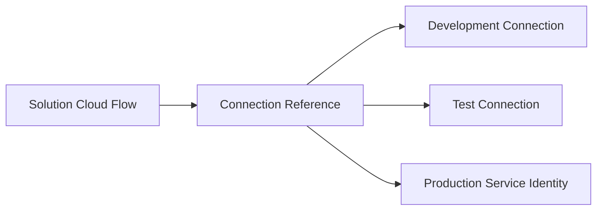

## Production Guidance

Prefer:

* enterprise-owned service accounts
* service principals where supported
* managed identity where supported
* documented shared mailbox ownership
* centrally governed connections

Avoid:

* personal developer connections
* undocumented credentials
* connections owned by departed employees
* one-off production reconnections
* excessive duplicate connection references

## Connection Inventory

| Reference          | Connector  | Purpose              | Owner            | Environment |
| ------------------ | ---------- | -------------------- | ---------------- | ----------- |
| `cr_IA_Outlook`    | Outlook    | Send operations mail | IA Platform      | Production  |
| `cr_IA_Dataverse`  | Dataverse  | Transaction tracking | IA Platform      | Production  |
| `cr_IA_SharePoint` | SharePoint | Document storage     | Content Services | Production  |

---

# Pattern 10: Reusable Child Flows

**Use when:** logic is repeated, independently testable, or making the parent flow difficult to understand.

Microsoft recommends child flows to reduce very large flows and reuse tasks across workflows. Child flows are created and managed within solutions.

## Strong Child Flow Candidates

* telemetry logging
* notification formatting
* configuration retrieval
* email validation
* document generation
* Graph API wrapper
* SharePoint file creation
* Dataverse transaction update
* business calendar calculation
* standardized error handling
* PDF attachment construction
* recipient resolution

## Child Flow Contract

Every child flow should define:

* purpose
* input schema
* output schema
* required connections
* timeout expectations
* retry behavior
* idempotency behavior
* possible outcome codes
* ownership
* versioning approach

## Example Child Flow Input

```json
{
  "correlationId": "c1d98f76-2d35-4479-82f6-6dcd866b0132",
  "businessKey": "POL-100482",
  "templateCode": "AUTO_RENEWAL_NOTICE",
  "outputFormat": "PDF",
  "data": {
    "insuredName": "Example Company",
    "effectiveDate": "2026-08-01"
  }
}
```

## Example Child Flow Output

```json
{
  "success": true,
  "status": "Succeeded",
  "code": "DOCUMENT_CREATED",
  "message": "Document created successfully.",
  "documentId": "DOC-88271",
  "fileName": "POL-100482-renewal.pdf",
  "correlationId": "c1d98f76-2d35-4479-82f6-6dcd866b0132"
}
```

## Child Flow Design Rules

* Keep the responsibility narrow.
* Return predictable outputs.
* Avoid hidden dependencies.
* Do not use child flows merely to reduce visual length.
* Document whether retries are safe.
* Keep parent and child flows in an appropriate solution boundary.
* Avoid circular flow calls.
* Do not expose secrets in child-flow responses.

---

# Pattern 11: API Wrapper Child Flow

**Use when:** several flows call the same API or need consistent authentication, headers, retry behavior, and response handling.

## Pattern

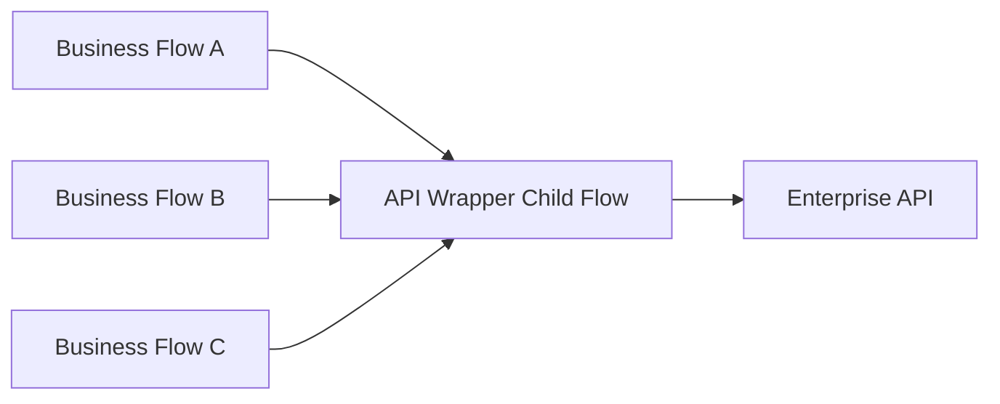

## Wrapper Responsibilities

* validate request
* build endpoint
* set headers
* add correlation ID
* handle authentication
* apply timeout
* apply retry policy
* normalize status codes
* sanitize errors
* return a standard contract
* log technical metrics

## Do Not Over-Generalize

Avoid one child flow that accepts:

```text
Any URL
Any method
Any body
Any connector
```

This becomes difficult to govern and can create a security risk.

Prefer purpose-specific wrappers:

```text
CF - Documents - Generate PDF
CF - Graph - Send Shared Mailbox Email
CF - SharePoint - Create Controlled File
CF - Databricks - Submit Lookup Request
```

---

# Pattern 12: Pagination and Bulk Retrieval

**Use when:** retrieving more rows than the connector returns in one page.

Examples:

* Dataverse
* SharePoint
* SQL
* Microsoft Graph
* REST APIs

## Strategy Order

1. Reduce records at the source.
2. Select only required columns.
3. Use supported server-side pagination.
4. Process pages or batches.
5. Record a checkpoint.
6. Avoid holding a massive dataset in flow memory.

## Server-Side Filtering

Prefer:

```text
Source query:
status eq 'Active' and modifiedon ge <watermark>
```

over:

```text
Retrieve all records
    ↓
Filter array inside Power Automate
```

## Cursor Pagination Pattern

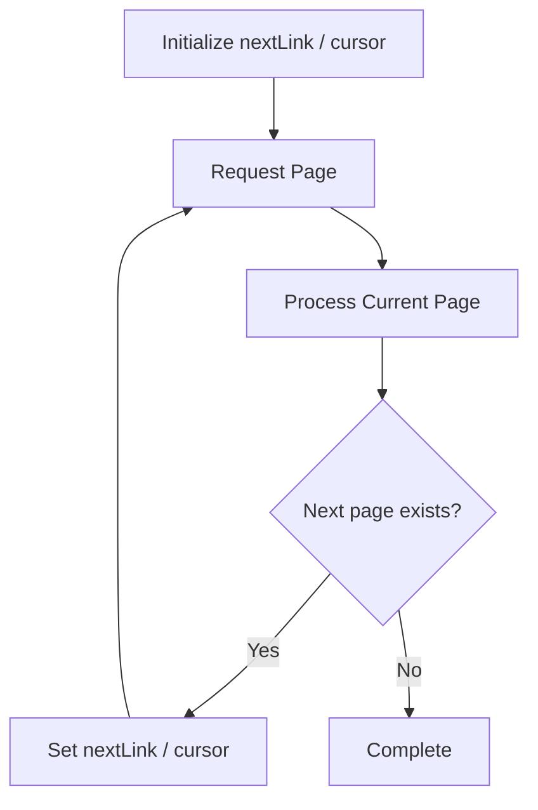

## Pagination Control Values

Track:

```text
pageNumber
nextLink
skipToken
cursor
pageSize
recordCount
lastBusinessKey
watermark
```

## Risks

* duplicate rows across pages
* records changing during pagination
* expired cursor
* connector threshold limits
* memory consumption
* timeout on long-running flows
* partial completion without checkpointing

Power Automate limits differ by flow profile, licensing, connector, and operation. Large-volume designs should be checked against the current limits rather than relying on a fixed remembered value.

---

# Pattern 13: Batch Processing With Concurrency Control

**Use when:** many independent items must be processed efficiently.

## Pattern

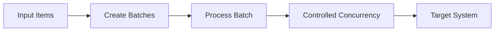

## Concurrency Decision

| Setting          | Use When                                          | Risk                           |
| ---------------- | ------------------------------------------------- | ------------------------------ |
| Sequential       | Order matters or target is sensitive              | Slow                           |
| Low concurrency  | API allows limited parallel work                  | Moderate throughput            |
| High concurrency | Operations are independent and target supports it | Throttling and race conditions |

## Questions Before Increasing Concurrency

* Are items independent?
* Can two items update the same record?
* Is ordering important?
* Does the target support parallel requests?
* Can actions be retried safely?
* Are there connector or API throttling limits?
* Can the process create duplicate files or messages?
* Is downstream locking understood?

## Recommended Batch Flow

```text
Retrieve eligible keys
    ↓
Divide into manageable batches
    ↓
Process each batch
    ↓
Record item-level outcome
    ↓
Retry only failed eligible items
    ↓
Produce batch summary
```

Do not retry the complete batch when only one item failed unless the batch operation is guaranteed to be idempotent.

---

# Pattern 14: Queue-Based Decoupling

**Use when:** processing is high-volume, long-running, failure-prone, or should not block the original request.

## Pattern

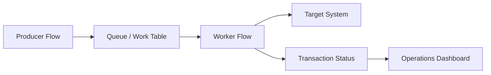

## Queue Record Fields

| Field               | Purpose                                |
| ------------------- | -------------------------------------- |
| Transaction ID      | Unique work item                       |
| Correlation ID      | Traceability                           |
| Idempotency key     | Duplicate protection                   |
| Work type           | Worker routing                         |
| Priority            | Processing order                       |
| Status              | Pending, processing, completed, failed |
| Attempt count       | Retry control                          |
| Available after     | Backoff scheduling                     |
| Locked by           | Worker ownership                       |
| Lock expires        | Abandoned-work recovery                |
| Payload reference   | Secure source reference                |
| Last error code     | Support analysis                       |
| Created/updated UTC | Aging and monitoring                   |

## Benefits

* separates request receipt from processing
* smooths workload spikes
* supports retry and replay
* enables item-level status
* prevents one large flow from timing out
* improves operational monitoring

## Queue Safety

A worker should:

1. claim the item
2. verify the lock
3. process idempotently
4. record outcome
5. release or complete the item
6. schedule retry only when appropriate

---

# Pattern 15: Watermark and Incremental Processing

**Use when:** a scheduled flow should process only new or changed data.

## Pattern

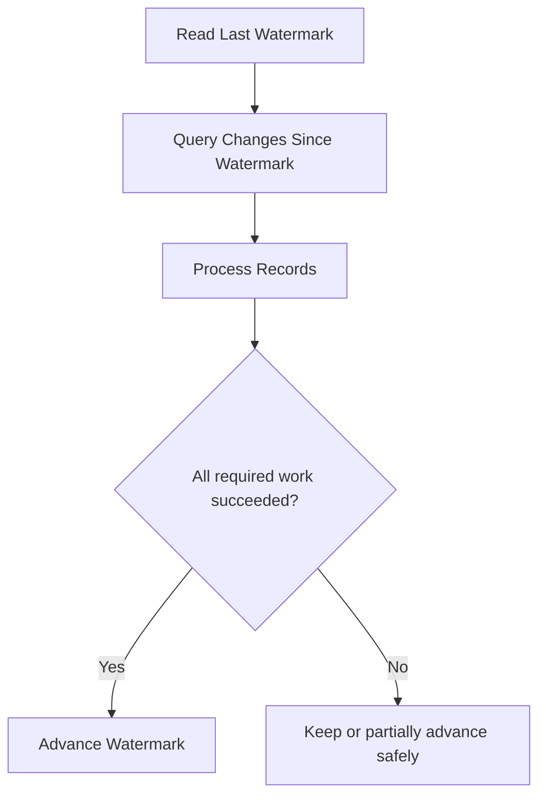

## Typical Watermarks

* modified timestamp
* increasing transaction ID
* source batch ID
* event sequence
* file timestamp
* Dataverse change token
* API continuation token

## Safe Watermark Rules

* advance only after required processing succeeds
* use UTC
* account for late-arriving data
* account for equal timestamps
* include overlap when needed
* combine timestamp with a deterministic tie-breaker
* record source and target counts
* retain replay capability

## Overlap Example

```text
Previous successful watermark: 2026-07-11T14:00:00Z
Next query starts at:          2026-07-11T13:55:00Z
```

The five-minute overlap captures late commits. Idempotency prevents duplicate effects.

---

# Pattern 16: Approval With Timeout, Reminder, and Escalation

**Use when:** a human decision controls whether processing can continue.

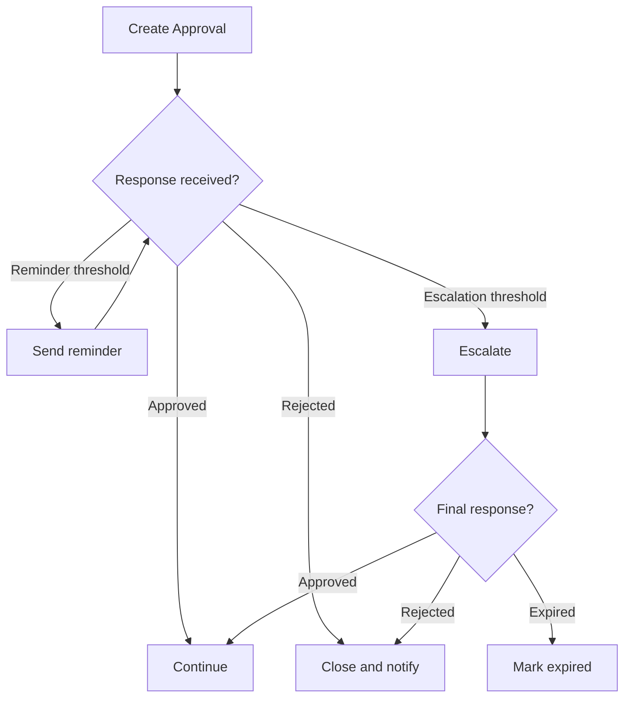

## Approval Record

Track:

* approval ID
* request ID
* approver
* backup approver
* requested UTC
* due UTC
* reminder count
* escalation UTC
* response
* response UTC
* comments
* final status

## Approval Rules

* Avoid indefinite waits.
* Define expiration.
* Define delegation.
* Define what happens when no one responds.
* Do not rely only on an email thread as the approval record.
* Confirm whether an approval is advisory or legally authoritative.
* Revalidate business data after a long approval delay.

---

# Pattern 17: Long-Running Process

**Use when:** processing may span hours or days.

Examples:

* approvals
* external batch jobs
* document review
* asynchronous APIs
* scheduled settlement
* delayed follow-up

## Prefer State-Based Orchestration

```text
Request received
    ↓
State = Submitted
    ↓
External work started
    ↓
State = Processing
    ↓
Completion event or scheduled status check
    ↓
State = Completed / Failed
```

Avoid one flow run waiting unnecessarily when the process can be represented through persisted state and resumed by another event.

## State Table

| Field           | Example              |
| --------------- | -------------------- |
| Process ID      | `PROC-10027`         |
| State           | `WaitingForApproval` |
| Previous state  | `Validated`          |
| Correlation ID  | GUID                 |
| Next action UTC | Timestamp            |
| Attempt count   | 2                    |
| Assigned owner  | Operations           |
| Last error      | Sanitized message    |
| Updated UTC     | Timestamp            |

---

# Pattern 18: Compensation and Partial Rollback

**Use when:** several systems are updated and one later step can fail.

Power Automate cannot automatically provide a distributed transaction across unrelated systems.

Use compensating actions where appropriate.

## Pattern

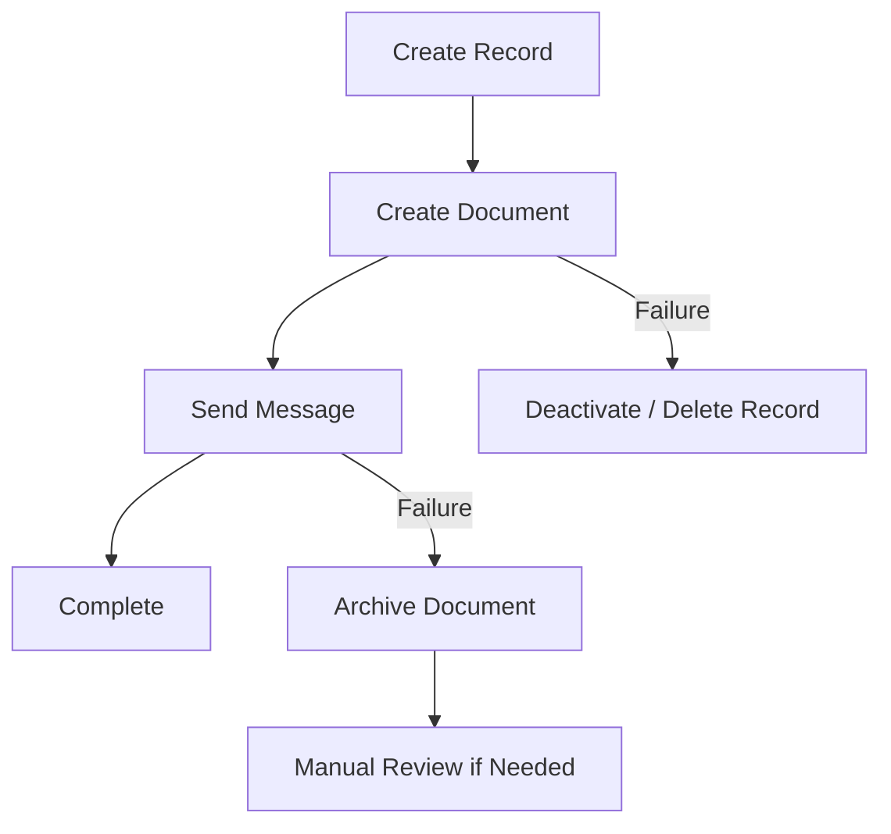

## Compensation Examples

| Completed Action            | Compensation               |
| --------------------------- | -------------------------- |
| Created temporary file      | Delete or archive file     |
| Reserved work item          | Release reservation        |
| Set status to processing    | Reset to pending or failed |
| Created ticket              | Close ticket as cancelled  |
| Added queue item            | Mark queue item cancelled  |
| Generated unsigned document | Mark obsolete              |

## Warning

Some business effects should not be automatically reversed.

Examples:

* sent customer email
* issued legal notice
* completed payment
* submitted regulatory record

For irreversible operations:

* place them late in the workflow
* validate everything first
* make them idempotent where possible
* record the external reference
* route failures for controlled remediation

---

# Pattern 19: Logging and Telemetry

**Use when:** a production flow requires support, reporting, auditability, or performance analysis.

## Three Telemetry Levels

| Level              | Purpose                | Example            |
| ------------------ | ---------------------- | ------------------ |
| Run                | Overall flow execution | Auto Renewal batch |
| Transaction        | One business item      | One policy         |
| Step or dependency | External call or stage | PDF API call       |

## Recommended Run Fields

```text
flowName
flowVersion
environment
correlationId
runId
triggerType
startUtc
endUtc
durationSeconds
status
recordsAttempted
recordsSucceeded
businessExceptions
systemFailures
retryCount
```

## Recommended Transaction Fields

```text
transactionId
correlationId
businessKey
automationName
processStage
status
outcomeCode
outcomeMessage
attemptCount
sourceSystem
targetSystem
createdUtc
completedUtc
durationSeconds
```

## Telemetry Pattern

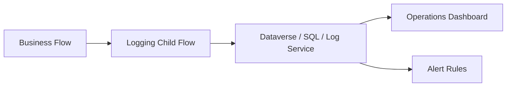

## Business Versus Technical Metrics

| Business Metric                  | Technical Metric  |
| -------------------------------- | ----------------- |
| Notices created                  | Flow runs         |
| Policies processed               | Connector calls   |
| Hours saved                      | Average duration  |
| Exceptions requiring review      | HTTP failures     |
| Straight-through processing rate | Retry count       |
| Customer communications sent     | API response time |

Do not rely solely on the native run-history interface as the long-term operational reporting system for critical workloads.

---

# Pattern 20: Alert Routing

**Use when:** failures require action from different teams.

## Alert Classification

| Alert Type                   | Owner                  |
| ---------------------------- | ---------------------- |
| Missing business data        | Business operations    |
| Connection failure           | Platform support       |
| API authentication           | Integration support    |
| Databricks freshness failure | Data engineering       |
| Document generation failure  | Document service owner |
| Customer email failure       | Automation operations  |
| Repeated throttling          | Platform architect     |
| Deployment issue             | DevOps or ALM owner    |

## Alert Content

Include:

* environment
* workload
* correlation ID
* business key
* outcome code
* sanitized summary
* retry status
* owner
* support priority
* run or dashboard reference

Avoid including:

* access tokens
* passwords
* full sensitive payloads
* confidential attachments
* unnecessary personal information

## Avoid Alert Fatigue

Do not send one email for every repeated infrastructure failure.

Consider:

* aggregation window
* threshold-based alerts
* one incident per correlation group
* suppression during known maintenance
* escalation after repeated failures
* recovery notification

---

# Pattern 21: Secure Inputs and Outputs

**Use when:** an action handles sensitive values that should not be visible in run-history inputs or outputs.

Power Automate provides Secure Inputs and Secure Outputs settings. Hardcoding credentials or sensitive values in actions can expose them to people who can inspect flow definitions or run histories.

## Use Secure Settings For

* secrets retrieved from a secure store
* tokens
* passwords
* confidential identifiers
* sensitive request payloads
* protected API responses
* desktop-flow credential values

## Important Limitation

Secure Inputs and Outputs reduce visibility in run history, but they are not a replacement for:

* correct access control
* secure secret storage
* least privilege
* DLP policies
* data classification
* retention controls

## Security Checklist

* [ ] No secrets hardcoded in flow actions.
* [ ] Production uses enterprise-owned identities.
* [ ] Secure Inputs/Outputs enabled where required.
* [ ] Logs contain only necessary data.
* [ ] Owners have appropriate access.
* [ ] DLP policies allow the connector combination.
* [ ] HTTP endpoints are approved.
* [ ] Test payloads contain no real sensitive data.
* [ ] Flow sharing is reviewed.
* [ ] Connection ownership is documented.

---

# Pattern 22: Feature Flag

**Use when:** a capability should be enabled or disabled without modifying the flow.

## Examples

```text
EnableDocumentGeneration
EnableCustomerEmail
EnableNewRateCalculation
UseNewDatabricksEndpoint
RouteFailuresToNewQueue
```

## Pattern

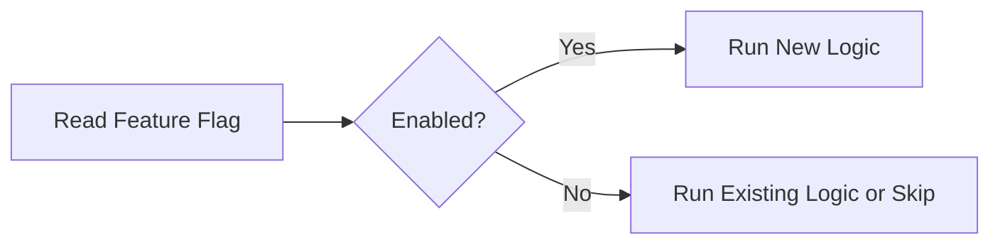

## Feature Flag Record

| Field         | Example                    |
| ------------- | -------------------------- |
| Name          | `EnableNewRateCalculation` |
| Environment   | `Production`               |
| Enabled       | `false`                    |
| Owner         | Pricing Automation Team    |
| Expiration    | `2026-08-31`               |
| Reason        | Controlled rollout         |
| Last reviewed | `2026-07-11`               |

Temporary flags should have:

* owner
* purpose
* removal date
* default behavior
* testing coverage

Do not leave old feature branches inside flows indefinitely.

---

# Pattern 23: Parent Flow and Worker Flow

**Use when:** a scheduled process retrieves many items but each item should be handled independently.

## Pattern

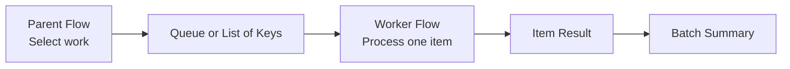

## Parent Responsibilities

* establish batch ID
* select eligible work
* avoid duplicates
* submit item keys
* monitor completion
* produce summary

## Worker Responsibilities

* process one business item
* validate current state
* operate idempotently
* record item outcome
* retry safely
* return stable response

This is often easier to support than one large `Apply to each` containing the entire business process.

---

# Pattern 24: Desktop Flow Orchestration

**Use when:** a cloud flow launches Power Automate for desktop or another UI automation.

## Pattern

```mermaid
flowchart TD
    CLOUD["Cloud Flow"] --> VALIDATE["Validate Request"]
    VALIDATE --> QUEUE["Create Work Item"]
    QUEUE --> DESKTOP["Run Desktop Flow"]
    DESKTOP --> RESULT{"Result"}
    RESULT -->|Success| COMPLETE["Complete Work Item"]
    RESULT -->|Business Exception| BUSINESS["Route to Operations"]
    RESULT -->|System Failure| TECH["Retry or Technical Support"]
```

## Cloud Flow Responsibilities

* validate request
* provide secure inputs
* allocate transaction ID
* call desktop flow
* enforce timeout expectations
* classify response
* record telemetry
* route exception

## Desktop Flow Responsibilities

* validate application state
* handle UI element failures
* return structured outputs
* avoid exposing credentials
* capture useful but safe diagnostics
* distinguish business and technical exceptions

## Desktop Output Contract

```json
{
  "success": false,
  "status": "BusinessException",
  "code": "POLICY_NOT_FOUND",
  "message": "No policy matched the supplied reference.",
  "retryable": false,
  "applicationReference": "",
  "screenshotReference": ""
}
```

---

# Pattern 25: AI-Assisted Processing With Human Review

**Use when:** AI extracts, classifies, summarizes, or recommends, but uncertainty must be controlled.

## Pattern

```mermaid
flowchart TD
    INPUT["Document or Message"] --> AI["AI Extraction / Classification"]
    AI --> SCORE{"Confidence acceptable?"}
    SCORE -->|High| RULES["Validate with Business Rules"]
    SCORE -->|Low| REVIEW["Human Review"]
    RULES --> VALID{"Rules passed?"}
    VALID -->|Yes| ACTION["Continue Automation"]
    VALID -->|No| REVIEW
    REVIEW --> ACTION
```

## Required Controls

* define approved use case
* validate input format
* capture model or prompt version where relevant
* set confidence threshold
* verify critical values
* create human-review path
* prevent unsupported autonomous decisions
* log outcome without exposing sensitive content
* monitor false positives and false negatives
* define fallback behavior

Preview or experimental AI capabilities should not be treated as production-ready without explicit organizational approval and validation.

---

# Reusable Child Flow Library

## Suggested Library

| Child Flow                            | Responsibility                             |
| ------------------------------------- | ------------------------------------------ |
| `CF - Common - Get Configuration`     | Return validated environment configuration |
| `CF - Common - Write Telemetry`       | Record run or transaction event            |
| `CF - Common - Create Exception`      | Create standardized exception record       |
| `CF - Common - Send Notification`     | Route templated notification               |
| `CF - Common - Validate Email`        | Validate and normalize email address       |
| `CF - Common - Build Response`        | Produce standard response contract         |
| `CF - Documents - Generate PDF`       | Call document-generation service           |
| `CF - SharePoint - Create File`       | Store controlled file                      |
| `CF - Graph - Send Email`             | Send standardized Graph email              |
| `CF - Dataverse - Upsert Transaction` | Create or update processing record         |
| `CF - Data - Request Lookup`          | Call governed data lookup endpoint         |
| `CF - Calendar - Add Business Days`   | Apply business-calendar rules              |

## Reuse Decision

Create a reusable child flow when:

* logic appears in multiple flows
* the responsibility is stable
* it has a clear input/output contract
* one team can own it
* independent testing provides value
* changes can remain backward compatible

Keep logic local when:

* it is specific to one business process
* reuse is speculative
* the contract changes frequently
* extracting it creates more complexity than it removes

---

# Flow Naming Standards

## Cloud Flow

```text
<Flow Type> - <Business Area> - <Purpose>
```

Examples:

```text
AUTO - Renewals - Process Eligible Policies
SCH - Bulk Notices - Retrieve Daily Candidates
INST - Claims - Submit Document Request
CHILD - Common - Write Telemetry
CHILD - Documents - Generate PDF
```

## Scope Naming

```text
Scope - Initialize
Scope - Validate
Scope - Try
Scope - Catch
Scope - Finally
```

## Action Naming

Prefer:

```text
DV - Get Policy
SQL - Retrieve Eligible Policies
HTTP - Generate PDF
SP - Create Notice File
OUTLOOK - Send Broker Email
CMP - Build Correlation ID
COND - Policy Is Eligible
```

Avoid:

```text
Get row
Compose 7
Condition 4
Apply to each 12
HTTP 3
```

Action names appear in expressions, run history, and error extraction. Rename them before creating many references.

---

# Expression Quick Reference

## Null-Safe Value

```text
coalesce(triggerBody()?['email'], '')
```

## Check Empty

```text
empty(triggerBody()?['policyId'])
```

## Generate GUID

```text
guid()
```

## Current UTC Time

```text
utcNow()
```

## Format Date

```text
formatDateTime(utcNow(), 'yyyy-MM-dd')
```

## Add Days

```text
addDays(utcNow(), 5)
```

## Convert to Lowercase

```text
toLower(trim(triggerBody()?['status']))
```

## Join Array

```text
join(variables('varRecipients'), ';')
```

## Build String

```text
concat(
    triggerBody()?['policyId'],
    '-',
    triggerBody()?['noticeType']
)
```

## Safe Boolean

```text
equals(
    toLower(string(coalesce(triggerBody()?['enabled'], false))),
    'true'
)
```

## Safe Integer

```text
int(coalesce(triggerBody()?['retryCount'], 0))
```

## First Array Item

```text
first(body('Filter_array'))
```

Only use `first()` after confirming the array is not empty.

## Array Length

```text
length(body('Filter_array'))
```

## Contains

```text
contains(
    toLower(coalesce(triggerBody()?['subject'], '')),
    'renewal'
)
```

---

# Data Transformation Patterns

## Select Instead of Apply to Each

Use the Select action when transforming every item in an array without external side effects.

Input:

```json
[
  {
    "policyId": "P-1",
    "email": "ONE@EXAMPLE.COM"
  }
]
```

Output mapping:

```json
{
  "businessKey": "@{item()?['policyId']}",
  "recipient": "@{toLower(item()?['email'])}"
}
```

## Filter Array

Use for an already retrieved in-memory array when source-side filtering is unavailable.

Prefer source-side filtering for large datasets.

## Compose for Calculated Values

Use Compose when:

* value is calculated once
* value does not change
* naming improves readability

## Parse JSON

Use Parse JSON when:

* downstream actions need typed dynamic content
* the response contract is stable
* schema validation is useful

Avoid making every optional field required in the schema.

---

# File Processing Patterns

## Controlled File Creation

```mermaid
flowchart TD
    CONTENT["Generate Content"] --> NAME["Create Deterministic File Name"]
    NAME --> CHECK{"File already exists?"}
    CHECK -->|Yes| VERSION["Version / Replace / Return Existing"]
    CHECK -->|No| CREATE["Create File"]
    CREATE --> META["Write Metadata"]
    META --> LOG["Log File Reference"]
```

## Recommended File Metadata

* business key
* document type
* source version
* generated UTC
* correlation ID
* status
* retention category
* owner
* source system
* document hash where appropriate

## File Naming

```text
<business-key>_<document-type>_<yyyyMMdd>_<version>.pdf
```

Example:

```text
POL-100482_AUTO-RENEWAL_20260711_v1.pdf
```

Avoid user-supplied file names without sanitizing prohibited characters.

---

# Notification Pattern

## Notification Levels

| Level              | Audience                     | Example                       |
| ------------------ | ---------------------------- | ----------------------------- |
| Informational      | Business user                | Request completed             |
| Business exception | Operations                   | Recipient data missing        |
| Technical warning  | Support                      | One retry occurred            |
| Technical failure  | Platform/integration support | API unavailable               |
| Critical incident  | Incident management          | High-volume production outage |

## Standard Notification Structure

```text
Environment:
Automation:
Status:
Business Key:
Correlation ID:
Summary:
Required Action:
Retry Status:
Support Reference:
```

Notifications should be actionable, not merely announce that “the flow failed.”

---

# Solution and ALM Standards

Solution-aware cloud flows provide stronger ALM capabilities, including environment variables, connection references, role-based access, solution layering, and transport between environments.

```mermaid
flowchart LR
    DEV["Development<br/>Unmanaged Solution"] --> BUILD["Export / Build"]
    BUILD --> TEST["Test<br/>Managed Solution"]
    TEST --> UAT["UAT<br/>Managed Solution"]
    UAT --> PROD["Production<br/>Managed Solution"]

    CONFIG["Environment Variables"] -.-> DEV
    CONFIG -.-> TEST
    CONFIG -.-> UAT
    CONFIG -.-> PROD

    CONNECTIONS["Connection References"] -.-> DEV
    CONNECTIONS -.-> TEST
    CONNECTIONS -.-> UAT
    CONNECTIONS -.-> PROD
```

## Minimum ALM Standards

| Practice                            | Reason                                  |
| ----------------------------------- | --------------------------------------- |
| Build flows inside solutions        | Portability and component management    |
| Use connection references           | Environment-specific connection binding |
| Use environment variables           | Externalized configuration              |
| Develop in unmanaged solutions      | Editable development source             |
| Deploy managed solutions downstream | Controlled customization                |
| Store source in Git                 | Review and recovery                     |
| Use deployment pipelines            | Repeatable promotion                    |
| Run solution checker                | Static quality validation               |
| Version releases                    | Traceability                            |
| Prevent direct production editing   | Avoid source drift                      |

Power Platform pipelines automate solution deployment among environments. Current platform guidance requires pipeline target environments to use Managed Environments for compliant deployment scenarios, so licensing and governance should be evaluated as part of pipeline adoption.

---

# Production Flow Review Checklist

## Trigger

* [ ] Trigger starts only when needed.
* [ ] Trigger conditions are documented.
* [ ] Recurrence timezone is explicit.
* [ ] Duplicate-trigger behavior is understood.
* [ ] Trigger concurrency is intentional.

## Configuration

* [ ] Environment-specific values are externalized.
* [ ] No production URL or mailbox is hardcoded.
* [ ] Connection references are in the solution.
* [ ] Configuration ownership is documented.

## Validation

* [ ] Required fields are validated.
* [ ] Data types are checked.
* [ ] Business eligibility is checked.
* [ ] Invalid requests stop early.
* [ ] Validation outcomes are logged.

## Reliability

* [ ] Try/Catch/Finally is implemented.
* [ ] Retry policy matches the failure type.
* [ ] Duplicate processing is prevented.
* [ ] Timeouts are handled.
* [ ] Partial completion is handled.
* [ ] Replay procedure exists.

## Security

* [ ] No secrets are hardcoded.
* [ ] Secure Inputs/Outputs are enabled where needed.
* [ ] Production uses enterprise-owned identity.
* [ ] Least privilege is applied.
* [ ] Logs exclude sensitive data.
* [ ] Connector combination complies with DLP.

## Performance

* [ ] Source-side filters are used.
* [ ] Required columns only are retrieved.
* [ ] Pagination is configured.
* [ ] Concurrency is intentional.
* [ ] Batch size is appropriate.
* [ ] Platform and API limits were assessed.

## Operations

* [ ] Correlation ID is recorded.
* [ ] Run and transaction telemetry exists.
* [ ] Alerts have an owner.
* [ ] Business exceptions are separated from technical failures.
* [ ] Runbook exists.
* [ ] Support can replay safely.

## ALM

* [ ] Flow is in a solution.
* [ ] Source is in Git.
* [ ] Solution checker passes.
* [ ] Release is versioned.
* [ ] Deployment uses an approved pipeline.
* [ ] Production changes are not made directly.

---

# Testing Matrix

| Test Type               | Example                              |
| ----------------------- | ------------------------------------ |
| Happy path              | Valid request completes              |
| Required-field test     | Policy ID is missing                 |
| Invalid-value test      | Unsupported status supplied          |
| Duplicate test          | Same event delivered twice           |
| Retry test              | API returns temporary 503            |
| Throttling test         | Connector returns 429                |
| Permanent failure test  | API returns 400                      |
| Authorization test      | Service identity lacks access        |
| Timeout test            | Dependency does not respond          |
| Partial completion test | File created but email fails         |
| Concurrency test        | Two requests update same record      |
| Pagination test         | More than one page returned          |
| Volume test             | Production-like batch size           |
| Late-data test          | Record arrives after watermark       |
| Child-flow test         | Child returns each supported outcome |
| Security test           | Sensitive values absent from logs    |
| Deployment test         | Connection references resolve        |
| Recovery test           | Failed transaction replayed safely   |

---

# Common Mistakes and Fixes

| Mistake                                  | Why It Fails                         | Better Approach                     |
| ---------------------------------------- | ------------------------------------ | ----------------------------------- |
| No error handling                        | Failures become silent or unclear    | Try/Catch/Finally                   |
| One flow with hundreds of actions        | Difficult to review and support      | Parent and child flows              |
| Hardcoded URLs or mailboxes              | Deployment becomes manual            | Environment variables               |
| Personal production connection           | Creates key-person dependency        | Enterprise-owned identity           |
| Retrieve all then filter                 | Wastes time and requests             | Source-side filters                 |
| High loop concurrency by default         | Causes throttling and races          | Tune using target capacity          |
| Retry every error                        | Permanent errors repeat uselessly    | Classify transient versus permanent |
| Retry non-idempotent action              | Creates duplicates                   | Idempotency key and status check    |
| Logging only run status                  | Cannot identify failed business item | Transaction-level telemetry         |
| Sending every error to one inbox         | Wrong team receives incidents        | Classified alert routing            |
| Using Compose 1, Compose 2               | Run history is unreadable            | Meaningful action names             |
| One universal child flow                 | Becomes tightly coupled and insecure | Purpose-specific contracts          |
| Storing secrets in variables             | Values may appear in history         | Secure storage and secure settings  |
| Advancing watermark before completion    | Records can be lost                  | Advance after validated success     |
| Directly editing production              | Creates drift from source            | Solution-based ALM                  |
| Treating business exceptions as failures | Distorts reliability metrics         | Separate outcome categories         |
| No explicit final status                 | Parent cannot interpret outcome      | Standard response contract          |
| Waiting indefinitely for approval        | Process never closes                 | Timeout and escalation              |

---

# Red Flags

* Flow is outside a solution.
* Production connection belongs to a developer.
* No correlation ID exists.
* Trigger fires for events immediately discarded.
* Flow can create duplicate emails or files.
* `Apply to each` contains the entire business process.
* Concurrency is increased without testing.
* Retries occur on HTTP 400 or invalid data.
* No distinction exists between business exception and system failure.
* Logging contains full customer payloads.
* A scheduled process has no watermark.
* An approval can wait forever.
* One flow updates several systems with no compensation plan.
* Child flows return inconsistent outputs.
* API calls have no timeout or status-code handling.
* Alerts say only “flow failed.”
* No one owns the production connection.
* Production cannot be recreated from a solution and repository.
* The workflow depends on manual production configuration.
* A failure replay can repeat irreversible actions.

---

# Troubleshooting Guide

| Symptom                               | Likely Cause                                 | Corrective Action                                    |
| ------------------------------------- | -------------------------------------------- | ---------------------------------------------------- |
| Trigger never runs                    | Trigger condition excludes event             | Test condition with actual payload                   |
| Trigger runs too often                | Filtering occurs after trigger               | Move criteria into trigger settings                  |
| Runs are cancelled                    | Concurrency setting rejects or replaces runs | Review trigger concurrency                           |
| Flow fails after deployment           | Missing environment-variable value           | Configure target environment                         |
| Flow cannot enable                    | Invalid connection reference                 | Rebind correct connection                            |
| HTTP action returns 429               | Throttling                                   | Reduce concurrency and use backoff                   |
| Apply to each is slow                 | Sequential processing or excessive actions   | Review safe concurrency and child-worker pattern     |
| Duplicate emails appear               | Trigger redelivery or retry                  | Add idempotency key and message reference            |
| Latest configuration is not used      | Cached or stale configuration                | Revalidate value and controlled refresh process      |
| Child flow unavailable                | Not solution-aware or connection issue       | Confirm solution, permissions, and connection        |
| Catch scope did not run               | Configure Run After is incomplete            | Include failed, timed out, and skipped as required   |
| Finally scope skipped                 | Run After does not cover every path          | Configure all possible statuses                      |
| Secure values appear in history       | Secure settings missing upstream             | Enable Secure Inputs/Outputs on relevant actions     |
| Scheduled flow misses records         | Watermark advanced incorrectly               | Add overlap and idempotent replay                    |
| Flow exceeds runtime or action limits | Workload is too large                        | Use queue, paging, worker flows, or external service |
| File action returns not found         | Site, library, or path changed               | Validate environment configuration                   |
| Production edit disappears            | Managed solution was redeployed              | Make change in development and promote               |
| Support cannot find failure           | No correlation ID or transaction log         | Add structured telemetry                             |

Microsoft’s current cloud-flow troubleshooting guidance recommends first determining whether the trigger occurred and then identifying the specific failed action and its detailed error.

---

# Efficiency Decision Table

| Requirement                    | Prefer                                                 |
| ------------------------------ | ------------------------------------------------------ |
| Prevent unnecessary runs       | Trigger condition                                      |
| Reduce returned data           | Source-side filter and select                          |
| Reuse business operation       | Child flow                                             |
| Reuse external API integration | Purpose-specific API wrapper                           |
| Handle temporary outage        | Exponential retry                                      |
| Avoid duplicate effects        | Idempotency key                                        |
| Process large workload         | Pagination, batching, queue workers                    |
| Process only changed rows      | Watermark                                              |
| Trace across systems           | Correlation ID                                         |
| Move among environments        | Solution, environment variables, connection references |
| Protect sensitive values       | Secure store and Secure Inputs/Outputs                 |
| Support long-running process   | Persisted state                                        |
| Handle partial completion      | Compensation pattern                                   |
| Monitor production             | Structured telemetry                                   |
| Reduce one giant loop          | Parent/worker pattern                                  |
| Control rollout                | Feature flag                                           |

---

# Beginner-to-Pro Learning Path

| Level                      | Focus                                                         | Practical Outcome                      |
| -------------------------- | ------------------------------------------------------------- | -------------------------------------- |
| Beginner                   | Triggers, actions, conditions, Compose                        | Build a simple workflow                |
| Advanced Beginner          | Expressions, loops, variables, connector behavior             | Handle basic branching and data        |
| Intermediate Practitioner  | Try/Catch, trigger conditions, pagination, approvals          | Build supportable departmental flows   |
| Advanced Practitioner      | Child flows, idempotency, concurrency, APIs                   | Build reusable and resilient solutions |
| Automation Engineer        | Telemetry, queues, contracts, recovery, desktop orchestration | Operate production workloads           |
| Enterprise Professional    | Solutions, ALM, DLP, identity, pipelines                      | Govern environment promotion           |
| Architect / Strategic Lead | Reference architectures, reusable platforms, risk controls    | Scale the automation department        |

---

# Reusable Flow Design Template

```markdown
# Flow Design: <Flow Name>

## Purpose

<What business outcome does this flow provide?>

## Trigger

- Trigger type:
- Source:
- Trigger conditions:
- Expected frequency:
- Expected volume:
- Concurrency setting:

## Grain

<What does one transaction represent?>

## Business Key

<Policy ID, request ID, file ID, or composite key>

## Idempotency Key

<Explain how duplicate work is prevented.>

## Inputs

| Input | Type | Required | Sensitive | Description |
|---|---|---:|---:|---|
| <name> | <type> | Yes/No | Yes/No | <description> |

## Outputs

| Output | Type | Description |
|---|---|---|
| status | String | Final outcome |
| code | String | Stable result code |
| correlationId | String | Trace identifier |

## Configuration

| Variable | Purpose | Environment-Specific |
|---|---|---:|
| <name> | <purpose> | Yes/No |

## Connections

| Connection Reference | Connector | Owner |
|---|---|---|
| <name> | <connector> | <team> |

## TRACE Design

### Trigger Selectively

<Describe trigger filters.>

### Resolve Context

<Describe configuration and correlation ID.>

### Assert Validity

<Describe validation and duplicate control.>

### Carry Out Logic

<Describe Try/Catch/Finally and child flows.>

### Emit Outcome

<Describe telemetry, notifications, and response.>

## Error Model

| Code | Category | Retryable | Owner |
|---|---|---:|---|
| <code> | <category> | Yes/No | <team> |

## Monitoring

<Describe telemetry, dashboard, and alerting.>

## Security

<Describe identities, sensitive data, and secure settings.>

## Testing

<List required test cases.>

## Recovery

<Describe replay and compensation.>

## Deployment

<Describe solution, variables, references, and pipeline.>
```

---

# Reusable Child Flow Contract Template

```markdown
# Child Flow Contract: <Name>

## Responsibility

<One clear responsibility.>

## Owner

<Team or role>

## Inputs

| Name | Type | Required | Sensitive | Validation |
|---|---|---:|---:|---|
| correlationId | String | Yes | No | Valid GUID |
| businessKey | String | Yes | No | Not empty |
| <input> | <type> | Yes/No | Yes/No | <rule> |

## Outputs

| Name | Type | Description |
|---|---|---|
| success | Boolean | Technical/business completion |
| status | String | Standard outcome |
| code | String | Stable outcome code |
| message | String | Safe summary |
| retryable | Boolean | Whether parent may retry |
| data | Object | Result payload |

## Supported Outcomes

| Code | Status | Retryable | Meaning |
|---|---|---:|---|
| <code> | <status> | Yes/No | <meaning> |

## Dependencies

- Connector:
- Connection reference:
- Environment variables:
- API:
- Table or system:

## Idempotency

<Explain whether and how repeated calls are safe.>

## Retry Policy

<Explain retryable failures and maximum behavior.>

## Timeout

<Expected completion time and timeout handling.>

## Security

<Explain sensitive inputs, logging, and access.>

## Versioning

<Explain backward compatibility and contract changes.>
```

---

# Repository Placement

```text
automation/
└── power-automate/
    ├── README.md
    ├── architecture/
    │   ├── trace-pattern.md
    │   ├── parent-worker-pattern.md
    │   ├── queue-processing-pattern.md
    │   └── api-wrapper-pattern.md
    ├── patterns/
    │   ├── error-handling.md
    │   ├── idempotency.md
    │   ├── retry-and-backoff.md
    │   ├── pagination.md
    │   ├── concurrency.md
    │   ├── approvals.md
    │   ├── telemetry.md
    │   ├── security.md
    │   └── feature-flags.md
    ├── standards/
    │   ├── naming-standard.md
    │   ├── solution-alm-standard.md
    │   ├── connection-reference-standard.md
    │   ├── environment-variable-standard.md
    │   └── production-readiness-standard.md
    ├── templates/
    │   ├── flow-design-template.md
    │   ├── child-flow-contract-template.md
    │   ├── test-case-template.md
    │   ├── runbook-template.md
    │   └── production-checklist.md
    ├── examples/
    │   ├── parent-flow/
    │   ├── worker-flow/
    │   ├── logging-child-flow/
    │   └── api-wrapper-child-flow/
    └── quick-reference/
        ├── expressions.md
        ├── error-codes.md
        └── repeatable-solution-patterns.md
```

Recommended filename:

```text
automation/power-automate/quick-reference/power-automate-repeatable-solution-patterns.md
```

---

# Final Mental Model

Think of Power Automate as an orchestration platform operating a controlled transaction:

```text
Event
    ↓
Selective Trigger
    ↓
Configuration and Correlation
    ↓
Validation
    ↓
Idempotency
    ↓
Structured Business Logic
    ↓
Retry or Exception Handling
    ↓
Telemetry and Notification
    ↓
Explicit Final Outcome
```

Use TRACE:

```text
T — Trigger Selectively
R — Resolve Context
A — Assert Validity
C — Carry Out Logic
E — Emit Outcome
```

The final rule is:

> A reusable flow should have a clear contract, a narrow responsibility, predictable outcomes, safe retry behavior, visible telemetry, and no hidden environment dependencies.
