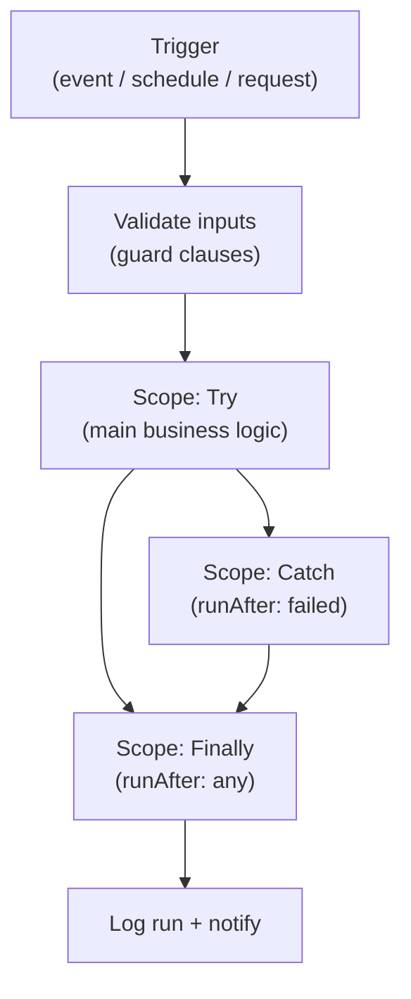
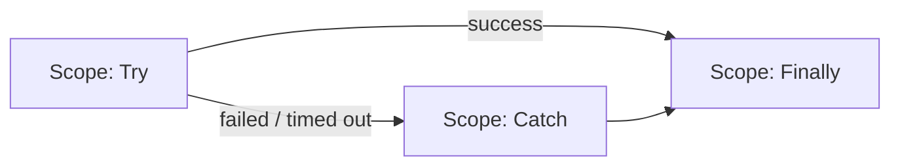
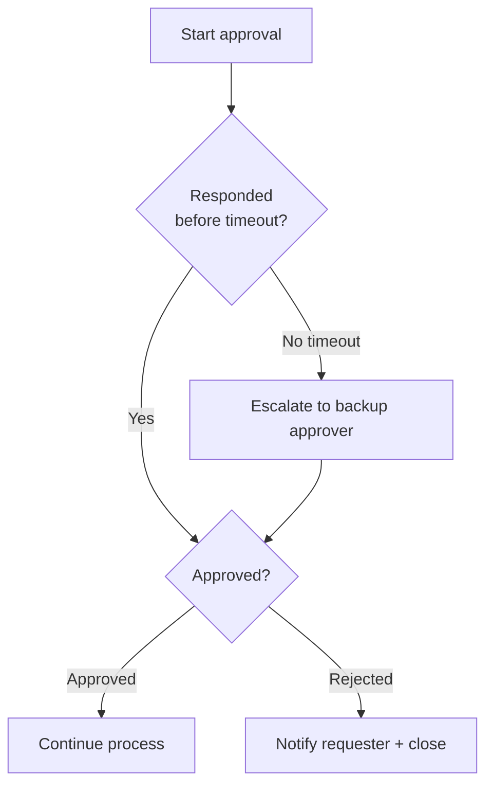
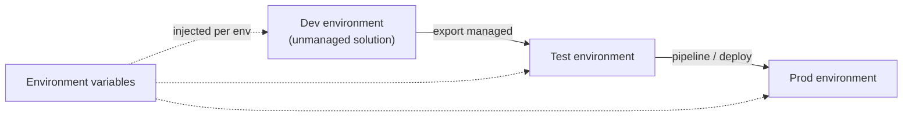

# Power Automate — Repeatable Solution Patterns

> A pattern library for building reliable Power Automate cloud flows. Each pattern includes when to use it, a visual, and the key building blocks so solutions are consistent, observable, and maintainable.

## Anatomy of a Well-Built Flow

Every production-grade flow tends to share the same backbone: a clear trigger, validation, a scoped main body, structured error handling, and a notification/logging tail.

## Pattern 1: Try / Catch / Finally (Structured Error Handling)

**Use when:** any flow that touches external systems or must not fail silently.

Build three parallel **Scope** actions and set `runAfter` on each:

| Scope | Configure "run after" | Purpose |
|---|---|---|
| Try | (default: after previous) | Main logic |
| Catch | Try = **failed, timed out, skipped** | Capture and report errors |
| Finally | Try & Catch = **is successful, failed, skipped, timed out** | Always log / clean up |

Inside Catch, use `result('Try')` to extract which action failed and why.

## Pattern 2: Pagination & Bulk Retrieval

**Use when:** retrieving large datasets (Dataverse, SharePoint, SQL, APIs).

- Turn on **Pagination** in the action settings and set a threshold, OR
- Use a **Do Until** loop with a `skiptoken` / `$skip` cursor until no more records return.
- Prefer server-side `$filter` and `$select` over retrieving all and filtering in the flow.

## Pattern 3: Batch Processing with Concurrency Control

**Use when:** processing many items where throughput matters but downstream systems have limits.

| Lever | Where | Note |
|---|---|---|
| Apply to each **Concurrency** | Loop settings | Raise for speed; lower to respect API throttling |
| Chunking | Split arrays with `chunk()`/`take`/`skip` | Avoid huge single calls |
| Batch APIs | Dataverse/Graph `$batch` | Fewer calls, less throttling |

## Pattern 4: Approval with Escalation & Timeout

**Use when:** human decisions gate a process.

Use the **Start and wait for an approval** action with a parallel **Delay/timeout** branch, or configure the approval timeout and a follow-up reminder.

## Pattern 5: Idempotency & Duplicate Prevention

**Use when:** triggers may fire more than once (retries, webhooks, at-least-once delivery).

- Compute a deterministic key (e.g., `triggerBody()?['id']`) and check a store (Dataverse/SharePoint) before acting.
- Use "**upsert**" semantics instead of blind "create".
- Add a **concurrency control = 1** on the trigger for order-sensitive flows.

## Pattern 6: Configuration via Environment Variables

**Use when:** values differ across dev/test/prod (URLs, emails, thresholds).

- Store settings as **Environment Variables** in a solution — never hard-code.
- Reference them so the same flow promotes cleanly across environments.

## Pattern 7: Child Flows for Reuse

**Use when:** the same logic (logging, notifications, formatting) appears in many flows.

- Build a **child flow** (called via "Run a Child Flow") for shared logic.
- Keep child flows in the same **solution** for portability.

## Solution & ALM Standards

| Practice | Why |
|---|---|
| Build inside a **solution** | Portable, versioned, deployable |
| Use **connection references** | Rebind connections per environment |
| Use **environment variables** | No hard-coded config |
| Ship **managed** to test/prod | Prevents unintended edits |
| Consistent naming (`Flow - Area - Action`) | Discoverability and support |

## Common Mistakes & Fixes

- **No error handling** — wrap logic in Try/Catch/Finally scopes.
- **Hard-coded URLs/emails** — move to environment variables.
- **Retrieving all rows then filtering** — push filters to the source with `$filter`.
- **Unbounded Apply to each** — cap concurrency and chunk large arrays.
- **Editing flows directly in prod** — use solutions and ALM promotion.

## Red Flags

- Flows outside any solution (not deployable/portable).
- Silent failures with no notification or run logging.
- Triggers with no idempotency on at-least-once delivery.
- Secrets stored in flow steps instead of secure config.

## Beginner-to-Pro Notes

| Level | Focus |
|---|---|
| Beginner | Build a simple trigger → action flow in the UI. |
| Advanced Beginner | Conditions, loops, expressions, connectors. |
| Intermediate Practitioner | Try/Catch scopes, pagination, approvals. |
| Advanced Practitioner | Child flows, concurrency tuning, idempotency. |
| Enterprise Professional | Solutions, ALM, environment variables, monitoring. |
| Architect / Strategic Lead | Reusable pattern libraries, CoE governance. |
