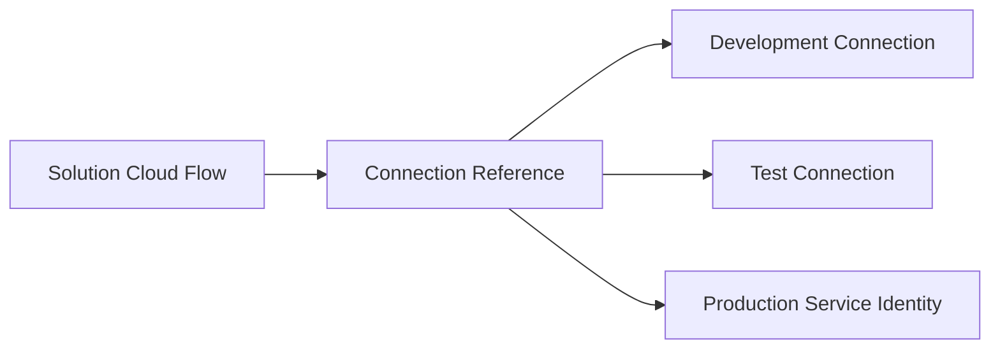
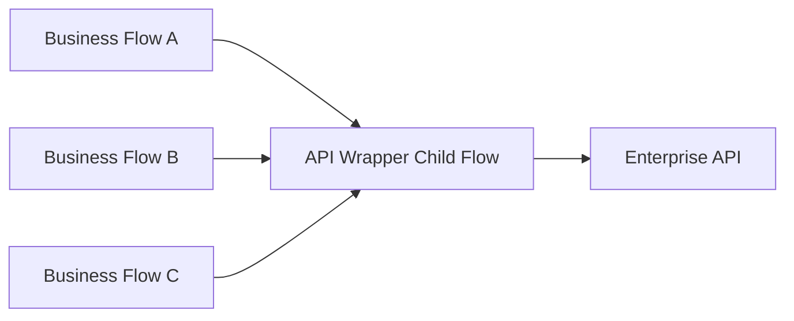

# Pattern 8: Configuration Through Environment Variables

**Use when:** values differ among development, test, UAT, and production.

Environment variables support moving the same solution between environments while replacing environment-specific values.

## Good Environment Variable Candidates

* base URLs
* SharePoint site URLs
* mailbox addresses
* queue names
* API resource identifiers
* timeout thresholds
* feature flags
* support team address
* document library name
* Dataverse table configuration
* batch size
* maximum retry count
* notification routing

## Do Not Store as Plain Configuration

* passwords
* access tokens
* unprotected API secrets
* private certificates
* personal credentials

## Naming Pattern

```text
ev_<Area>_<Purpose>
```

Examples:

```text
ev_IA_DocumentApiBaseUrl
ev_IA_SupportMailbox
ev_AutoRenewal_BatchSize
ev_AutoRenewal_FeatureEnabled
```

## Configuration Child Flow

For complex solutions, create a child flow that returns normalized configuration.

Input:

```json
{
  "solutionName": "Auto Renewal",
  "environment": "Production"
}
```

Output:

```json
{
  "supportMailbox": "ia-support@example.com",
  "batchSize": 100,
  "documentApiBaseUrl": "https://approved-api-host",
  "featureEnabled": true
}
```

This is useful when configuration requires:

* validation
* defaults
* multiple variables
* versioning
* centralized logging

---

# Pattern 9: Connection References and Enterprise Identity

**Use when:** cloud flows are deployed through solutions.

Solution flows can use connection references so the flow points to an environment-appropriate connection without rewriting the workflow. Microsoft recommends keeping the relevant connection reference in the same solution as the flow.

## Pattern



## Production Guidance

Prefer:

* enterprise-owned service accounts
* service principals where supported
* managed identity where supported
* documented shared mailbox ownership
* centrally governed connections

Avoid:

* personal developer connections
* undocumented credentials
* connections owned by departed employees
* one-off production reconnections
* excessive duplicate connection references

## Connection Inventory

| Reference          | Connector  | Purpose              | Owner            | Environment |
| ------------------ | ---------- | -------------------- | ---------------- | ----------- |
| `cr_IA_Outlook`    | Outlook    | Send operations mail | IA Platform      | Production  |
| `cr_IA_Dataverse`  | Dataverse  | Transaction tracking | IA Platform      | Production  |
| `cr_IA_SharePoint` | SharePoint | Document storage     | Content Services | Production  |

---

# Pattern 10: Reusable Child Flows

**Use when:** logic is repeated, independently testable, or making the parent flow difficult to understand.

Microsoft recommends child flows to reduce very large flows and reuse tasks across workflows. Child flows are created and managed within solutions.

## Strong Child Flow Candidates

* telemetry logging
* notification formatting
* configuration retrieval
* email validation
* document generation
* Graph API wrapper
* SharePoint file creation
* Dataverse transaction update
* business calendar calculation
* standardized error handling
* PDF attachment construction
* recipient resolution

## Child Flow Contract

Every child flow should define:

* purpose
* input schema
* output schema
* required connections
* timeout expectations
* retry behavior
* idempotency behavior
* possible outcome codes
* ownership
* versioning approach

## Example Child Flow Input

```json
{
  "correlationId": "c1d98f76-2d35-4479-82f6-6dcd866b0132",
  "businessKey": "POL-100482",
  "templateCode": "AUTO_RENEWAL_NOTICE",
  "outputFormat": "PDF",
  "data": {
    "insuredName": "Example Company",
    "effectiveDate": "2026-08-01"
  }
}
```

## Example Child Flow Output

```json
{
  "success": true,
  "status": "Succeeded",
  "code": "DOCUMENT_CREATED",
  "message": "Document created successfully.",
  "documentId": "DOC-88271",
  "fileName": "POL-100482-renewal.pdf",
  "correlationId": "c1d98f76-2d35-4479-82f6-6dcd866b0132"
}
```

## Child Flow Design Rules

* Keep the responsibility narrow.
* Return predictable outputs.
* Avoid hidden dependencies.
* Do not use child flows merely to reduce visual length.
* Document whether retries are safe.
* Keep parent and child flows in an appropriate solution boundary.
* Avoid circular flow calls.
* Do not expose secrets in child-flow responses.

---

# Pattern 11: API Wrapper Child Flow

**Use when:** several flows call the same API or need consistent authentication, headers, retry behavior, and response handling.

## Pattern



## Wrapper Responsibilities

* validate request
* build endpoint
* set headers
* add correlation ID
* handle authentication
* apply timeout
* apply retry policy
* normalize status codes
* sanitize errors
* return a standard contract
* log technical metrics

## Do Not Over-Generalize

Avoid one child flow that accepts:

```text
Any URL
Any method
Any body
Any connector
```

This becomes difficult to govern and can create a security risk.

Prefer purpose-specific wrappers:

```text
CF - Documents - Generate PDF
CF - Graph - Send Shared Mailbox Email
CF - SharePoint - Create Controlled File
CF - Databricks - Submit Lookup Request
```

---
