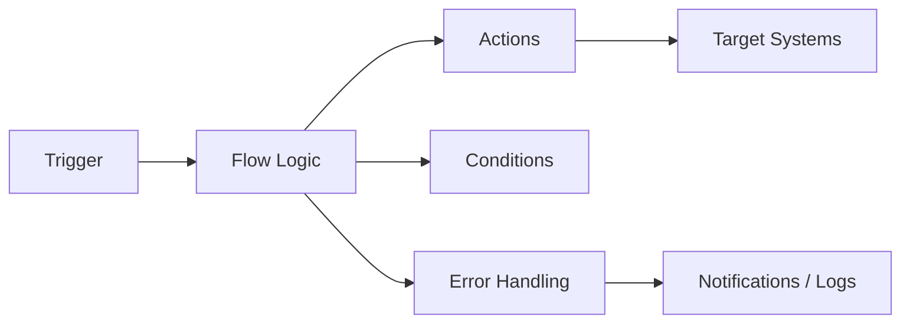
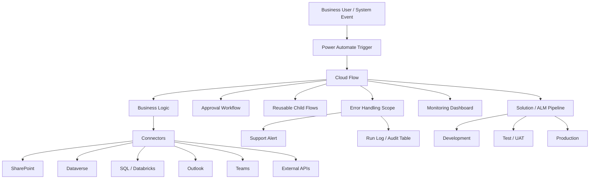
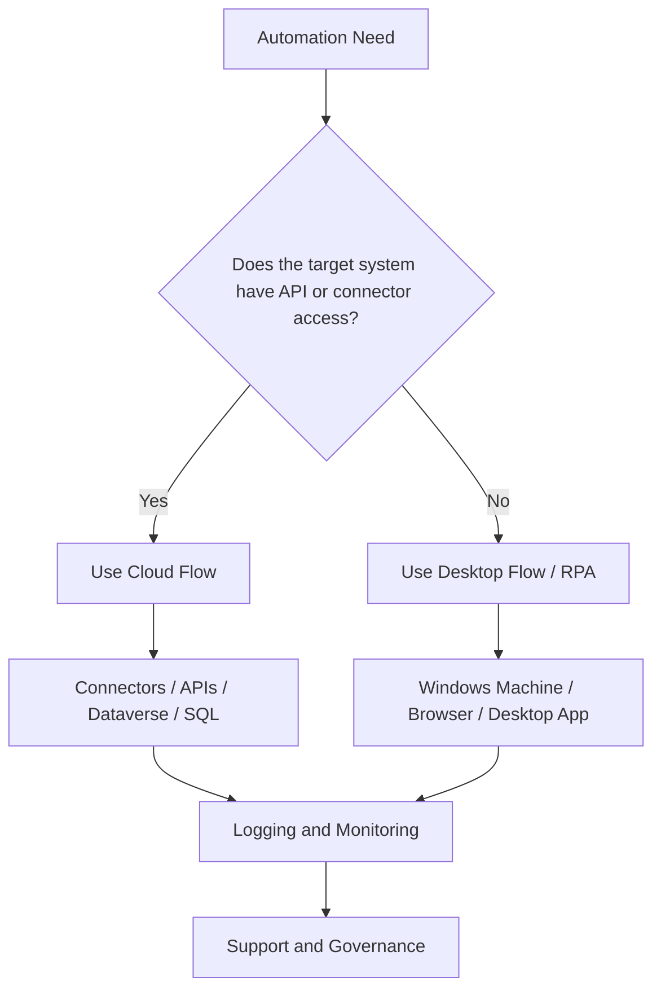

# Power Automate Reference Guide

## 1. Executive Summary

Microsoft Power Automate is a low-code automation platform within Microsoft Power Platform. It helps individuals and organizations automate repetitive tasks, connect systems, orchestrate business processes, trigger approvals, move data between applications, and support intelligent automation at scale.

In plain terms, Power Automate helps teams answer:

* What task is repetitive enough to automate?
* What event should trigger the automation?
* What systems need to exchange data?
* What approvals or decisions are required?
* What should happen if something fails?
* Who owns and supports the automation?
* How do we move the automation safely from development to production?

Power Automate supports several automation patterns, including cloud flows, desktop flows, business process flows, process mining, and AI-assisted automation. Microsoft’s 2026 Power Automate release wave describes the platform as spanning low-code cloud flows, RPA through desktop flows, process mining, and integration with Copilot and Copilot Studio.

For enterprise teams, Power Automate is not just a productivity tool. It is part of a broader automation operating model involving governance, security, ALM, monitoring, ownership, support, and business process improvement.

---

## 2. Plain-English Explanation

Power Automate lets you build “if this happens, then do that” workflows across business systems.

Simple example:

```text
When an email arrives with an attachment,
save the attachment to SharePoint,
send a Teams notification,
create a tracking record,
and notify the requester.
```

A Power Automate flow usually has:

```text
Trigger  ->  Conditions  ->  Actions  ->  Error Handling  ->  Logging / Notification
```

A simple mental model:

```text
Event happens
   ↓
Power Automate wakes up
   ↓
It checks rules and conditions
   ↓
It performs actions across systems
   ↓
It logs the result or alerts someone if it fails
```

Power Automate is useful when the business process is repeatable, rule-driven, and connected to systems that expose connectors, APIs, emails, files, databases, or user interfaces.

---

## 3. Business Context

Power Automate matters because organizations often have many manual, repetitive, and error-prone processes spread across email, Excel, SharePoint, Teams, Dataverse, SQL, APIs, legacy applications, and line-of-business systems.

Common business pain points include:

* Employees copying and pasting between systems
* Manual approvals through email
* Missed follow-ups
* Duplicate data entry
* No audit trail
* Delayed handoffs
* Inconsistent business rules
* Lack of process visibility
* High operational dependency on key individuals

Power Automate helps reduce these problems by creating structured, repeatable workflows.

### Business Value of Power Automate

| Business Need               | How Power Automate Helps                                                      |
| --------------------------- | ----------------------------------------------------------------------------- |
| Reduce manual work          | Automates repetitive tasks and handoffs                                       |
| Improve speed               | Triggers actions immediately or on schedule                                   |
| Improve consistency         | Applies the same business rules every time                                    |
| Improve visibility          | Provides run history, logs, and notifications                                 |
| Improve governance          | Uses environments, solutions, DLP, and ALM                                    |
| Connect systems             | Uses connectors, APIs, Dataverse, SharePoint, SQL, and more                   |
| Support citizen development | Enables business users and technical makers to build automations              |
| Scale automation            | Supports cloud flows, desktop flows, process mining, and managed environments |

### Enterprise View

In an enterprise environment, Power Automate is commonly connected to:

* SharePoint
* Outlook
* Teams
* Dataverse
* Excel
* SQL Server
* Azure SQL
* Databricks SQL endpoints
* Azure DevOps
* ServiceNow
* Salesforce
* UiPath
* APIs
* Power Apps
* Power BI
* Copilot Studio
* On-premises data gateway
* Legacy desktop or web applications through desktop flows

---

## 4. Core Concepts

---

### 4.1 Flow

A **flow** is an automation workflow created in Power Automate.

A flow usually contains:

* One trigger
* One or more actions
* Conditions
* Loops
* Variables
* Error handling
* Notifications
* Logging

Example:

```text
Trigger: When a file is created in SharePoint
Action: Read file metadata
Condition: Is the file type PDF?
Action: Send approval
Action: Update tracking list
```

---

### 4.2 Trigger

A **trigger** starts the flow.

Common trigger types:

| Trigger Type | Example                                   |
| ------------ | ----------------------------------------- |
| Automated    | When an email arrives                     |
| Instant      | Manually trigger a flow                   |
| Scheduled    | Run every day at 8 AM                     |
| HTTP/API     | When an external system sends a request   |
| Dataverse    | When a row is added, modified, or deleted |
| SharePoint   | When an item or file changes              |
| Power Apps   | When a user clicks a button in an app     |

Microsoft describes cloud flows as workflows that connect apps and services and can be triggered by events, such as an email arriving, or by a specific time of day.

---

### 4.3 Action

An **action** is a step that the flow performs after the trigger.

Examples:

* Send an email
* Create a SharePoint item
* Update a Dataverse row
* Call an API
* Start an approval
* Post a Teams message
* Run a child flow
* Execute a SQL query
* Start a desktop flow

---

### 4.4 Connector

A **connector** is a prebuilt integration between Power Automate and another service.

Examples:

* Outlook connector
* SharePoint connector
* Teams connector
* Dataverse connector
* SQL Server connector
* Azure DevOps connector
* HTTP connector
* OneDrive connector

Connectors are powerful, but they also create governance and security concerns because they control how data moves between systems.

---

### 4.5 Connection

A **connection** is the authenticated link between a connector and a user or service account.

Example:

```text
Connector: SharePoint
Connection: automation.service@company.com
```

The connector defines what system is being used.
The connection defines whose credentials are being used.

---

### 4.6 Connection Reference

A **connection reference** is a solution component that points to a connection. In solution-aware apps and flows, operations bind to a connection reference rather than directly to an individual connection, which helps when moving solutions between environments.

Plain-English explanation:

```text
Connection = actual login
Connection reference = reusable pointer to that login
```

Connection references are important for enterprise ALM because they help move flows from development to test to production without rebuilding every connection manually.

---

### 4.7 Environment Variable

An **environment variable** stores values that differ across environments.

Examples:

| Variable             | Dev Value   | Prod Value                 |
| -------------------- | ----------- | -------------------------- |
| SharePoint site URL  | Dev site    | Production site            |
| API base URL         | Test API    | Production API             |
| Notification email   | Dev mailbox | Production support mailbox |
| Dataverse table name | Test table  | Production table           |

Microsoft explains that environment variables support ALM scenarios where the application stays the same while external references differ between source and destination environments.

---

### 4.8 Solution

A **solution** is a package used to group and move Power Platform components.

A solution can include:

* Cloud flows
* Power Apps
* Dataverse tables
* Connection references
* Environment variables
* Security roles
* Custom connectors
* Business process flows

For enterprise work, flows should generally be solution-aware instead of being created as isolated personal flows.

---

### 4.9 Cloud Flow

A **cloud flow** runs in the Power Automate cloud service.

Cloud flows are usually used for:

* Email-based workflows
* SharePoint automation
* Dataverse automation
* Approvals
* Notifications
* API orchestration
* Scheduled jobs
* Data movement between cloud systems

Microsoft groups cloud flow creation around automations triggered automatically, instantly, or on a schedule.

---

### 4.10 Desktop Flow

A **desktop flow** is used for robotic process automation, or RPA.

Desktop flows automate actions on a computer, such as:

* Clicking buttons
* Opening applications
* Reading screens
* Entering data
* Downloading files
* Interacting with legacy systems
* Automating websites or desktop apps

Desktop flows are especially useful when the target application does not have a clean API or connector.

---

### 4.11 Business Process Flow

A **business process flow** guides users through a defined business process. Microsoft describes business process flows as providing a streamlined user experience that leads people through organization-defined processes.

Examples:

* Sales qualification process
* Claims review process
* Customer onboarding process
* Case escalation process
* Compliance review process

Business process flows are more about guiding people than silently automating tasks.

---

### 4.12 Process Mining

**Process mining** helps organizations understand how real processes actually operate and identify opportunities for improvement, automation, and digitalization.

It can help answer:

* Where are the bottlenecks?
* Which steps are repeated unnecessarily?
* Where do exceptions occur?
* Which process variations exist?
* Which tasks are good automation candidates?

---

### 4.13 Approval

An **approval** is a human decision step inside a flow.

Examples:

* Manager approval
* Legal approval
* Finance approval
* Compliance approval
* Exception approval

Approvals are useful when the process should not be fully automated without human judgment.

---

### 4.14 Child Flow

A **child flow** is a reusable flow called by another flow.

Use child flows for:

* Shared logging
* Shared error handling
* Reusable API calls
* Common notification logic
* Standard validation routines

Child flows help reduce duplication and improve maintainability.

---

## 5. Architecture View

### 5.1 Basic Power Automate Architecture



---

### 5.2 Enterprise Power Automate Architecture



---

### 5.3 Cloud Flow vs Desktop Flow Architecture



---

## 6. Data / Process Flow

A Power Automate flow usually follows this process:

```text
1. Trigger occurs
2. Flow starts
3. Input data is captured
4. Variables or configuration values are initialized
5. Data is retrieved from source systems
6. Business rules are applied
7. Actions are performed
8. Exceptions are handled
9. Results are logged
10. Notifications are sent
11. Flow run completes
```

### Example Data Flow

```text
SharePoint item created
   ↓
Power Automate trigger starts
   ↓
Get item details
   ↓
Validate required fields
   ↓
Look up related policy data in SQL
   ↓
If valid, create automation task
   ↓
If invalid, send exception notification
   ↓
Write result to monitoring table
```

---

## 7. Common Use Cases

---

### 7.1 Email Automation

Examples:

* Save attachments from emails
* Route requests from shared mailbox
* Send follow-up reminders
* Generate notification emails
* Parse structured email content

Good fit when:

* Email is a primary intake channel
* Rules are predictable
* Attachments or metadata need to be captured

Poor fit when:

* Email content is highly unstructured
* Decisions require deep judgment
* Attachments vary heavily without standards

---

### 7.2 SharePoint Automation

Examples:

* Trigger flow when item is created
* Update list records
* Route documents for approval
* Move files between libraries
* Track document status

Good fit when:

* SharePoint is used as a business intake or tracking tool
* Lists and libraries are structured
* Permissions are well-managed

---

### 7.3 Approval Workflows

Examples:

* Expense approval
* Contract approval
* Exception approval
* Document review
* Access request approval

Good fit when:

* Human decision-making is required
* Approval history matters
* Escalations are needed

---

### 7.4 Dataverse Automation

Examples:

* Trigger when row changes
* Update related records
* Start approval from model-driven app
* Sync data to another system
* Enforce process rules

Good fit when:

* The business process is built on Power Platform
* Data model and security roles are mature
* Records need auditability

---

### 7.5 Scheduled Jobs

Examples:

* Daily reconciliation
* Weekly report distribution
* Monthly data cleanup
* Hourly status check
* Periodic API pull

Good fit when:

* Timing is predictable
* Batch processing is acceptable
* Volumes are manageable

---

### 7.6 API Orchestration

Examples:

* Call internal APIs
* Submit data to external service
* Retrieve customer or policy information
* Trigger downstream automation
* Integrate with Azure Functions

Good fit when:

* APIs are available
* Authentication is well-defined
* Response handling is predictable

---

### 7.7 Desktop Automation / RPA

Examples:

* Legacy application automation
* Website automation without API
* File download/upload automation
* Repetitive data entry
* Report extraction

Good fit when:

* No API exists
* Manual UI work is stable and repetitive
* Business value justifies RPA fragility

Poor fit when:

* UI changes frequently
* Process volume is very high
* API access can be created instead

---

### 7.8 Intelligent Automation

Examples:

* AI-assisted email triage
* Document extraction
* Sentiment classification
* Summarization
* Human-in-the-loop exception handling
* Copilot-assisted flow creation

Good fit when:

* Rules alone are not enough
* Human review remains in the loop
* Accuracy can be validated
* Data sensitivity is governed

---
