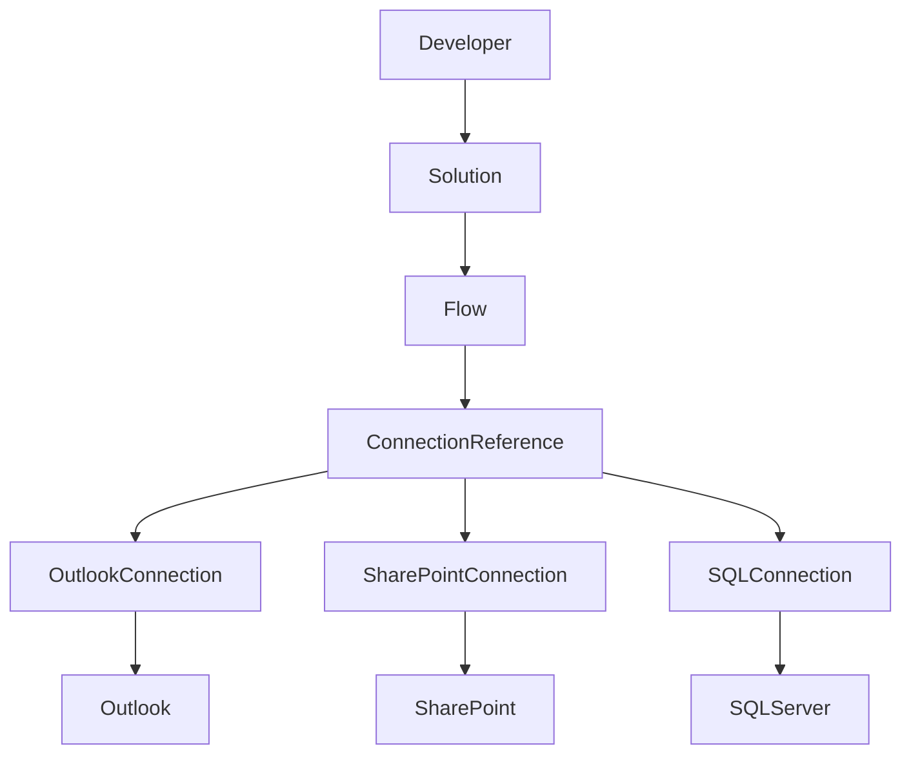
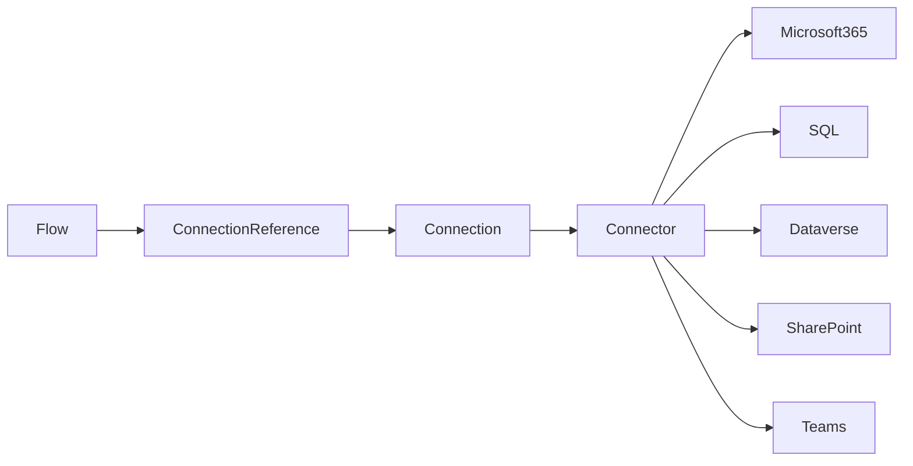
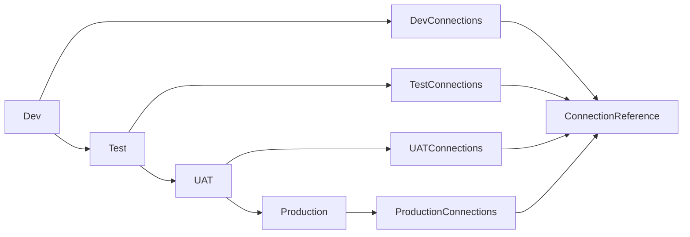
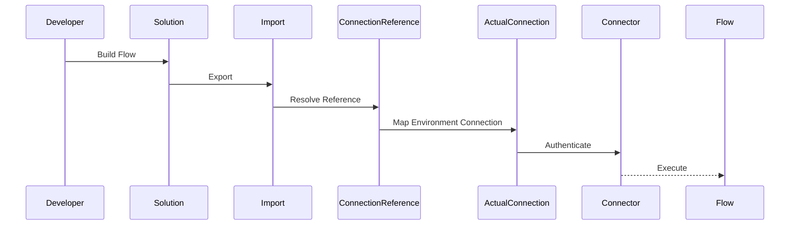
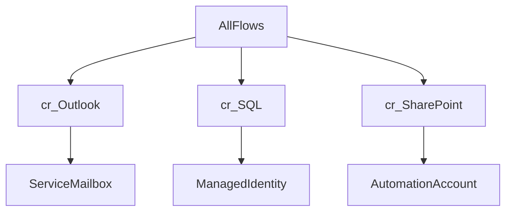

# Updating Connection References in Microsoft Power Platform Solutions
## Enterprise Reference Guide (Beginner → Professional)

**Audience:** Power Platform Developers, Solution Architects, Automation Engineers, Platform Administrators, DevOps Engineers

**Goal:** Learn how connection references work, why they exist, how to update them correctly across environments, and how to build enterprise-ready deployment practices.

---

# Executive Summary

Connection References are one of the most important concepts in modern Power Platform ALM (Application Lifecycle Management).

Instead of every Flow storing its own connection information, a solution stores reusable connection references.

This allows the exact same Flow to run in:

- Development
- Test
- UAT
- Production

without modifying the Flow itself.

Only the connection reference changes.

Think of a connection reference as:

> "A pointer that tells Power Platform which actual account should be used."

Without connection references:

- deployments become manual
- imports fail
- production automations accidentally run using developer credentials
- governance becomes nearly impossible

Enterprise environments rely heavily on connection references because they separate:

- Application Logic
- Authentication
- Environment Configuration

---

# Plain English Explanation

Imagine your Flow sends Outlook emails.

The Flow itself doesn't actually know your Outlook account.

Instead it says:

> "Use Outlook Connection #3"

Power Platform then checks:

```
Outlook Connection #3

↓

Developer Account (Dev)

or

Service Account (Prod)

or

Automation Account (UAT)
```

The Flow never changes.

Only the mapping changes.

That mapping is called a **Connection Reference**.

---

# Why Microsoft Introduced Connection References

Before Solutions:

Flow

↓

Developer Connection

↓

Deployment

↓

Broken

Every imported Flow had to be manually reconnected.

Modern Solutions solve this by introducing an abstraction layer.

```
Flow

↓

Connection Reference

↓

Actual Connection

↓

Microsoft Connector
```

This dramatically improves:

- portability
- governance
- deployment automation
- CI/CD

---

# Business Context

Large organizations may have:

- hundreds of Flows
- multiple developers
- multiple environments
- service accounts
- production automation accounts

Example

```
Developer A

↓

Development

↓

Outlook Connection

Developer Account

----------------------

Production

↓

Outlook Connection

Automation Service Account
```

The Flow is identical.

Only the connection changes.

---

# Core Concepts

| Concept | Description |
|----------|-------------|
| Connection | Actual authenticated account |
| Connector | Outlook, SharePoint, SQL, Dataverse, Teams, etc. |
| Connection Reference | Pointer to a Connection |
| Solution | Deployment package |
| Environment | Dev/Test/UAT/Prod |
| Service Account | Dedicated automation identity |
| Managed Solution | Production deployment package |
| Unmanaged Solution | Development package |

---

# Architecture View



---

# Relationship Diagram



---

# Lifecycle Across Environments



Notice:

The Flow never changes.

Only the Connection changes.

---

# Data / Process Flow



---

# How Updating a Connection Reference Works

Example

Current:

```
Flow

↓

Outlook Connection Reference

↓

John Smith Account
```

Need Production

```
Flow

↓

Outlook Connection Reference

↓

Automation Service Account
```

Steps

1. Import Solution
2. Open Solution
3. Select Connection References
4. Choose Reference
5. Select new Connection
6. Save
7. Publish
8. Test Flow

---

# Common Connectors

| Connector | Typical Production Identity |
|------------|----------------------------|
| Outlook | Service Mailbox |
| SharePoint | Service Account |
| Dataverse | Service Principal |
| SQL | Managed Identity / Service Account |
| Azure Blob | Managed Identity |
| Teams | Service Account |
| OneDrive | Service Account |
| HTTP | Managed Identity where possible |

---

# Enterprise Deployment Example

Environment

Development

```
Developer Outlook
Developer SharePoint
Developer SQL
```

UAT

```
Automation Outlook
Automation SharePoint
Automation SQL
```

Production

```
Production Automation Account
```

Same Flow.

Different connections.

---

# Deployment Process


Export Solution

↓

Import Solution

↓

Resolve Connection References

↓

Assign Environment Variables

↓

Publish

↓

Enable Flows

↓

Validate

↓

Release
```

---

# Environment Variables vs Connection References

| Environment Variables | Connection References |
|----------------------|-----------------------|
| Store configuration | Store authentication |
| URLs | Accounts |
| API Keys | Connector Identity |
| IDs | Connection Mapping |

Use both together.

---

# Typical Enterprise Solution

```
Solution

│

├── Cloud Flow

├── Power App

├── Tables

├── Environment Variables

├── Connection References

├── Custom Connector

└── Security Roles
```

---

# Common Use Cases

## SQL Migration

Development

Developer SQL Login

↓

Production

Managed Identity

---

## SharePoint

Development

Developer Site

↓

Production

Automation Site

---

## Outlook

Development

Developer Mailbox

↓

Production

Shared Mailbox

---

## Dataverse

Development

Personal Account

↓

Production

Service Principal

---

# Best Practices

## Always

✅ Use Solutions

✅ Use Connection References

✅ Use Environment Variables

✅ Use Service Accounts

✅ Document each reference

✅ Standard naming

Example

```
cr_Outlook

cr_SQL

cr_SharePoint

cr_Dataverse
```

---

## Never

❌ Personal production accounts

❌ Hardcoded URLs

❌ Hardcoded credentials

❌ Manual Flow recreation

❌ Duplicate references

---

# Naming Standards

Good

```
cr_Outlook

cr_SQLClaims

cr_SQLPolicy

cr_SharePointIA

cr_DataverseCore
```

Bad

```
Connection1

New Connection

John Connection

Flow Connection
```

---

# Updating Connection References During Import

During Solution Import

Power Platform asks:

```
Connection Reference

↓

Choose Existing Connection

or

Create New Connection
```

This is where Production credentials are assigned.

---

# Common Mistakes

## Mistake 1

Using personal accounts in Production.

Result

Developer leaves company.

Everything fails.

---

## Mistake 2

Multiple Outlook references

```
cr_Outlook1

cr_Outlook2

cr_Outlook3
```

Nobody knows which Flow uses which.

---

## Mistake 3

One reference per Flow

Instead

Reuse references.

---

## Mistake 4

Editing Production Flow directly

Always

Dev

↓

Test

↓

Production

---

## Mistake 5

Not documenting connection ownership.

---

# Troubleshooting

| Symptom | Likely Cause | Resolution |
|----------|-------------|------------|
| Flow won't enable | Missing connection | Reassign connection reference |
| Import fails | Missing connector | Install connector |
| Authentication error | Expired credentials | Reauthenticate connection |
| Access denied | Service account lacks permissions | Grant connector permissions |
| Wrong mailbox | Wrong connection mapped | Update connection reference |

---

# Governance

Large organizations should maintain:

## Connection Inventory

| Reference | Owner | Connector | Environment |
|------------|-------|-----------|-------------|

---

## Service Account Register

| Service Account | Purpose | Expiration | Owner |

---

## Connection Review

Quarterly

Review

- expired credentials
- orphaned references
- unused connections

---

# Security Considerations

Prefer

Managed Identity

↓

Service Principal

↓

Service Account

↓

Personal Account

Least preferred.

---

# Continuous Improvement Checklist

- Review unused references
- Standardize names
- Remove duplicates
- Rotate credentials
- Document ownership
- Automate deployments
- Validate imports
- Monitor failures

---

# Development Lifecycle

```mermaid
flowchart LR

Requirements

↓

Development

↓

Connection References

↓

Environment Variables

↓

Testing

↓

Export

↓

CI/CD

↓

Production

↓

Monitoring
```

---

# CI/CD Integration

Azure DevOps or GitHub Actions

```
Build

↓

Export Solution

↓

Import Solution

↓

Assign Environment Variables

↓

Resolve Connection References

↓

Publish

↓

Smoke Test

↓

Release
```

---

# Framework

```
Authentication

↓

Connection

↓

Connection Reference

↓

Flow

↓

Solution

↓

Environment

↓

Deployment

↓

Monitoring
```

---

# Recommended Tools

| Tool | Purpose |
|------|----------|
| Power Platform Admin Center | Environment management |
| Power Automate | Cloud Flows |
| Power Apps | Solutions |
| Azure DevOps | CI/CD |
| GitHub | Source Control |
| PAC CLI | Automation |
| Solution Checker | Best Practices |
| CoE Toolkit | Governance |

---

# Quick Reference

## Where to Update

Solutions

↓

Connection References

↓

Select Reference

↓

Edit Connection

↓

Save

↓

Publish

---

## Import Order

1. Environment
2. Solution
3. Connection References
4. Environment Variables
5. Publish
6. Enable Flows
7. Validate

---

# Example Enterprise Scenario

## Business Problem

Your department has:

- 25 Power Automate Flows
- SQL
- SharePoint
- Outlook
- Dataverse

The developer leaves.

Production fails because every Flow uses the developer's Outlook account.

---

## Better Architecture



When the developer leaves...

Nothing changes.

Only the connection references remain mapped to enterprise-owned identities.

---

## Step-by-Step Migration

1. Inventory all flows and connectors.
2. Create or identify enterprise service accounts or managed identities.
3. Add all flows, apps, and related components to a managed Solution.
4. Create standardized connection references (for example, `cr_Outlook`, `cr_SharePointIA`, `cr_SQLClaims`).
5. Update each flow to use the standardized connection references.
6. Configure environment variables for URLs, site names, and other environment-specific values.
7. Export the solution and import it into Test/UAT.
8. During import, map each connection reference to the correct environment-specific connection.
9. Execute smoke tests and end-to-end validation.
10. Promote to Production through the CI/CD pipeline and monitor for authentication or permission issues.

---

# Meeting Talking Points

## Questions to Ask

- Which service accounts own our production connections?
- Do all production solutions use connection references?
- Are any flows still using personal developer accounts?
- How are connection references updated during CI/CD?
- Who owns credential rotation?
- Are environment variables standardized across environments?
- How do we audit unused or orphaned connection references?
- Can we automate connection assignment using PAC CLI or deployment pipelines?
- Are managed identities or service principals available for supported connectors?
- What is our rollback strategy if a deployment changes connection mappings incorrectly?

---

# Beginner-to-Pro Learning Path

## Level 1 – Foundations

- Understand connectors versus connections.
- Learn why Solutions are required.
- Create a simple flow that uses a connection reference.

## Level 2 – Intermediate

- Work with environment variables.
- Import and export managed and unmanaged solutions.
- Update connection references after deployment.

## Level 3 – Advanced

- Implement Azure DevOps or GitHub Actions deployment pipelines.
- Use Power Platform CLI (PAC CLI) for automation.
- Manage authentication with service principals and managed identities where supported.
- Design reusable enterprise solution architectures.

## Level 4 – Expert

- Define organization-wide naming and governance standards.
- Build reusable deployment templates.
- Automate environment provisioning and validation.
- Establish monitoring, credential rotation, and compliance processes.

---

# Repository Placement

```text
power-platform/
│
├── README.md
├── solutions/
│   ├── connection-references.md
│   ├── environment-variables.md
│   ├── managed-vs-unmanaged.md
│   ├── solution-layering.md
│   ├── deployment-pipelines.md
│   └── pac-cli.md
│
├── governance/
│   ├── naming-standards.md
│   ├── service-accounts.md
│   └── alm-checklists.md
│
├── diagrams/
│   ├── connection-reference-architecture.mmd
│   └── deployment-flow.mmd
│
└── templates/
    ├── connection-inventory.md
    ├── deployment-checklist.md
    └── solution-review.md
```

---

# Reusable Templates

## Connection Reference Inventory

| Reference | Connector | Environment | Owner | Service Account | Status |
|-----------|-----------|-------------|-------|-----------------|--------|
| cr_Outlook | Outlook | Production | IA Team | ia-prod-mailbox | Active |
| cr_SQLClaims | SQL Server | Production | Data Team | SQL Managed Identity | Active |
| cr_SharePointIA | SharePoint | UAT | Platform Team | ia-uat-service | Active |

---

## Deployment Checklist

- [ ] Solution exported from source environment
- [ ] Managed solution created for production
- [ ] Environment variables configured
- [ ] Connection references mapped
- [ ] Service accounts validated
- [ ] Required permissions confirmed
- [ ] Smoke tests completed
- [ ] End-to-end business tests completed
- [ ] Monitoring enabled
- [ ] Deployment documentation updated

---

## Solution Review Checklist

- [ ] All connectors use connection references
- [ ] No personal accounts in Production
- [ ] Standard naming conventions followed
- [ ] Environment variables externalize configuration
- [ ] Documentation is current
- [ ] Security review completed
- [ ] Credential ownership documented
- [ ] Rollback plan documented

---

# Final Mental Model

Think of a Power Platform solution as a modern enterprise application with clear separation of responsibilities:

```text
Business Logic
        │
        ▼
Cloud Flow / Power App
        │
        ▼
Connection Reference
        │
        ▼
Environment-Specific Connection
        │
        ▼
Enterprise Service Account or Managed Identity
        │
        ▼
Microsoft Connector
        │
        ▼
Business System
```

The application logic should never know *who* is authenticated. It should only know *which connection reference* to use. By separating logic from authentication and environment-specific configuration, organizations achieve repeatable deployments, stronger governance, reduced operational risk, and a scalable Application Lifecycle Management (ALM) practice.
