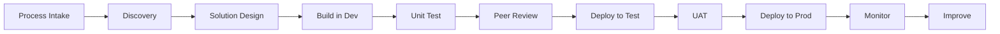

# Power Automate Lifecycle, Frameworks, and Reference

## 13. Development Lifecycle

A mature Power Automate lifecycle follows this flow:



---

### 13.1 Lifecycle Stages

| Stage     | Activity                                              |
| --------- | ----------------------------------------------------- |
| Intake    | Capture automation idea and business problem          |
| Discovery | Map process, systems, rules, exceptions               |
| Design    | Define architecture, ownership, security, data flow   |
| Build     | Create solution-aware flow in dev                     |
| Test      | Validate happy path, exceptions, permissions, volume  |
| Review    | Peer review logic, naming, governance, error handling |
| Deploy    | Move through solution pipeline                        |
| Monitor   | Track run history, failures, alerts, volume           |
| Improve   | Tune, refactor, retire, or scale                      |

---

### 13.2 ALM and Pipelines

Power Platform ALM covers governance, development, and maintenance. Microsoft defines ALM as including disciplines such as requirements management, software architecture, development, testing, maintenance, change management, deployment, release management, and governance.

Power Platform pipelines bring ALM automation and CI/CD capabilities into the service in a way intended to be approachable for makers, admins, and developers.

Recommended enterprise flow:

```text
Development Solution
   ↓
Export / Pipeline
   ↓
Test Environment
   ↓
UAT Approval
   ↓
Managed Solution Import
   ↓
Production Environment
```

---

## 14. Frameworks

---

### 14.1 Automation Suitability Framework

Use this to decide whether Power Automate is a good fit.

| Question                        | Good Candidate | Poor Candidate    |
| ------------------------------- | -------------- | ----------------- |
| Is the process repeatable?      | Yes            | No                |
| Are rules clear?                | Yes            | No                |
| Are systems accessible?         | Yes            | No                |
| Is volume manageable?           | Yes            | Unknown / extreme |
| Are exceptions understood?      | Yes            | No                |
| Is ownership clear?             | Yes            | No                |
| Is data sensitivity manageable? | Yes            | No                |
| Is business value measurable?   | Yes            | No                |

---

### 14.2 Cloud Flow vs Desktop Flow Decision Framework

| Question                        | Prefer Cloud Flow | Prefer Desktop Flow          |
| ------------------------------- | ----------------- | ---------------------------- |
| Is there an API or connector?   | Yes               | No                           |
| Is the system web/desktop only? | No                | Yes                          |
| Does UI change often?           | Cloud preferred   | Desktop risky                |
| Is high volume required?        | Cloud preferred   | Desktop may struggle         |
| Is the process screen-based?    | Not ideal         | Better fit                   |
| Is unattended execution needed? | Possible          | Requires RPA setup/licensing |

---

### 14.3 Human-in-the-Loop Framework

Use human approval when:

* Decision has financial risk
* Legal/compliance judgment is needed
* AI output needs validation
* Exception is ambiguous
* Data quality is poor
* Customer impact is high

Automation should assist judgment, not blindly replace it where risk is high.

---

### 14.4 Error Handling Framework

Recommended pattern:

```text
Scope: Initialize
Scope: Try
Scope: Catch
Scope: Finally
```

Catch scope should:

* Capture error
* Log run details
* Notify support
* Mark business record as failed
* Provide enough context to retry safely

---

### 14.5 Monitoring Framework

Monitor at four levels:

| Level               | What to Monitor                           |
| ------------------- | ----------------------------------------- |
| Flow health         | Success, failure, duration                |
| Business outcome    | Records processed, approvals completed    |
| Dependency health   | API failures, SharePoint/Dataverse issues |
| Operational support | Alerts, retries, unresolved exceptions    |

---

## 15. Tools

### 15.1 Core Power Automate Tools

| Tool                        | Purpose                                  |
| --------------------------- | ---------------------------------------- |
| Power Automate portal       | Create and manage flows                  |
| Power Platform Admin Center | Manage environments, policies, analytics |
| Power Automate Desktop      | Build desktop/RPA flows                  |
| Solutions                   | Package and deploy components            |
| Environment variables       | Manage environment-specific values       |
| Connection references       | Manage connections across environments   |
| Approvals                   | Human approval workflows                 |
| Process mining              | Discover and analyze business processes  |

---

### 15.2 Supporting Microsoft Tools

| Tool                   | Purpose                                    |
| ---------------------- | ------------------------------------------ |
| Power Apps             | Build user interfaces for workflows        |
| Dataverse              | Secure structured data platform            |
| SharePoint             | Lists, files, intake, lightweight tracking |
| Teams                  | Notifications and collaboration            |
| Outlook                | Email-based automation                     |
| Power BI               | Monitoring and reporting                   |
| Azure DevOps           | Work tracking and CI/CD                    |
| Azure Functions        | Custom code extensions                     |
| Azure Key Vault        | Secret management                          |
| SQL Server / Azure SQL | Structured data source                     |
| Databricks             | Enterprise data platform                   |
| Copilot Studio         | Conversational and agent experiences       |

---

## 16. Quick Reference

---

### 16.1 Flow Types

| Flow Type             | Use When                                       |
| --------------------- | ---------------------------------------------- |
| Automated cloud flow  | Something should happen after an event         |
| Instant cloud flow    | A user manually starts the flow                |
| Scheduled cloud flow  | The flow runs at a specific time or frequency  |
| Desktop flow          | UI automation is needed                        |
| Business process flow | Users need guided process stages               |
| Child flow            | Reusable logic should be called by other flows |

---

### 16.2 Common Building Blocks

| Component            | Purpose                        |
| -------------------- | ------------------------------ |
| Trigger              | Starts the flow                |
| Action               | Performs work                  |
| Condition            | Branches logic                 |
| Switch               | Handles multiple cases         |
| Apply to each        | Loops through records          |
| Scope                | Groups actions                 |
| Variable             | Stores temporary value         |
| Compose              | Stores expression output       |
| Parse JSON           | Structures API response        |
| Delay                | Waits before continuing        |
| Approval             | Gets human decision            |
| Connection reference | Points to connector connection |
| Environment variable | Stores configurable value      |

---

### 16.3 Common Expressions

| Need               | Expression Pattern                       |
| ------------------ | ---------------------------------------- |
| Current time       | `utcNow()`                               |
| Empty check        | `empty(value)`                           |
| Null fallback      | `coalesce(value, 'fallback')`            |
| Convert to string  | `string(value)`                          |
| Convert to integer | `int(value)`                             |
| Get first item     | `first(array)`                           |
| Get length         | `length(array)`                          |
| Format date        | `formatDateTime(utcNow(), 'yyyy-MM-dd')` |
| Check contains     | `contains(text, 'value')`                |

---

### 16.4 Common Design Rules

```text
Use solutions for production.
Use connection references.
Use environment variables.
Use service accounts carefully.
Use trigger conditions.
Use error handling scopes.
Log important runs.
Avoid giant flows.
Avoid hardcoded values.
Avoid personal ownership.
Monitor after deployment.
```

---

## 17. Meeting Talking Points

Use these when discussing Power Automate with stakeholders, engineers, managers, governance teams, or business owners.

---

### 17.1 Process Discovery Questions

* What business problem are we solving?
* What triggers the process today?
* What are the inputs and outputs?
* What systems are involved?
* What decisions are rule-based?
* What decisions require human judgment?
* What exceptions happen most often?
* What is the expected volume?
* What is the SLA?
* Who owns the process?

---

### 17.2 Architecture Questions

* Should this be a cloud flow, desktop flow, or API-based solution?
* Are connectors available for all systems?
* Do we need an on-premises data gateway?
* Should we use Dataverse, SharePoint, SQL, or another data store?
* Do we need child flows?
* How will errors be logged?
* How will retries be handled?
* What happens if a downstream system is unavailable?

---

### 17.3 Governance Questions

* Which environment should this live in?
* Is the flow solution-aware?
* Are connection references used?
* Are environment variables used?
* Does a DLP policy allow these connectors together?
* Who owns the flow?
* Who supports it after hours?
* What is the rollback plan?
* What licensing is required?
* Is production monitoring in place?

---

### 17.4 Data and AI Questions

* What data does the flow read?
* What data does the flow write?
* Is any sensitive data involved?
* Is AI being used for classification, extraction, or generation?
* Does AI output require human review?
* Is there a validation layer?
* Are decisions auditable?
* Are prompts or AI outputs logged safely?

---
