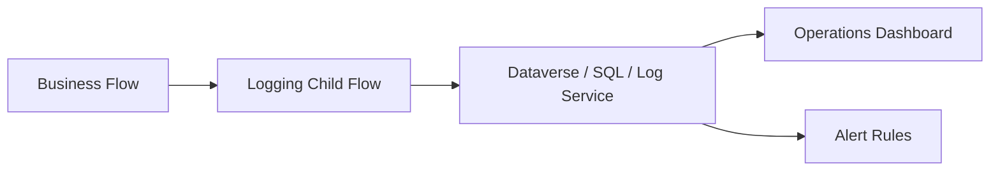
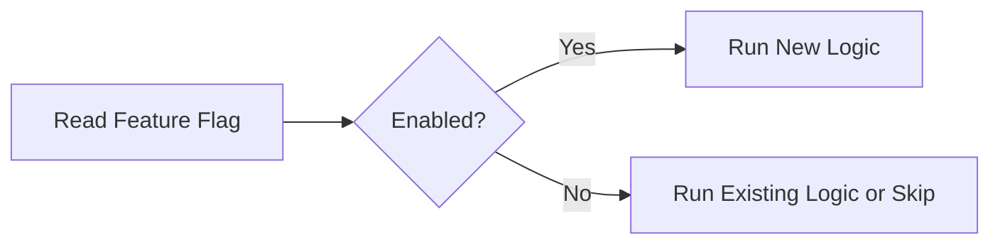
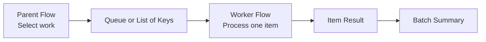
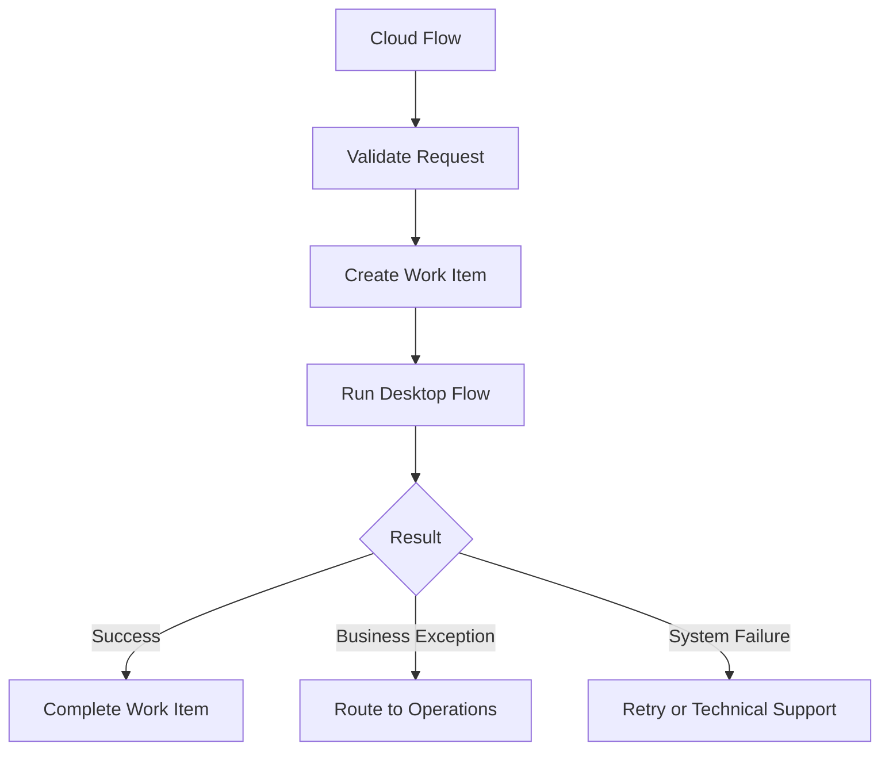
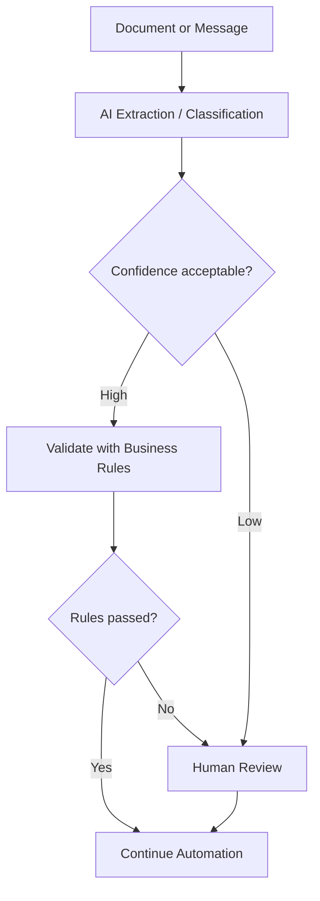

# Pattern 19: Logging and Telemetry

**Use when:** a production flow requires support, reporting, auditability, or performance analysis.

## Three Telemetry Levels

| Level              | Purpose                | Example            |
| ------------------ | ---------------------- | ------------------ |
| Run                | Overall flow execution | Auto Renewal batch |
| Transaction        | One business item      | One policy         |
| Step or dependency | External call or stage | PDF API call       |

## Recommended Run Fields

```text
flowName
flowVersion
environment
correlationId
runId
triggerType
startUtc
endUtc
durationSeconds
status
recordsAttempted
recordsSucceeded
businessExceptions
systemFailures
retryCount
```

## Recommended Transaction Fields

```text
transactionId
correlationId
businessKey
automationName
processStage
status
outcomeCode
outcomeMessage
attemptCount
sourceSystem
targetSystem
createdUtc
completedUtc
durationSeconds
```

## Telemetry Pattern



## Business Versus Technical Metrics

| Business Metric                  | Technical Metric  |
| -------------------------------- | ----------------- |
| Notices created                  | Flow runs         |
| Policies processed               | Connector calls   |
| Hours saved                      | Average duration  |
| Exceptions requiring review      | HTTP failures     |
| Straight-through processing rate | Retry count       |
| Customer communications sent     | API response time |

Do not rely solely on the native run-history interface as the long-term operational reporting system for critical workloads.

---

# Pattern 20: Alert Routing

**Use when:** failures require action from different teams.

## Alert Classification

| Alert Type                   | Owner                  |
| ---------------------------- | ---------------------- |
| Missing business data        | Business operations    |
| Connection failure           | Platform support       |
| API authentication           | Integration support    |
| Databricks freshness failure | Data engineering       |
| Document generation failure  | Document service owner |
| Customer email failure       | Automation operations  |
| Repeated throttling          | Platform architect     |
| Deployment issue             | DevOps or ALM owner    |

## Alert Content

Include:

* environment
* workload
* correlation ID
* business key
* outcome code
* sanitized summary
* retry status
* owner
* support priority
* run or dashboard reference

Avoid including:

* access tokens
* passwords
* full sensitive payloads
* confidential attachments
* unnecessary personal information

## Avoid Alert Fatigue

Do not send one email for every repeated infrastructure failure.

Consider:

* aggregation window
* threshold-based alerts
* one incident per correlation group
* suppression during known maintenance
* escalation after repeated failures
* recovery notification

---

# Pattern 21: Secure Inputs and Outputs

**Use when:** an action handles sensitive values that should not be visible in run-history inputs or outputs.

Power Automate provides Secure Inputs and Secure Outputs settings. Hardcoding credentials or sensitive values in actions can expose them to people who can inspect flow definitions or run histories.

## Use Secure Settings For

* secrets retrieved from a secure store
* tokens
* passwords
* confidential identifiers
* sensitive request payloads
* protected API responses
* desktop-flow credential values

## Important Limitation

Secure Inputs and Outputs reduce visibility in run history, but they are not a replacement for:

* correct access control
* secure secret storage
* least privilege
* DLP policies
* data classification
* retention controls

## Security Checklist

* [ ] No secrets hardcoded in flow actions.
* [ ] Production uses enterprise-owned identities.
* [ ] Secure Inputs/Outputs enabled where required.
* [ ] Logs contain only necessary data.
* [ ] Owners have appropriate access.
* [ ] DLP policies allow the connector combination.
* [ ] HTTP endpoints are approved.
* [ ] Test payloads contain no real sensitive data.
* [ ] Flow sharing is reviewed.
* [ ] Connection ownership is documented.

---

# Pattern 22: Feature Flag

**Use when:** a capability should be enabled or disabled without modifying the flow.

## Examples

```text
EnableDocumentGeneration
EnableCustomerEmail
EnableNewRateCalculation
UseNewDatabricksEndpoint
RouteFailuresToNewQueue
```

## Pattern



## Feature Flag Record

| Field         | Example                    |
| ------------- | -------------------------- |
| Name          | `EnableNewRateCalculation` |
| Environment   | `Production`               |
| Enabled       | `false`                    |
| Owner         | Pricing Automation Team    |
| Expiration    | `2026-08-31`               |
| Reason        | Controlled rollout         |
| Last reviewed | `2026-07-11`               |

Temporary flags should have:

* owner
* purpose
* removal date
* default behavior
* testing coverage

Do not leave old feature branches inside flows indefinitely.

---

# Pattern 23: Parent Flow and Worker Flow

**Use when:** a scheduled process retrieves many items but each item should be handled independently.

## Pattern



## Parent Responsibilities

* establish batch ID
* select eligible work
* avoid duplicates
* submit item keys
* monitor completion
* produce summary

## Worker Responsibilities

* process one business item
* validate current state
* operate idempotently
* record item outcome
* retry safely
* return stable response

This is often easier to support than one large `Apply to each` containing the entire business process.

---

# Pattern 24: Desktop Flow Orchestration

**Use when:** a cloud flow launches Power Automate for desktop or another UI automation.

## Pattern



## Cloud Flow Responsibilities

* validate request
* provide secure inputs
* allocate transaction ID
* call desktop flow
* enforce timeout expectations
* classify response
* record telemetry
* route exception

## Desktop Flow Responsibilities

* validate application state
* handle UI element failures
* return structured outputs
* avoid exposing credentials
* capture useful but safe diagnostics
* distinguish business and technical exceptions

## Desktop Output Contract

```json
{
  "success": false,
  "status": "BusinessException",
  "code": "POLICY_NOT_FOUND",
  "message": "No policy matched the supplied reference.",
  "retryable": false,
  "applicationReference": "",
  "screenshotReference": ""
}
```

---

# Pattern 25: AI-Assisted Processing With Human Review

**Use when:** AI extracts, classifies, summarizes, or recommends, but uncertainty must be controlled.

## Pattern



## Required Controls

* define approved use case
* validate input format
* capture model or prompt version where relevant
* set confidence threshold
* verify critical values
* create human-review path
* prevent unsupported autonomous decisions
* log outcome without exposing sensitive content
* monitor false positives and false negatives
* define fallback behavior

Preview or experimental AI capabilities should not be treated as production-ready without explicit organizational approval and validation.

---
