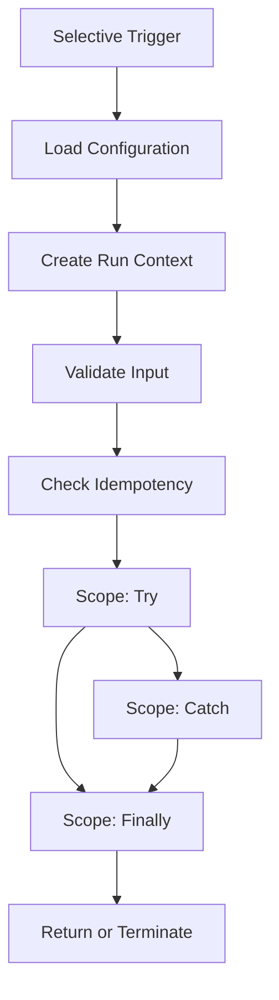
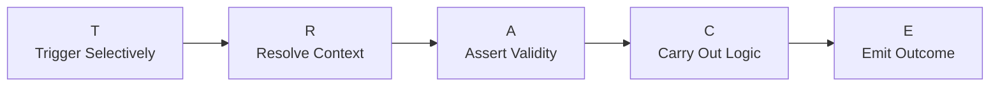
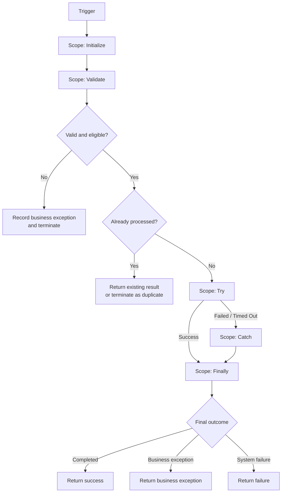

# Power Automate — Repeatable Solution Patterns

---


> A reusable pattern library for designing reliable, scalable, observable, secure, and maintainable Power Automate cloud flows.
>
> Each pattern explains when to use it, how it works, the main building blocks, common risks, and how it fits into an enterprise delivery model.

---

# Quick Mental Model

A production-ready Power Automate solution is not simply:

```text
Trigger
    ↓
Actions
```

It is a controlled workflow with:

```text
Selective Trigger
    ↓
Configuration and Context
    ↓
Input Validation
    ↓
Duplicate Protection
    ↓
Business Logic
    ↓
Error Handling and Recovery
    ↓
Telemetry
    ↓
Explicit Outcome
```



The main principle is:

> A flow is not complete when the happy path works. It is complete when it behaves predictably during success, failure, retry, duplicate delivery, timeout, and support investigation.

---

# Reusable TRACE Pattern

Use the **TRACE pattern** as the default structure for production cloud flows.

| Step                        | Meaning                                     | Main Responsibility                               |
| --------------------------- | ------------------------------------------- | ------------------------------------------------- |
| **T — Trigger Selectively** | Start only when required                    | Trigger conditions, source filtering, recurrence  |
| **R — Resolve Context**     | Load configuration and identify the run     | Environment variables, correlation ID, timestamps |
| **A — Assert Validity**     | Validate inputs and prevent duplicate work  | Guard clauses, schema checks, idempotency         |
| **C — Carry Out Logic**     | Execute the business process safely         | Try/Catch/Finally, child flows, retry policies    |
| **E — Emit Outcome**        | Log, notify, respond, and terminate clearly | Telemetry, status, response contract, alerts      |



## TRACE Parent Flow Structure

```text
Trigger

Scope: Initialize
├── Read configuration
├── Generate correlation ID
├── Record start time
└── Normalize trigger values

Scope: Validate
├── Validate required values
├── Validate business eligibility
├── Check duplicate-processing store
└── Terminate or return when invalid

Scope: Try
├── Call reusable child flows
├── Read or update business systems
├── Generate documents
├── Send communications
└── Record business result

Scope: Catch
├── Inspect Try results
├── Classify error
├── Create technical exception
├── Notify support when required
└── Set failed outcome

Scope: Finally
├── Calculate duration
├── Write run telemetry
├── Update control record
└── Release temporary resources

Response or Terminate
```

## TRACE Skeleton Diagram



---

# Anatomy of a Well-Built Flow

## Standard Flow Sections

| Section               | Purpose                                            |
| --------------------- | -------------------------------------------------- |
| Trigger               | Starts the workflow only when required             |
| Initialize            | Establishes configuration and run context          |
| Validate              | Stops invalid or ineligible requests early         |
| Idempotency           | Prevents repeated business effects                 |
| Try                   | Contains primary business logic                    |
| Catch                 | Handles failed, skipped, or timed-out actions      |
| Finally               | Executes logging and cleanup regardless of outcome |
| Response or Terminate | Produces an explicit final status                  |

## Recommended Flow Variables

Avoid creating variables without a clear purpose. Common run-level values include:

| Variable             | Example Purpose                                     |
| -------------------- | --------------------------------------------------- |
| `varCorrelationId`   | Trace one transaction across systems                |
| `varFlowStartUtc`    | Calculate duration                                  |
| `varOutcomeStatus`   | Completed, failed, duplicate, or business exception |
| `varOutcomeCode`     | Stable machine-readable result                      |
| `varOutcomeMessage`  | Human-readable summary                              |
| `varBusinessKey`     | Policy ID, transaction ID, or request ID            |
| `varRetryable`       | Whether the failure can safely be retried           |
| `varEnvironmentName` | Development, test, UAT, or production               |

Prefer Compose actions over variables for values that do not change.

---

# Standard Outcome Model

Every reusable flow should return or record a predictable result.

## Recommended Status Categories

| Status               | Meaning                                                                       |
| -------------------- | ----------------------------------------------------------------------------- |
| `Succeeded`          | Processing completed as intended                                              |
| `BusinessException`  | Request was valid technically but could not be processed under business rules |
| `SystemFailure`      | A technical system, connection, timeout, or connector failure occurred        |
| `Duplicate`          | The request was already processed                                             |
| `Rejected`           | Input failed initial validation                                               |
| `Pending`            | Processing has not completed                                                  |
| `PartiallySucceeded` | Some independent operations succeeded and others failed                       |

## Reusable Response Contract

```json
{
  "success": true,
  "status": "Succeeded",
  "code": "RENEWAL_NOTICE_CREATED",
  "message": "The renewal notice was generated and sent.",
  "correlationId": "c1d98f76-2d35-4479-82f6-6dcd866b0132",
  "businessKey": "POL-100482",
  "retryable": false,
  "completedAtUtc": "2026-07-11T20:15:32Z",
  "data": {
    "documentId": "DOC-88271",
    "notificationId": "MSG-62882"
  }
}
```

## Standard Failure Contract

```json
{
  "success": false,
  "status": "SystemFailure",
  "code": "DOCUMENT_API_TIMEOUT",
  "message": "The document generation service did not respond before the timeout.",
  "correlationId": "c1d98f76-2d35-4479-82f6-6dcd866b0132",
  "businessKey": "POL-100482",
  "retryable": true,
  "completedAtUtc": "2026-07-11T20:16:14Z",
  "data": {}
}
```

Stable response contracts make parent flows, APIs, dashboards, and support processes easier to maintain.

---
