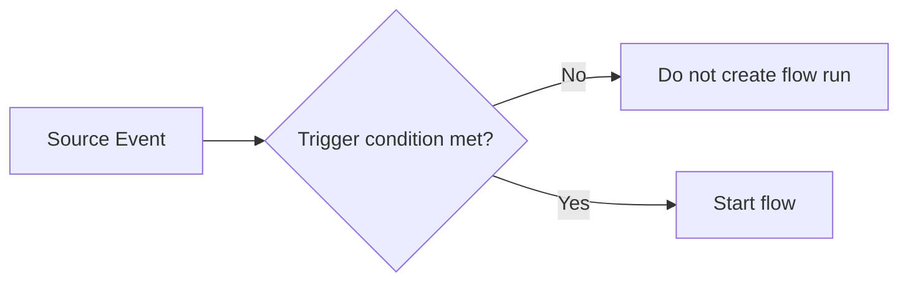
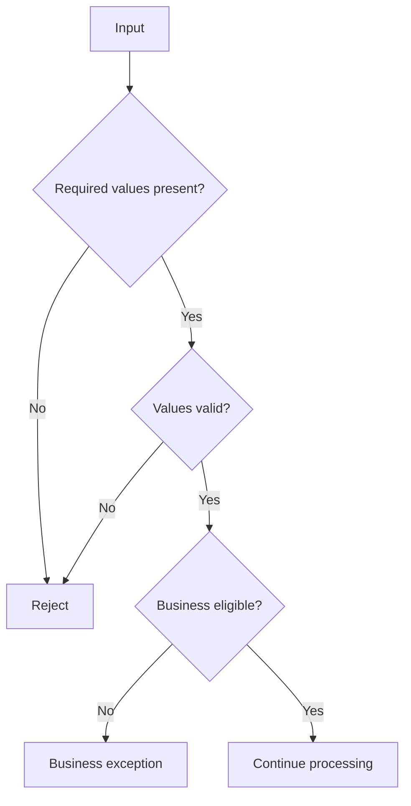
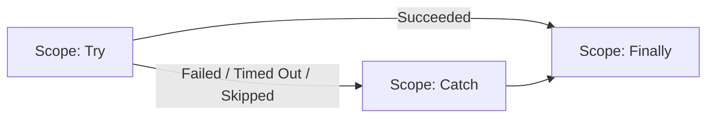
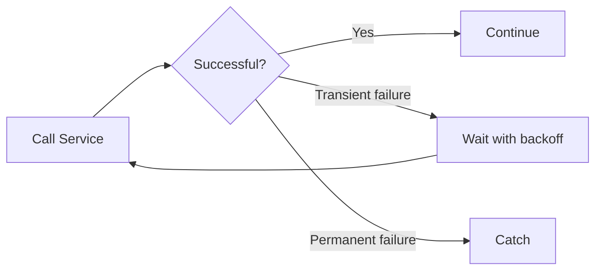
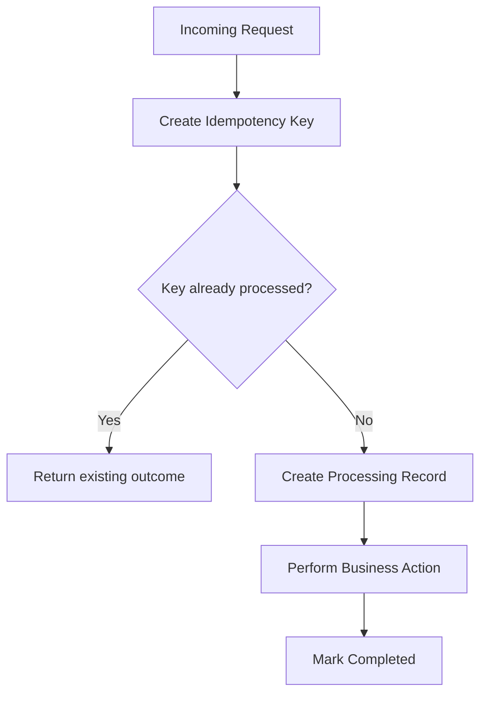
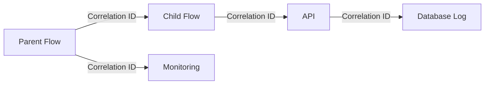

# Pattern 1: Selective Trigger

**Use when:** a trigger source generates more events than the flow should process.

Examples:

* SharePoint item changes
* Dataverse row updates
* email arrival
* file creation
* scheduled processing
* HTTP webhook delivery

Trigger conditions reduce unnecessary flow runs and Power Platform request consumption by preventing the flow from starting when the conditions are not met.

## Pattern



## Example Trigger Condition

Start only when status becomes ready:

```text
@equals(triggerBody()?['status'], 'Ready')
```

Start only when required fields are present:

```text
@and(
    not(empty(triggerBody()?['policyId'])),
    not(empty(triggerBody()?['recipientEmail']))
)
```

## Dataverse Trigger Optimization

Where supported, configure:

* change type
* table
* scope
* filter rows
* select columns
* trigger conditions

Dataverse can evaluate the trigger after each qualifying row update, including repeated updates, so filtering and duplicate protection remain important.

## Avoid

```text
Trigger every update
    ↓
Start flow
    ↓
Check condition
    ↓
Terminate most runs
```

Prefer:

```text
Trigger condition
    ↓
Create a run only when needed
```

---

# Pattern 2: Guard Clauses and Early Termination

**Use when:** requests may be invalid, incomplete, ineligible, or unnecessary.

Guard clauses evaluate requirements before expensive processing begins.

## Pattern



## Example Validation Checks

* required ID exists
* email address is populated
* amount is non-negative
* status is approved
* effective date is valid
* source record still exists
* requesting user is authorized
* document type is supported
* transaction has not already completed

## Common Expressions

Required value:

```text
not(empty(triggerBody()?['policyId']))
```

Allowed value:

```text
contains(
    createArray('Pending', 'Approved', 'Completed'),
    triggerBody()?['status']
)
```

Positive amount:

```text
greater(
    float(coalesce(triggerBody()?['amount'], 0)),
    0
)
```

## Recommendation

Set the final outcome before terminating:

```text
Status: Rejected
Code: REQUIRED_POLICY_ID_MISSING
Message: A policy identifier is required.
Retryable: false
```

---

# Pattern 3: Try / Catch / Finally

**Use when:** any flow interacts with external systems, updates data, sends communications, or must not fail silently.

Microsoft supports configuring actions to run after previous actions succeed, fail, time out, or are skipped.

## Scope Configuration

| Scope      | Configure Run After                   | Purpose           |
| ---------- | ------------------------------------- | ----------------- |
| Initialize | Normal execution                      | Establish context |
| Validate   | Initialize succeeded                  | Validate request  |
| Try        | Validate succeeded                    | Main processing   |
| Catch      | Try failed, timed out, or skipped     | Handle failure    |
| Finally    | Try and Catch completed in any status | Log and clean up  |



## Catch Scope Responsibilities

* capture failed action information
* classify the failure
* decide whether it is retryable
* set the final status
* create an exception record
* alert the correct support channel
* avoid exposing sensitive information

## Error Classification

| Category                | Example                          | Typical Handling                      |
| ----------------------- | -------------------------------- | ------------------------------------- |
| Business exception      | Missing recipient email          | Route for operational correction      |
| Validation failure      | Invalid request schema           | Reject without retry                  |
| Authentication          | Expired or invalid connection    | Alert platform support                |
| Authorization           | Service account lacks access     | Alert application owner               |
| Not found               | File or row no longer exists     | Recheck business state                |
| Throttling              | HTTP 429                         | Back off and retry                    |
| Timeout                 | External service did not respond | Retry when safe                       |
| Server failure          | HTTP 5xx                         | Retry or queue                        |
| Permanent request error | HTTP 400                         | Correct payload; do not retry blindly |
| Conflict                | Record changed during processing | Re-read and evaluate                  |

---

# Pattern 4: Structured Error Extraction

**Use when:** support teams need to know which action failed and why.

The `result()` expression can be used with a scope name to inspect child action results.

## Conceptual Expression

```text
result('Scope_-_Try')
```

A Filter array can isolate failed or timed-out actions.

## Example Filter Logic

From:

```text
result('Scope_-_Try')
```

Keep entries where:

```text
item()?['status']
```

equals:

```text
Failed
```

or:

```text
TimedOut
```

## Suggested Error Log Fields

| Field           | Purpose                          |
| --------------- | -------------------------------- |
| Correlation ID  | Connect related events           |
| Flow name       | Identify workflow                |
| Environment     | Identify runtime                 |
| Business key    | Identify transaction             |
| Failed scope    | Identify process area            |
| Failed action   | Identify action                  |
| Status code     | Connector or HTTP code           |
| Error code      | Stable technical classification  |
| Message         | Sanitized error                  |
| Retryable       | Control replay                   |
| Run start/end   | Duration analysis                |
| Flow run URL    | Support navigation               |
| Input reference | Reference, not sensitive payload |
| Created UTC     | Audit timestamp                  |

Do not place passwords, tokens, full customer payloads, or sensitive document contents in error logs.

---

# Pattern 5: Retry With Backoff

**Use when:** a failure is temporary and retrying is safe.

Examples:

* network interruption
* HTTP 408 timeout
* HTTP 429 throttling
* temporary HTTP 5xx response
* short-lived service outage

Power Automate supports fixed and exponential retry policies on supported actions. Microsoft recommends exponential retry for many transient-failure scenarios because delays increase between attempts.

## Pattern



## Retry Decision Table

| Failure               |                          Retry? | Reason                                         |
| --------------------- | ------------------------------: | ---------------------------------------------- |
| HTTP 408              |                         Usually | Temporary timeout                              |
| HTTP 429              |                         Usually | Throttling                                     |
| HTTP 500–503          |                         Usually | Temporary server condition                     |
| HTTP 400              |                      Usually no | Invalid request                                |
| HTTP 401              | Not until identity is corrected | Authentication problem                         |
| HTTP 403              |   Not until access is corrected | Authorization problem                          |
| HTTP 404              |                         Depends | Resource may be delayed or permanently missing |
| Invalid business data |                              No | Retry will not correct data                    |

## Important Rule

Do not retry an action unless it is:

* naturally read-only, or
* idempotent, or
* protected by a duplicate key, or
* paired with a reliable status check

Retrying a payment, email, file creation, ticket creation, or legal notice without duplicate protection can create unintended business effects.

Current retry behavior and limits depend on the flow performance profile and connector, so confirm the applicable platform guidance instead of assuming one retry count for every flow.

---

# Pattern 6: Idempotency and Duplicate Prevention

**Use when:** a trigger, webhook, retry, or replay may deliver the same request more than once.

**Idempotent** means that processing the same request again does not create an unintended additional business effect.

## Pattern



## Example Idempotency Keys

```text
SourceSystem + TransactionId
PolicyId + PolicyVersion + NoticeType
InvoiceId + PaymentType
FileId + FileVersion
CustomerId + CommunicationType + EffectiveDate
```

## Deterministic Key Expression

```text
concat(
    triggerBody()?['policyId'],
    '|',
    string(triggerBody()?['policyVersion']),
    '|',
    triggerBody()?['noticeType']
)
```

For systems requiring a compact value, hash the deterministic source string through an approved service or platform capability.

## Idempotency Store Fields

| Field              | Purpose                         |
| ------------------ | ------------------------------- |
| Idempotency key    | Unique request identifier       |
| Status             | Processing, completed, failed   |
| Correlation ID     | Trace current execution         |
| First received UTC | Initial receipt                 |
| Last attempted UTC | Latest attempt                  |
| Attempt count      | Retry tracking                  |
| Result reference   | Existing document or message ID |
| Expires UTC        | Optional retention control      |

## Concurrency Warning

Two runs can check for a key at nearly the same time and both find nothing.

Prefer a store that enforces uniqueness at write time, such as:

* Dataverse alternate key
* database unique constraint
* API-managed idempotency key
* queue with duplicate detection
* transactional locking service

Trigger concurrency set to one can help order-sensitive processes, but it reduces throughput and should not be the only duplicate control.

---

# Pattern 7: Correlation ID

**Use when:** one transaction crosses multiple flows, APIs, queues, desktop automations, or data systems.

## Pattern



## Create a Correlation ID

```text
guid()
```

If the calling system already provides a valid correlation ID, reuse it.

## Standard Correlation Fields

```text
correlationId
parentCorrelationId
businessKey
flowRunId
sourceSystem
sourceEventId
```

## Recommended Header for HTTP Calls

```text
x-correlation-id
```

The same identifier should appear in:

* parent flow telemetry
* child flow inputs
* API request headers
* Dataverse or SQL transaction logs
* exception records
* support notifications

---
