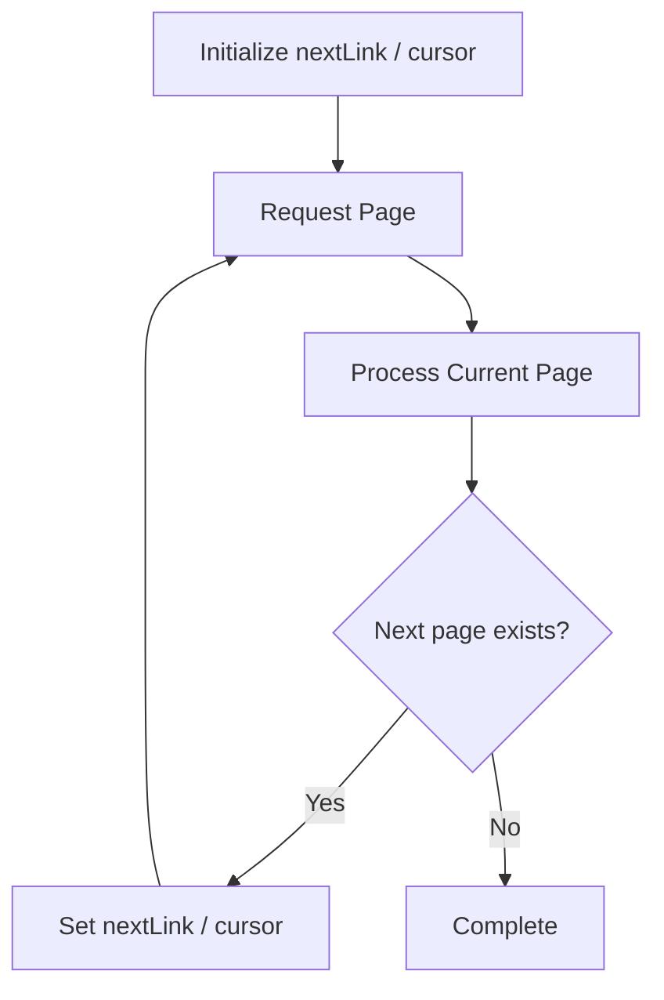
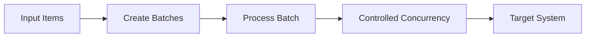
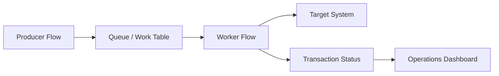
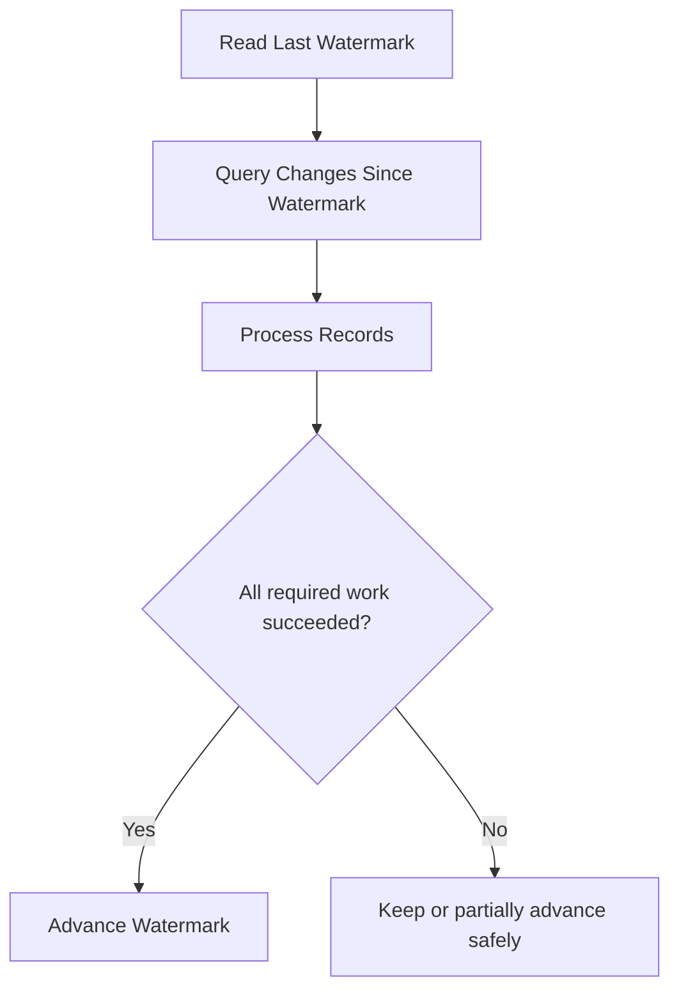
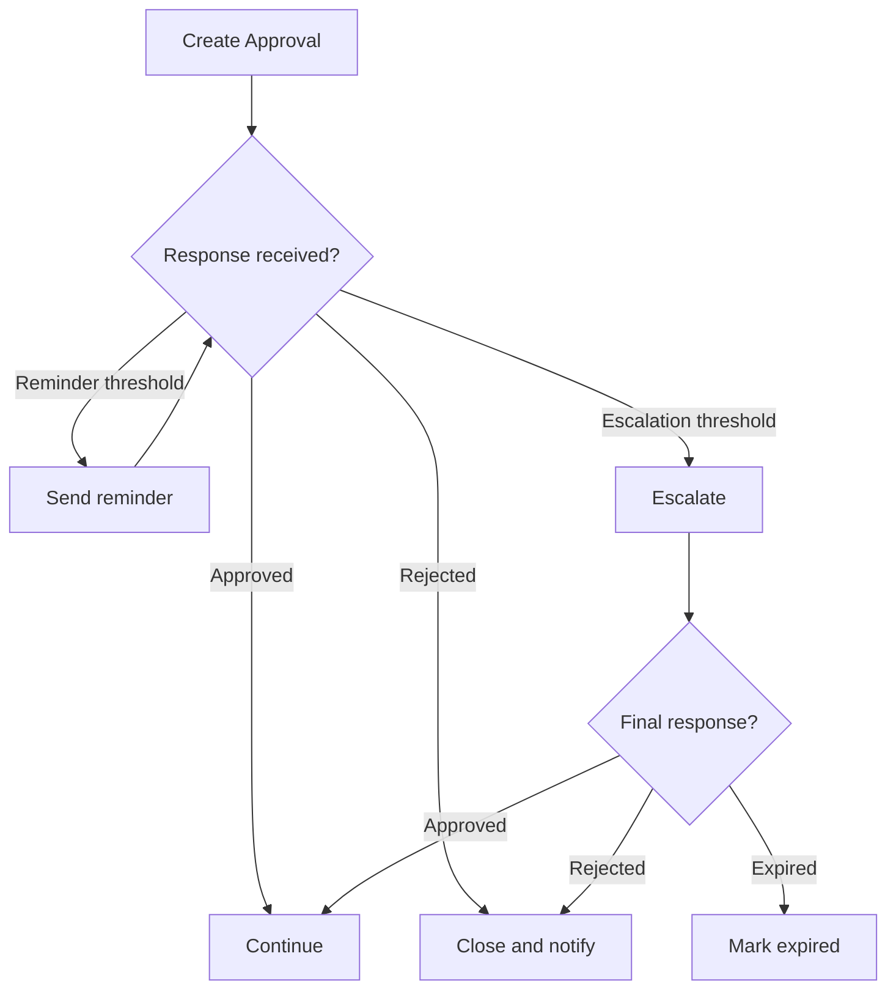
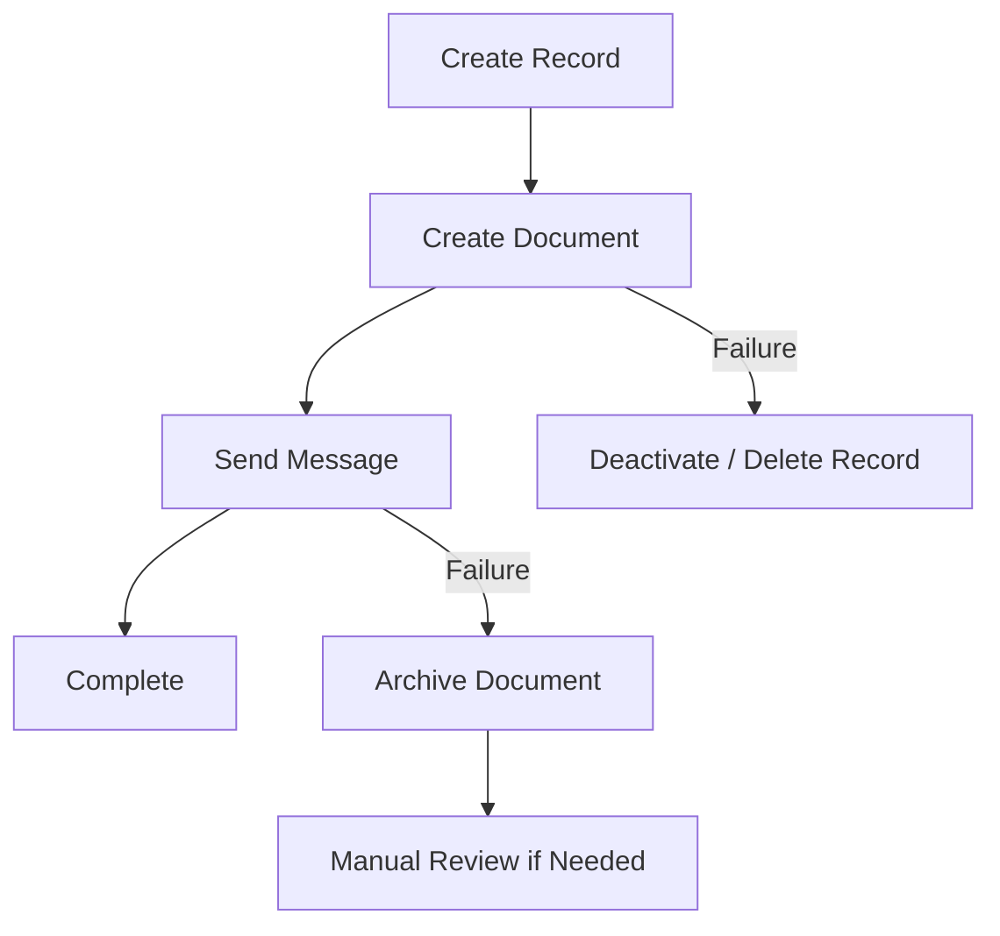

# Pattern 12: Pagination and Bulk Retrieval

**Use when:** retrieving more rows than the connector returns in one page.

Examples:

* Dataverse
* SharePoint
* SQL
* Microsoft Graph
* REST APIs

## Strategy Order

1. Reduce records at the source.
2. Select only required columns.
3. Use supported server-side pagination.
4. Process pages or batches.
5. Record a checkpoint.
6. Avoid holding a massive dataset in flow memory.

## Server-Side Filtering

Prefer:

```text
Source query:
status eq 'Active' and modifiedon ge <watermark>
```

over:

```text
Retrieve all records
    ↓
Filter array inside Power Automate
```

## Cursor Pagination Pattern



## Pagination Control Values

Track:

```text
pageNumber
nextLink
skipToken
cursor
pageSize
recordCount
lastBusinessKey
watermark
```

## Risks

* duplicate rows across pages
* records changing during pagination
* expired cursor
* connector threshold limits
* memory consumption
* timeout on long-running flows
* partial completion without checkpointing

Power Automate limits differ by flow profile, licensing, connector, and operation. Large-volume designs should be checked against the current limits rather than relying on a fixed remembered value.

---

# Pattern 13: Batch Processing With Concurrency Control

**Use when:** many independent items must be processed efficiently.

## Pattern



## Concurrency Decision

| Setting          | Use When                                          | Risk                           |
| ---------------- | ------------------------------------------------- | ------------------------------ |
| Sequential       | Order matters or target is sensitive              | Slow                           |
| Low concurrency  | API allows limited parallel work                  | Moderate throughput            |
| High concurrency | Operations are independent and target supports it | Throttling and race conditions |

## Questions Before Increasing Concurrency

* Are items independent?
* Can two items update the same record?
* Is ordering important?
* Does the target support parallel requests?
* Can actions be retried safely?
* Are there connector or API throttling limits?
* Can the process create duplicate files or messages?
* Is downstream locking understood?

## Recommended Batch Flow

```text
Retrieve eligible keys
    ↓
Divide into manageable batches
    ↓
Process each batch
    ↓
Record item-level outcome
    ↓
Retry only failed eligible items
    ↓
Produce batch summary
```

Do not retry the complete batch when only one item failed unless the batch operation is guaranteed to be idempotent.

---

# Pattern 14: Queue-Based Decoupling

**Use when:** processing is high-volume, long-running, failure-prone, or should not block the original request.

## Pattern



## Queue Record Fields

| Field               | Purpose                                |
| ------------------- | -------------------------------------- |
| Transaction ID      | Unique work item                       |
| Correlation ID      | Traceability                           |
| Idempotency key     | Duplicate protection                   |
| Work type           | Worker routing                         |
| Priority            | Processing order                       |
| Status              | Pending, processing, completed, failed |
| Attempt count       | Retry control                          |
| Available after     | Backoff scheduling                     |
| Locked by           | Worker ownership                       |
| Lock expires        | Abandoned-work recovery                |
| Payload reference   | Secure source reference                |
| Last error code     | Support analysis                       |
| Created/updated UTC | Aging and monitoring                   |

## Benefits

* separates request receipt from processing
* smooths workload spikes
* supports retry and replay
* enables item-level status
* prevents one large flow from timing out
* improves operational monitoring

## Queue Safety

A worker should:

1. claim the item
2. verify the lock
3. process idempotently
4. record outcome
5. release or complete the item
6. schedule retry only when appropriate

---

# Pattern 15: Watermark and Incremental Processing

**Use when:** a scheduled flow should process only new or changed data.

## Pattern



## Typical Watermarks

* modified timestamp
* increasing transaction ID
* source batch ID
* event sequence
* file timestamp
* Dataverse change token
* API continuation token

## Safe Watermark Rules

* advance only after required processing succeeds
* use UTC
* account for late-arriving data
* account for equal timestamps
* include overlap when needed
* combine timestamp with a deterministic tie-breaker
* record source and target counts
* retain replay capability

## Overlap Example

```text
Previous successful watermark: 2026-07-11T14:00:00Z
Next query starts at:          2026-07-11T13:55:00Z
```

The five-minute overlap captures late commits. Idempotency prevents duplicate effects.

---

# Pattern 16: Approval With Timeout, Reminder, and Escalation

**Use when:** a human decision controls whether processing can continue.



## Approval Record

Track:

* approval ID
* request ID
* approver
* backup approver
* requested UTC
* due UTC
* reminder count
* escalation UTC
* response
* response UTC
* comments
* final status

## Approval Rules

* Avoid indefinite waits.
* Define expiration.
* Define delegation.
* Define what happens when no one responds.
* Do not rely only on an email thread as the approval record.
* Confirm whether an approval is advisory or legally authoritative.
* Revalidate business data after a long approval delay.

---

# Pattern 17: Long-Running Process

**Use when:** processing may span hours or days.

Examples:

* approvals
* external batch jobs
* document review
* asynchronous APIs
* scheduled settlement
* delayed follow-up

## Prefer State-Based Orchestration

```text
Request received
    ↓
State = Submitted
    ↓
External work started
    ↓
State = Processing
    ↓
Completion event or scheduled status check
    ↓
State = Completed / Failed
```

Avoid one flow run waiting unnecessarily when the process can be represented through persisted state and resumed by another event.

## State Table

| Field           | Example              |
| --------------- | -------------------- |
| Process ID      | `PROC-10027`         |
| State           | `WaitingForApproval` |
| Previous state  | `Validated`          |
| Correlation ID  | GUID                 |
| Next action UTC | Timestamp            |
| Attempt count   | 2                    |
| Assigned owner  | Operations           |
| Last error      | Sanitized message    |
| Updated UTC     | Timestamp            |

---

# Pattern 18: Compensation and Partial Rollback

**Use when:** several systems are updated and one later step can fail.

Power Automate cannot automatically provide a distributed transaction across unrelated systems.

Use compensating actions where appropriate.

## Pattern



## Compensation Examples

| Completed Action            | Compensation               |
| --------------------------- | -------------------------- |
| Created temporary file      | Delete or archive file     |
| Reserved work item          | Release reservation        |
| Set status to processing    | Reset to pending or failed |
| Created ticket              | Close ticket as cancelled  |
| Added queue item            | Mark queue item cancelled  |
| Generated unsigned document | Mark obsolete              |

## Warning

Some business effects should not be automatically reversed.

Examples:

* sent customer email
* issued legal notice
* completed payment
* submitted regulatory record

For irreversible operations:

* place them late in the workflow
* validate everything first
* make them idempotent where possible
* record the external reference
* route failures for controlled remediation

---
