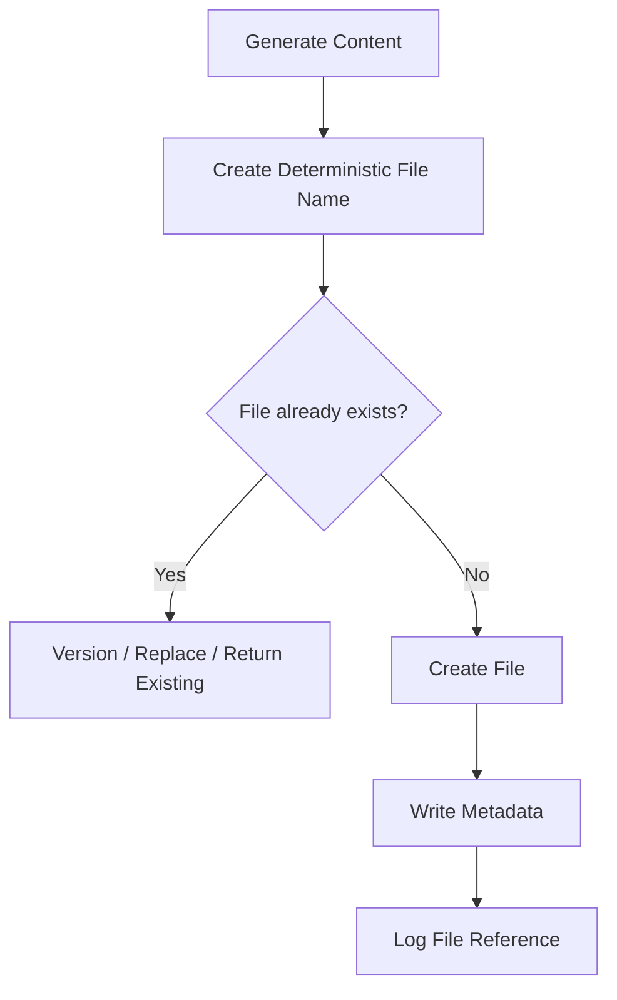
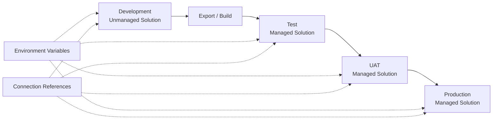

# Reusable Child Flow Library

## Suggested Library

| Child Flow                            | Responsibility                             |
| ------------------------------------- | ------------------------------------------ |
| `CF - Common - Get Configuration`     | Return validated environment configuration |
| `CF - Common - Write Telemetry`       | Record run or transaction event            |
| `CF - Common - Create Exception`      | Create standardized exception record       |
| `CF - Common - Send Notification`     | Route templated notification               |
| `CF - Common - Validate Email`        | Validate and normalize email address       |
| `CF - Common - Build Response`        | Produce standard response contract         |
| `CF - Documents - Generate PDF`       | Call document-generation service           |
| `CF - SharePoint - Create File`       | Store controlled file                      |
| `CF - Graph - Send Email`             | Send standardized Graph email              |
| `CF - Dataverse - Upsert Transaction` | Create or update processing record         |
| `CF - Data - Request Lookup`          | Call governed data lookup endpoint         |
| `CF - Calendar - Add Business Days`   | Apply business-calendar rules              |

## Reuse Decision

Create a reusable child flow when:

* logic appears in multiple flows
* the responsibility is stable
* it has a clear input/output contract
* one team can own it
* independent testing provides value
* changes can remain backward compatible

Keep logic local when:

* it is specific to one business process
* reuse is speculative
* the contract changes frequently
* extracting it creates more complexity than it removes

---

# Flow Naming Standards

## Cloud Flow

```text
<Flow Type> - <Business Area> - <Purpose>
```

Examples:

```text
AUTO - Renewals - Process Eligible Policies
SCH - Bulk Notices - Retrieve Daily Candidates
INST - Claims - Submit Document Request
CHILD - Common - Write Telemetry
CHILD - Documents - Generate PDF
```

## Scope Naming

```text
Scope - Initialize
Scope - Validate
Scope - Try
Scope - Catch
Scope - Finally
```

## Action Naming

Prefer:

```text
DV - Get Policy
SQL - Retrieve Eligible Policies
HTTP - Generate PDF
SP - Create Notice File
OUTLOOK - Send Broker Email
CMP - Build Correlation ID
COND - Policy Is Eligible
```

Avoid:

```text
Get row
Compose 7
Condition 4
Apply to each 12
HTTP 3
```

Action names appear in expressions, run history, and error extraction. Rename them before creating many references.

---

# Expression Quick Reference

## Null-Safe Value

```text
coalesce(triggerBody()?['email'], '')
```

## Check Empty

```text
empty(triggerBody()?['policyId'])
```

## Generate GUID

```text
guid()
```

## Current UTC Time

```text
utcNow()
```

## Format Date

```text
formatDateTime(utcNow(), 'yyyy-MM-dd')
```

## Add Days

```text
addDays(utcNow(), 5)
```

## Convert to Lowercase

```text
toLower(trim(triggerBody()?['status']))
```

## Join Array

```text
join(variables('varRecipients'), ';')
```

## Build String

```text
concat(
    triggerBody()?['policyId'],
    '-',
    triggerBody()?['noticeType']
)
```

## Safe Boolean

```text
equals(
    toLower(string(coalesce(triggerBody()?['enabled'], false))),
    'true'
)
```

## Safe Integer

```text
int(coalesce(triggerBody()?['retryCount'], 0))
```

## First Array Item

```text
first(body('Filter_array'))
```

Only use `first()` after confirming the array is not empty.

## Array Length

```text
length(body('Filter_array'))
```

## Contains

```text
contains(
    toLower(coalesce(triggerBody()?['subject'], '')),
    'renewal'
)
```

---

# Data Transformation Patterns

## Select Instead of Apply to Each

Use the Select action when transforming every item in an array without external side effects.

Input:

```json
[
  {
    "policyId": "P-1",
    "email": "ONE@EXAMPLE.COM"
  }
]
```

Output mapping:

```json
{
  "businessKey": "@{item()?['policyId']}",
  "recipient": "@{toLower(item()?['email'])}"
}
```

## Filter Array

Use for an already retrieved in-memory array when source-side filtering is unavailable.

Prefer source-side filtering for large datasets.

## Compose for Calculated Values

Use Compose when:

* value is calculated once
* value does not change
* naming improves readability

## Parse JSON

Use Parse JSON when:

* downstream actions need typed dynamic content
* the response contract is stable
* schema validation is useful

Avoid making every optional field required in the schema.

---

# File Processing Patterns

## Controlled File Creation



## Recommended File Metadata

* business key
* document type
* source version
* generated UTC
* correlation ID
* status
* retention category
* owner
* source system
* document hash where appropriate

## File Naming

```text
<business-key>_<document-type>_<yyyyMMdd>_<version>.pdf
```

Example:

```text
POL-100482_AUTO-RENEWAL_20260711_v1.pdf
```

Avoid user-supplied file names without sanitizing prohibited characters.

---

# Notification Pattern

## Notification Levels

| Level              | Audience                     | Example                       |
| ------------------ | ---------------------------- | ----------------------------- |
| Informational      | Business user                | Request completed             |
| Business exception | Operations                   | Recipient data missing        |
| Technical warning  | Support                      | One retry occurred            |
| Technical failure  | Platform/integration support | API unavailable               |
| Critical incident  | Incident management          | High-volume production outage |

## Standard Notification Structure

```text
Environment:
Automation:
Status:
Business Key:
Correlation ID:
Summary:
Required Action:
Retry Status:
Support Reference:
```

Notifications should be actionable, not merely announce that “the flow failed.”

---

# Solution and ALM Standards

Solution-aware cloud flows provide stronger ALM capabilities, including environment variables, connection references, role-based access, solution layering, and transport between environments.



## Minimum ALM Standards

| Practice                            | Reason                                  |
| ----------------------------------- | --------------------------------------- |
| Build flows inside solutions        | Portability and component management    |
| Use connection references           | Environment-specific connection binding |
| Use environment variables           | Externalized configuration              |
| Develop in unmanaged solutions      | Editable development source             |
| Deploy managed solutions downstream | Controlled customization                |
| Store source in Git                 | Review and recovery                     |
| Use deployment pipelines            | Repeatable promotion                    |
| Run solution checker                | Static quality validation               |
| Version releases                    | Traceability                            |
| Prevent direct production editing   | Avoid source drift                      |

Power Platform pipelines automate solution deployment among environments. Current platform guidance requires pipeline target environments to use Managed Environments for compliant deployment scenarios, so licensing and governance should be evaluated as part of pipeline adoption.

---

# Production Flow Review Checklist

## Trigger

* [ ] Trigger starts only when needed.
* [ ] Trigger conditions are documented.
* [ ] Recurrence timezone is explicit.
* [ ] Duplicate-trigger behavior is understood.
* [ ] Trigger concurrency is intentional.

## Configuration

* [ ] Environment-specific values are externalized.
* [ ] No production URL or mailbox is hardcoded.
* [ ] Connection references are in the solution.
* [ ] Configuration ownership is documented.

## Validation

* [ ] Required fields are validated.
* [ ] Data types are checked.
* [ ] Business eligibility is checked.
* [ ] Invalid requests stop early.
* [ ] Validation outcomes are logged.

## Reliability

* [ ] Try/Catch/Finally is implemented.
* [ ] Retry policy matches the failure type.
* [ ] Duplicate processing is prevented.
* [ ] Timeouts are handled.
* [ ] Partial completion is handled.
* [ ] Replay procedure exists.

## Security

* [ ] No secrets are hardcoded.
* [ ] Secure Inputs/Outputs are enabled where needed.
* [ ] Production uses enterprise-owned identity.
* [ ] Least privilege is applied.
* [ ] Logs exclude sensitive data.
* [ ] Connector combination complies with DLP.

## Performance

* [ ] Source-side filters are used.
* [ ] Required columns only are retrieved.
* [ ] Pagination is configured.
* [ ] Concurrency is intentional.
* [ ] Batch size is appropriate.
* [ ] Platform and API limits were assessed.

## Operations

* [ ] Correlation ID is recorded.
* [ ] Run and transaction telemetry exists.
* [ ] Alerts have an owner.
* [ ] Business exceptions are separated from technical failures.
* [ ] Runbook exists.
* [ ] Support can replay safely.

## ALM

* [ ] Flow is in a solution.
* [ ] Source is in Git.
* [ ] Solution checker passes.
* [ ] Release is versioned.
* [ ] Deployment uses an approved pipeline.
* [ ] Production changes are not made directly.

---

# Testing Matrix

| Test Type               | Example                              |
| ----------------------- | ------------------------------------ |
| Happy path              | Valid request completes              |
| Required-field test     | Policy ID is missing                 |
| Invalid-value test      | Unsupported status supplied          |
| Duplicate test          | Same event delivered twice           |
| Retry test              | API returns temporary 503            |
| Throttling test         | Connector returns 429                |
| Permanent failure test  | API returns 400                      |
| Authorization test      | Service identity lacks access        |
| Timeout test            | Dependency does not respond          |
| Partial completion test | File created but email fails         |
| Concurrency test        | Two requests update same record      |
| Pagination test         | More than one page returned          |
| Volume test             | Production-like batch size           |
| Late-data test          | Record arrives after watermark       |
| Child-flow test         | Child returns each supported outcome |
| Security test           | Sensitive values absent from logs    |
| Deployment test         | Connection references resolve        |
| Recovery test           | Failed transaction replayed safely   |

---

# Common Mistakes and Fixes

| Mistake                                  | Why It Fails                         | Better Approach                     |
| ---------------------------------------- | ------------------------------------ | ----------------------------------- |
| No error handling                        | Failures become silent or unclear    | Try/Catch/Finally                   |
| One flow with hundreds of actions        | Difficult to review and support      | Parent and child flows              |
| Hardcoded URLs or mailboxes              | Deployment becomes manual            | Environment variables               |
| Personal production connection           | Creates key-person dependency        | Enterprise-owned identity           |
| Retrieve all then filter                 | Wastes time and requests             | Source-side filters                 |
| High loop concurrency by default         | Causes throttling and races          | Tune using target capacity          |
| Retry every error                        | Permanent errors repeat uselessly    | Classify transient versus permanent |
| Retry non-idempotent action              | Creates duplicates                   | Idempotency key and status check    |
| Logging only run status                  | Cannot identify failed business item | Transaction-level telemetry         |
| Sending every error to one inbox         | Wrong team receives incidents        | Classified alert routing            |
| Using Compose 1, Compose 2               | Run history is unreadable            | Meaningful action names             |
| One universal child flow                 | Becomes tightly coupled and insecure | Purpose-specific contracts          |
| Storing secrets in variables             | Values may appear in history         | Secure storage and secure settings  |
| Advancing watermark before completion    | Records can be lost                  | Advance after validated success     |
| Directly editing production              | Creates drift from source            | Solution-based ALM                  |
| Treating business exceptions as failures | Distorts reliability metrics         | Separate outcome categories         |
| No explicit final status                 | Parent cannot interpret outcome      | Standard response contract          |
| Waiting indefinitely for approval        | Process never closes                 | Timeout and escalation              |

---

# Red Flags

* Flow is outside a solution.
* Production connection belongs to a developer.
* No correlation ID exists.
* Trigger fires for events immediately discarded.
* Flow can create duplicate emails or files.
* `Apply to each` contains the entire business process.
* Concurrency is increased without testing.
* Retries occur on HTTP 400 or invalid data.
* No distinction exists between business exception and system failure.
* Logging contains full customer payloads.
* A scheduled process has no watermark.
* An approval can wait forever.
* One flow updates several systems with no compensation plan.
* Child flows return inconsistent outputs.
* API calls have no timeout or status-code handling.
* Alerts say only “flow failed.”
* No one owns the production connection.
* Production cannot be recreated from a solution and repository.
* The workflow depends on manual production configuration.
* A failure replay can repeat irreversible actions.

---

# Troubleshooting Guide

| Symptom                               | Likely Cause                                 | Corrective Action                                    |
| ------------------------------------- | -------------------------------------------- | ---------------------------------------------------- |
| Trigger never runs                    | Trigger condition excludes event             | Test condition with actual payload                   |
| Trigger runs too often                | Filtering occurs after trigger               | Move criteria into trigger settings                  |
| Runs are cancelled                    | Concurrency setting rejects or replaces runs | Review trigger concurrency                           |
| Flow fails after deployment           | Missing environment-variable value           | Configure target environment                         |
| Flow cannot enable                    | Invalid connection reference                 | Rebind correct connection                            |
| HTTP action returns 429               | Throttling                                   | Reduce concurrency and use backoff                   |
| Apply to each is slow                 | Sequential processing or excessive actions   | Review safe concurrency and child-worker pattern     |
| Duplicate emails appear               | Trigger redelivery or retry                  | Add idempotency key and message reference            |
| Latest configuration is not used      | Cached or stale configuration                | Revalidate value and controlled refresh process      |
| Child flow unavailable                | Not solution-aware or connection issue       | Confirm solution, permissions, and connection        |
| Catch scope did not run               | Configure Run After is incomplete            | Include failed, timed out, and skipped as required   |
| Finally scope skipped                 | Run After does not cover every path          | Configure all possible statuses                      |
| Secure values appear in history       | Secure settings missing upstream             | Enable Secure Inputs/Outputs on relevant actions     |
| Scheduled flow misses records         | Watermark advanced incorrectly               | Add overlap and idempotent replay                    |
| Flow exceeds runtime or action limits | Workload is too large                        | Use queue, paging, worker flows, or external service |
| File action returns not found         | Site, library, or path changed               | Validate environment configuration                   |
| Production edit disappears            | Managed solution was redeployed              | Make change in development and promote               |
| Support cannot find failure           | No correlation ID or transaction log         | Add structured telemetry                             |

Microsoft’s current cloud-flow troubleshooting guidance recommends first determining whether the trigger occurred and then identifying the specific failed action and its detailed error.

---

# Efficiency Decision Table

| Requirement                    | Prefer                                                 |
| ------------------------------ | ------------------------------------------------------ |
| Prevent unnecessary runs       | Trigger condition                                      |
| Reduce returned data           | Source-side filter and select                          |
| Reuse business operation       | Child flow                                             |
| Reuse external API integration | Purpose-specific API wrapper                           |
| Handle temporary outage        | Exponential retry                                      |
| Avoid duplicate effects        | Idempotency key                                        |
| Process large workload         | Pagination, batching, queue workers                    |
| Process only changed rows      | Watermark                                              |
| Trace across systems           | Correlation ID                                         |
| Move among environments        | Solution, environment variables, connection references |
| Protect sensitive values       | Secure store and Secure Inputs/Outputs                 |
| Support long-running process   | Persisted state                                        |
| Handle partial completion      | Compensation pattern                                   |
| Monitor production             | Structured telemetry                                   |
| Reduce one giant loop          | Parent/worker pattern                                  |
| Control rollout                | Feature flag                                           |

---

# Beginner-to-Pro Learning Path

| Level                      | Focus                                                         | Practical Outcome                      |
| -------------------------- | ------------------------------------------------------------- | -------------------------------------- |
| Beginner                   | Triggers, actions, conditions, Compose                        | Build a simple workflow                |
| Advanced Beginner          | Expressions, loops, variables, connector behavior             | Handle basic branching and data        |
| Intermediate Practitioner  | Try/Catch, trigger conditions, pagination, approvals          | Build supportable departmental flows   |
| Advanced Practitioner      | Child flows, idempotency, concurrency, APIs                   | Build reusable and resilient solutions |
| Automation Engineer        | Telemetry, queues, contracts, recovery, desktop orchestration | Operate production workloads           |
| Enterprise Professional    | Solutions, ALM, DLP, identity, pipelines                      | Govern environment promotion           |
| Architect / Strategic Lead | Reference architectures, reusable platforms, risk controls    | Scale the automation department        |

---
