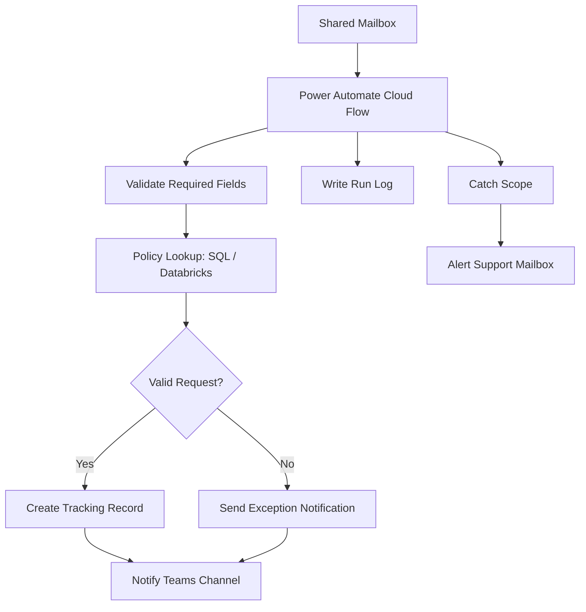

# Power Automate Worked Example and Learning Path

## 18. Example Scenario

### Scenario: Automating Policy Renewal Exception Intake

A business team receives renewal exception requests through a shared mailbox. Each request includes a policy number, broker information, requested action, and sometimes attachments.

The goal is to automate intake, validation, routing, and tracking.

---

### 18.1 Process Flow

```text
Email arrives in shared mailbox
   ↓
Power Automate cloud flow triggers
   ↓
Extract email metadata and attachments
   ↓
Validate required fields
   ↓
Look up policy data in SQL / Databricks
   ↓
If valid, create tracking record
   ↓
If missing data, send exception notice
   ↓
Notify automation support channel
   ↓
Log run result
```

---

### 18.2 Architecture



---

### 18.3 Good Design Choices

* Use shared mailbox, not personal mailbox
* Use solution-aware cloud flow
* Use connection references
* Use environment variables for mailbox, SQL endpoint, and support channel
* Use service account connection
* Add validation before creating records
* Log every run
* Add support notification on failure
* Create a runbook
* Track business outcome metrics

---

## 19. Beginner-to-Pro Learning Path

---

### Level 1: Beginner — Basic Flow Builder

Goal: Understand simple triggers and actions.

Learn:

* What Power Automate is
* Flow types
* Triggers
* Actions
* Conditions
* Dynamic content
* Run history
* Basic expressions

Practice:

```text
Create a flow that sends a Teams message when a SharePoint item is created.
```

You should be able to:

* Create a simple flow
* Test a flow
* View run history
* Fix basic errors
* Use dynamic content

---

### Level 2: Advanced Beginner — Practical Automation Maker

Goal: Build useful team automations.

Learn:

* Conditions
* Switch statements
* Apply to each
* Variables
* Compose
* Approvals
* SharePoint and Outlook connectors
* Basic error handling

Practice:

```text
Create an approval flow for a SharePoint request list.
```

You should be able to:

* Build multi-step flows
* Add approval logic
* Handle common errors
* Notify users
* Update records

---

### Level 3: Intermediate — Enterprise-Ready Builder

Goal: Build supportable production flows.

Learn:

* Solutions
* Connection references
* Environment variables
* Service accounts
* Child flows
* Try/Catch scopes
* Logging
* Trigger conditions
* DLP basics

Practice:

```text
Create a solution-aware flow that logs success and failure to a tracking table.
```

You should be able to:

* Build flows inside solutions
* Move flows between environments
* Design error handling
* Create reusable child flows
* Avoid hardcoded values

---

### Level 4: Advanced — Automation Engineer

Goal: Design scalable and governed automation solutions.

Learn:

* ALM
* Pipelines
* Custom connectors
* HTTP/API actions
* Power Platform CLI
* Dataverse integration
* On-premises data gateway
* Licensing and request limits
* Monitoring dashboards
* Desktop flows and RPA patterns

Practice:

```text
Design a production automation with dev/test/prod environments, logging, exception handling, and deployment controls.
```

You should be able to:

* Choose the right automation pattern
* Design for scale
* Integrate APIs
* Build support dashboards
* Lead technical reviews
* Advise on governance

---

### Level 5: Pro — Enterprise Automation Architect

Goal: Lead automation strategy and operating model.

Learn:

* Center of Excellence practices
* Environment strategy
* Automation intake models
* Governance frameworks
* Process mining
* AI and Copilot integration
* Risk management
* Automation portfolio management
* Enterprise monitoring
* Cost and value tracking

You should be able to:

* Define Power Automate standards
* Build enterprise automation frameworks
* Mentor makers and engineers
* Govern citizen development
* Design automation lifecycle controls
* Align automation with business strategy

---

## 20. Repository Placement

For a personal or team knowledge repository, place this guide here:

```text
knowledge-repository/
└── power-platform/
    └── power-automate/
        ├── README.md
        ├── power-automate-reference-guide.md
        ├── quick-reference.md
        ├── troubleshooting.md
        ├── governance.md
        ├── alm-and-solutions.md
        ├── error-handling-patterns.md
        ├── flow-design-standards.md
        ├── templates/
        │   ├── flow-design-document.md
        │   ├── production-readiness-checklist.md
        │   ├── troubleshooting-runbook.md
        │   ├── support-handoff-template.md
        │   └── automation-intake-template.md
        └── examples/
            ├── approval-flow-example.md
            ├── sharepoint-intake-flow.md
            ├── dataverse-trigger-flow.md
            ├── desktop-flow-pattern.md
            └── child-flow-logging-pattern.md
```

Recommended `README.md`:

```markdown
# Power Automate

This folder contains practical Power Automate guidance for technical professionals, automation engineers, and enterprise makers.

## Start Here

1. Read `power-automate-reference-guide.md`
2. Use `quick-reference.md` for daily building
3. Use `troubleshooting.md` when flows fail
4. Use `governance.md` before production deployment
5. Use templates before submitting flows for review

## Key Topics

- Cloud flows
- Desktop flows
- Connectors
- Solutions
- Connection references
- Environment variables
- Error handling
- ALM
- Monitoring
- Governance
```

---
