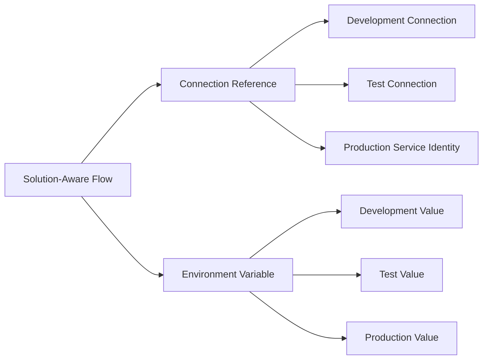

# Power Platform Workspace Architecture

## Local Workspace and Release Flow

Development is the only maker environment in this model. A named PAC profile identifies each environment. Local source is reviewed in Git; an approved, immutable managed artifact progresses downstream. The workspace does not automate Production deployment.

## Environment Configuration

A connection reference is transported with the solution and bound to an approved connection in each target. An environment variable definition is transported with the solution; its stage-specific value is supplied through controlled configuration. Credentials remain in the platform's approved identity or secret mechanism, not in Git.

## Responsibility Boundary

| Maker portal | VS Code workspace |
|---|---|
| Visual app and flow design | Source control and diff review |
| Dataverse table and form design | `.cdsproj` and supported source review |
| Connection-reference and environment-variable authoring | Deployment settings and inventories |
| AI Builder and Copilot Studio visual configuration | Custom code, documentation, tests, and Git history |
| Save, publish, and interactive testing | Static validation, package build, PR evidence |

## Solution Boundary

Every deployable workload should have an owner, publisher, solution unique name, component inventory, dependency model, connection inventory, environment-variable inventory, test plan, monitoring model, support model, and release/rollback procedure. Shared components should be split only when their dependency and lifecycle boundaries justify it.
