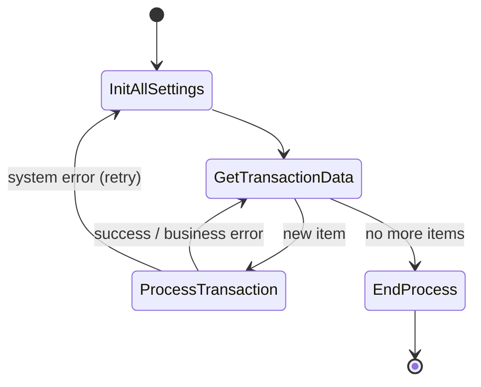
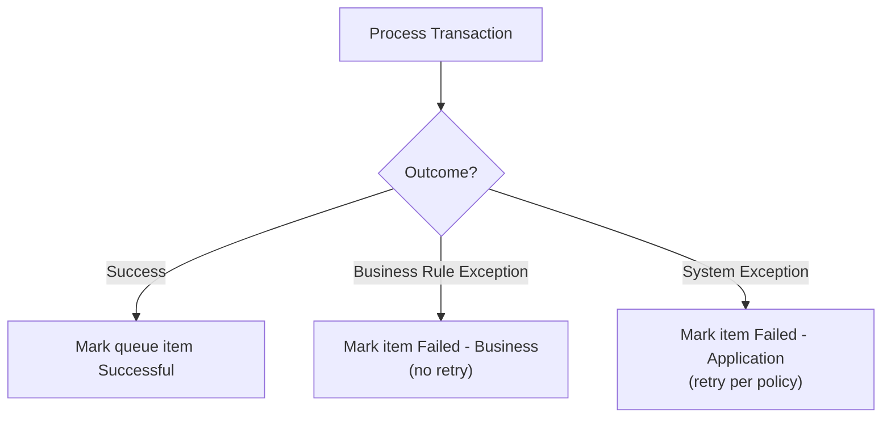
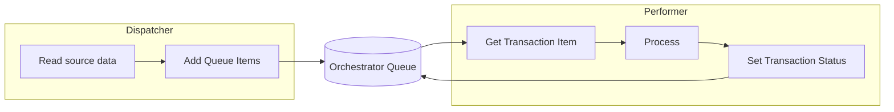

# UiPath — Repeatable Project Patterns

> A pattern library for building maintainable, enterprise-grade UiPath automations. Centers on the Robotic Enterprise (REFramework) model, transactional queue processing, robust exception handling, and Orchestrator assets.

## The REFramework Backbone

UiPath's Robotic Enterprise Framework is the default template for reliable, transactional automations. It is a state machine with four states.



| State | Responsibility |
|---|---|
| Initialization | Read config, open apps, verify environment |
| Get Transaction Data | Pull next item (often from an Orchestrator queue) |
| Process Transaction | Do the work for one item; classify outcome |
| End Process | Close apps, clean up, send summary |

## Pattern 1: Transaction Types & Error Classification

**Use when:** any REFramework process — classifying outcomes correctly drives retry logic.



| Exception | Meaning | Retry? |
|---|---|---|
| **BusinessRuleException** | Data/policy issue (e.g., missing field) | No — will fail again |
| **System/ApplicationException** | Transient (app crash, timeout) | Yes — retry per config |

## Pattern 2: Queue-Based Dispatcher / Performer

**Use when:** high volume, need parallelism, resilience, and auditability.



- **Dispatcher** loads work into a queue (fast, decoupled).
- **Performer(s)** consume items — scale by running multiple robots.
- Enables retries, SLA tracking, and audit via Orchestrator.

## Pattern 3: Config-Driven Design

**Use when:** always. Never hard-code settings inside workflows.

- Keep a `Config.xlsx` with **Settings**, **Constants**, and **Assets** sheets.
- Store secrets (credentials) in **Orchestrator Assets / Credential Assets**, not the config file.
- Read config once in Initialization into a `Dictionary`.

## Pattern 4: Robust Selectors

**Use when:** any UI automation.

| Technique | Benefit |
|---|---|
| Prefer stable attributes (`id`, `name`) over dynamic ones | Resilient selectors |
| Use wildcards (`*`) for volatile parts | Tolerates minor changes |
| Anchor Base / relative selectors | Locates elements by nearby stable ones |
| Validate with UI Explorer | Fewer runtime failures |

## Pattern 5: Retry & Recovery

**Use when:** interacting with apps that intermittently fail.

- Wrap fragile steps in **Retry Scope** with a condition.
- Set **max retries** and **delay** in Config, not inline.
- On system exception, REFramework auto-retries the transaction up to the configured limit.

## Pattern 6: Logging & Screenshots

**Use when:** every production automation.

- Use **Log Message** at key milestones with structured, searchable text.
- Add **Log Fields** for transaction ID and context.
- Capture a **screenshot on error** for faster diagnosis.

## Project Structure Standards

```text
Main.xaml                 # REFramework entry (state machine)
Data/
  Config.xlsx             # settings, constants, asset names
Framework/
  InitAllSettings.xaml
  GetTransactionData.xaml
  Process.xaml
  SetTransactionStatus.xaml
  CloseAllApplications.xaml
  KillAllProcesses.xaml
Tests/                    # workflow unit tests
project.json              # dependencies & metadata
```

## Common Mistakes & Fixes

- **Hard-coded values in workflows** — move to Config.xlsx / Assets.
- **Catching everything as one exception type** — separate Business vs System.
- **Fragile absolute selectors** — use wildcards and anchors.
- **No queue for high volume** — adopt dispatcher/performer.
- **Credentials in plain files** — use Orchestrator Credential Assets.

## Red Flags

- Monolithic `Main.xaml` with no modular workflows.
- No exception handling or transaction status updates.
- Robots run attended for unattended-scale volume.
- No logging, so failures are undiagnosable.

## Beginner-to-Pro Notes

| Level | Focus |
|---|---|
| Beginner | Sequences, activities, variables, basic selectors. |
| Advanced Beginner | Reusable workflows, arguments, Try/Catch. |
| Intermediate Practitioner | REFramework, Config-driven design, Retry Scope. |
| Advanced Practitioner | Queues, dispatcher/performer, Orchestrator assets. |
| Enterprise Professional | Multi-bot scaling, monitoring, credential mgmt. |
| Architect / Strategic Lead | Reusable components, CoE standards, governance. |
