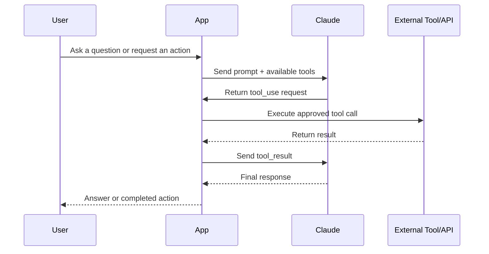
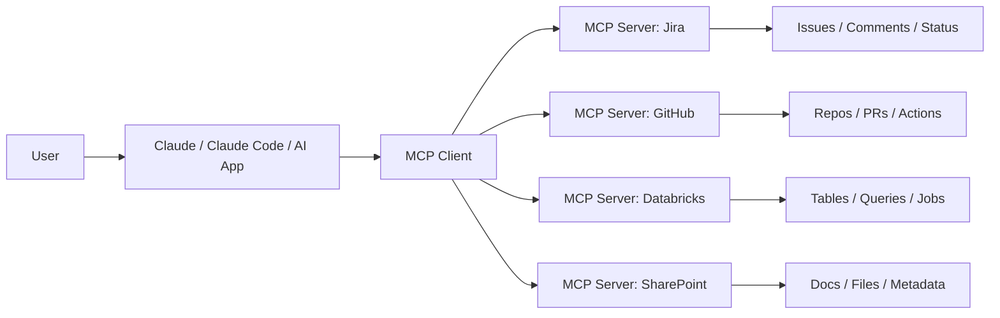
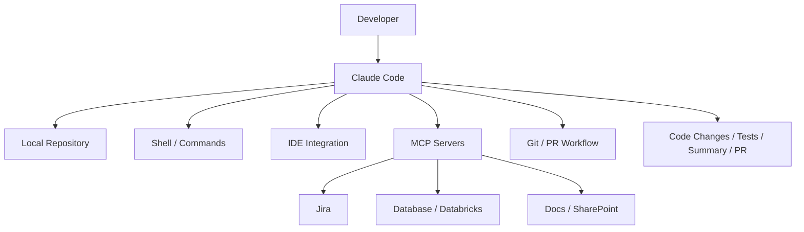
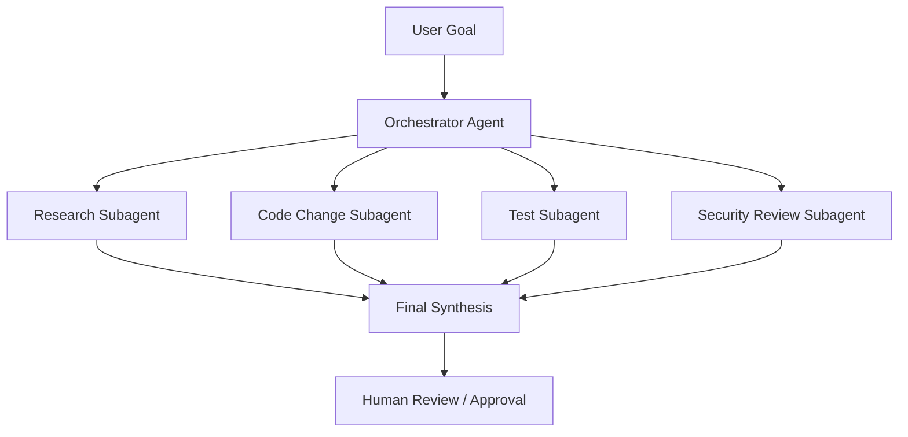
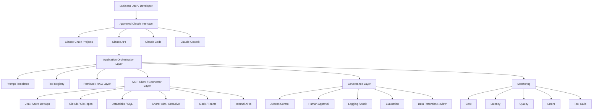
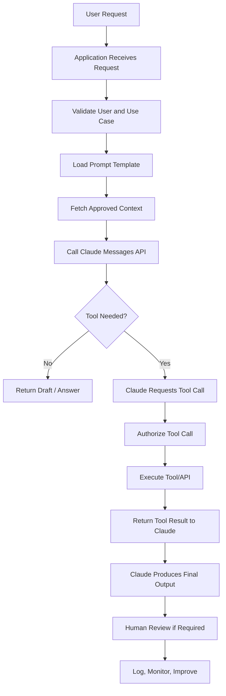
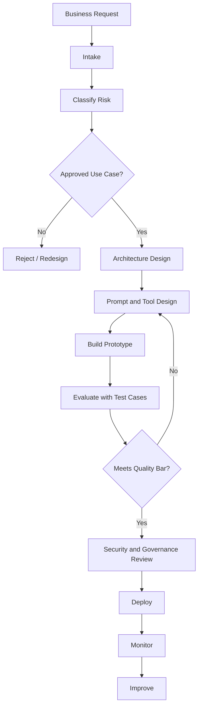

# Claude by Anthropic

**Audience:** Beginner-to-pro technical professionals, automation engineers, data/AI practitioners, enterprise architects, technical leads, solution designers, and team members onboarding into Claude-based work.

**Last verified:** July 5, 2026
**Scope:** Claude chat, Claude API, Claude Code, Claude Cowork, MCP, tool use, enterprise architecture, governance, agent workflows, and production readiness.

> **Current-state note:** Claude changes quickly. As of July 2026, Anthropic’s current model family includes Claude Fable 5, Claude Mythos 5, Claude Opus 4.8, Claude Sonnet 5, and Claude Haiku 4.5. Anthropic describes Claude as a platform for language, reasoning, analysis, coding, and more.

---

## 1. Executive Summary

Claude is Anthropic’s AI assistant and AI development platform. It can be used directly through chat-style products, integrated into enterprise workflows through APIs, embedded into software engineering workflows through Claude Code, and connected to tools and systems through tool use, MCP, connectors, and agent frameworks.

At a practical enterprise level, Claude should be understood as **three things at once**:

| View | Plain-English Meaning | Enterprise Use |
|---|---|---|
| Assistant | A conversational AI that helps users write, analyze, summarize, reason, and code | Knowledge work, drafting, analysis, meeting prep |
| API platform | A model interface developers can call from applications | Internal copilots, automation assistants, document processing, support bots |
| Agent runtime / workflow partner | A system that can use tools, read files, run commands, interact with codebases, and complete multi-step work | Software delivery, data analysis, business process automation, research workflows |

For enterprise teams, Claude is most valuable when it is not treated as a magic chatbot, but as a controlled AI capability inside a disciplined operating model:

```text
Business Problem
→ Use Case Intake
→ Risk Classification
→ Architecture Design
→ Prompt / Tool / Data Design
→ Evaluation
→ Human Approval
→ Deployment
→ Monitoring
→ Continuous Improvement
```

The main enterprise lesson is simple:

> Claude is strongest when paired with clear instructions, trusted context, controlled tools, strong human review, measurable evaluations, and governance.

---

## 2. Plain-English Explanation

Claude is an AI system that can understand instructions, reason over text, analyze files, write code, call tools, and help complete business or technical tasks.

A simple way to think about Claude:

> Claude is like a highly capable analyst, writer, developer, and workflow assistant — but it still needs clear instructions, trusted data, defined permissions, and human judgment.

Claude does **not** automatically know your company’s private systems, data definitions, process rules, security policies, or business context. You must provide that context through prompts, files, retrieval, tools, APIs, MCP servers, or approved connectors.

### What Claude Can Do

| Capability | Plain-English Explanation | Real Work Example |
|---|---|---|
| Summarization | Condense long content into useful takeaways | Summarize legal documents, support tickets, or meeting notes |
| Reasoning | Work through multi-step problems | Compare migration options or diagnose root causes |
| Coding | Generate, review, refactor, and explain code | Review a dbt model or generate API integration code |
| Tool use | Ask external systems for data or actions | Search Jira, call an internal policy API, query a database |
| File analysis | Read documents, PDFs, images, and datasets | Extract clauses from contracts or reconcile spreadsheets |
| Agentic work | Plan and execute multi-step tasks with tools | Analyze a repo, create a pull request, draft a report |
| Cowork-style delegation | Complete knowledge-work tasks across desktop files and apps | Assemble a report from local files and source documents |

---

## 3. Business Context

Claude is useful in enterprises because many business processes involve the same recurring pain points:

| Business Pain | Why It Matters | Claude-Enabled Pattern |
|---|---|---|
| Too much unstructured information | Employees spend hours reading emails, PDFs, notes, contracts, logs, or tickets | Summarization, extraction, classification |
| Manual decision support | People need to compare options, assess risks, and prepare recommendations | Structured analysis and decision memos |
| Repetitive technical work | Engineers repeatedly review code, generate docs, debug, and write tests | Claude Code, code review, test generation |
| Fragmented systems | Information lives in SharePoint, Jira, Slack, Databricks, GitHub, Outlook, etc. | MCP, connectors, tool use, retrieval |
| Slow onboarding | New team members need to learn architecture, terminology, and standards | Knowledge repository assistant, training guides |
| Inconsistent documentation | Teams build solutions without reusable templates | Documentation generation and review |
| Lack of operational visibility | AI outputs may be untracked, untested, or unmanaged | Governance, audit, evals, monitoring |

Claude’s business value comes from reducing time spent on low-value assembly work while keeping humans responsible for judgment, approval, and accountability.

### High-Value Enterprise Domains

| Domain | Example Use |
|---|---|
| Intelligent automation | Generate process designs, API flows, exception handling, support runbooks |
| Data engineering | Explain pipelines, review dbt models, generate lineage summaries |
| Analytics / BI | Draft metric definitions, summarize dashboard changes, generate Power BI migration checklists |
| Legal / compliance | Summarize documents, extract clauses, prepare issue lists |
| Customer operations | Classify emails, draft responses, summarize case history |
| Software engineering | Code review, refactoring, test generation, PR assistance |
| Knowledge management | Convert tribal knowledge into reusable documentation |

---

## 4. Core Concepts

### 4.1 Claude Models

A Claude model is the actual AI engine you call. Different models are optimized for different combinations of intelligence, speed, cost, and workload type.

| Model Tier | Practical Use | Tradeoff |
|---|---|---|
| Haiku | Fast, low-cost, high-volume tasks | May be less capable on complex reasoning |
| Sonnet | Balanced enterprise work, coding, agents | Good default for many production use cases |
| Opus | Hard reasoning, complex agentic tasks, deep code work | Higher cost |
| Fable / Mythos | Long-running or advanced frontier workflows | Validate availability, policy, and compliance before enterprise use |

#### Common Mistake

Do not pick the strongest model by default. Use evaluations to prove whether the workload actually needs it.

---

### 4.2 Messages API

The Messages API is the standard way developers send prompts to Claude and receive responses. It supports basic requests, multi-turn conversations, system instructions, tool use, vision, and other features.

Plain-English definition:

> The Messages API is how your application talks to Claude.

Basic shape:

```python
import anthropic

client = anthropic.Anthropic()

message = client.messages.create(
    model="claude-opus-4-8",
    max_tokens=1024,
    messages=[
        {"role": "user", "content": "Explain MCP in plain English."}
    ],
)

print(message.content)
```

#### Why It Matters

The Messages API gives your team control over:

| Area | What You Control |
|---|---|
| Prompt design | Instructions, context, examples, output format |
| Data handling | What context is sent and what is stored by your app |
| Tooling | Which APIs/tools Claude can request |
| Monitoring | Logs, usage, latency, errors, cost |
| Governance | Human review, access controls, approval gates |

---

### 4.3 Prompts and System Instructions

A prompt is the instruction or context you give Claude. A system instruction is a higher-priority instruction that defines Claude’s role, constraints, tone, and behavior.

Plain-English definition:

> A prompt tells Claude what to do. A system instruction tells Claude how it should behave while doing it.

Good prompt structure:

```text
Role:
You are a senior data engineer reviewing a dbt model.

Task:
Review the SQL for correctness, maintainability, and downstream impact.

Context:
This model supports automation lookups for renewal processing.

Output:
Return findings in a table with severity, issue, evidence, recommendation, and owner.

Rules:
Do not invent table meanings. If a dependency is unclear, say what must be verified.
```

#### Common Mistake

Vague prompt:

```text
Review this.
```

Better prompt:

```text
Review this SQL model for production readiness. Focus on join grain, null handling, test coverage, naming, downstream automation impact, and rollback risk.
```

---

### 4.4 Context Window

The context window is Claude’s working memory for a request. It includes your input, relevant prior messages, files, tool results, and the response Claude generates.

Plain-English definition:

> The context window is what Claude can “see” during a task.

#### Practical Guidance

| Situation | Good Practice |
|---|---|
| Long documents | Ask Claude to extract evidence first, then analyze |
| Large codebases | Use Claude Code, subagents, or targeted file selection |
| Repeated context | Use prompt caching where appropriate |
| Long-running agents | Use compaction or summarize intermediate state |
| Retrieval workflows | Send only relevant chunks, not everything |

---

### 4.5 Tokens, Cost, and Usage

Tokens are chunks of text used for billing and model processing. Inputs, outputs, tool definitions, tool results, images, PDFs, and thinking blocks can all affect token usage.

#### Cost Drivers

| Driver | Why It Costs More |
|---|---|
| Long prompts | More input tokens |
| Large documents | More content to process |
| Large tool schemas | Tool definitions count as input |
| Multi-step agents | Many model calls and tool calls |
| Extended thinking | Additional output-side reasoning tokens |
| Web search / code execution | Additional tool-specific charges |

---

### 4.6 Tool Use

Tool use allows Claude to call functions or tools. Some tools are client-side, meaning your application executes them. Others are server-side, meaning Anthropic runs them.

Plain-English definition:

> Tool use lets Claude ask for help from a system outside the model.

#### Tool Use Flow



#### Examples of Tools

| Tool Type | Example |
|---|---|
| Lookup tool | Get policy details from an internal API |
| Action tool | Create a Jira ticket |
| Retrieval tool | Search SharePoint documents |
| Database tool | Query Databricks SQL |
| Code tool | Run Python analysis |
| Browser/computer tool | Interact with a desktop or web app under controls |

---

### 4.7 MCP — Model Context Protocol

MCP stands for Model Context Protocol. It is an open standard for connecting AI applications to external systems such as files, databases, APIs, tools, and workflows.

Plain-English definition:

> MCP is a standard way for Claude or another AI application to connect to tools and data sources without every integration being custom-built from scratch.

#### MCP Components

| Component | Plain-English Meaning | Example |
|---|---|---|
| MCP host | The AI app the user interacts with | Claude Code, desktop assistant, IDE |
| MCP client | The connector inside the host | Claude Code’s MCP integration |
| MCP server | The service exposing tools/data | Jira MCP server, GitHub MCP server, Databricks MCP server |
| Tools | Actions Claude can request | Create ticket, query table, fetch file |
| Resources | Data Claude can read | Documents, schemas, dashboards |
| Prompts | Reusable workflows/instructions | “Review this PR” or “Summarize incident” |

#### MCP Architecture



#### MCP Use Cases

| Use Case | Example |
|---|---|
| Developer productivity | Claude reads Jira issue, updates code, opens PR |
| Data analysis | Claude queries Databricks for approved metrics |
| Operations | Claude checks monitoring dashboards and incident tickets |
| Documentation | Claude reads repo files and generates architecture docs |
| Business workflow | Claude assembles a report using SharePoint, Excel, and email context |

#### MCP Risks

| Risk | Control |
|---|---|
| Excessive permissions | Use least-privilege service accounts |
| Tool misuse | Add approval gates for write actions |
| Prompt injection | Treat external content as untrusted |
| Data leakage | Restrict sensitive data access |
| Poor observability | Log tool calls, inputs, outputs, and user approvals |
| Tool sprawl | Maintain a registry and owner for each MCP server |

---

### 4.8 Claude Code

Claude Code is Anthropic’s agentic coding tool. It can read a codebase, edit files, run commands, and integrate with development tools.

Plain-English definition:

> Claude Code is Claude working inside your software development environment.

#### Good Claude Code Tasks

| Task | Example |
|---|---|
| Codebase exploration | “Explain the architecture of this repo.” |
| Impact analysis | “What breaks if we change this dbt model?” |
| Refactoring | “Refactor this module without changing behavior.” |
| Test generation | “Add unit tests for this edge case.” |
| Pull request assistance | “Review this PR for security, naming, and performance.” |
| Migration | “Update this API client to the new endpoint pattern.” |

#### Claude Code Architecture



#### Practical Warning

Claude Code should not be given unrestricted access to sensitive repositories, production credentials, or write actions without approval controls. Treat it as a powerful junior-to-senior assistant that can move quickly, not as an unsupervised production engineer.

---

### 4.9 Claude Cowork

Claude Cowork is Anthropic’s agentic knowledge-work product for multi-step knowledge work across files and applications.

Plain-English definition:

> Claude Cowork is for delegating business tasks, not just asking chat questions.

#### Good Cowork Tasks

| Task | Example |
|---|---|
| Document assembly | Turn source files into a structured report |
| Research synthesis | Summarize multiple documents into findings |
| File organization | Rename, sort, deduplicate, or classify local files |
| Data extraction | Extract key fields from contracts, invoices, or records |
| Draft preparation | Create a memo, one-pager, or presentation draft |

#### Cowork vs Chat

| Chat | Cowork |
|---|---|
| You drive each prompt | You assign an outcome |
| Best for Q&A and drafting | Best for multi-step tasks |
| Works mostly in conversation | Works across files and apps |
| User coordinates steps | Claude coordinates more of the task |

#### Governance Warning

Cowork-style workflows can be powerful, but they may touch local files, applications, and business data. Use governed access, clear approval rules, and avoid regulated workloads unless your organization has validated coverage, retention, auditability, and compliance requirements.

---

### 4.10 Multi-Agent Workflows

A multi-agent workflow uses multiple specialized Claude instances or subagents to divide work. One agent may orchestrate, while others research, test, validate, summarize, or review.

#### Multi-Agent Pattern



#### Example Agent Roles

| Agent | Responsibility |
|---|---|
| Orchestrator | Break down work, assign tasks, synthesize results |
| Research agent | Read docs, tickets, logs, or business context |
| Implementation agent | Modify code or configuration |
| Test agent | Run tests and validate outputs |
| Security agent | Review secrets, permissions, and risky behavior |
| Documentation agent | Produce README, runbook, or architecture notes |

#### Common Mistake

Do not create many agents just because it sounds advanced. Use multiple agents when work can be safely split and independently verified.

---

### 4.11 Computer Use

Claude’s computer use capability can allow Claude to interact with a desktop environment through screenshots, mouse, and keyboard actions. This should be sandboxed and carefully governed.

Plain-English definition:

> Computer use lets Claude operate a virtual desktop, but it must be isolated and governed.

#### Good Use Cases

| Use Case | Example |
|---|---|
| UI-only systems | Legacy app has no API |
| Testing | Validate a web workflow |
| Data extraction | Pull information from a controlled internal UI |
| Office workflow | Open files, inspect content, prepare output |

#### High-Risk Use Cases

| Use Case | Why Risky |
|---|---|
| Financial transactions | Consequential external action |
| Production admin consoles | Risk of destructive changes |
| Sensitive customer data | Data leakage risk |
| Open internet browsing | Prompt injection risk |
| Login credential handling | Credential exposure risk |

---

### 4.12 Prompt Caching and Batch Processing

Prompt caching lets repeated prompt prefixes be reused to reduce latency and cost. Batch processing is useful for high-volume asynchronous workloads.

| Feature | Use When | Avoid When |
|---|---|---|
| Prompt caching | Reusing long policies, schemas, docs, tool instructions | Every prompt is unique |
| Batch processing | Large offline jobs, document classification, nightly analysis | User needs instant response |
| Streaming | User-facing chat or long responses | Backend batch job |
| Token counting | Estimating cost before production | Never skip for high-volume jobs |

---

### 4.13 Evaluation

Evaluation means testing whether Claude produces acceptable outputs for your use case.

Plain-English definition:

> Evals are test cases for AI behavior.

#### What to Evaluate

| Evaluation Area | Example |
|---|---|
| Accuracy | Did it answer from the source correctly? |
| Grounding | Did it cite or use the provided evidence? |
| Format | Did it return valid JSON or the required table? |
| Safety | Did it refuse unsafe requests appropriately? |
| Business rules | Did it follow company policy? |
| Tool use | Did it call the right tool with correct parameters? |
| Cost | Did it stay within expected token/cost limits? |
| Latency | Was it fast enough for the workflow? |

---

## 5. Architecture View

### 5.1 High-Level Enterprise Architecture



### 5.2 Reference Architecture Layers

| Layer | Purpose | Enterprise Owner |
|---|---|---|
| User experience | Chat, desktop, IDE, Slack, web app | Product / business owner |
| AI orchestration | Prompting, tool routing, memory, state | Engineering |
| Model layer | Claude model selection | AI platform / architecture |
| Data context | RAG, files, approved documents, metadata | Data governance / domain owners |
| Tool layer | APIs, MCP servers, function calls | Platform / application owners |
| Control layer | approvals, policy checks, access | Security / governance |
| Observability | logs, metrics, cost, errors, evals | Operations / platform |
| Support layer | runbooks, incident response, user support | Support / engineering |

---

## 6. Data / Process Flow

### 6.1 Basic Claude API Flow



### 6.2 Enterprise AI Workflow Flow



---
