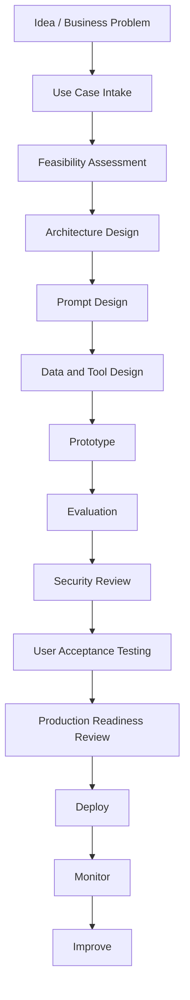
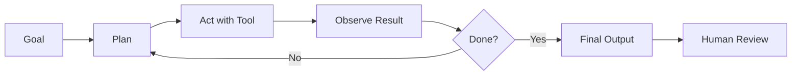

# Claude Lifecycle, Frameworks, and Reference

## 13. Development Lifecycle

### 13.1 Lifecycle Diagram



### 13.2 Lifecycle Details

| Phase | Key Questions | Deliverables |
|---|---|---|
| Intake | What problem are we solving? Who owns it? | Intake form |
| Feasibility | Is Claude the right fit? | Feasibility note |
| Architecture | What systems, tools, and data are involved? | Architecture diagram |
| Prompt design | What role, rules, and output are needed? | Prompt template |
| Tool design | What APIs can Claude call? | Tool specs |
| Evaluation | What does good look like? | Eval dataset |
| Security | What can go wrong? | Threat model |
| UAT | Do users trust and understand it? | Signoff |
| Production | Is it supportable? | Runbook |
| Monitoring | Is it working over time? | Metrics dashboard |

---

## 14. Frameworks

### 14.1 RAG — Retrieval-Augmented Generation

RAG means retrieving trusted information and giving it to Claude so it can answer from that context.

Plain-English:

> RAG is how Claude answers from your documents instead of guessing.

Use RAG when:

| Use RAG When | Example |
|---|---|
| Knowledge changes | Policy documents, procedures |
| Answers need evidence | Legal summaries, compliance notes |
| Data is private | Internal documentation |
| You need citations | Audit-friendly answers |

Avoid weak RAG patterns:

| Weak Pattern | Better Pattern |
|---|---|
| Dump entire document library | Retrieve relevant chunks |
| No source metadata | Include title, date, owner, version |
| No citation requirement | Require evidence per claim |
| No stale-data check | Include source freshness |

### 14.2 Tool-Augmented Generation

Tool-augmented generation means Claude can request external actions or data.

Use when:

| Need | Example |
|---|---|
| Current data | Search latest status |
| Private data | Query internal API |
| Action | Create ticket |
| Calculation | Run code |
| System interaction | Use MCP or controlled computer use |

### 14.3 Agentic Workflow Framework

An agentic workflow gives Claude a goal, tools, memory/context, and a loop for planning and acting.



### 14.4 Human-in-the-Loop Framework

| Decision Type | Human Role |
|---|---|
| Informational | Review if needed |
| Internal draft | Edit and approve |
| Customer-facing | Approve before send |
| Financial/legal/regulated | Specialist approval |
| Destructive system action | Explicit approval or block |

### 14.5 DRAG Framework for Practical AI Work

Use this lightweight framework for enterprise AI tasks:

| Step | Meaning | Example |
|---|---|---|
| Define | Define the business problem and output | “Create a renewal exception summary.” |
| Retrieve | Provide approved context | Policy data, SOP, exception rules |
| Analyze | Claude reasons over the context | Identify missing fields and risk |
| Govern | Apply controls and approval | Human review, logging, escalation |

---

## 15. Tools

### 15.1 Anthropic / Claude Tools

| Tool | Use |
|---|---|
| Claude Chat | Interactive writing, analysis, brainstorming |
| Claude Projects | Persistent workspaces with files and context |
| Claude API | Build custom applications |
| Claude Console | Test prompts, evaluate, manage API work |
| Messages API | Fine-grained model interactions |
| Managed Agents | Long-running/asynchronous agent infrastructure |
| Claude Code | Codebase work, terminal/IDE agent |
| Claude Cowork | Multi-step knowledge work across files/apps |
| MCP Connector | Connect Claude to remote MCP servers |
| Computer use | Controlled desktop interaction |
| Code execution | Run sandboxed analysis and file generation |
| Web search / web fetch | Retrieve current information with citations |
| Prompt caching | Reduce cost/latency for repeated context |
| Batch API | Process high-volume asynchronous jobs |

### 15.2 Enterprise Tools Claude Often Connects To

| System | Typical Claude Use |
|---|---|
| Jira / Azure DevOps | Read tickets, create implementation plans |
| GitHub / Azure Repos | Review PRs, inspect code, generate docs |
| Databricks | Query governed data and metadata |
| SharePoint / OneDrive | Retrieve business documents |
| Slack / Teams | Summarize threads, coordinate work |
| ServiceNow / Zendesk | Triage tickets |
| Power Platform | Explain flows, generate API integration patterns |
| Power BI | Explain datasets, metric definitions, migration plans |
| Confluence | Knowledge base retrieval |
| SQL Server / Postgres | Query operational data through approved tools |

### 15.3 Supporting Engineering Tools

| Tool | Use |
|---|---|
| Git | Version prompts, code, MCP configs |
| CI/CD | Run tests and deploy safely |
| OpenTelemetry | Agent observability |
| Secrets manager | Protect API keys and tokens |
| Feature flags | Roll out AI features gradually |
| Data catalog | Govern source definitions |
| SIEM | Monitor security events |
| Cost dashboards | Track usage and spend |

---

## 16. Quick Reference

### 16.1 Claude Surface Decision Rules

| Need | Use |
|---|---|
| Ask questions, draft, summarize | Claude Chat |
| Team workspace with reusable docs | Claude Projects |
| Build an app or workflow | Claude API |
| Codebase work | Claude Code |
| Multi-step knowledge task across files/apps | Claude Cowork |
| Connect external tools/data | MCP or tool use |
| Long-running autonomous workflow | Managed Agents or Agent SDK |
| High-volume offline work | Batch API |
| Repeated long context | Prompt caching |

### 16.2 Model Selection Rules

| Workload | Starting Point |
|---|---|
| Simple classification | Haiku |
| Standard enterprise assistant | Sonnet |
| Complex coding / architecture | Sonnet or Opus |
| Hard reasoning / agent orchestration | Opus |
| Long-running frontier agent work | Validate advanced models |
| Cost-sensitive high volume | Haiku + evals |
| Unclear workload | Start with Sonnet, evaluate alternatives |

### 16.3 Prompt Checklist

```text
[ ] Role is clear
[ ] Task is specific
[ ] Context is provided
[ ] Output format is defined
[ ] Constraints are explicit
[ ] Source of truth is identified
[ ] Unknowns must be stated
[ ] Risks must be surfaced
[ ] Human approval point is clear
```

### 16.4 API Request Skeleton

```python
import anthropic

client = anthropic.Anthropic()

response = client.messages.create(
    model="claude-sonnet-5",
    max_tokens=2000,
    system="You are a careful enterprise automation architect.",
    messages=[
        {
            "role": "user",
            "content": "Review this automation design and identify risks."
        }
    ],
)

print(response.content)
```

### 16.5 Tool Design Skeleton

```json
{
  "name": "lookup_policy",
  "description": "Look up approved policy attributes by policy number. Use only when the user asks for policy-specific facts.",
  "input_schema": {
    "type": "object",
    "properties": {
      "policy_number": {
        "type": "string",
        "description": "The policy number to look up."
      }
    },
    "required": ["policy_number"]
  }
}
```

### 16.6 MCP Design Rules

| Rule | Practical Meaning |
|---|---|
| One server per domain when possible | Keep ownership clear |
| Use least privilege | Do not expose admin tools by default |
| Separate read and write tools | Easier approval design |
| Describe tools clearly | Claude chooses tools based on descriptions |
| Log every call | Required for support and audit |
| Add approval for write actions | Prevent unwanted changes |
| Version tool contracts | Avoid breaking agents |
| Test malicious inputs | Prompt injection is a real risk |

### 16.7 Claude Code Starter Commands

```bash
# macOS, Linux, WSL
curl -fsSL https://claude.ai/install.sh | bash
```

```powershell
# Windows PowerShell
irm https://claude.ai/install.ps1 | iex
```

### 16.8 Production Readiness Rule of Thumb

```text
If Claude can affect a customer, employee, legal position, financial transaction,
production system, or regulated record, it needs documented controls, testing,
logging, and human approval.
```

---

## 17. Meeting Talking Points

### 17.1 Questions to Ask Anthropic / Vendor / Internal AI Platform Team

| Topic | Question |
|---|---|
| Model selection | Which model should we start with for our workload and why? |
| Data retention | Which features are ZDR eligible and which are not? |
| Compliance | Are our use cases covered under our enterprise agreement? |
| MCP | Which MCP servers are approved or supported? |
| Tool governance | How do we restrict read vs write actions? |
| Auditability | Can we see user prompts, outputs, tool calls, and approvals? |
| Cost | How should we estimate and cap spend? |
| Evals | What evaluation approach is recommended before production? |
| Security | How do we handle prompt injection from external tools/documents? |
| Claude Code | What permissions should developers grant locally? |
| Cowork | What workloads should not use Cowork yet? |
| Support | Who handles incidents, model behavior issues, and integration failures? |
| Change management | How are model upgrades tested before rollout? |

### 17.2 Executive Talking Points

- Claude is not just a chatbot; it is an AI platform for reasoning, analysis, coding, tool use, and multi-step work.
- The safest enterprise path is to start with low-risk internal use cases, define controls, then expand.
- The value comes from combining Claude with trusted data, approved tools, measurable evals, and human approval.
- MCP can reduce integration friction, but it introduces new governance requirements around permissions, tool ownership, and auditability.
- Claude Code can accelerate engineering, but it should operate through branches, tests, PRs, and review.
- Cowork can help business teams complete multi-step document and file work, but sensitive or regulated workloads require extra review.
- AI outputs should be treated as drafts or recommendations unless the workflow has been formally validated.

### 17.3 Architecture Review Talking Points

- What is the source of truth?
- What data does Claude receive?
- What tools can Claude call?
- Which actions are read-only versus write-enabled?
- Where does human approval happen?
- How are prompts and tool definitions versioned?
- What happens when Claude is wrong?
- How do we measure quality?
- What logs are retained?
- What is the rollback process?

---
