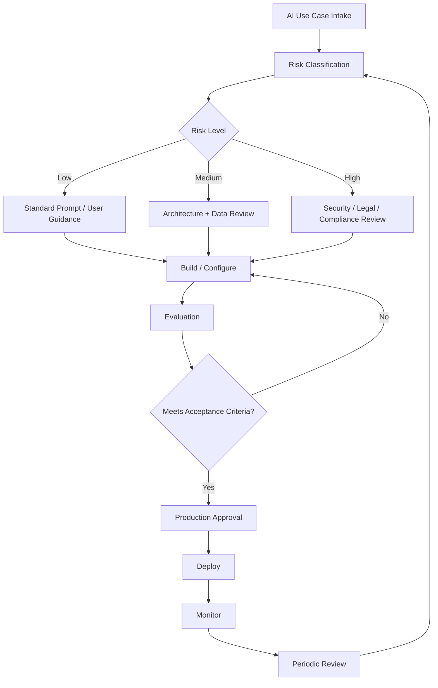
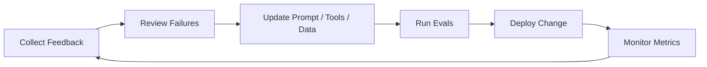

# Claude Operations, Governance, and Improvement

## 10. Troubleshooting Guide

### 10.1 Output Is Wrong or Hallucinated

| Symptom | Likely Cause | Fix |
|---|---|---|
| Claude invents facts | No grounding source | Provide source documents or retrieval |
| Claude overstates confidence | Prompt encourages completion over honesty | Tell Claude to say “I don’t know” |
| Claude cites irrelevant evidence | Retrieval quality issue | Improve chunking, ranking, filters |
| Claude mixes old and new data | Context conflict | Label sources with dates and authority |
| Claude makes unsupported claims | No evidence requirement | Require claims + supporting quotes |

### 10.2 Tool Calls Fail

| Symptom | Likely Cause | Fix |
|---|---|---|
| Wrong tool selected | Tool descriptions are vague | Improve descriptions and examples |
| Invalid parameters | Schema unclear | Tighten input schema |
| Permission denied | Token/service account lacks access | Check IAM and scopes |
| Tool loops repeatedly | No stopping condition | Add max tool calls and completion rules |
| Tool returns too much data | Query too broad | Add filters and pagination |
| Tool exposes sensitive info | Permission too broad | Reduce scope and mask outputs |

### 10.3 Claude Code Makes Bad Changes

| Symptom | Likely Cause | Fix |
|---|---|---|
| Edits too many files | Prompt too broad | Tell Claude exact files and boundaries |
| Breaks tests | No test-first instruction | Require test plan and test execution |
| Misunderstands architecture | No repo orientation | Ask for analysis before edits |
| Deletes useful code | No approval gate | Use branch, diff review, checkpoints |
| Misses downstream impact | No lineage context | Provide dependency graph or ask it to inspect |

### 10.4 Cost Is Too High

| Cause | Fix |
|---|---|
| Re-sending long documents | Use prompt caching or Files API where appropriate |
| Too many tools in every call | Dynamically load relevant tools |
| Large context every turn | Summarize, compact, or retrieve only needed chunks |
| Using Opus for simple work | Evaluate Haiku or Sonnet |
| Long-running agents without limits | Add budgets, max turns, and stop conditions |

### 10.5 Latency Is Too High

| Cause | Fix |
|---|---|
| Model too large | Test smaller model |
| Too many sequential tool calls | Parallelize independent lookups |
| Prompt too long | Trim or cache context |
| Output too verbose | Set concise output requirements |
| Repeated reasoning | Use templates and structured instructions |

---

## 11. Governance

Governance is the operating system around Claude. It defines who can use it, what data can be sent, which tools it can access, how outputs are reviewed, and how risk is monitored.

### 11.1 Governance Operating Model

### 11.2 Governance Checklist

| Area | Question | Required Control |
|---|---|---|
| Use case | What business problem is being solved? | Intake record |
| Data | What data will Claude see? | Data classification |
| Retention | Is ZDR required? | Feature-level retention review |
| Access | Who can use it? | RBAC / SSO |
| Tools | What can Claude call? | Tool allowlist |
| Actions | Can Claude write, send, delete, approve, or transact? | Human approval |
| Accuracy | How will output quality be measured? | Evals |
| Security | Could prompt injection or data leakage occur? | Threat model |
| Audit | Can we reconstruct what happened? | Logs |
| Support | Who owns failures? | Runbook |
| Change control | How are prompts/tools updated? | Versioning and review |

### 11.3 Risk Classification

| Risk Level | Example | Control Level |
|---|---|---|
| Low | Draft an internal meeting agenda | User review |
| Medium | Summarize internal docs | Approved source + human review |
| High | Generate customer-facing response | QA + approval |
| Very high | Legal, medical, financial, employment, regulated decisions | Specialist review, compliance approval |
| Restricted | Autonomous production changes, payments, credential access | Usually not allowed without strict controls |

---

## 12. Continuous Improvement

Claude solutions should improve through measurement, not opinion.

### 12.1 Improvement Loop

### 12.2 Metrics to Track

| Metric | Why It Matters |
|---|---|
| Accuracy rate | Measures correctness |
| Human edit rate | Shows how much rework is needed |
| Escalation rate | Shows when Claude cannot complete task |
| Tool success rate | Measures integration reliability |
| Tool error rate | Highlights API or permission issues |
| Latency | Impacts user adoption |
| Cost per task | Supports ROI decisions |
| Token usage | Helps optimize prompts and context |
| Policy violation rate | Governance and safety |
| User satisfaction | Adoption and trust |

### 12.3 Review Cadence

| Cadence | Activity |
|---|---|
| Weekly | Review errors, cost spikes, user feedback |
| Monthly | Refresh eval set, update prompts, review incidents |
| Quarterly | Reassess model choice, data access, governance controls |
| Major release | Re-run regression evals against new Claude models |

---
