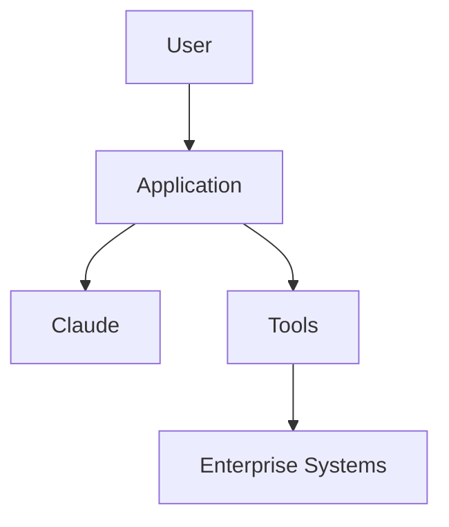
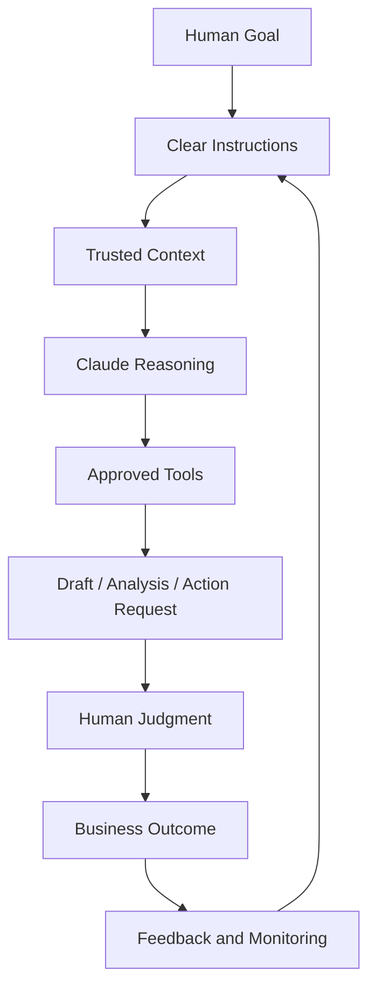

# Claude Reusable Templates

## 21. Reusable Templates

### 21.1 Use Case Intake Template

```markdown
# Claude Use Case Intake

## 1. Business Problem
What problem are we solving?

## 2. Current Process
How is the work done today?

## 3. Proposed Claude Role
What should Claude do?

- [ ] Summarize
- [ ] Classify
- [ ] Draft
- [ ] Extract
- [ ] Reason
- [ ] Call tools
- [ ] Modify code
- [ ] Perform multi-step workflow

## 4. Users
Who will use this?

## 5. Data Involved
What data will Claude see?

## 6. Data Classification
- [ ] Public
- [ ] Internal
- [ ] Confidential
- [ ] Regulated
- [ ] Restricted

## 7. Systems Involved
List APIs, databases, documents, repositories, or tools.

## 8. Output
What should Claude produce?

## 9. Human Approval
Where is human review required?

## 10. Risks
What could go wrong?

## 11. Success Metrics
How will we measure success?

## 12. Owner
Business owner:
Technical owner:
Support owner:
```

---

### 21.2 Design Document Template

````markdown
# Claude Solution Design Document

## 1. Overview
Briefly describe the solution.

## 2. Business Objective
State the measurable business goal.

## 3. Scope
### In Scope
### Out of Scope

## 4. Users and Personas

## 5. Architecture



## 6. Data Flow

## 7. Prompt Design
Include prompt template, variables, and examples.

## 8. Tool Design
List tools, owners, permissions, and schemas.

## 9. Model Selection
Chosen model:
Reason:
Fallback model:

## 10. Evaluation Plan
Test cases:
Acceptance criteria:

## 11. Security and Governance
Data classification:
Retention:
Access controls:
Approval gates:

## 12. Monitoring
Metrics:
Logs:
Alerts:

## 13. Deployment Plan

## 14. Rollback Plan

## 15. Support Model
Owner:
Runbook:
Escalation:
````

---

### 21.3 Prompt Template

```markdown
# Prompt Template

## Role
You are a [role].

## Task
Your task is to [specific task].

## Context
Use the following context:
[context]

## Inputs
[input variables]

## Rules
- Do not invent facts.
- Use only the provided sources.
- State unknowns clearly.
- Flag risks and assumptions.
- Ask for approval before consequential actions.

## Output Format
Return:

| Field | Description |
|---|---|
| Summary | Brief answer |
| Evidence | Source-backed facts |
| Risks | Issues or uncertainties |
| Recommendation | Next best action |
| Confidence | High / Medium / Low |

## Quality Bar
A good answer is accurate, concise, sourced, actionable, and clear about uncertainty.
```

---

### 21.4 MCP Server Design Template

```markdown
# MCP Server Design

## 1. Server Name

## 2. Business Domain
Example: Jira, Databricks, SharePoint, Policy Admin

## 3. Owner
Technical owner:
Business owner:

## 4. Purpose
What data or tools does this expose?

## 5. Tools Exposed

| Tool | Read/Write | Description | Approval Required |
|---|---|---|---|

## 6. Resources Exposed

| Resource | Description | Sensitivity |
|---|---|---|

## 7. Authentication

## 8. Authorization

## 9. Rate Limits

## 10. Logging

## 11. Error Handling

## 12. Security Controls
- Least privilege
- Input validation
- Output filtering
- Prompt injection handling
- Audit logging

## 13. Test Cases

## 14. Production Readiness Decision
Approved / Not approved:
Approver:
Date:
```

---

### 21.5 Troubleshooting Checklist

```markdown
# Claude Troubleshooting Checklist

## Problem
Describe the issue.

## Symptoms
- [ ] Wrong answer
- [ ] Missing data
- [ ] Invalid JSON
- [ ] Tool failure
- [ ] Timeout
- [ ] High cost
- [ ] Security concern
- [ ] User complaint

## Recent Changes
Prompt changed?
Model changed?
Tool changed?
Data source changed?
Permissions changed?

## Evidence
Request ID:
Prompt version:
Model:
Tool calls:
Input sources:
Output:
Error message:

## Diagnosis
Likely cause:

## Fix
Immediate fix:
Long-term fix:

## Follow-Up
Update evals?
Update prompt?
Update tool schema?
Update runbook?
Notify users?
```

---

### 21.6 Governance Checklist

```markdown
# Claude Governance Checklist

## Use Case
Name:
Owner:
Risk level:

## Data
- [ ] Data classified
- [ ] Sensitive fields minimized
- [ ] Retention reviewed
- [ ] Source system approved

## Access
- [ ] User authentication
- [ ] Role-based access
- [ ] Least privilege
- [ ] Service account reviewed

## Tools
- [ ] Tool owner assigned
- [ ] Tool schema documented
- [ ] Read/write separated
- [ ] Write actions require approval
- [ ] Logs enabled

## Evaluation
- [ ] Test cases created
- [ ] Accuracy threshold defined
- [ ] Failure examples tested
- [ ] Regression test process defined

## Production
- [ ] Monitoring enabled
- [ ] Cost tracking enabled
- [ ] Support owner assigned
- [ ] Rollback plan documented
- [ ] Human review process documented
```

---

### 21.7 Production Readiness Checklist

```markdown
# Claude Production Readiness Checklist

## Architecture
- [ ] Architecture diagram completed
- [ ] Data flow documented
- [ ] Tool flow documented
- [ ] Failure paths documented

## Security
- [ ] Secrets protected
- [ ] Access reviewed
- [ ] Sensitive data minimized
- [ ] Prompt injection risks reviewed

## Quality
- [ ] Eval suite passed
- [ ] Human review completed
- [ ] Output format validated
- [ ] Edge cases tested

## Operations
- [ ] Logs available
- [ ] Dashboard available
- [ ] Alerts configured
- [ ] Runbook published
- [ ] Support owner assigned

## Change Control
- [ ] Prompt versioned
- [ ] Tool versioned
- [ ] Model version documented
- [ ] Rollback tested

## Approval
Business owner:
Technical owner:
Security:
Compliance:
Go-live date:
```

---

### 21.8 Code Review Checklist for Claude-Assisted Work

```markdown
# Claude-Assisted Code Review Checklist

## Scope
- [ ] Change matches requested scope
- [ ] No unrelated files changed
- [ ] No generated clutter added

## Correctness
- [ ] Tests pass
- [ ] Edge cases handled
- [ ] Error handling included
- [ ] No broken dependencies

## Security
- [ ] No secrets exposed
- [ ] No unsafe permissions added
- [ ] Inputs validated
- [ ] Logs do not expose sensitive data

## Maintainability
- [ ] Naming is clear
- [ ] Comments are useful
- [ ] Code follows project conventions
- [ ] Documentation updated

## AI-Specific Review
- [ ] Claude assumptions reviewed
- [ ] Generated code manually inspected
- [ ] Prompt/output saved if required
- [ ] Risks documented
```

---

### 21.9 Meeting Agenda Template

```markdown
# Claude Use Case Review Meeting

## Objective
Review the proposed Claude use case and decide next steps.

## Agenda
1. Business problem
2. Current process pain points
3. Proposed Claude role
4. Data and systems involved
5. Tool/MCP requirements
6. Risk classification
7. Human approval points
8. Evaluation approach
9. Architecture review
10. Decision and next steps

## Decisions Needed
- Proceed / pause / redesign
- Risk level
- Required approvals
- MVP scope
- Owner assignments
```

---

### 21.10 Support Runbook Template

```markdown
# Claude Solution Support Runbook

## System Name

## Owner
Business:
Technical:
Support:

## What It Does

## Common Failures

| Failure | Cause | Resolution |
|---|---|---|

## Monitoring

| Metric | Alert Threshold | Owner |
|---|---|---|

## Logs
Where to find logs:

## Escalation
Level 1:
Level 2:
Security:
Vendor:

## Rollback
Steps:

## Known Limitations

## Last Reviewed
Date:
Reviewer:
```

---

## 22. Final Mental Model

Think of Claude as a **reasoning engine inside a governed enterprise workflow**.



The practical mental model:

```text
Claude is not the process owner.
Claude is not the source of truth.
Claude is not the approval authority.

Claude is the reasoning and execution assistant.

The enterprise system around Claude must provide:
- the goal,
- the trusted context,
- the allowed tools,
- the rules,
- the evaluation,
- the approval path,
- the logs,
- and the continuous improvement loop.
```

The best Claude implementations are not the flashiest ones. They are the ones that are clear, measurable, secure, supportable, and useful enough that people actually trust them in real work.
