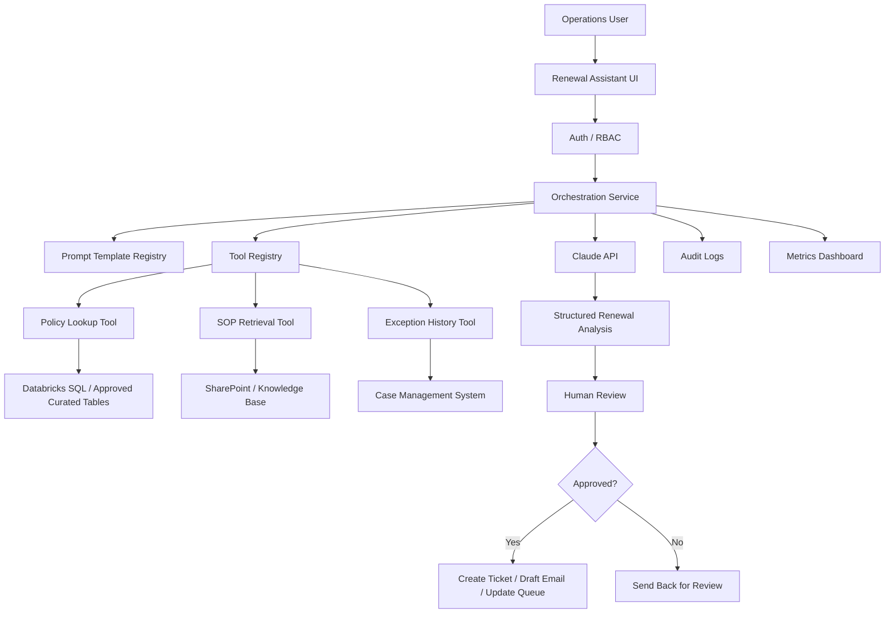

# Claude Worked Example and Learning Path

## 18. Example Scenario

### Scenario: Enterprise Policy Renewal Assistant

#### Business Problem

An insurance operations team manually reviews renewal-related policy records, supporting documents, email context, and exception rules. The process is slow, inconsistent, and difficult to scale. The team wants Claude to help identify missing policy attributes, summarize renewal readiness, draft exception notes, and recommend next actions.

#### Technical Solution

Build a governed Claude-powered renewal assistant that:

1. Accepts a policy number or batch of policies.
2. Retrieves approved policy attributes from Databricks through a read-only API or SQL service.
3. Retrieves relevant SOP rules from a governed knowledge base.
4. Uses Claude to analyze readiness and generate a structured output.
5. Requires human approval before any downstream action.
6. Logs prompts, retrieved sources, tool calls, outputs, user approvals, and exceptions.

#### Example Architecture



#### Step-by-Step Process

| Step | Description |
|---|---|
| 1 | User enters policy number |
| 2 | App validates user permissions |
| 3 | App calls policy lookup tool |
| 4 | App retrieves SOP rules relevant to renewal |
| 5 | Claude receives only approved context |
| 6 | Claude returns structured readiness analysis |
| 7 | User reviews recommendations |
| 8 | User approves or rejects downstream action |
| 9 | System logs full trace |
| 10 | Metrics feed improvement dashboard |

#### Example Output Schema

```json
{
  "policy_number": "string",
  "renewal_readiness": "ready | blocked | needs_review",
  "missing_attributes": ["string"],
  "risk_flags": ["string"],
  "source_evidence": [
    {
      "source": "string",
      "quote_or_field": "string"
    }
  ],
  "recommended_next_action": "string",
  "requires_human_approval": true,
  "confidence": "high | medium | low"
}
```

#### Risks

| Risk | Mitigation |
|---|---|
| Claude uses stale rules | Retrieve only current approved SOP content |
| Claude invents missing facts | Require evidence per claim |
| Incorrect policy lookup | Validate tool output and policy ID |
| Sensitive data leakage | Send minimum necessary fields |
| Unauthorized action | Require approval for write tools |
| Cost growth | Use token budgets, caching, and model evaluation |
| Poor adoption | Provide clear UI, training, and override paths |

#### Governance Considerations

| Area | Control |
|---|---|
| Data access | Read-only service principal |
| Human approval | Required before ticket/email/update |
| Audit | Log prompt version, tool calls, sources, output |
| Evaluation | Test known renewal scenarios |
| Security | Prompt injection checks on retrieved documents |
| Change control | Version prompt and SOP retrieval logic |
| Support | Runbook for tool/API/model failures |

#### Monitoring Approach

| Metric | Target |
|---|---|
| Analysis accuracy | 95%+ against sampled human review |
| Missing-field detection | High recall for required fields |
| Human override rate | Track by rule/category |
| Average processing time | Lower than manual baseline |
| Cost per policy | Within approved budget |
| Tool error rate | Below agreed threshold |
| Escalation rate | Reviewed weekly |

---

## 19. Beginner-to-Pro Learning Path

### Level 1: Beginner

| Area | Details |
|---|---|
| Learn | What Claude is, what prompts are, how to ask clear questions |
| Practice | Summarize documents, draft emails, explain code snippets |
| Be able to do | Use Claude as a personal productivity assistant |
| Avoid | Trusting outputs without review, vague prompts, sharing sensitive data |

### Level 2: Advanced Beginner

| Area | Details |
|---|---|
| Learn | Prompt structure, system instructions, context, output formats |
| Practice | Create reusable prompts for meeting prep, documentation, code review |
| Be able to do | Produce consistent outputs with clear instructions |
| Avoid | Overly long prompts, undefined success criteria, no examples |

### Level 3: Intermediate

| Area | Details |
|---|---|
| Learn | Messages API, model selection, tokens, structured outputs, tool use |
| Practice | Build a small Claude-powered app or API workflow |
| Be able to do | Integrate Claude into a controlled application |
| Avoid | Hardcoding model assumptions, skipping error handling, ignoring cost |

### Level 4: Advanced

| Area | Details |
|---|---|
| Learn | MCP, RAG, Claude Code, evals, prompt caching, batch processing |
| Practice | Build a retrieval assistant, connect one approved tool, create eval tests |
| Be able to do | Design governed enterprise Claude workflows |
| Avoid | Tool sprawl, weak permissions, no monitoring, poor grounding |

### Level 5: Pro / Enterprise Architect

| Area | Details |
|---|---|
| Learn | Multi-agent systems, managed agents, security architecture, governance, observability |
| Practice | Design an enterprise AI operating model and production support process |
| Be able to do | Lead Claude adoption across teams with standards and controls |
| Avoid | Vendor hype, unmanaged autonomy, lack of auditability, no ROI measurement |

---

## 20. Repository Placement

Recommended folder structure:

```text
knowledge-repository/
└── artificial-intelligence/
    └── claude-anthropic/
        ├── README.md
        ├── reference-guide.md
        ├── quick-reference.md
        ├── architecture.md
        ├── api-patterns.md
        ├── prompt-engineering.md
        ├── mcp.md
        ├── claude-code.md
        ├── claude-cowork.md
        ├── multi-agent-workflows.md
        ├── troubleshooting.md
        ├── governance.md
        ├── security-and-risk.md
        ├── evaluation.md
        ├── templates/
        │   ├── use-case-intake.md
        │   ├── design-document.md
        │   ├── prompt-template.md
        │   ├── mcp-server-design.md
        │   ├── production-readiness.md
        │   ├── code-review-checklist.md
        │   ├── support-runbook.md
        │   └── architecture-review.md
        └── examples/
            ├── policy-renewal-assistant.md
            ├── document-extraction-agent.md
            ├── claude-code-repo-review.md
            └── mcp-databricks-lookup.md
```

### Suggested README.md

```markdown
# Claude by Anthropic

This folder contains enterprise-ready learning, architecture, governance, and implementation guidance for Claude.

## Start Here

1. Read `reference-guide.md`
2. Review `quick-reference.md`
3. Use `templates/use-case-intake.md` for new ideas
4. Use `governance.md` before production use
5. Use `examples/` for implementation patterns

## Key Topics

- Claude models
- Messages API
- Prompt engineering
- Tool use
- MCP
- Claude Code
- Claude Cowork
- Multi-agent workflows
- Governance
- Evaluation
- Production readiness
```

---
