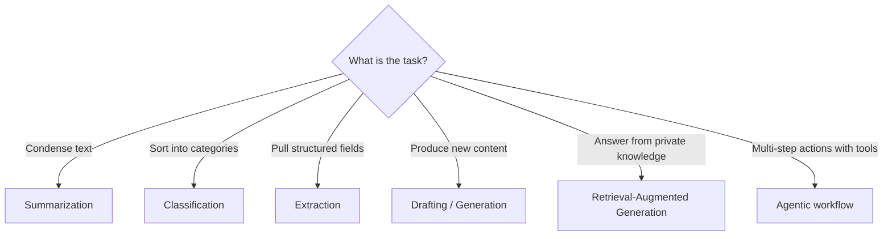
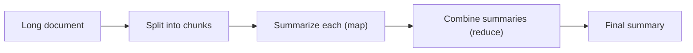
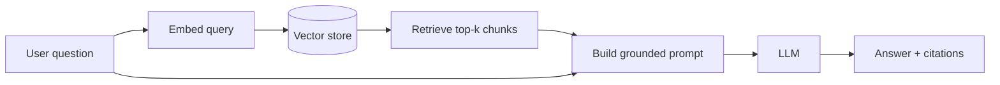
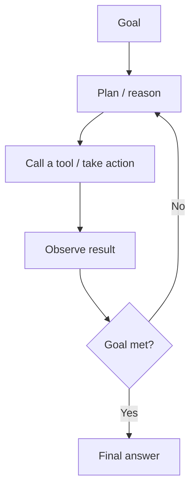

# Applied AI — Repeatable Patterns

> Reusable ways to apply LLMs and ML to common work: summarization, classification, extraction, drafting, RAG, and agents. Each pattern lists when to use it, the shape of the solution, a visual, and evaluation/guardrail notes.

## Choosing a Pattern



## The Prompt Contract (applies to all patterns)

A reliable prompt states five things: **role, task, context, constraints, and output format**.

| Element | Purpose |
|---|---|
| Role | Sets perspective and tone |
| Task | The single, explicit objective |
| Context | Inputs, background, examples |
| Constraints | What to avoid, length, policy |
| Output format | JSON schema, headings, etc. — enables parsing |

## Pattern 1: Summarization

**Use when:** condensing documents, meetings, threads.

- Specify audience, length, and focus ("executive summary, 5 bullets, decisions only").
- For long inputs, use **map-reduce**: summarize chunks, then summarize the summaries.
- Evaluate for faithfulness (no invented facts) and coverage.



## Pattern 2: Classification

**Use when:** routing, tagging, triage, sentiment.

- Provide the exact label set and a definition for each label.
- Force a constrained output (return one of the allowed labels only).
- Add a "none/uncertain" label to avoid forced wrong answers.
- Evaluate with a labeled set: accuracy, precision/recall, confusion matrix.

## Pattern 3: Extraction

**Use when:** turning unstructured text into structured data.

- Provide a strict **JSON schema**; ask for that schema only.
- Use `null` for missing fields rather than guessing.
- Validate output against the schema; retry on parse failure.

```json
{
  "invoice_number": "string | null",
  "total_amount": "number | null",
  "due_date": "YYYY-MM-DD | null"
}
```

## Pattern 4: Drafting / Generation

**Use when:** first-draft emails, docs, code, replies.

- Give examples of good outputs (few-shot) and a clear style guide.
- Keep a human-in-the-loop review step for anything published.
- Constrain scope to reduce hallucination and drift.

## Pattern 5: Retrieval-Augmented Generation (RAG)

**Use when:** answering from private/approved knowledge that the model wasn't trained on.



| Stage | Key choices |
|---|---|
| Ingest | Chunk size/overlap, metadata, embeddings model |
| Retrieve | top-k, hybrid (keyword + vector), reranking |
| Generate | Ground strictly in retrieved context; cite sources |
| Guardrail | "I don't know" when context is insufficient |

## Pattern 6: Agentic Workflow

**Use when:** tasks need planning, tool calls, and multiple steps.



- Give the agent a bounded tool set and clear stop conditions.
- Add step/iteration limits and human approval for risky actions.
- Log every step (plan, tool, result) for auditability.

## Evaluation & Guardrails (all patterns)

| Concern | Approach |
|---|---|
| Hallucination | Ground in sources; require citations; "I don't know" option |
| Consistency | Fixed prompts, low temperature for deterministic tasks |
| Quality | Golden test set; LLM-as-judge with rubrics; human review |
| Safety | Content filtering, PII handling, policy checks |
| Cost/latency | Cache, smaller models for simple steps, limit retries |

## Common Mistakes & Fixes

- **No output schema** — specify JSON/format so results are parseable.
- **Ungrounded answers** — use RAG and require citations for factual tasks.
- **No evaluation set** — build a small labeled set before scaling.
- **Over-powered agents** — start with the simplest pattern that works.
- **No human review on published output** — keep a review gate.

## Red Flags

- Factual answers with no source grounding.
- Prompts that mix many tasks in one call.
- Agents with unbounded tool access or no stop condition.
- Shipping to production with no evaluation or monitoring.

## Beginner-to-Pro Notes

| Level | Focus |
|---|---|
| Beginner | Write clear prompts with role/task/format. |
| Advanced Beginner | Few-shot examples, classification, extraction schemas. |
| Intermediate Practitioner | Map-reduce summarization, basic RAG. |
| Advanced Practitioner | Hybrid retrieval, reranking, evaluation harnesses. |
| Enterprise Professional | Guardrails, monitoring, cost/latency optimization. |
| Architect / Strategic Lead | Pattern selection standards, governance, platform design. |
