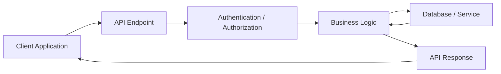
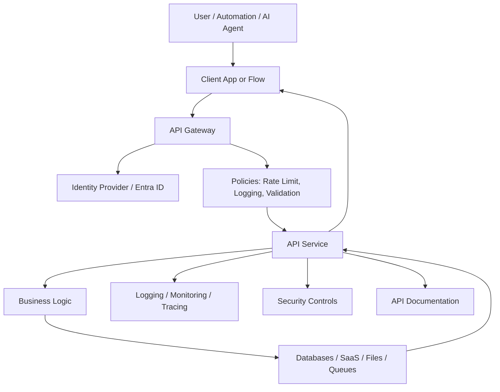
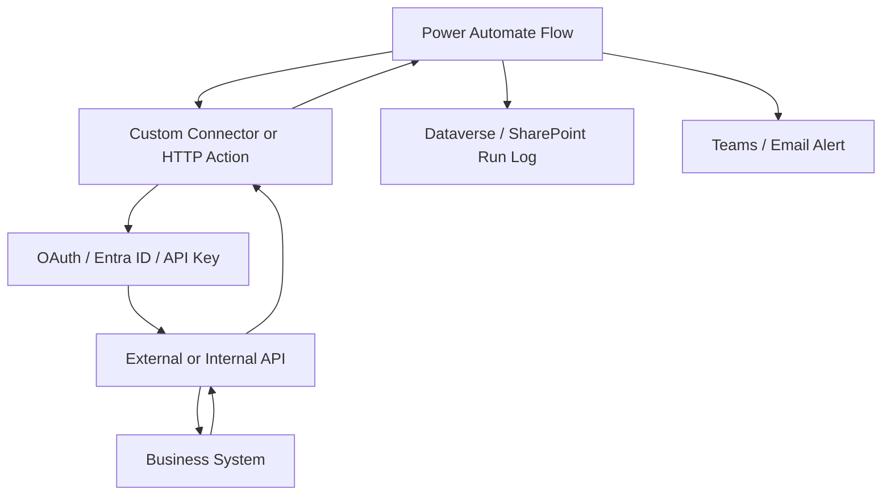
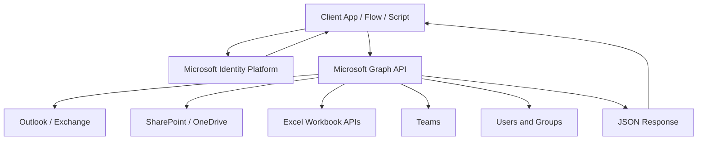
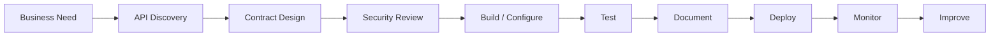
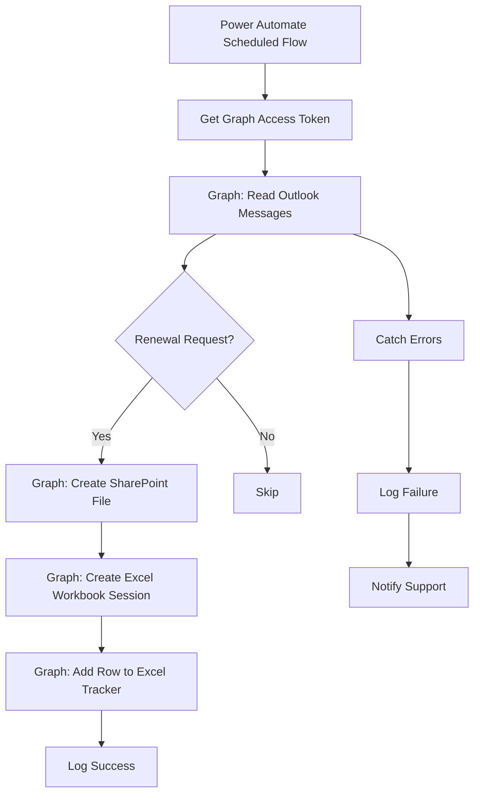

# APIs Reference Guide

---

## 1. Executive Summary

An **API**, or **Application Programming Interface**, is a structured way for one system to communicate with another system.

In plain terms, an API lets software ask another system to do something or return information.

Examples:

```text
Get the latest emails from Outlook.
Create a file in SharePoint.
Update a row in an Excel workbook.
Fetch policy data from Databricks.
Generate a PDF from a document service.
Send an approval request.
Create a ticket in Jira or ServiceNow.
```

For a technical professional, APIs are one of the most important concepts to master because they are the foundation of modern integration, automation, data movement, cloud applications, AI workflows, and enterprise architecture.

APIs help teams answer:

* How do systems exchange data?
* How do automations interact with business applications?
* How do we avoid manual copy/paste work?
* How do we securely expose business capabilities?
* How do we connect Power Platform, Databricks, SharePoint, Outlook, Excel, SQL, Azure, and third-party systems?
* How do we govern access, errors, rate limits, and sensitive data?

For enterprise automation and data work, APIs are not optional knowledge. They are a core professional skill.

---

## 2. Plain-English Explanation

Think of an API like a restaurant menu.

You do not walk into the kitchen and make the food yourself. You look at the menu, choose an item, place an order, and the kitchen returns the result.

An API works similarly:

```text
Client asks for something
   ↓
API receives the request
   ↓
System processes the request
   ↓
API returns a response
```

Example:

```http
GET /users/123
```

Plain-English meaning:

```text
Please get me information about user 123.
```

Response:

```json
{
  "id": "123",
  "displayName": "Dionne Artsen",
  "email": "dionne@example.com"
}
```

The API acts as a controlled front door into a system.

---

## 3. Business Context

APIs matter because most business processes depend on multiple systems.

A single workflow may involve:

* Outlook
* SharePoint
* Excel
* Dataverse
* Databricks
* SQL Server
* Power Automate
* UiPath
* ServiceNow
* Salesforce
* Azure Functions
* Power BI
* Custom internal applications
* Vendor platforms

Without APIs, teams often rely on:

* Manual exports
* Email attachments
* Copy/paste work
* Screen scraping
* Shared spreadsheets
* Fragile desktop automation
* Duplicate data entry

With APIs, teams can create structured, secure, repeatable integrations.

### Business Value of APIs

| Business Need | How APIs Help                                                     |
| ------------- | ----------------------------------------------------------------- |
| Automation    | APIs let workflows trigger actions across systems                 |
| Data access   | APIs expose data without direct database access                   |
| Security      | APIs control authentication, permissions, and scope               |
| Scalability   | APIs allow repeatable machine-to-machine communication            |
| Governance    | APIs create traceable, auditable integration points               |
| Speed         | APIs reduce manual handoffs and delays                            |
| Reliability   | APIs reduce dependency on fragile UI automation                   |
| AI enablement | APIs allow AI agents and copilots to safely call business systems |
| Reusability   | One API can support many applications and workflows               |

---

## 4. Core Concepts

---

### 4.1 API

An **API** defines how systems communicate.

It usually specifies:

* Available operations
* Required inputs
* Response format
* Authentication method
* Permissions
* Error messages
* Rate limits
* Versioning rules

---

### 4.2 Client

The **client** is the system making the API request.

Examples:

* Power Automate flow
* Power App
* Python script
* Azure Function
* UiPath bot
* Web application
* Mobile app
* Postman
* AI agent
* Custom connector

---

### 4.3 Server

The **server** is the system receiving the request and returning a response.

Examples:

* Microsoft Graph
* Databricks API
* SharePoint API
* ServiceNow API
* Salesforce API
* Internal enterprise API
* PDF generation API

---

### 4.4 Endpoint

An **endpoint** is a specific URL where an API operation is available.

Example:

```http
GET https://graph.microsoft.com/v1.0/me/messages
```

Plain-English meaning:

```text
Get messages for the signed-in Microsoft 365 user.
```

---

### 4.5 HTTP Methods

Most modern APIs use HTTP methods.

| Method   | Meaning                | Example                 |
| -------- | ---------------------- | ----------------------- |
| `GET`    | Read data              | Get emails              |
| `POST`   | Create or submit data  | Create a folder         |
| `PUT`    | Replace or upload data | Upload a file           |
| `PATCH`  | Partially update data  | Update an Excel range   |
| `DELETE` | Delete data            | Delete a file or record |

---

### 4.6 Request

A **request** is what the client sends to the API.

A request usually includes:

* Method
* URL
* Headers
* Query parameters
* Body

Example:

```http
GET https://graph.microsoft.com/v1.0/me/messages?$top=10
Authorization: Bearer {access_token}
Accept: application/json
```

---

### 4.7 Response

A **response** is what the API sends back.

Example:

```json
{
  "value": [
    {
      "subject": "Renewal Notice",
      "from": {
        "emailAddress": {
          "address": "broker@example.com"
        }
      },
      "receivedDateTime": "2026-07-04T13:45:00Z"
    }
  ]
}
```

---

### 4.8 Headers

**Headers** carry metadata about the request or response.

Common headers:

| Header                | Purpose                                                         |
| --------------------- | --------------------------------------------------------------- |
| `Authorization`       | Sends access token or credential                                |
| `Content-Type`        | Tells API the format of request body                            |
| `Accept`              | Tells API preferred response format                             |
| `Retry-After`         | Tells client when to retry after throttling                     |
| `workbook-session-id` | Used by Microsoft Graph Excel APIs to scope workbook operations |

---

### 4.9 Query Parameters

Query parameters refine the request.

Example:

```http
GET /messages?$top=10&$select=subject,from,receivedDateTime
```

Common Microsoft Graph query options:

| Query Option | Purpose                               |
| ------------ | ------------------------------------- |
| `$select`    | Return only specific fields           |
| `$filter`    | Filter records                        |
| `$top`       | Limit number of records               |
| `$orderby`   | Sort results                          |
| `$expand`    | Include related objects               |
| `$count`     | Return count metadata where supported |

---

### 4.10 Request Body

A **body** sends data to the API.

Example:

```json
{
  "name": "Renewal Notices",
  "folder": {},
  "@microsoft.graph.conflictBehavior": "rename"
}
```

---

### 4.11 Authentication

Authentication answers:

```text
Who are you?
```

Common authentication patterns:

| Pattern            | Description                                                |
| ------------------ | ---------------------------------------------------------- |
| API key            | Simple key passed with request                             |
| Bearer token       | Access token passed in `Authorization` header              |
| OAuth 2.0          | Standard authorization framework                           |
| Client credentials | App authenticates as itself                                |
| Authorization code | User signs in and grants access                            |
| Managed identity   | Azure-hosted resource authenticates without stored secrets |
| Certificate auth   | App proves identity using certificate                      |

---

### 4.12 Authorization

Authorization answers:

```text
What are you allowed to do?
```

Example:

A user may be authenticated but not authorized to read another user’s mailbox or update a SharePoint file.

Microsoft Graph uses delegated and application permission models. Delegated access means the app acts on behalf of a signed-in user, while app-only access means the app acts as itself without a signed-in user. Microsoft Graph exposes delegated permissions and application permissions to support these scenarios.

---

### 4.13 Status Codes

APIs return HTTP status codes to describe the result.

| Status Code                 | Meaning                               |
| --------------------------- | ------------------------------------- |
| `200 OK`                    | Request succeeded                     |
| `201 Created`               | Resource created                      |
| `202 Accepted`              | Request accepted for async processing |
| `204 No Content`            | Success with no body                  |
| `400 Bad Request`           | Request is malformed                  |
| `401 Unauthorized`          | Authentication failed or missing      |
| `403 Forbidden`             | Authenticated but not allowed         |
| `404 Not Found`             | Resource not found                    |
| `409 Conflict`              | Conflict with current state           |
| `429 Too Many Requests`     | Throttled or rate-limited             |
| `500 Internal Server Error` | Server error                          |
| `503 Service Unavailable`   | Service temporarily unavailable       |

---

### 4.14 Payload

A **payload** is the data sent to or returned from an API.

Most modern APIs use JSON.

Example:

```json
{
  "policyNumber": "POL123456",
  "insuredName": "ABC Construction LLC",
  "renewalDate": "2026-09-01"
}
```

---

### 4.15 Schema

A **schema** defines the expected shape of data.

Example:

```json
{
  "type": "object",
  "required": ["policyNumber", "insuredName"],
  "properties": {
    "policyNumber": { "type": "string" },
    "insuredName": { "type": "string" },
    "renewalDate": { "type": "string", "format": "date" }
  }
}
```

Schemas are important for validation, documentation, AI tool calling, and reliable integration.

---

### 4.16 REST API

A **REST API** exposes resources through URLs and standard HTTP methods.

Example:

```http
GET /policies/123
POST /policies
PATCH /policies/123
DELETE /policies/123
```

REST is common because it is simple, web-native, and widely supported.

---

### 4.17 GraphQL API

A **GraphQL API** lets the client specify exactly what fields it wants.

Example:

```graphql
query {
  policy(id: "123") {
    policyNumber
    insuredName
    premium
  }
}
```

GraphQL is useful when clients need flexible data retrieval, but it requires strong governance to avoid expensive queries.

---

### 4.18 Webhook

A **webhook** lets one system notify another system when something happens.

Example:

```text
When a new file is added to SharePoint,
send an HTTP request to a Power Automate flow.
```

Webhooks are event-driven.

---

### 4.19 Pagination

Pagination is how APIs return large results in smaller pages.

Example:

```json
{
  "value": [...],
  "@odata.nextLink": "https://graph.microsoft.com/v1.0/me/messages?$skip=10"
}
```

With Microsoft Graph mail APIs, do not manually extract and manipulate `$skip` from `@odata.nextLink`; Microsoft documents that the API uses `$skip` internally to count all items it has processed in the mailbox.

---

### 4.20 Throttling

**Throttling** happens when too many requests are made too quickly.

Microsoft Graph recommends detecting HTTP `429`, reading the `Retry-After` response header, waiting that many seconds, and retrying.

---

## 5. Architecture View

---

### 5.1 Basic API Architecture



---

### 5.2 Enterprise API Architecture



---

### 5.3 Power Platform API Architecture



---

### 5.4 Microsoft Graph Architecture



Microsoft Graph is the common API layer for many Microsoft 365 resources, including Outlook mail, SharePoint files, OneDrive files, Excel workbooks, Teams, users, and groups.

---

## 6. Data / Process Flow

A typical API process follows this sequence:

```text
1. Identify business need.
2. Identify source and target systems.
3. Determine API endpoint.
4. Register app or obtain credentials.
5. Request access token or API key.
6. Build request.
7. Send request.
8. Receive response.
9. Validate response.
10. Handle errors and retries.
11. Log the transaction.
12. Continue downstream process.
```

### Example Flow

```text
Power Automate receives request
   ↓
Gets access token
   ↓
Calls Microsoft Graph
   ↓
Reads Outlook messages
   ↓
Filters messages by subject
   ↓
Creates SharePoint file
   ↓
Updates Excel workbook
   ↓
Logs success or failure
```

---

## 7. Common Use Cases

---

### 7.1 Reading Email

Examples:

* Read Outlook mailbox messages
* Find emails with attachments
* Process shared mailbox requests
* Monitor incoming customer submissions
* Trigger downstream automation

Microsoft Graph supports accessing data in users’ primary mailboxes and shared mailboxes, including mail, calendar, and contacts data stored in Exchange Online or supported hybrid deployments. It does not support in-place archive mailboxes.

---

### 7.2 Creating Files

Examples:

* Create a SharePoint document
* Upload a generated PDF
* Save an email attachment
* Store automation output
* Archive reports

Microsoft Graph represents files and folders in OneDrive and SharePoint document libraries as `driveItem` resources, and drive items can be addressed by ID or by path.

---

### 7.3 Editing Excel Workbooks

Examples:

* Update status trackers
* Insert rows into a workbook
* Read workbook tables
* Update a named range
* Write automation results to a worksheet

The Microsoft Graph Excel APIs can use workbook sessions. Microsoft recommends using the `workbook-session-id` header to improve performance, although the header is not required for an Excel API call to work.

---

### 7.4 Calling Databricks

Examples:

* Execute SQL statement
* Fetch curated automation data
* Retrieve policy attributes
* Pull monitoring metrics
* Query a Delta table through a SQL warehouse

---

### 7.5 Generating Documents

Examples:

* Send data to a PDF generation API
* Create renewal notices
* Create customer letters
* Generate invoices
* Generate exception reports

---

### 7.6 AI Tool Calling

Examples:

* AI agent calls a policy lookup API
* AI assistant retrieves knowledge base records
* Copilot calls an enterprise API through a connector
* Claude or ChatGPT calls an API using a JSON schema

APIs are the bridge between AI reasoning and real enterprise systems.

---

## 8. Microsoft Graph API Examples

---

# 8.1 Authentication Pattern for Microsoft Graph

Most Microsoft Graph calls require a Bearer token.

General header:

```http
Authorization: Bearer {access_token}
```

For background automations, the common enterprise pattern is **client credentials flow**, where an app authenticates as itself instead of acting on behalf of a signed-in user. In the Microsoft identity platform client credentials flow, permissions are granted directly to the application by an administrator, and no user is involved at runtime. Microsoft also recommends using supported Microsoft Authentication Libraries, or MSAL, when possible.

### Token Request Example: Client Credentials

```http
POST https://login.microsoftonline.com/{tenant-id}/oauth2/v2.0/token
Content-Type: application/x-www-form-urlencoded
```

Body:

```text
client_id={client-id}
&scope=https://graph.microsoft.com/.default
&client_secret={client-secret}
&grant_type=client_credentials
```

Example response:

```json
{
  "token_type": "Bearer",
  "expires_in": 3599,
  "access_token": "eyJ0eXAiOiJKV1QiLCJ..."
}
```

### Important Security Note

Do not hardcode secrets in Power Automate, source code, Git repos, Excel files, or configuration files. Prefer:

* Azure Key Vault
* Managed identity where supported
* Certificate-based authentication
* Secured custom connector
* Environment variables with appropriate protection
* Enterprise secret management tools

---

# 8.2 Graph API Example: Read Outlook Emails

## Use Case

Read recent Outlook messages from a user mailbox or shared mailbox.

---

## Endpoint: Signed-In User Mailbox

```http
GET https://graph.microsoft.com/v1.0/me/messages?$top=10&$select=id,subject,from,receivedDateTime,hasAttachments
Authorization: Bearer {access_token}
Accept: application/json
```

---

## Endpoint: Specific User Mailbox

```http
GET https://graph.microsoft.com/v1.0/users/{user-id-or-upn}/messages?$top=10&$select=id,subject,from,receivedDateTime,hasAttachments
Authorization: Bearer {access_token}
Accept: application/json
```

Example:

```http
GET https://graph.microsoft.com/v1.0/users/automation.sharedmailbox@company.com/messages?$top=10&$select=id,subject,from,receivedDateTime,hasAttachments
```

---

## Endpoint: Inbox Folder

```http
GET https://graph.microsoft.com/v1.0/users/{user-id-or-upn}/mailFolders/Inbox/messages?$top=25&$select=id,subject,from,receivedDateTime,bodyPreview,hasAttachments
Authorization: Bearer {access_token}
Accept: application/json
```

---

## Filter by Subject

```http
GET https://graph.microsoft.com/v1.0/users/{user-id-or-upn}/messages?$filter=contains(subject,'Renewal')&$select=id,subject,from,receivedDateTime
Authorization: Bearer {access_token}
Accept: application/json
```

---

## Sort by Received Date

```http
GET https://graph.microsoft.com/v1.0/users/{user-id-or-upn}/messages?$top=25&$orderby=receivedDateTime desc&$select=id,subject,from,receivedDateTime
Authorization: Bearer {access_token}
Accept: application/json
```

---

## Example Response

```json
{
  "@odata.context": "https://graph.microsoft.com/v1.0/$metadata#users('automation.sharedmailbox%40company.com')/messages(id,subject,from,receivedDateTime,hasAttachments)",
  "value": [
    {
      "id": "AAMkAGVm...",
      "subject": "Renewal Notice Request - POL123456",
      "receivedDateTime": "2026-07-04T13:45:00Z",
      "hasAttachments": true,
      "from": {
        "emailAddress": {
          "name": "Broker Team",
          "address": "broker@example.com"
        }
      }
    }
  ]
}
```

---

## Power Automate Usage Pattern

```text
HTTP - Get Access Token
   ↓
HTTP - Get Outlook Messages from Graph
   ↓
Parse JSON
   ↓
Apply to each message
   ↓
Filter by subject/body/sender
   ↓
Create business request
   ↓
Log result
```

---

## Permissions to Discuss With Admins

Possible permissions depend on delegated versus application access and the exact mailbox scenario.

Typical examples:

| Scenario                                             | Possible Permission                           |
| ---------------------------------------------------- | --------------------------------------------- |
| Read signed-in user mail                             | `Mail.Read` delegated                         |
| Read mail across mailboxes using app-only automation | `Mail.Read` application or higher as approved |
| Read and modify messages                             | `Mail.ReadWrite`                              |
| Send email                                           | `Mail.Send`                                   |

Use least privilege. Microsoft Graph’s permission guidance specifically warns that granting more privileges than necessary increases exposure to unauthorized or unintended access.

---

# 8.3 Graph API Example: Create a File in SharePoint

## Use Case

Create or upload a file into a SharePoint document library.

Microsoft Graph supports uploading or replacing the contents of a drive item in a single API call for files up to 250 MB; larger files should use an upload session.

---

## Step 1: Identify the Site

Common pattern:

```http
GET https://graph.microsoft.com/v1.0/sites/{hostname}:/sites/{site-path}
Authorization: Bearer {access_token}
```

Example:

```http
GET https://graph.microsoft.com/v1.0/sites/contoso.sharepoint.com:/sites/Automation
Authorization: Bearer {access_token}
```

Response includes:

```json
{
  "id": "contoso.sharepoint.com,abc123,def456",
  "name": "Automation",
  "webUrl": "https://contoso.sharepoint.com/sites/Automation"
}
```

---

## Step 2: Upload a Small File by Path

```http
PUT https://graph.microsoft.com/v1.0/sites/{site-id}/drive/root:/Shared Documents/Renewal Notices/RenewalNotice_POL123456.txt:/content
Authorization: Bearer {access_token}
Content-Type: text/plain

Renewal notice content goes here.
```

---

## Step 3: Upload a PDF File by Path

```http
PUT https://graph.microsoft.com/v1.0/sites/{site-id}/drive/root:/Shared Documents/Renewal Notices/RenewalNotice_POL123456.pdf:/content
Authorization: Bearer {access_token}
Content-Type: application/pdf

{binary_pdf_content}
```

---

## Step 4: Create a Folder

```http
POST https://graph.microsoft.com/v1.0/sites/{site-id}/drive/root:/Shared Documents:/children
Authorization: Bearer {access_token}
Content-Type: application/json
```

Body:

```json
{
  "name": "Renewal Notices",
  "folder": {},
  "@microsoft.graph.conflictBehavior": "rename"
}
```

---

## Example Response

```json
{
  "id": "01ABCDEF...",
  "name": "RenewalNotice_POL123456.pdf",
  "webUrl": "https://contoso.sharepoint.com/sites/Automation/Shared%20Documents/Renewal%20Notices/RenewalNotice_POL123456.pdf",
  "size": 24567,
  "file": {
    "mimeType": "application/pdf"
  }
}
```

---

## Power Automate Usage Pattern

```text
HTTP - Get Access Token
   ↓
HTTP - Upload File to SharePoint via Graph
   ↓
Parse Graph Response
   ↓
Store webUrl in run log
   ↓
Send email with link or attachment
```

---

## Permissions to Discuss With Admins

Possible permissions:

| Scenario                            | Possible Permission                                                     |
| ----------------------------------- | ----------------------------------------------------------------------- |
| Read files current user can access  | `Files.Read` delegated                                                  |
| Write files current user can access | `Files.ReadWrite` delegated                                             |
| App-only write across SharePoint    | `Files.ReadWrite.All` or `Sites.ReadWrite.All`, depending on governance |
| Restrict app to selected sites      | `Sites.Selected` plus explicit site grant pattern                       |

The exact permission model should be confirmed with the Microsoft Graph permissions reference and your tenant governance standards.

---

# 8.4 Graph API Example: Edit and Scope Microsoft Excel Workbooks

## Use Case

Use Microsoft Graph to update an Excel workbook stored in SharePoint or OneDrive.

Examples:

* Update a tracking worksheet
* Write automation run status
* Update named ranges
* Insert data into a table
* Read scoped workbook data
* Modify only a specific worksheet/range

---

## Excel Scope Mental Model

```text
Tenant
   ↓
Site
   ↓
Drive / Document Library
   ↓
DriveItem / Workbook File
   ↓
Workbook Session
   ↓
Worksheet
   ↓
Range / Table / Named Item
   ↓
Cell Values / Formats / Formulas
```

The goal is to scope your API call as narrowly as possible:

```text
Do not update the whole workbook.
Update the specific workbook file, worksheet, range, table, or named item.
```

---

## Step 1: Create a Workbook Session

```http
POST https://graph.microsoft.com/v1.0/sites/{site-id}/drive/items/{item-id}/workbook/createSession
Authorization: Bearer {access_token}
Content-Type: application/json
```

Body:

```json
{
  "persistChanges": true
}
```

Response:

```json
{
  "id": "{session-id}",
  "persistChanges": true
}
```

Use the session ID in later requests:

```http
workbook-session-id: {session-id}
```

Microsoft documents that the session ID returned from `createSession` should be passed on subsequent Excel API requests using the `workbook-session-id` header.

---

## Step 2: List Worksheets

```http
GET https://graph.microsoft.com/v1.0/sites/{site-id}/drive/items/{item-id}/workbook/worksheets
Authorization: Bearer {access_token}
workbook-session-id: {session-id}
Accept: application/json
```

Example response:

```json
{
  "value": [
    {
      "id": "{worksheet-id}",
      "name": "RunLog",
      "position": 0,
      "visibility": "Visible"
    },
    {
      "id": "{worksheet-id-2}",
      "name": "Config",
      "position": 1,
      "visibility": "Visible"
    }
  ]
}
```

---

## Step 3: Read a Specific Range

```http
GET https://graph.microsoft.com/v1.0/sites/{site-id}/drive/items/{item-id}/workbook/worksheets/RunLog/range(address='A1:E10')
Authorization: Bearer {access_token}
workbook-session-id: {session-id}
Accept: application/json
```

---

## Step 4: Update a Specific Range

```http
PATCH https://graph.microsoft.com/v1.0/sites/{site-id}/drive/items/{item-id}/workbook/worksheets/RunLog/range(address='A2:E2')
Authorization: Bearer {access_token}
Content-Type: application/json
workbook-session-id: {session-id}
```

Body:

```json
{
  "values": [
    [
      "RUN-000123",
      "POL123456",
      "Success",
      "2026-07-04T13:45:00Z",
      "Renewal notice emailed"
    ]
  ]
}
```

Microsoft’s range update API supports updating values, number formats, and formulas; `null` can be used to ignore a cell for a particular input.

---

## Step 5: Update a Named Range

Named ranges are useful for stable automation because they avoid relying on hardcoded cell coordinates.

Example:

```http
PATCH https://graph.microsoft.com/v1.0/sites/{site-id}/drive/items/{item-id}/workbook/names/LastRunStatus/range
Authorization: Bearer {access_token}
Content-Type: application/json
workbook-session-id: {session-id}
```

Body:

```json
{
  "values": [
    [
      "Success"
    ]
  ]
}
```

---

## Step 6: Update a Table Row

If the workbook has a table named `AutomationRunLog`, use a table-based pattern rather than raw cell coordinates.

```http
POST https://graph.microsoft.com/v1.0/sites/{site-id}/drive/items/{item-id}/workbook/tables/AutomationRunLog/rows/add
Authorization: Bearer {access_token}
Content-Type: application/json
workbook-session-id: {session-id}
```

Body:

```json
{
  "values": [
    [
      "RUN-000123",
      "POL123456",
      "Success",
      "2026-07-04T13:45:00Z",
      "Renewal notice emailed"
    ]
  ]
}
```

---

## Recommended Excel API Scoping Rules

| Need                              | Preferred Scope                                       |
| --------------------------------- | ----------------------------------------------------- |
| Update one value                  | Named range or exact cell                             |
| Update one row                    | Table row                                             |
| Update tracker                    | Excel table                                           |
| Update formulas                   | Specific range                                        |
| Read config values                | Named ranges or config table                          |
| Large structured dataset          | Prefer Dataverse, SQL, or Databricks instead of Excel |
| Mission-critical system of record | Avoid Excel as the primary system of record           |

---

## Power Automate Usage Pattern

```text
HTTP - Get Access Token
   ↓
HTTP - Create Workbook Session
   ↓
HTTP - Read Worksheet / Range / Table
   ↓
HTTP - Update Range or Add Table Row
   ↓
HTTP - Close Session if applicable
   ↓
Log result
```

---

## Important Excel API Guidance

Use Excel APIs for controlled workbook automation, not as a replacement for a real database.

Good uses:

```text
Update small trackers.
Read controlled config sheets.
Write audit rows.
Modify a known range.
```

Risky uses:

```text
Large transactional workloads.
Concurrent writes from many automations.
Unbounded ranges.
Critical system-of-record updates.
Complex workbooks with volatile formulas.
```

---

## 9. Best Practices

---

### 9.1 Start With the Business Process

Before choosing an API, understand:

* What process is being automated?
* What data is needed?
* Which system owns the data?
* Which system should be updated?
* Who is allowed to perform the action?
* What happens when the API fails?
* What needs to be logged?

---

### 9.2 Use the Right Integration Pattern

| Situation                           | Recommended Pattern                     |
| ----------------------------------- | --------------------------------------- |
| Simple read/write to SaaS           | REST API                                |
| Microsoft 365 data                  | Microsoft Graph                         |
| Internal enterprise service         | Internal API                            |
| Reusable Power Platform integration | Custom connector                        |
| Event-driven notification           | Webhook                                 |
| Long-running operation              | Async API or queue                      |
| High-volume data extraction         | Data pipeline, not repeated API polling |
| Legacy UI only                      | RPA as fallback                         |

---

### 9.3 Prefer APIs Over UI Automation

Use APIs when available.

APIs are usually:

* More stable
* More secure
* Easier to monitor
* Easier to test
* Easier to scale
* Less fragile than screen automation

Use UI automation only when:

* No API exists
* No database access exists
* No export mechanism exists
* Business value justifies the fragility

---

### 9.4 Use Least Privilege

Ask for the minimum permission needed.

Bad:

```text
Request full tenant-wide access when only one SharePoint site is needed.
```

Better:

```text
Request access only to the mailbox, site, file, table, or operation required.
```

---

### 9.5 Use Pagination Correctly

Do not assume the first API response contains all data.

Look for:

```json
"@odata.nextLink"
```

Then continue calling the next link until all pages are retrieved.

---

### 9.6 Handle Throttling

For Microsoft Graph:

```text
If status code = 429
Read Retry-After header
Wait
Retry
Repeat if needed
```

Do not retry immediately in a tight loop.

---

### 9.7 Validate Inputs and Outputs

Validate:

* Required fields
* Data types
* Null values
* Expected status codes
* Response body shape
* Business rules
* Duplicate records
* Empty arrays

---

### 9.8 Log Every Important Transaction

For production automations, log:

* Request ID
* Correlation ID
* API endpoint
* Method
* Status code
* Start time
* End time
* Business key
* Error message
* Retry count
* Environment
* Caller identity

---

### 9.9 Never Store Secrets in Code

Avoid storing secrets in:

* Git repositories
* Power Automate plain text actions
* Excel files
* SharePoint lists
* unsecured environment variables
* scripts on local machines

Use:

* Azure Key Vault
* managed identity
* certificates
* secure pipeline variables
* custom connector security configuration

---

### 9.10 Document API Contracts

A good API contract includes:

* Endpoint
* Method
* Authentication
* Required permissions
* Request headers
* Query parameters
* Request body
* Response body
* Status codes
* Error examples
* Rate limits
* Version
* Owner
* Support contact

---

## 10. Common Mistakes

---

### Mistake 1: Confusing Authentication and Authorization

Authentication:

```text
Who are you?
```

Authorization:

```text
What are you allowed to do?
```

A valid token does not guarantee access to the requested resource.

---

### Mistake 2: Using Too-Broad Permissions

Bad:

```text
Give app full read/write access to all SharePoint sites.
```

Better:

```text
Scope the app to the minimum required site, library, folder, or operation where possible.
```

---

### Mistake 3: Ignoring Pagination

Problem:

```text
Flow processes only first 100 records and misses the rest.
```

Better:

```text
Follow nextLink until complete.
```

---

### Mistake 4: Ignoring Rate Limits

Problem:

```text
Automation works in testing but fails under production volume.
```

Better:

```text
Handle 429, Retry-After, batching, and backoff.
```

---

### Mistake 5: Hardcoding URLs and IDs

Bad:

```text
Hardcode production SharePoint site ID directly in a flow.
```

Better:

```text
Use environment variables or configuration tables.
```

---

### Mistake 6: No Error Handling

Problem:

```text
API call fails and no one knows why.
```

Better:

```text
Capture status code, response body, correlation ID, and failed endpoint.
```

---

### Mistake 7: Treating Excel Like a Database

Problem:

```text
Multiple automations write to the same workbook at the same time.
```

Better:

```text
Use Excel for lightweight controlled workbooks.
Use Dataverse, SQL, or Databricks for transactional workloads.
```

---

### Mistake 8: Not Versioning API Changes

Problem:

```text
API response changes and downstream automations break.
```

Better:

```text
Version API contracts and test consumers before release.
```

---

### Mistake 9: Not Testing Negative Scenarios

Test:

* Missing token
* Expired token
* Wrong permission
* Bad request body
* Empty response
* Duplicate request
* API timeout
* Throttling
* Partial failure

---

### Mistake 10: Overusing APIs for Bulk Data Movement

APIs are excellent for operational transactions, but poor for huge repeated extracts when a data pipeline is more appropriate.

Use:

```text
API for operational action.
Pipeline for large-scale data movement.
```

---

## 11. Troubleshooting Guide

---

### 11.1 API Troubleshooting Checklist

```markdown
# API Troubleshooting Checklist

## Request

- [ ] Is the endpoint correct?
- [ ] Is the HTTP method correct?
- [ ] Are headers correct?
- [ ] Is the request body valid JSON?
- [ ] Are query parameters encoded correctly?
- [ ] Is the resource ID correct?

## Authentication

- [ ] Is the token present?
- [ ] Is the token expired?
- [ ] Is the token for the correct tenant?
- [ ] Is the token audience correct?
- [ ] Is the client secret or certificate valid?

## Authorization

- [ ] Does the app have required API permissions?
- [ ] Was admin consent granted?
- [ ] Does the user or app have resource access?
- [ ] Is the mailbox/site/file shared correctly?
- [ ] Is RBAC also required?

## Response

- [ ] What is the HTTP status code?
- [ ] What is the error message?
- [ ] Is there a correlation ID?
- [ ] Is there a Retry-After header?
- [ ] Is response pagination being handled?

## Data

- [ ] Are required fields present?
- [ ] Are values in the expected format?
- [ ] Are arrays empty?
- [ ] Are dates/time zones handled correctly?
- [ ] Are duplicate records possible?
```

---

### 11.2 Common Status Code Troubleshooting

| Code  | Meaning      | Likely Cause                                | Fix                                                 |
| ----- | ------------ | ------------------------------------------- | --------------------------------------------------- |
| `400` | Bad request  | Invalid JSON, missing parameter, bad filter | Validate request body and query syntax              |
| `401` | Unauthorized | Missing/expired token                       | Refresh token or fix authentication                 |
| `403` | Forbidden    | Permission or RBAC issue                    | Check API permissions and resource access           |
| `404` | Not found    | Wrong ID/path/resource                      | Validate site ID, drive ID, item ID, worksheet name |
| `409` | Conflict     | Duplicate or locked resource                | Handle conflict behavior                            |
| `429` | Throttled    | Too many requests                           | Honor `Retry-After`                                 |
| `500` | Server error | API/system issue                            | Retry safely and escalate                           |
| `503` | Unavailable  | Service overloaded/down                     | Retry with backoff                                  |

---

### 11.3 Microsoft Graph Troubleshooting

Common issues:

| Issue                         | Possible Cause                                       |
| ----------------------------- | ---------------------------------------------------- |
| `InvalidAuthenticationToken`  | Token expired, wrong audience, malformed token       |
| `Authorization_RequestDenied` | Missing permissions or admin consent                 |
| `AccessDenied`                | App/user lacks resource access                       |
| `ResourceNotFound`            | Wrong site, drive, item, mailbox, worksheet, or path |
| `TooManyRequests`             | Throttling                                           |
| Excel session `404`           | Workbook session expired                             |

Microsoft’s Excel API documentation notes that if a session ID expires, the API can return `404`; in that case, create a new session and continue.

---

## 12. Governance

API governance ensures integrations are secure, supportable, reliable, and aligned with enterprise architecture.

---

### 12.1 API Ownership

Every API should have:

* Business owner
* Technical owner
* Support owner
* Data owner
* Security contact
* Documentation owner

---

### 12.2 Access Governance

Control:

* Who can call the API
* What app registrations exist
* Which permissions are granted
* Who approved admin consent
* Whether permissions are delegated or application-based
* Whether access is reviewed periodically
* Whether access is removed when no longer needed

---

### 12.3 Data Governance

Ask:

* What data is exposed?
* Is it sensitive?
* Is it regulated?
* Is it customer data?
* Can it leave the tenant?
* Is it logged?
* Is it encrypted?
* How long is it retained?

---

### 12.4 API Change Governance

Before changing an API:

* Identify consumers
* Check downstream dependencies
* Version breaking changes
* Notify stakeholders
* Update documentation
* Provide migration timeline
* Test in lower environment
* Monitor after release

---

### 12.5 Security Governance

Recommended controls:

* Least privilege
* Admin consent review
* Secret rotation
* Certificate-based auth where appropriate
* Managed identity where possible
* API gateway policies
* Logging and monitoring
* Rate limiting
* IP restrictions where appropriate
* DLP policies for Power Platform
* Periodic access reviews

---

### 12.6 Power Platform Governance for APIs

For Power Platform:

* Prefer custom connectors for reusable APIs.
* Use connection references in solutions.
* Use environment variables for endpoints.
* Avoid personal credentials for production flows.
* Govern HTTP connector usage with DLP policies.
* Log API calls for critical automations.
* Use service accounts or managed identity patterns where approved.
* Do not expose sensitive API payloads in unnecessary run history.

---

## 13. Continuous Improvement

APIs should be treated as products, not one-off technical endpoints.

---

### 13.1 API Metrics

Track:

| Metric                          | Why It Matters                 |
| ------------------------------- | ------------------------------ |
| Request count                   | Measures usage                 |
| Error rate                      | Measures reliability           |
| Latency                         | Measures performance           |
| Throttling rate                 | Shows scale pressure           |
| Authentication failures         | Shows credential/config issues |
| Authorization failures          | Shows permission issues        |
| Consumer count                  | Shows dependency footprint     |
| Breaking incidents              | Shows governance maturity      |
| Retry count                     | Shows instability              |
| Business transactions processed | Shows value                    |

---

### 13.2 Improvement Questions

Ask monthly:

* Which APIs fail most often?
* Which integrations are most business-critical?
* Which apps have over-privileged permissions?
* Which APIs lack documentation?
* Which APIs have no owner?
* Which consumers are still using old versions?
* Which API calls should be replaced by data pipelines?
* Which UI automations could be replaced by APIs?
* Which APIs should become custom connectors?

---

## 14. Development Lifecycle

A mature API lifecycle looks like this:



---

### 14.1 Lifecycle Stages

| Stage     | Activity                                    |
| --------- | ------------------------------------------- |
| Intake    | Define integration need                     |
| Discovery | Identify source system and API capability   |
| Design    | Define endpoint, payload, auth, permissions |
| Security  | Review access and data sensitivity          |
| Build     | Implement client, connector, or API         |
| Test      | Validate success and failure scenarios      |
| Deploy    | Move through dev/test/prod                  |
| Monitor   | Track usage, failures, performance          |
| Improve   | Optimize, version, retire, or scale         |

---

## 15. Frameworks

---

### 15.1 API Fit Framework

Use this to decide whether an API is the right pattern.

| Question                                   | Good API Candidate | Poor API Candidate  |
| ------------------------------------------ | ------------------ | ------------------- |
| Is the process repeatable?                 | Yes                | No                  |
| Is the system accessible programmatically? | Yes                | No                  |
| Is real-time or near-real-time needed?     | Yes                | No                  |
| Is volume moderate and transactional?      | Yes                | Huge bulk extract   |
| Are permissions manageable?                | Yes                | No clear ownership  |
| Is the payload structured?                 | Yes                | Highly unstructured |
| Is business logic clear?                   | Yes                | No                  |
| Is monitoring required?                    | Yes                | Unknown             |

---

### 15.2 API vs RPA Decision Framework

| Question                                | Prefer API  | Prefer RPA          |
| --------------------------------------- | ----------- | ------------------- |
| Does the system expose API access?      | Yes         | No                  |
| Is the UI unstable?                     | API         | RPA risky           |
| Is high volume expected?                | API         | RPA may struggle    |
| Is auditability important?              | API         | Possible but harder |
| Is user interface interaction required? | Not usually | Yes                 |
| Is integration reusable?                | API         | Less reusable       |

---

### 15.3 API Security Framework

```text
Identity
   ↓
Permission
   ↓
Scope
   ↓
Validation
   ↓
Logging
   ↓
Monitoring
   ↓
Review
```

Questions:

* Who is calling?
* What are they allowed to do?
* What data can they access?
* Is the request valid?
* Is the activity logged?
* Are failures monitored?
* Is access reviewed?

---

### 15.4 API Error Handling Framework

```text
Detect
   ↓
Classify
   ↓
Retry if safe
   ↓
Fail gracefully if not safe
   ↓
Log
   ↓
Alert
   ↓
Recover
```

Retry safe examples:

* `429 Too Many Requests`
* `503 Service Unavailable`
* temporary network timeout

Do not blindly retry:

* payment submissions
* record creation without idempotency
* email sends
* destructive updates
* API calls with side effects

---

### 15.5 API Documentation Framework

Every API should document:

```text
Purpose
Endpoint
Method
Authentication
Permissions
Headers
Parameters
Request body
Response body
Status codes
Examples
Limits
Owner
Support process
Version history
```

---

## 16. Tools

---

### 16.1 API Testing Tools

| Tool                     | Purpose                           |
| ------------------------ | --------------------------------- |
| Postman                  | Build, test, document APIs        |
| Insomnia                 | API testing client                |
| curl                     | Command-line API testing          |
| PowerShell               | Scripted API automation           |
| VS Code REST Client      | Test API calls from `.http` files |
| Microsoft Graph Explorer | Explore Microsoft Graph APIs      |
| Swagger UI               | Explore OpenAPI documentation     |
| Bruno                    | Git-friendly API client           |

---

### 16.2 API Development Tools

| Tool                 | Purpose                             |
| -------------------- | ----------------------------------- |
| Azure Functions      | Build lightweight APIs              |
| Azure API Management | API gateway and governance          |
| Azure Logic Apps     | Integration workflows               |
| Power Automate       | Low-code API orchestration          |
| Custom Connectors    | Reusable Power Platform API wrapper |
| Databricks APIs      | Data platform operations            |
| FastAPI              | Python API framework                |
| Express.js           | Node.js API framework               |
| .NET Web API         | Enterprise API development          |
| OpenAPI / Swagger    | API contract specification          |

---

### 16.3 API Monitoring Tools

| Tool                        | Purpose                       |
| --------------------------- | ----------------------------- |
| Application Insights        | Logs, traces, performance     |
| Azure Monitor               | Platform monitoring           |
| Power Platform Admin Center | Flow and connector monitoring |
| Dataverse logs              | Business transaction logs     |
| Power BI                    | API/automation reporting      |
| Splunk                      | Enterprise observability      |
| Datadog                     | Monitoring and tracing        |
| Grafana                     | Dashboards                    |

---

## 17. Quick Reference

---

### 17.1 HTTP Method Quick Reference

| Method   | Use For           |
| -------- | ----------------- |
| `GET`    | Read              |
| `POST`   | Create or submit  |
| `PUT`    | Replace or upload |
| `PATCH`  | Partial update    |
| `DELETE` | Delete            |

---

### 17.2 Common Headers

```http
Authorization: Bearer {access_token}
Content-Type: application/json
Accept: application/json
```

For Excel workbook sessions:

```http
workbook-session-id: {session-id}
```

---

### 17.3 Common Microsoft Graph Base URL

```http
https://graph.microsoft.com/v1.0
```

Use `v1.0` for production unless a specific feature requires beta and the risk is accepted.

---

### 17.4 Common Graph Endpoints

| Need                       | Endpoint Pattern                                                                                  |
| -------------------------- | ------------------------------------------------------------------------------------------------- |
| Read signed-in user emails | `GET /me/messages`                                                                                |
| Read user mailbox emails   | `GET /users/{id}/messages`                                                                        |
| Read Inbox messages        | `GET /users/{id}/mailFolders/Inbox/messages`                                                      |
| Get SharePoint site        | `GET /sites/{hostname}:/sites/{path}`                                                             |
| Upload file                | `PUT /sites/{site-id}/drive/root:/path/file.ext:/content`                                         |
| Create folder              | `POST /sites/{site-id}/drive/root:/path:/children`                                                |
| Create Excel session       | `POST /sites/{site-id}/drive/items/{item-id}/workbook/createSession`                              |
| List worksheets            | `GET /sites/{site-id}/drive/items/{item-id}/workbook/worksheets`                                  |
| Update Excel range         | `PATCH /sites/{site-id}/drive/items/{item-id}/workbook/worksheets/{sheet}/range(address='A1:B2')` |
| Add Excel table row        | `POST /sites/{site-id}/drive/items/{item-id}/workbook/tables/{table}/rows/add`                    |

---

### 17.5 Common Status Codes

```text
200 = OK
201 = Created
202 = Accepted
204 = No Content
400 = Bad Request
401 = Unauthorized
403 = Forbidden
404 = Not Found
409 = Conflict
429 = Too Many Requests
500 = Server Error
503 = Service Unavailable
```

---

### 17.6 API Design Rules

```text
Use least privilege.
Validate inputs.
Handle errors.
Handle pagination.
Handle throttling.
Avoid hardcoded secrets.
Log important calls.
Document contracts.
Version breaking changes.
Monitor usage.
```

---

## 18. Meeting Talking Points

---

### 18.1 API Discovery Questions

* What business process are we integrating?
* Which system owns the data?
* Which system needs the data?
* Is there an existing API?
* Is there existing documentation?
* Is this a read, write, or delete operation?
* Is the process real-time, scheduled, or event-driven?
* What volume do we expect?
* What is the SLA?
* Who owns the API?

---

### 18.2 Security Questions

* What authentication method is required?
* Does this need delegated or application permissions?
* Is admin consent required?
* Can access be scoped to a mailbox, site, folder, workbook, table, or specific API?
* What sensitive data is exposed?
* Where are secrets stored?
* How often are credentials rotated?
* Is activity logged?
* Who reviews access?

---

### 18.3 Microsoft Graph Questions

* Are we accessing Outlook, SharePoint, Excel, Teams, or users?
* Are we using `v1.0` or `beta`?
* What Graph permissions are needed?
* Are we using delegated or app-only access?
* Does the app need access to all mailboxes or one mailbox?
* Does the app need access to all sites or selected sites?
* Are we handling pagination?
* Are we handling throttling?
* Are we using workbook sessions for Excel?
* Are we logging Graph request failures?

---

### 18.4 Power Platform Questions

* Should this be a custom connector instead of raw HTTP?
* Will the connector be used by multiple flows or apps?
* Which environment should host it?
* Does DLP allow this connector?
* Should the flow use connection references?
* Are endpoint URLs stored in environment variables?
* Is run history safe for sensitive payloads?
* Who supports failures?

---

## 19. Example Scenario

# Scenario: Email Intake → SharePoint File → Excel Tracker

## Business Need

A shared mailbox receives renewal notice requests. The automation should:

1. Read recent Outlook messages.
2. Identify messages related to renewal notices.
3. Save a request summary file in SharePoint.
4. Update an Excel tracker with the processed status.
5. Log the API activity.

---

## Architecture



---

## API Sequence

```text
1. POST token endpoint
2. GET /users/{mailbox}/mailFolders/Inbox/messages
3. PUT /sites/{site-id}/drive/root:/Shared Documents/Requests/{file}.json:/content
4. POST /sites/{site-id}/drive/items/{workbook-id}/workbook/createSession
5. POST /sites/{site-id}/drive/items/{workbook-id}/workbook/tables/AutomationRunLog/rows/add
6. Write run log
```

---

## Example Request Summary File

```json
{
  "messageId": "AAMkAGVm...",
  "subject": "Renewal Notice Request - POL123456",
  "from": "broker@example.com",
  "receivedDateTime": "2026-07-04T13:45:00Z",
  "processedAtUtc": "2026-07-04T13:50:00Z",
  "status": "Processed"
}
```

---

## Example Excel Tracker Row

```json
{
  "values": [
    [
      "RUN-000123",
      "AAMkAGVm...",
      "Renewal Notice Request - POL123456",
      "broker@example.com",
      "Processed",
      "2026-07-04T13:50:00Z"
    ]
  ]
}
```

---

## Design Notes

Use this pattern when the volume is controlled and Excel is a lightweight tracker. If volume grows or the tracker becomes business-critical, replace Excel with Dataverse, SQL, or Databricks.

---

## 20. Beginner-to-Pro Learning Path

---

### Level 1: Beginner — Understand API Basics

Goal: Understand what an API is and how requests work.

Learn:

* What APIs are
* HTTP methods
* URLs and endpoints
* JSON
* Headers
* Status codes
* Postman basics

Practice:

```http
GET https://api.example.com/customers/123
```

You should be able to explain:

```text
A client sends a request.
The API processes it.
The server returns a response.
```

---

### Level 2: Advanced Beginner — Make Real API Calls

Goal: Call APIs safely using tools.

Learn:

* Postman
* curl
* Power Automate HTTP actions
* Query parameters
* Request bodies
* Basic authentication
* Bearer tokens

Practice:

```http
GET https://graph.microsoft.com/v1.0/me
Authorization: Bearer {access_token}
```

You should be able to:

* Send GET and POST requests
* Read JSON responses
* Troubleshoot 400/401/403 errors
* Use simple query parameters

---

### Level 3: Intermediate — Build Reliable Integrations

Goal: Use APIs in automations and applications.

Learn:

* OAuth 2.0
* Client credentials
* Pagination
* Error handling
* Retry logic
* Rate limits
* API contracts
* Logging
* Custom connectors

Practice:

```text
Build a Power Automate flow that calls Graph API, parses the response, and writes to a log table.
```

You should be able to:

* Register an app
* Request permissions
* Get tokens
* Call Microsoft Graph
* Handle failed API calls
* Log transactions

---

### Level 4: Advanced — Design Enterprise API Solutions

Goal: Design secure and scalable API integrations.

Learn:

* API gateways
* Azure API Management
* Managed identity
* Certificate authentication
* OpenAPI
* Versioning
* Idempotency
* Observability
* Governance
* DLP policies

You should be able to:

* Design API-based architecture
* Review API security
* Define API contracts
* Guide Power Platform custom connector design
* Lead API integration reviews

---

### Level 5: Pro — API Strategy and Architecture

Goal: Lead API strategy across teams.

Learn:

* API product management
* Domain-driven API design
* Enterprise integration patterns
* Event-driven architecture
* API lifecycle governance
* API catalogs
* Consumer onboarding
* AI tool/API design
* Zero-trust integration patterns

You should be able to:

* Define API standards
* Govern app permissions
* Create API intake models
* Mentor engineers and makers
* Align APIs with enterprise data and automation strategy

---

## 21. Repository Placement

Recommended placement in a knowledge repository:

```text
knowledge-repository/
└── engineering-foundations/
    └── apis/
        ├── README.md
        ├── api-reference-guide.md
        ├── api-quick-reference.md
        ├── api-troubleshooting.md
        ├── api-governance.md
        ├── microsoft-graph/
        │   ├── graph-overview.md
        │   ├── outlook-mail-examples.md
        │   ├── sharepoint-file-examples.md
        │   ├── excel-workbook-examples.md
        │   └── graph-permissions-guide.md
        ├── power-platform/
        │   ├── custom-connectors.md
        │   ├── power-automate-http-patterns.md
        │   └── api-dlp-considerations.md
        ├── templates/
        │   ├── api-design-document.md
        │   ├── api-contract-template.md
        │   ├── api-testing-checklist.md
        │   ├── api-security-review.md
        │   └── api-troubleshooting-runbook.md
        └── examples/
            ├── read-outlook-email.md
            ├── create-sharepoint-file.md
            ├── update-excel-workbook.md
            └── databricks-to-pdf-api.md
```

Recommended `README.md`:

```markdown
# APIs

This folder contains practical API guidance for technical professionals working with automation, data, cloud platforms, and enterprise integrations.

## Start Here

1. Read `api-reference-guide.md`
2. Use `api-quick-reference.md` for everyday commands and patterns
3. Use `api-troubleshooting.md` when calls fail
4. Review `microsoft-graph/` for Microsoft 365 examples
5. Use templates before designing or reviewing API integrations

## Key Topics

- REST APIs
- OAuth 2.0
- Microsoft Graph
- Power Automate HTTP actions
- Custom connectors
- API governance
- Error handling
- Throttling
- API documentation
```

---

## 22. Reusable Templates

---

### 22.1 API Design Document Template

````markdown
# API Design Document

## API Name

`<api-name>`

## Business Purpose

Describe why this API exists.

## Consumer Systems

- Consumer 1
- Consumer 2
- Consumer 3

## Provider System

`<system-name>`

## Endpoint

`<method> <endpoint>`

## Authentication

- [ ] API key
- [ ] OAuth delegated
- [ ] OAuth client credentials
- [ ] Managed identity
- [ ] Certificate
- [ ] Other

## Authorization

Required permissions:

- Permission 1
- Permission 2

## Request Headers

| Header | Required | Description |
|---|---|---|
| Authorization | Yes | Bearer token |
| Content-Type | Yes | application/json |

## Query Parameters

| Parameter | Required | Description |
|---|---|---|
| param1 | Yes | Description |

## Request Body

```json
{
  "example": "value"
}
````

## Response Body

```json
{
  "example": "value"
}
```

## Status Codes

| Code | Meaning      |
| ---- | ------------ |
| 200  | Success      |
| 400  | Bad request  |
| 401  | Unauthorized |
| 403  | Forbidden    |
| 429  | Throttled    |
| 500  | Server error |

## Error Handling

Describe retry and failure behavior.

## Logging

Describe what should be logged.

## Security Notes

Describe sensitive data and access controls.

## Owner

Business owner:
Technical owner:
Support owner:

## Version History

| Version | Date       | Change          |
| ------- | ---------- | --------------- |
| v1.0    | YYYY-MM-DD | Initial version |

````

---

### 22.2 API Contract Template

```markdown
# API Contract

## Operation

`<operation-name>`

## Method and URL

```http
POST https://api.company.com/resource
````

## Headers

```http
Authorization: Bearer {token}
Content-Type: application/json
```

## Request

```json
{
  "id": "123",
  "name": "Example"
}
```

## Successful Response

```json
{
  "success": true,
  "id": "123"
}
```

## Error Response

```json
{
  "error": {
    "code": "InvalidRequest",
    "message": "The required field 'id' is missing."
  }
}
```

## Notes

* Note 1
* Note 2

````

---

### 22.3 API Testing Checklist

```markdown
# API Testing Checklist

## Happy Path

- [ ] Valid request returns expected success status
- [ ] Required fields are returned
- [ ] Response body matches schema
- [ ] Business outcome is correct

## Authentication

- [ ] Missing token fails correctly
- [ ] Expired token fails correctly
- [ ] Wrong tenant token fails correctly
- [ ] Invalid client secret fails correctly

## Authorization

- [ ] Missing permission fails correctly
- [ ] Unauthorized resource access fails correctly
- [ ] Least-privilege permission works

## Data Validation

- [ ] Missing required field fails correctly
- [ ] Invalid data type fails correctly
- [ ] Empty array handled correctly
- [ ] Null values handled correctly
- [ ] Duplicate request handled correctly

## Reliability

- [ ] Timeout handled
- [ ] Retry logic tested
- [ ] Throttling tested
- [ ] Pagination tested

## Logging

- [ ] Success logged
- [ ] Failure logged
- [ ] Correlation ID captured
- [ ] Sensitive data not over-logged
````

---

### 22.4 API Security Review Template

```markdown
# API Security Review

## API Name

`<api-name>`

## Data Classification

- [ ] Public
- [ ] Internal
- [ ] Confidential
- [ ] Regulated / sensitive

## Authentication Method

Describe authentication.

## Authorization Model

Describe permissions and scope.

## Least Privilege Review

- [ ] Permissions are minimal
- [ ] Admin consent reviewed
- [ ] Resource access scoped
- [ ] Access expiration considered

## Secret Management

- [ ] No secrets in code
- [ ] No secrets in Git
- [ ] Secret rotation defined
- [ ] Key Vault or approved secret store used

## Logging Review

- [ ] API calls logged
- [ ] Errors logged
- [ ] Sensitive payloads not over-logged
- [ ] Correlation IDs captured

## Risk Notes

Describe risks.

## Approval

Security reviewer:  
Technical owner:  
Business owner:  
Approval date:  
```

---

### 22.5 Microsoft Graph Request Template

```http
### Microsoft Graph Request

METHOD https://graph.microsoft.com/v1.0/{resource-path}
Authorization: Bearer {access_token}
Accept: application/json
Content-Type: application/json

{
  "example": "body if needed"
}
```

---

### 22.6 Power Automate API Flow Template

```text
Trigger
   ↓
Initialize variables
   ↓
Get configuration
   ↓
Get access token
   ↓
Call API
   ↓
Check status code
   ↓
Parse JSON
   ↓
Apply business rules
   ↓
Handle pagination if needed
   ↓
Log success
   ↓
Catch errors
   ↓
Log failure
   ↓
Notify support
```

---

## 23. Final Mental Model

APIs are not just technical endpoints.

They are controlled agreements between systems.

At the beginner level, APIs help you read and send data.

At the intermediate level, APIs help you build reliable integrations.

At the advanced level, APIs help you design secure automation and data flows.

At the enterprise level, APIs become part of governance, architecture, AI enablement, and digital operating models.

The core mental model is:

```text
Need
   ↓
Endpoint
   ↓
Auth
   ↓
Request
   ↓
Response
   ↓
Validation
   ↓
Error Handling
   ↓
Logging
   ↓
Governance
   ↓
Improvement
```

The goal is not just to “make the API call work.”

The goal is to make the integration secure, reliable, observable, reusable, and supportable.
