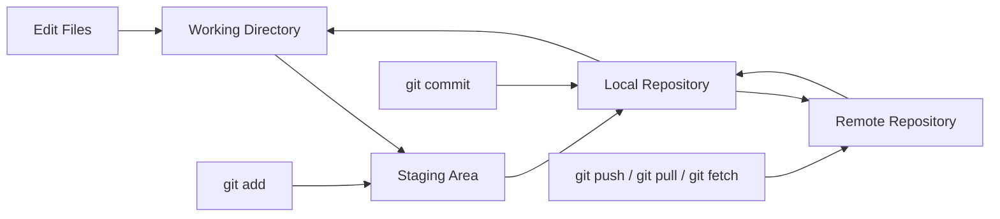
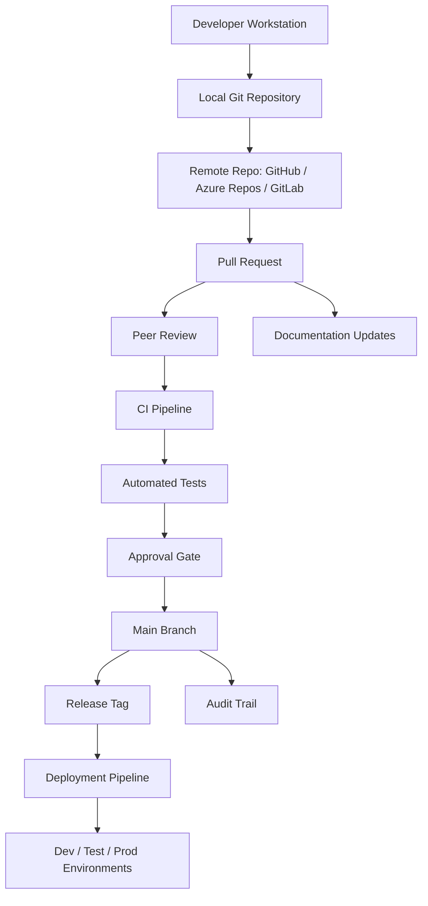

---
# Git Reference Guide

---

## 1. Executive Summary

Git is a distributed version control system used to track changes, collaborate on code, manage releases, recover from mistakes, and create a reliable history of technical work.

In plain terms, Git helps teams answer:

* What changed?
* Who changed it?
* Why was it changed?
* When did it change?
* Can we safely undo or compare it?
* Can multiple people work at the same time without overwriting each other?

For enterprise teams, Git is not just a developer tool. It is a control system for engineering quality, auditability, collaboration, delivery discipline, and operational maturity.

Used well, Git supports:

* Faster development
* Safer deployments
* Better peer review
* Stronger documentation
* Easier troubleshooting
* Clearer accountability
* Repeatable delivery processes

Used poorly, Git creates confusion, merge conflicts, lost work, broken releases, and unclear ownership.

---

## 2. Plain-English Explanation

Think of Git as a timeline for your project.

Every time you make a meaningful change, you can save a snapshot called a **commit**. Each commit records what changed and includes a message explaining why.

Instead of everyone editing one shared copy directly, Git lets each person work on their own copy, create a branch, make changes safely, and then merge those changes back into the main project after review.

A simple mental model:

```text
Working folder  ->  Staging area  ->  Commit history  ->  Remote repository
Your files      ->  Selected work ->  Saved snapshot  ->  Shared team copy
```

Git is local-first. That means most Git activity happens on your machine. The remote repository, such as GitHub, GitLab, Bitbucket, or Azure Repos, is where the team shares and reviews work.

---

## 3. Business Context

Git matters because modern technical work is rarely done by one person in one file. Enterprise projects often include:

* Application code
* Data models
* dbt transformations
* Infrastructure-as-code
* Automation scripts
* SQL files
* API definitions
* Configuration files
* Documentation
* Deployment pipelines
* AI prompts and evaluation assets

Git gives the organization a controlled way to manage change.

### Business Value of Git

| Business Need      | How Git Helps                                               |
| ------------------ | ----------------------------------------------------------- |
| Collaboration      | Multiple people can work in parallel using branches         |
| Auditability       | Commit history shows what changed and why                   |
| Quality control    | Pull requests support review before merge                   |
| Risk reduction     | Changes can be tested before release                        |
| Recovery           | Bad changes can be reverted                                 |
| Compliance         | History supports traceability and approvals                 |
| Knowledge transfer | Commits and PRs document decisions                          |
| Delivery maturity  | Branching, release tagging, and CI/CD improve repeatability |

### Git in Enterprise Environments

In an enterprise, Git is commonly connected to:

* Azure DevOps
* GitHub Enterprise
* GitLab
* Bitbucket
* Jira
* CI/CD pipelines
* Databricks Repos
* dbt projects
* Power Platform ALM
* UiPath automation projects
* Terraform or infrastructure repositories
* Documentation sites

Git becomes the backbone of controlled technical change.

---

## 4. Core Concepts

### 4.1 Repository

A **repository**, or repo, is a project folder tracked by Git.

It contains:

* Your project files
* Git history
* Branches
* Commit metadata
* Configuration

Example:

```text
customer-automation-platform/
├── README.md
├── src/
├── tests/
├── docs/
└── .git/
```

The hidden `.git` folder contains Git’s internal database.

---

### 4.2 Working Tree

The **working tree** is the current version of files on your machine.

This is where you edit files.

---

### 4.3 Staging Area

The **staging area** is where you prepare changes before committing them.

You can think of it as a review basket.

```bash
git add file_name
```

Only staged changes go into the next commit.

---

### 4.4 Commit

A **commit** is a saved snapshot of changes.

Each commit has:

* A unique ID
* Author
* Timestamp
* Message
* Parent commit
* File changes

Example:

```bash
git commit -m "Add policy validation logic"
```

A good commit explains the purpose of the change.

---

### 4.5 Branch

A **branch** is an independent line of work.

Branches let you work safely without changing the main project immediately.

Example:

```bash
git checkout -b feature/add-policy-validation
```

Common branch types:

| Branch Type | Purpose                                     |
| ----------- | ------------------------------------------- |
| `main`      | Stable production-ready code                |
| `develop`   | Shared integration branch in some workflows |
| `feature/*` | New functionality                           |
| `bugfix/*`  | Non-urgent bug fixes                        |
| `hotfix/*`  | Urgent production fixes                     |
| `release/*` | Release preparation                         |

---

### 4.6 Merge

A **merge** combines changes from one branch into another.

Example:

```bash
git checkout main
git merge feature/add-policy-validation
```

Merging is common when completing a feature branch.

---

### 4.7 Rebase

A **rebase** moves your branch on top of another branch’s latest history.

Example:

```bash
git checkout feature/add-policy-validation
git rebase main
```

Rebase can create a cleaner history, but it should be used carefully, especially on shared branches.

---

### 4.8 Remote

A **remote** is a shared repository hosted somewhere else.

Examples:

* GitHub
* Azure Repos
* GitLab
* Bitbucket

Common remote commands:

```bash
git remote -v
git fetch origin
git pull origin main
git push origin feature/my-branch
```

---

### 4.9 Pull Request / Merge Request

A **pull request**, often called a PR, is a request to merge one branch into another.

It is where teams review:

* Code quality
* Business logic
* Testing
* Security
* Documentation
* Impact

A PR is not just a Git action. It is an engineering control point.

---

### 4.10 Conflict

A **merge conflict** happens when Git cannot automatically combine changes.

This usually occurs when two people modify the same part of the same file.

Conflict markers look like this:

```text
<<<<<<< HEAD
current branch version
=======
incoming branch version
>>>>>>> feature-branch
```

You resolve the conflict manually, then stage and commit the result.

---

## 5. Architecture View

### 5.1 Git Local and Remote Architecture



### 5.2 Enterprise Git Architecture



---

## 6. Data / Process Flow

Git itself is not usually thought of as a data platform, but it has a clear process flow.

```text
1. Create or update files
2. Review local changes
3. Stage selected changes
4. Commit changes with a message
5. Pull latest remote updates
6. Resolve conflicts if needed
7. Push branch to remote
8. Open pull request
9. Review and test
10. Merge into main
11. Tag or release
12. Deploy through pipeline
```

### Typical Developer Flow

```bash
git checkout main
git pull origin main
git checkout -b feature/add-validation
# make changes
git status
git add .
git commit -m "Add validation for missing policy attributes"
git push origin feature/add-validation
```

Then open a pull request.

---

## 7. Common Use Cases

### 7.1 Feature Development

Used when building new functionality.

```bash
git checkout -b feature/new-reporting-model
git add .
git commit -m "Add curated reporting model"
git push origin feature/new-reporting-model
```

---

### 7.2 Bug Fix

Used when correcting a defect.

```bash
git checkout -b bugfix/fix-null-policy-status
git add .
git commit -m "Fix null policy status handling"
git push origin bugfix/fix-null-policy-status
```

---

### 7.3 Hotfix

Used for urgent production issues.

```bash
git checkout main
git pull origin main
git checkout -b hotfix/restore-prod-pipeline
```

Hotfixes should be small, reviewed quickly, tested, and merged carefully.

---

### 7.4 Experimentation

Used when testing ideas safely.

```bash
git checkout -b experiment/test-new-architecture
```

If the experiment fails, delete the branch without affecting `main`.

---

### 7.5 Documentation Updates

Git should track documentation, not just code.

Examples:

* Architecture diagrams
* README files
* Runbooks
* Troubleshooting guides
* Data lineage notes
* Decision logs

---

### 7.6 Data Engineering Projects

Git is commonly used to manage:

* dbt models
* SQL transformations
* YAML configurations
* data quality tests
* macros
* seeds
* source definitions
* deployment workflows

Example dbt repo structure:

```text
dbt-project/
├── models/
│   ├── raw/
│   ├── conformed/
│   └── curated/
├── seeds/
├── macros/
├── tests/
├── snapshots/
└── dbt_project.yml
```

---

### 7.7 Automation Projects

Git can manage:

* UiPath project files
* Power Platform solution source
* Python automation scripts
* API integration code
* configuration files
* documentation
* monitoring scripts

---

## 8. Best Practices

### 8.1 Commit Often, But Meaningfully

Good commits are focused.

Poor commit:

```text
Updated stuff
```

Better commit:

```text
Add null handling for broker email validation
```

Best commit:

```text
Add broker email validation for renewal notice automation
```

---

### 8.2 Keep Branches Short-Lived

Long-running branches create more conflicts and harder reviews.

Preferred pattern:

* Small branch
* Small change
* Quick review
* Frequent merge

---

### 8.3 Pull Before Starting Work

Start from the latest stable branch.

```bash
git checkout main
git pull origin main
```

---

### 8.4 Use Clear Branch Names

Recommended branch naming:

```text
feature/add-policy-validation
bugfix/fix-renewal-date-logic
hotfix/restore-prod-build
docs/update-onboarding-guide
refactor/simplify-policy-joins
```

---

### 8.5 Write Useful Pull Request Descriptions

A PR should explain:

* What changed
* Why it changed
* How it was tested
* What risks exist
* What reviewers should focus on

---

### 8.6 Avoid Committing Secrets

Never commit:

* passwords
* API keys
* bearer tokens
* private certificates
* database credentials
* production connection strings
* customer-sensitive data

Use:

* environment variables
* secret managers
* pipeline variables
* `.gitignore`

---

### 8.7 Use `.gitignore`

A `.gitignore` file prevents unwanted files from being tracked.

Example:

```gitignore
.env
*.log
__pycache__/
.vscode/
.DS_Store
node_modules/
target/
dbt_packages/
```

---

### 8.8 Review Before Committing

Always inspect changes before committing.

```bash
git status
git diff
git diff --staged
```

---

### 8.9 Keep `main` Stable

The `main` branch should represent deployable or production-ready work.

Protect `main` with:

* required PR reviews
* automated tests
* branch policies
* required build checks
* restricted direct pushes

---

### 8.10 Use Tags for Releases

Tags mark important versions.

```bash
git tag v1.0.0
git push origin v1.0.0
```

Common release tag format:

```text
v1.0.0
v1.1.0
v2.0.0
```

---

## 9. Common Mistakes

### Mistake 1: Working Directly on `main`

Risk:

* accidental production changes
* no peer review
* hard rollback

Better:

```bash
git checkout -b feature/my-change
```

---

### Mistake 2: Huge Pull Requests

Risk:

* hard to review
* hidden bugs
* delayed approval

Better:

* smaller PRs
* one logical change per PR
* clear test evidence

---

### Mistake 3: Bad Commit Messages

Poor:

```text
fix
changes
updates
misc
```

Better:

```text
Fix duplicate policy rows in renewal lookup
```

---

### Mistake 4: Not Pulling Latest Changes

Risk:

* stale branch
* merge conflicts
* broken build

Better:

```bash
git fetch origin
git rebase origin/main
```

or:

```bash
git pull origin main
```

---

### Mistake 5: Committing Generated or Temporary Files

Examples:

* logs
* local cache files
* build outputs
* credentials
* temporary exports

Use `.gitignore`.

---

### Mistake 6: Using Force Push Carelessly

This can overwrite shared history.

Dangerous:

```bash
git push --force
```

Safer:

```bash
git push --force-with-lease
```

Only force-push when you understand the impact.

---

## 10. Troubleshooting Guide

### 10.1 Check Current Status

```bash
git status
```

Use this first when confused.

---

### 10.2 See Recent History

```bash
git log --oneline --graph --decorate --all
```

This shows branches and commits visually.

---

### 10.3 Undo Unstaged Local Changes

```bash
git restore file_name
```

To discard all unstaged changes:

```bash
git restore .
```

Be careful. This removes local edits.

---

### 10.4 Unstage a File

```bash
git restore --staged file_name
```

---

### 10.5 Amend Last Commit Message

```bash
git commit --amend
```

Use this before pushing when the last commit message needs correction.

---

### 10.6 Undo Last Commit But Keep Changes

```bash
git reset --soft HEAD~1
```

This removes the commit but keeps the changes staged.

---

### 10.7 Undo Last Commit and Keep Files Modified

```bash
git reset HEAD~1
```

---

### 10.8 Revert a Commit Safely

```bash
git revert commit_hash
```

This creates a new commit that reverses the old one. This is safer for shared branches.

---

### 10.9 Stash Work Temporarily

```bash
git stash
```

Bring it back:

```bash
git stash pop
```

List stashes:

```bash
git stash list
```

Apply a specific stash:

```bash
git stash apply stash@{0}
```

---

### 10.10 Resolve Merge Conflict

Basic process:

```bash
git status
# open conflicted files and fix them
git add resolved_file
git commit
```

Conflict resolution steps:

1. Identify conflicted files.
2. Open each file.
3. Decide what content should remain.
4. Remove conflict markers.
5. Test the result.
6. Stage the resolved file.
7. Commit the resolution.

---

### 10.11 Abort a Merge

```bash
git merge --abort
```

Use this if a merge gets messy and you want to return to the previous state.

---

### 10.12 Abort a Rebase

```bash
git rebase --abort
```

---

### 10.13 See Who Changed a Line

```bash
git blame file_name
```

Use this carefully. The goal is understanding, not blaming people.

---

### 10.14 Find a Lost Commit

```bash
git reflog
```

`reflog` shows where your branch or HEAD pointed recently. It can help recover lost work.

---

## 11. Governance

Git governance is about controlling how changes move from idea to production.

### 11.1 Branch Protection

Protect important branches such as:

* `main`
* `master`
* `production`
* `release/*`

Recommended controls:

* no direct commits
* required PR approval
* required build validation
* required security scan
* required status checks
* required linked work item
* restricted force pushes

---

### 11.2 Pull Request Standards

Every PR should include:

* clear summary
* business reason
* testing performed
* screenshots or logs when helpful
* risk notes
* rollback plan for production changes
* reviewer guidance

---

### 11.3 Approval Rules

Suggested approval model:

| Risk Level                   | Review Requirement                        |
| ---------------------------- | ----------------------------------------- |
| Low-risk docs change         | 1 reviewer                                |
| Normal feature               | 1-2 technical reviewers                   |
| Production-impacting change  | technical reviewer + owner approval       |
| Security-sensitive change    | security or platform review               |
| Data model change            | data owner or analytics reviewer          |
| Automation production change | automation owner + business process owner |

---

### 11.4 Traceability

Git work should connect to:

* Jira ticket
* Azure Boards work item
* incident number
* change request
* architecture decision record
* release note

Example commit:

```text
IA-245 Add renewal status validation to policy lookup
```

---

### 11.5 Security Controls

Git governance should prevent:

* secrets in commits
* unauthorized branch changes
* unreviewed production deployments
* accidental exposure of customer data
* untracked emergency fixes

Recommended controls:

* secret scanning
* dependency scanning
* code scanning
* signed commits where required
* least-privilege repository access
* regular access reviews

---

## 12. Continuous Improvement

Git maturity improves through consistent team habits.

### 12.1 Review Commit Quality

Ask:

* Are commits small and meaningful?
* Do messages explain why?
* Are unrelated changes separated?
* Is history understandable?

---

### 12.2 Improve PR Quality

Track:

* PR size
* review cycle time
* number of review comments
* failed builds
* rework after merge
* production defects tied to changes

---

### 12.3 Improve Branch Hygiene

Monitor:

* stale branches
* long-running branches
* abandoned PRs
* repeated conflict areas
* direct commits to protected branches

---

### 12.4 Build Team Standards

Create shared standards for:

* branch names
* commit messages
* PR descriptions
* release tags
* hotfix process
* documentation updates
* code ownership

---

## 13. Development Lifecycle

A mature Git-based lifecycle usually follows this pattern:


### Lifecycle Stages

| Stage       | Git Activity              |
| ----------- | ------------------------- |
| Intake      | Link work item to branch  |
| Development | Commit focused changes    |
| Review      | Open PR                   |
| Validation  | Run tests and checks      |
| Merge       | Merge approved PR         |
| Release     | Tag or package version    |
| Deployment  | Deploy from stable branch |
| Monitoring  | Track production behavior |
| Improvement | Fix, refactor, document   |

---

## 14. Branching Frameworks

### 14.1 GitHub Flow

Simple and popular.

```text
main
  └── feature branch
        └── pull request
              └── merge to main
```

Best for:

* small teams
* continuous deployment
* web apps
* automation projects
* documentation repositories

Pros:

* simple
* fast
* easy to understand

Cons:

* may need extra controls for complex releases

---

### 14.2 GitFlow

More structured.

Common branches:

```text
main
develop
feature/*
release/*
hotfix/*
```

Best for:

* formal release cycles
* enterprise software
* regulated environments
* teams needing separate release preparation

Pros:

* structured
* supports releases and hotfixes

Cons:

* more complex
* can slow teams down if overused

---

### 14.3 Trunk-Based Development

Developers merge small changes frequently into the main branch.

Best for:

* mature teams
* strong automated testing
* continuous delivery
* feature flags

Pros:

* fewer long-running branches
* faster integration
* fewer major merge conflicts

Cons:

* requires discipline
* requires strong testing

---

### 14.4 Release Branching

A release branch is created when preparing a specific version.

Example:

```text
release/2026.07
release/v1.4.0
```

Best for:

* controlled releases
* UAT cycles
* production support

---

## 15. Tools

### 15.1 Core Git Tools

| Tool              | Purpose                            |
| ----------------- | ---------------------------------- |
| Git CLI           | Primary Git command-line tool      |
| VS Code Git Panel | Visual Git operations              |
| GitHub Desktop    | Beginner-friendly Git GUI          |
| SourceTree        | Visual Git client                  |
| GitKraken         | Visual Git client                  |
| Azure Repos       | Microsoft-hosted Git repositories  |
| GitHub            | Git hosting and collaboration      |
| GitLab            | Git hosting with DevOps features   |
| Bitbucket         | Git hosting often paired with Jira |

---

### 15.2 Enterprise Supporting Tools

| Tool Type           | Examples                                          |
| ------------------- | ------------------------------------------------- |
| Work tracking       | Jira, Azure Boards                                |
| CI/CD               | GitHub Actions, Azure Pipelines, GitLab CI        |
| Secret scanning     | GitHub Advanced Security, GitLab Secret Detection |
| Code quality        | SonarQube, CodeQL                                 |
| Dependency scanning | Dependabot, Snyk                                  |
| Documentation       | Markdown, MkDocs, Docusaurus                      |
| Data projects       | dbt, Databricks Repos                             |
| Automation projects | UiPath Studio, Power Platform solution export     |

---

## 16. Quick Reference

### 16.1 Everyday Commands

| Task          | Command                       |
| ------------- | ----------------------------- |
| Check status  | `git status`                  |
| See changes   | `git diff`                    |
| Stage file    | `git add file_name`           |
| Stage all     | `git add .`                   |
| Commit        | `git commit -m "message"`     |
| Pull latest   | `git pull origin main`        |
| Push branch   | `git push origin branch_name` |
| Create branch | `git checkout -b branch_name` |
| Switch branch | `git checkout branch_name`    |
| List branches | `git branch`                  |
| Fetch updates | `git fetch origin`            |
| Merge branch  | `git merge branch_name`       |
| Rebase branch | `git rebase main`             |
| View history  | `git log --oneline`           |
| Stash changes | `git stash`                   |
| Apply stash   | `git stash pop`               |
| Revert commit | `git revert commit_hash`      |

---

### 16.2 Safer Undo Commands

| Situation                    | Safer Command                    |
| ---------------------------- | -------------------------------- |
| Unstage a file               | `git restore --staged file_name` |
| Discard local file changes   | `git restore file_name`          |
| Undo commit but keep changes | `git reset --soft HEAD~1`        |
| Reverse a pushed commit      | `git revert commit_hash`         |
| Recover lost history         | `git reflog`                     |

---

### 16.3 Commands to Use Carefully

| Command            | Risk                                      |
| ------------------ | ----------------------------------------- |
| `git reset --hard` | Deletes local changes                     |
| `git push --force` | Can overwrite shared history              |
| `git clean -fd`    | Deletes untracked files                   |
| `git rebase`       | Can rewrite commit history                |
| `git stash pop`    | Can create conflicts while removing stash |

Prefer safer alternatives when unsure.

---

## 17. Meeting Talking Points

Use these when discussing Git process with a team, manager, architect, or engineering lead.

### 17.1 Process Questions

* What branch strategy are we using?
* Is `main` protected?
* Are direct commits to `main` blocked?
* What is the minimum approval requirement for PRs?
* Are automated tests required before merge?
* How do we handle hotfixes?
* How do we link commits or PRs to work items?
* What is the rollback process?
* Who owns release approval?
* What files or folders require special review?

---

### 17.2 Risk Questions

* Are secrets being scanned before merge?
* Are large PRs slowing reviews?
* Are merge conflicts happening repeatedly in the same files?
* Are stale branches being cleaned up?
* Are production changes traceable to tickets?
* Are emergency fixes documented after the fact?
* Do we know which commit is currently deployed?

---

### 17.3 Data / Automation-Specific Questions

* Should dbt model changes require data owner review?
* Should automation config changes require process owner approval?
* Are seed files treated as governed reference data?
* Are production pipeline changes tied to release notes?
* Are SQL changes tested before merge?
* Are breaking schema changes flagged in PRs?
* Are documentation updates required for model or workflow changes?

---

## 18. Example Scenario

### Scenario: Adding a New Policy Validation Rule

You are asked to add a validation rule to an automation lookup table. The rule checks whether a policy has a missing broker email address before an automated renewal notice is generated.

### Step 1: Start From Latest Main

```bash
git checkout main
git pull origin main
```

### Step 2: Create a Branch

```bash
git checkout -b feature/add-broker-email-validation
```

### Step 3: Make Changes

Files updated:

```text
models/conformed/intermediate_policy_validation.sql
tests/assert_broker_email_not_null.sql
docs/policy-validation-rules.md
```

### Step 4: Review Local Changes

```bash
git status
git diff
```

### Step 5: Stage and Commit

```bash
git add models/conformed/intermediate_policy_validation.sql
git add tests/assert_broker_email_not_null.sql
git add docs/policy-validation-rules.md

git commit -m "Add broker email validation for renewal automation"
```

### Step 6: Push Branch

```bash
git push origin feature/add-broker-email-validation
```

### Step 7: Open Pull Request

PR description should include:

```markdown
## Summary
Adds broker email validation to prevent renewal notices from being generated when broker contact data is missing.

## Business Reason
Renewal notices require broker contact information. Missing broker emails can cause failed or misdirected automation output.

## Changes
- Added broker email validation logic
- Added data quality test
- Updated validation documentation

## Testing
- Ran dbt model locally
- Confirmed test fails when broker email is null
- Confirmed valid records still pass

## Risk
Low to medium. This may exclude records that previously passed through the automation.

## Reviewer Focus
Please review the validation logic and confirm whether broker email should be required for all renewal notice scenarios.
```

### Step 8: Review, Approve, Merge

After approval and passing tests, merge into `main`.

---

## 19. Beginner-to-Pro Learning Path

### Level 1: Beginner — Basic Survival

Goal: Use Git without fear.

Learn:

* What Git is
* What a repository is
* `git status`
* `git add`
* `git commit`
* `git push`
* `git pull`
* basic branch creation

Practice:

```bash
git status
git add .
git commit -m "Update README"
git push
```

You should be able to:

* clone a repo
* make changes
* commit safely
* push a branch
* open a PR

---

### Level 2: Advanced Beginner — Team Collaboration

Goal: Work safely with others.

Learn:

* branches
* pull requests
* merge conflicts
* `.gitignore`
* commit message quality
* reviewing changes before commit

Practice:

```bash
git checkout -b feature/my-change
git diff
git add .
git commit -m "Add meaningful change"
git push origin feature/my-change
```

You should be able to:

* create clean branches
* resolve simple conflicts
* submit reviewable PRs
* avoid committing unwanted files

---

### Level 3: Intermediate — Clean History and Recovery

Goal: Fix mistakes and keep history understandable.

Learn:

* `git log`
* `git reset`
* `git revert`
* `git stash`
* `git reflog`
* `git rebase`
* commit squashing
* safe force push

Practice:

```bash
git log --oneline --graph
git stash
git revert commit_hash
git rebase main
```

You should be able to:

* recover lost work
* undo changes safely
* rebase feature branches
* clean up commits before review

---

### Level 4: Advanced — Workflow Design

Goal: Help teams work better.

Learn:

* branching strategies
* release tagging
* branch protection
* CI/CD integration
* PR standards
* code ownership
* hotfix process

You should be able to:

* recommend a branch strategy
* design PR rules
* define release flow
* support production hotfixes
* connect Git to delivery governance

---

### Level 5: Pro — Enterprise Git Leadership

Goal: Use Git as an engineering operating system.

Learn:

* repository architecture
* monorepo vs multi-repo
* compliance controls
* secure development workflow
* audit traceability
* deployment promotion models
* automated quality gates
* developer enablement

You should be able to:

* design Git standards for a team
* mentor junior engineers
* troubleshoot complex history issues
* govern production change
* align Git with enterprise architecture

---

## 20. Repository Placement

For a personal or team knowledge repository, place this guide here:

```text
knowledge-repository/
└── engineering-foundations/
    └── git/
        ├── README.md
        ├── git-reference-guide.md
        ├── quick-reference.md
        ├── troubleshooting.md
        ├── branching-strategies.md
        ├── pull-request-template.md
        ├── commit-message-guide.md
        └── examples/
            ├── feature-branch-flow.md
            ├── merge-conflict-example.md
            └── hotfix-flow.md
```

Recommended `README.md` structure:

```markdown
# Git

This folder contains practical Git guidance for technical professionals.

## Start Here

1. Read `git-reference-guide.md`
2. Use `quick-reference.md` for daily commands
3. Use `troubleshooting.md` when stuck
4. Use the templates before opening PRs

## Key Topics

- Git fundamentals
- Branching strategies
- Pull requests
- Merge conflicts
- Safe undo commands
- Enterprise governance
```

---

## 21. Reusable Templates

---

### 21.1 Branch Naming Template

```text
<type>/<short-description>
```

Types:

```text
feature/
bugfix/
hotfix/
docs/
refactor/
test/
chore/
experiment/
```

Examples:

```text
feature/add-policy-validation
bugfix/fix-renewal-date-filter
hotfix/restore-prod-build
docs/update-runbook
refactor/simplify-dbt-model
```

---

### 21.2 Commit Message Template

```text
<verb> <what changed> <why/context if helpful>
```

Examples:

```text
Add policy status validation for renewal automation
Fix duplicate broker records in conformed model
Update README with local setup instructions
Refactor policy lookup query for readability
Remove unused automation config file
```

Good commit verbs:

```text
Add
Fix
Update
Remove
Refactor
Rename
Document
Validate
Improve
Simplify
```

---

### 21.3 Pull Request Template

```markdown
# Pull Request

## Summary

Briefly describe what this PR changes.

## Business Context

Explain why this change is needed.

## Technical Changes

- Change 1
- Change 2
- Change 3

## Files or Areas Impacted

- `path/to/file`
- `path/to/folder`

## Testing Performed

- [ ] Unit tests passed
- [ ] Integration tests passed
- [ ] Manual validation completed
- [ ] Data quality checks completed
- [ ] Pipeline/build passed

## Risk Level

Choose one:

- [ ] Low
- [ ] Medium
- [ ] High

## Risk Notes

Describe possible side effects, downstream impacts, or deployment concerns.

## Rollback Plan

Explain how to undo this change if needed.

## Reviewer Focus

Tell reviewers what to pay special attention to.

## Linked Work Item

Ticket: `<ticket-id>`
```

---

### 21.4 Code Review Checklist

```markdown
# Code Review Checklist

## Correctness

- [ ] Does the change solve the stated problem?
- [ ] Is the logic clear?
- [ ] Are edge cases handled?
- [ ] Are errors handled safely?

## Maintainability

- [ ] Is the code readable?
- [ ] Are names clear?
- [ ] Is unnecessary complexity avoided?
- [ ] Is duplication minimized?

## Testing

- [ ] Are tests included or updated?
- [ ] Do existing tests pass?
- [ ] Was manual validation documented?

## Security

- [ ] No secrets committed
- [ ] No sensitive data exposed
- [ ] Access patterns are appropriate

## Documentation

- [ ] README updated if needed
- [ ] Runbook updated if needed
- [ ] Comments explain non-obvious logic

## Deployment

- [ ] Deployment impact understood
- [ ] Rollback path documented
- [ ] Dependencies identified
```

---

### 21.5 Merge Conflict Resolution Template

```markdown
# Merge Conflict Resolution Notes

## Branch

`<branch-name>`

## Conflicted Files

- `file1`
- `file2`

## Cause of Conflict

Explain why the conflict occurred.

## Resolution

Explain what version or combined logic was kept.

## Validation

- [ ] File compiles or runs
- [ ] Tests passed
- [ ] Business logic confirmed
- [ ] Reviewer notified

## Notes

Additional context for future reference.
```

---

### 21.6 Hotfix Template

```markdown
# Hotfix Record

## Issue

Describe the production issue.

## Impact

Who or what is affected?

## Root Cause

Explain the cause if known.

## Fix

Describe the change being made.

## Files Changed

- `file1`
- `file2`

## Testing

Explain what was validated before release.

## Approval

Approved by:

- Technical owner:
- Business owner:
- Release owner:

## Rollback Plan

Explain how to reverse the hotfix.

## Follow-Up Actions

- [ ] Add permanent test
- [ ] Update documentation
- [ ] Review monitoring
- [ ] Create post-incident note
```

---

### 21.7 Release Checklist

```markdown
# Release Checklist

## Pre-Release

- [ ] All PRs approved
- [ ] Build passed
- [ ] Tests passed
- [ ] Release notes prepared
- [ ] Deployment window confirmed
- [ ] Rollback plan confirmed
- [ ] Stakeholders notified

## Release

- [ ] Tag created
- [ ] Deployment started
- [ ] Deployment completed
- [ ] Smoke tests passed

## Post-Release

- [ ] Monitoring checked
- [ ] Errors reviewed
- [ ] Stakeholders updated
- [ ] Release notes published
- [ ] Follow-up items created
```

---

### 21.8 Repository Onboarding Template

```markdown
# Repository Onboarding

## Repository Name

`<repo-name>`

## Purpose

Explain what this repository is used for.

## Main Technologies

- Technology 1
- Technology 2
- Technology 3

## Important Folders

| Folder | Purpose |
|---|---|
| `/src` | Application or script source |
| `/tests` | Tests |
| `/docs` | Documentation |
| `/config` | Configuration |

## Setup Steps

1. Clone the repository
2. Install dependencies
3. Configure environment variables
4. Run local tests
5. Start development

## Branch Strategy

Describe how branches should be used.

## PR Rules

Describe review and approval requirements.

## Deployment Notes

Explain how changes are deployed.

## Common Issues

List common setup or development problems.

## Contacts

| Area | Owner |
|---|---|
| Technical owner | `<name>` |
| Business owner | `<name>` |
| Platform owner | `<name>` |
```

---

## 22. Recommended Personal Practice Routine

### Daily

* Run `git status` before and after work.
* Pull latest changes before starting.
* Commit focused changes.
* Review your diff before pushing.

### Weekly

* Clean up stale local branches.
* Review open PRs.
* Update documentation for meaningful changes.
* Revisit unresolved merge conflicts or repeated issues.

### Monthly

* Review branch strategy.
* Review PR quality.
* Review failed builds.
* Review repository access.
* Improve templates or standards.

---

## 23. Final Mental Model

Git is not just a save button.

Git is a disciplined system for managing change.

At the beginner level, Git helps you avoid losing work.

At the intermediate level, Git helps you collaborate safely.

At the advanced level, Git helps your team deliver reliably.

At the enterprise level, Git becomes part of governance, auditability, quality control, and engineering maturity.

The goal is not to memorize every Git command.

The goal is to understand the flow:

```text
Change -> Review -> Commit -> Share -> Validate -> Merge -> Release -> Learn
```

Master that flow, and Git becomes a force multiplier for every technical project you touch.
