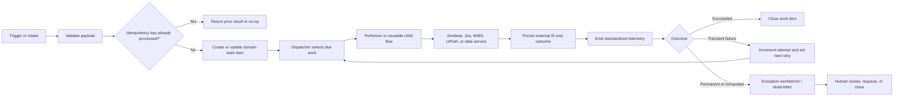

# Power Platform Current-State Architecture Review and Modernization Blueprint

**Review date:** July 13, 2026  
**Review type:** Static local-file review; no tenant connection or environment mutation  
**Primary audience:** Intelligent Automation technical leadership, platform engineering, and solution owners

## 1. Inventory Summary

The review covered the complete local tree under `C:\Users\dionn\IA Projects`: **13 top-level folders and 82 files**. No `.zip` solution export was present, so `pac solution unpack` was not required. The Power Platform CLI (`pac`) is not installed and was not invoked. The inventory supports **12 logical workload reviews** because the `Rate Change Calculator` folder contains both the Rate Change Calculator solution and a separate legacy package named **US Data Intake Form Integration**.

### What was found

| Artifact category | Count | What is analyzable | Limitations |
|---|---:|---|---|
| Unpacked Dataverse solution exports | 8 | `solution.xml`, `customizations.xml`, 19 solution-aware cloud-flow JSON files, connection references, environment-variable definitions/values, three Dataverse tables, one security role, and two canvas-app packages | Six exports are managed artifacts and two are unmanaged; no source-control or build metadata proves which export is the development source of truth |
| Expanded legacy app/flow packages | 4 | Package manifests, three cloud-flow `definition.json` files, connection maps, and one canvas-app package | These packages are not solution-aware and do not provide a complete ALM/dependency model |
| Canvas `.msapp` packages | 3 | App metadata, data-source references, App Checker SARIF for all three; embedded `.pa.yaml` for Rate Change Calculator and US Data Science Intake Form | IA Intake Form contains no embedded YAML, so formula, delegation, and component analysis is package-limited |
| Packed solution `.zip` exports | 0 | Not applicable | No unpacking was necessary |
| Documentation, architecture notes, runbooks, screenshots, spreadsheets, PBIX files | 0 | None | Environment strategy, support model, production topology, refresh design, ownership, and operational processes cannot be confirmed from documentation |
| Empty/non-artifact folders | 2 | `On Call Rotataion` and `USDataIntakeForm` are empty | They are noted but not treated as solutions |
| Other files | App media inside `.msapp` packages | Images are app resources | They are not architecture evidence |

### Solution exports

| Folder | Solution unique name | Version | Export state | Confirmed root components |
|---|---|---:|---|---:|
| BOP Nonrenewal Notice Process | `BOPNonrenewalNoticeProcess` | 2.0.0.5 | Managed | 4 |
| IA Core Conections | `OnCallRotation` | 1.0.0.1 | Managed | 1 |
| Mustang Conditional Renewal Notice Remediation | `MustangConditionalRenewalNoticeRemediation` | 1.0.0.11 | Managed | 2 |
| Mustang Failed Renewal Remediation | `MustangFailedRenewalRemediation` | 1.0.0.10 | Managed | 3 |
| NOC Process | `NOCProcess` | 1.0.0.1 | Unmanaged | 7 |
| Rate Change Calculator | `RateChangeCalculator` | 1.0.0.5 | Managed | 2 |
| USDataScienceIntakeForm | `USDataScienceIntakeForm` | 1.0.0.1 | Managed | 2 |
| Zendesk Ticket Creation | `ZendeskTicketBatchCreationGil` | 1.0.0.3 | Unmanaged | 4 |

### Evidence labels used in this report

- **Confirmed:** Directly observed in XML, JSON, YAML, manifest, or App Checker SARIF.
- **Package-limited:** Observed in package metadata or compiled app content, but the full editable source was unavailable.
- **Not evidenced:** The local artifact set contains no proof of the control or feature. This does not prove the control is absent in the tenant.
- **Inferred:** A conclusion derived from documentation rather than technical source. No project documentation was present, so inferred claims are intentionally limited.

No Copilot Studio, AI Builder, Azure OpenAI, UiPath Orchestrator, Databricks, or internal observability-platform artifacts were found. Power BI/dataflow connector usage was found, but no PBIX, semantic-model definition, refresh configuration, or RLS artifact was present. Those areas are therefore integration-boundary validation gaps, not confirmed absences from the live estate.

## 2. Executive Summary

The reviewed portfolio shows a useful foundation—solution-aware flows, managed exports for six solutions, Dataverse-based queues in three workloads, consistent try/catch/finally scopes in several newer flows, and genuine parent/child orchestration in NOC and Zendesk Ticket Creation—but it is not yet operating as a consistently governed automation platform. The immediate security concern is confirmed credential material embedded in multiple Zendesk HTTP actions and in the default value of `mfrr_ZendeskAuth`; one literal credential set is reused by four flows, making revocation and blast-radius control urgent. Reliability is uneven: nine flows show explicit failure-handling paths, while many ticket, email, and document flows have no error branch, and none of the 22 reviewed flow definitions contains an explicit retry or timeout policy. ALM evidence is weak because the local bundle mixes managed exports, unmanaged solutions, and legacy packages without pipeline definitions, deployment settings, source-control metadata, or environment-specific configuration files. Reuse is emerging but fragmented: NOC and Zendesk use child flows, while Zendesk and Jira integrations, notification patterns, and queue behaviors are repeatedly implemented elsewhere. The three canvas apps fit their user-facing calculator/intake scenarios, but App Checker findings, a nondelegable row-loading workaround, an unconditional success navigation, and a potentially overprivileged app role require correction. No live evidence supports conclusions about environment separation, DLP enforcement, service-account ownership, licensing, production performance, observability, or AI governance; those controls must be validated in the tenant before the portfolio can be rated beyond an artifact-evidenced Initial-to-Repeatable state.

## 3. Per-Solution Findings

### 3.1 Auto Renewal Exception Tickets

| Strengths | Weaknesses | Red Flags | Missing Controls | Scalability Risk | Notes |
|---|---|---|---|---|---|
| **Confirmed:** Small, understandable manual-request flow; Excel retrieval and ticket creation are easy to trace. | **Confirmed:** `Autorenewal Exception Tickets` has no scope-based error path, explicit retry, timeout, idempotency check, or solution-aware connection reference. Pair with R1–R5. | **Confirmed:** `Apply_to_each/HTTP_-_Create_Zendesk_Ticket` contains literal Basic-auth credential material, secure inputs are off, and the same credential set is used in three other workloads. | **Not evidenced:** Owner/connection identity, support alert, DLP classification, runbook, and failed-item recovery. | Per-row Excel processing plus synchronous external HTTP can throttle or duplicate tickets when a trigger is replayed. | Replace this one-off HTTP implementation with the shared Zendesk integration and deterministic ticket key described in R3/R5. |

### 3.2 BOP Nonrenewal Notice Process

| Strengths | Weaknesses | Red Flags | Missing Controls | Scalability Risk | Notes |
|---|---|---|---|---|---|
| **Confirmed:** Managed solution; three named flows use try/catch/finally; Dataverse queue table; change tracking enabled; connector references exist for Dataverse, Word, Outlook, dataflows, and SharePoint. | **Confirmed:** `BOP Nonrenewal Notifications` and `GA BOP Nonrenewal Notifications` have highly similar action structures; endpoint/site configuration remains embedded; no explicit retry/timeout policies; table-level auditing is disabled. Pair with R5, R10, R14, and R16. | None confirmed. | **Not evidenced:** Security role, production ownership, data-retention policy, business-unit design, queue support view, deployment settings, and monitoring alert. | `bopnrn_bopNonrenewalQueue` has 28 custom columns, no alternate key, and only system ownership relationships; duplicate detection alone is not an atomic idempotency control. | Consolidate jurisdiction differences into governed configuration while retaining explicit exception rules; add a stable business-key alternate key where uniqueness is valid. |

### 3.3 IA Core Connections / On Call Rotation

| Strengths | Weaknesses | Red Flags | Missing Controls | Scalability Risk | Notes |
|---|---|---|---|---|---|
| **Confirmed:** Managed export; scheduled flow is small; reusable `iacc_` SharePoint and Outlook connection-reference names indicate an intent to standardize connections. | **Confirmed:** The folder is named as a shared connection solution, but the solution is actually `OnCallRotation` and contains the business flow `On Call Rotation Notification`; the flow has no explicit failure path, retry, timeout, or parameterized site/email configuration. Pair with R5, R10, and R16. | None confirmed. | **Not evidenced:** A complete shared-foundation solution, ownership model, support rota fallback, or telemetry. | Recurrence plus SharePoint item iteration and email delivery may silently miss notifications when a connector fails. | Split the on-call workload from a true shared foundation containing governed connectors, connection references, telemetry, and templates. This split is a situational architecture judgment. |

### 3.4 Media Auto Renewal Tickets

| Strengths | Weaknesses | Red Flags | Missing Controls | Scalability Risk | Notes |
|---|---|---|---|---|---|
| **Confirmed:** Compact manual-request flow with a clear Excel-to-Zendesk path. | **Confirmed:** `Media Auto Renewal Tickets` has no explicit error path, retry, timeout, idempotency guard, or solution-aware configuration. Pair with R1–R5. | **Confirmed:** `Apply_to_each/HTTP_-_Create_AR_request_ticket` contains literal Basic-auth credentials, secure inputs are off, and its credential is reused across workloads. | **Not evidenced:** DLP, owner, connection identity, operational alert, and failed-ticket reconciliation. | The per-row pattern can create duplicate tickets and amplify API throttling during replay or large input batches. | Merge with Auto Renewal Exception Tickets behind a parameterized Zendesk operation and common result contract. |

### 3.5 Mustang Conditional Renewal Notice Remediation

| Strengths | Weaknesses | Red Flags | Missing Controls | Scalability Risk | Notes |
|---|---|---|---|---|---|
| **Confirmed:** Managed solution; one flow with try/catch/finally; broad connection-reference coverage; Dataverse work table has change tracking and an alternate key on `mcrnr_guid`. | **Confirmed:** The 50-action recurrence flow contains fixed `Wait` actions around Power BI/dataflow/document steps; no explicit retry/timeout; no environment-variable definitions; table auditing is disabled. Pair with R5, R7, R10, and R14. | None confirmed. | **Not evidenced:** Dataflow freshness SLA, semantic-model ownership, batch reconciliation, alert threshold, or human reprocessing interface. | Long-running waits hold runs open and make recovery dependent on run history; batch overlap can occur if a recurrence starts before the prior batch finishes. | Persist batch state and freshness watermark, then resume by schedule/event; prevent overlapping active batches with a deterministic batch key. |

### 3.6 Mustang Failed Renewal Remediation

| Strengths | Weaknesses | Red Flags | Missing Controls | Scalability Risk | Notes |
|---|---|---|---|---|---|
| **Confirmed:** Managed solution; clear dispatcher/performer split; both flows use try/catch/finally; Dataverse queue has an alternate key on `mfrr_queueid`; six HTTP actions have secure inputs enabled. | **Confirmed:** The performer duplicates the same Zendesk operation across six transaction-status branches; no explicit retry/timeout; environment-variable current/default values are exported; table auditing is disabled. Pair with R1–R5, R10, and R14. | **Confirmed:** `mfrr_ZendeskAuth` contains a non-placeholder default JSON value with username/password fields. The value is intentionally not reproduced here and must be treated as compromised. | **Not evidenced:** Rotation process, environment-specific secret references, dead-letter view, service identity, or replay procedure. | Branch duplication increases defect and change cost; repeated external calls can create multiple tickets unless the alternate key and external ID are used atomically. | Revoke/rotate the exposed credential, replace the JSON value with a Key Vault-backed secret reference, and use one status-to-template configuration plus one shared Zendesk operation. |

### 3.7 NOC Process

| Strengths | Weaknesses | Red Flags | Missing Controls | Scalability Risk | Notes |
|---|---|---|---|---|---|
| **Confirmed:** Parent flow calls six child flows; process steps are separated by concern; certified Zendesk connector is used in `Payment Confirmation Emails`. | **Confirmed:** Unmanaged export; most child flows have no failure path; `Notice of Cancellation Emails` contains eight fixed waits and repeated file conversion; `Final Notice of Cancellation Emails` and `Payment Overdue Emails` have identical operation shapes; connection references are duplicated/inconsistently named. Pair with R3, R5, R9, R10, and R16. | **Confirmed:** `NOC Cancellation Requests/Apply_to_each/HTTP_-_Create_Ticket` embeds the same literal Zendesk Basic-auth credential used by three other workloads, with secure inputs off. | **Not evidenced:** Child-flow error contract, compensation behavior, document-conversion SLA, queue/replay workbench, deployment settings, or connector DLP approval. | SharePoint/Excel item loops, fixed waits, and email/document fan-out can exhaust connector limits and leave partially processed accounts. | Retain the thin orchestrator, standardize child-flow responses, use stateful document completion, and route all Zendesk operations through one governed integration. |

### 3.8 Rate Change Calculator

| Strengths | Weaknesses | Red Flags | Missing Controls | Scalability Risk | Notes |
|---|---|---|---|---|---|
| **Confirmed:** Managed solution; one-screen canvas app is a reasonable fit for an interactive calculator; embedded YAML is available; App.OnStart uses `Concurrent` for two reads. | **Confirmed:** App.OnStart loads the SharePoint `RateChangeMatrix` in ascending and descending chunks, merges collections, and depends on the app row limit; App Checker reports 31 findings, including 16 missing accessible labels and a default maximum-row warning. Pair with R15. | None confirmed. | **Confirmed risk requiring tenant validation:** `IA_App_User` contains 82 privileges, including 53 at Global depth and create/delete/write process privileges. Assignment is not present, so exposure cannot be confirmed. Pair with R12/R13. | Results can be incomplete when the matrix exceeds the effective collection window; loading the full matrix increases startup time and client memory. | Use delegable, indexed server-side filtering. Move the matrix to Dataverse when size, security, audit, or ALM needs exceed a SharePoint list’s safe fit. |

### 3.9 US Data Intake Form Integration (legacy package inside Rate Change Calculator)

| Strengths | Weaknesses | Red Flags | Missing Controls | Scalability Risk | Notes |
|---|---|---|---|---|---|
| **Confirmed:** Clear SharePoint-triggered Jira creation and attachment path; only 12 actions. | **Confirmed:** Separate legacy package is mixed into the Rate Change folder; two direct Jira HTTP actions use Basic authentication, secure inputs are off, and no scope-based error path, explicit retry, or timeout exists. Pair with R2, R4, R5, and R9. | No password literal was confirmed in this package; a username is literal and the password is parameterized. | **Not evidenced:** Solution wrapper, connection reference, Key Vault secret, Jira throttling handling, idempotency, or deployment settings. | Trigger replay can create duplicate Jira issues; attachment loops amplify throttling and may leave a ticket without all attachments. | Migrate into a solution-aware shared Jira operation with an external-reference key and attachment reconciliation. |

### 3.10 IA Intake Form

| Strengths | Weaknesses | Red Flags | Missing Controls | Scalability Risk | Notes |
|---|---|---|---|---|---|
| **Package-limited:** Canvas app is an appropriate fit for intake; confirmed data sources are Office 365 Users and the SharePoint list `US IA Request Portal`. | **Package-limited:** No embedded YAML; App Checker reports 15 findings, including 11 invalid-name and two invalid-argument findings plus a default-row-limit warning; app is a legacy package rather than solution-aware. Pair with R9, R10, and R15. | None confirmed. | **Not evidenced:** Editable formula source, component library, environment variables for SharePoint site/list, role model, app tests, or deployment pipeline. | Invalid references may represent a broken/stale package; SharePoint list growth can expose delegation and row-limit defects that cannot be inspected without source. | Re-export/unpack from an unmanaged development solution, resolve App Checker errors before promotion, and parameterize SharePoint site/list references. |

### 3.11 US Data Science Intake Form

| Strengths | Weaknesses | Red Flags | Missing Controls | Scalability Risk | Notes |
|---|---|---|---|---|---|
| **Confirmed:** Managed solution; four-screen canvas app; SharePoint list is filtered to the current user and recent records; Jira flow uses try/catch/finally and sends failure information; App Checker has only 11 findings. | **Confirmed:** Submit button calls `IfError(SubmitForm(...), AllErrors)` and then navigates to Success regardless of confirmed form completion; two Jira HTTP actions have secure inputs off and no explicit retry/timeout; SharePoint source is not parameterized. Pair with R2, R4, R5, R10, and R15. | None confirmed. | **Not evidenced:** Jira secret store, form OnSuccess/OnFailure behavior, automated app tests, list-volume baseline, or owner/connection identity. | Users can see a false success state; attachment processing can partially fail or duplicate Jira issues on replay. | Move navigation to the form’s `OnSuccess`, show actionable `OnFailure`, and reuse the shared Jira create/attach operation. |

### 3.12 Zendesk Ticket Creation

| Strengths | Weaknesses | Red Flags | Missing Controls | Scalability Risk | Notes |
|---|---|---|---|---|---|
| **Confirmed:** Strongest orchestration pattern in the portfolio: a main flow, three child flows, typed responses, system-error scope, counters, and final report generation. | **Confirmed:** Unmanaged export; HTTP ticket subflow has no explicit retry/timeout; SharePoint site/folder environment variables and Zendesk token/subdomain definitions exist but are blank/not referenced by the reviewed flows; Excel connection references are duplicated. Pair with R3, R5, R9, and R10. | **Confirmed:** `ZTC-Sub-CreateTicket/HTTP_-_Create_Zendesk_Ticket` embeds the same literal Basic-auth credential used in Auto Renewal, Media Auto Renewal, and NOC; secure inputs are off. | **Not evidenced:** Automated deployment settings, per-environment connection mapping, secret rotation, batch-size limit, or central telemetry. | Per-row child-flow calls plus Excel updates can become a bottleneck; partial failure recovery depends on the report rather than a durable work-item state. | Preserve the orchestration shape, but move ticket creation to the shared connector and persist each row’s idempotency/external ID before reporting completion. |

## 4. Cross-Cutting Themes

### Credential exposure is the only confirmed portfolio-level red flag

Four Zendesk HTTP actions contain the same literal Basic-auth credential material, and `mfrr_ZendeskAuth` contains a separate credential-bearing default value. Microsoft’s Well-Architected Security recommendation SE:07 says not to hardcode secrets in flows or source artifacts, to store them in a hardened secret system, and to revoke secrets discovered by scanning. The exported values should therefore be treated as compromised even if they are believed to be old or nonproduction. [Microsoft: protect application secrets](https://learn.microsoft.com/en-us/power-platform/well-architected/security/application-secrets)

**Highest-leverage action:** rotate/revoke both exposed credential sets, inspect access logs, remove values from every export and source-control history, and prevent promotion when secret scanning finds credential material.

### Reliability controls vary by solution generation

The portfolio contains **22 reviewed flow definitions**. Nine show an explicit failure-handling path; none contains an explicit retry policy or action timeout. This does not mean connectors never retry—the platform or connector may apply defaults—but it means workload owners have not encoded a reviewed transient-fault policy in source. Newer BOP/Mustang/Zendesk flows use scopes effectively; legacy ticket and NOC child flows frequently lack catch/finally, compensation, or user-facing failure communication.

**Highest-leverage action:** publish and apply one flow standard covering correlation ID, validation, try/catch/finally, transient/permanent error categories, bounded retry, timeout, terminate/response semantics, idempotency, telemetry, and requeue behavior.

### External API integration is duplicated and bypasses a common governance boundary

Fourteen direct HTTP actions implement Zendesk or Jira behavior across seven flows. NOC also uses the certified Zendesk connector in a different child flow, so the same external platform is accessed through two patterns. A connector provides a strongly typed API surface that can be governed by data policies, but choosing a custom connector rather than a certified connector is a workload decision, not a Microsoft mandate. [Microsoft: data policies and connector types](https://learn.microsoft.com/en-us/power-platform/admin/wp-data-loss-prevention)

**Highest-leverage action:** approve one integration surface per external system, one authentication pattern, one DLP classification, one retry/throttling contract, and one telemetry schema.

### Connector and licensing footprint requires tenant validation

The packages evidence a mixed connector estate. The observed Microsoft 365 connectors—SharePoint, Office 365 Outlook, Office 365 Users, Excel Online (Business), Word Online (Business), OneDrive for Business, Content Conversion, and Power BI—are generally catalogued as Standard. Microsoft Dataverse and Zendesk are catalogued as Premium for Power Automate/Power Apps, and the portfolio also uses direct HTTP actions and dataflow operations whose applicable entitlement depends on the exact action, flow context, and license. [Microsoft: Power Automate connector catalogue](https://learn.microsoft.com/en-us/connectors/connector-reference/connector-reference-powerautomate-connectors) [Microsoft: Dataverse connector](https://learn.microsoft.com/en-us/connectors/commondataserviceforapps/) [Microsoft: Zendesk connector](https://learn.microsoft.com/en-us/connectors/zendesk/) [Microsoft: Power Automate license types](https://learn.microsoft.com/en-us/power-platform/admin/power-automate-licensing/types)

| Observed connector group | Static evidence | Current catalogue implication | Review conclusion |
|---|---|---|---|
| Microsoft 365 and Power BI | SharePoint, Outlook, Users, Excel, Word, OneDrive, Content Conversion, Power BI | Generally Standard | **Confirmed usage;** actual tenant request allocations, service limits, and user entitlements are **Not evidenced**. |
| Microsoft Dataverse | Solution-aware flows and three queue tables | Premium connector | **Confirmed usage;** whether rights are supplied through Power Apps, Dynamics 365, Power Automate Premium/Process, or another entitlement is **Not evidenced**. |
| Zendesk | Certified connector in NOC plus direct HTTP implementations elsewhere | Certified Zendesk connector is Premium; direct HTTP licensing depends on the HTTP capability used | **Confirmed mixed pattern;** connector approval, license assignment, and DLP classification are **Not evidenced**. |
| Jira via direct HTTP | Data Intake Form and US Data Science Intake Form | Premium/custom-connector implications must be evaluated against the selected governed replacement and flow context | **Confirmed direct integration;** exact production licensing is **Not evidenced**. |
| Power Query dataflows | BOP, Mustang Conditional, and Mustang Failed Renewal flows | Product/workspace capacity and connector/action rights vary by implementation | **Package-limited;** refresh capacity, workspace licensing, and throttling are **Not evidenced**. |

**Highest-leverage action:** build a tenant-side connector and flow inventory that records license context, owner identity, DLP group, request volume, capacity consumption, and business criticality. Do not estimate savings until those runtime facts are available. Microsoft licensing guidance confirms that premium capability can be licensed through different user, process, app-context, and capacity models. [Microsoft: Power Automate licensing FAQ](https://learn.microsoft.com/en-us/power-platform/admin/power-automate-licensing/faqs)

### ALM artifacts do not demonstrate a repeatable release process

The static bundle contains six managed solution exports, two unmanaged exports, and four legacy packages, but no repository metadata, branch policy, pipeline, deployment settings, solution-check output, release manifest, or rollback instructions. Microsoft’s ALM guidance identifies solutions as the transport mechanism, source control as the source of truth, managed solutions for nondevelopment environments, and automation for validation/build/deployment. [Microsoft: ALM basics](https://learn.microsoft.com/en-us/power-platform/alm/basics-alm) [Microsoft: Power Platform pipelines](https://learn.microsoft.com/en-us/power-platform/alm/pipelines)

**Highest-leverage action:** establish an unmanaged development source, unpacked source control, automated checks, and managed promotion through development/test/production using deployment settings for connection references and environment variables.

### Configuration is only partially parameterized

Connection references are present in solution-aware flows, but naming and ownership are inconsistent. Environment variables exist in only three solutions, include exported current/default values, and are often not consumed by the flow. SharePoint sites, list IDs, folder paths, email addresses, and API endpoints remain embedded in multiple definitions. Microsoft recommends environment variables for values that vary between environments and says values should be supplied in the target environment rather than included in the solution. [Microsoft: environment variables](https://learn.microsoft.com/en-us/power-apps/maker/data-platform/environmentvariables) [Microsoft: automated connection/environment settings](https://learn.microsoft.com/en-us/power-platform/alm/conn-ref-env-variables-build-tools)

**Highest-leverage action:** define a configuration catalogue and deployment-settings contract; remove environment-specific values from component source.

### Reuse exists, but it is solution-local rather than program-level

NOC and Zendesk Ticket Creation demonstrate the right direction with child flows. Across solutions, however, ticket creation, attachments, notifications, report creation, error handling, and queue state are reimplemented. Operation-shape comparison found exact or strong similarity between NOC Final Notice and Payment Overdue flows, BOP general and GA notifications, and Auto/Media ticket flows.

**Highest-leverage action:** build a small governed component portfolio—Zendesk, Jira, notification/document handling, telemetry/error contract, and solution templates—rather than one oversized utility solution.

### Dataverse queue design has useful keys but weak audit/security evidence

The three custom Dataverse tables are user-owned and have change tracking enabled. Mustang Conditional and Mustang Failed have alternate keys; BOP does not. All three have table-level auditing disabled, no secured custom columns, and no custom domain relationships beyond standard owner/business-unit relationships. Column-level audit flags do not produce a complete audit trail when table/environment auditing is not enabled. The appropriate audit scope depends on business and retention requirements, but the decision should be explicit. [Microsoft: manage Dataverse auditing](https://learn.microsoft.com/en-us/power-platform/admin/manage-dataverse-auditing)

The only packaged role, `IA_App_User`, contains broad process privileges. Because role assignment is unavailable, this is a **high-priority validation item**, not a confirmed live exposure. Dataverse’s role model should grant users only the access required for their tasks. [Microsoft: Dataverse security concepts](https://learn.microsoft.com/en-us/power-platform/admin/wp-security-cds)

### Canvas apps need a shared quality gate

All three apps use SharePoint as a primary business data source. This is proportionate for modest intake workloads, but Rate Change Calculator intentionally circumvents the row limit by loading ascending and descending collections; that approach has a correctness ceiling. App Checker reports 31, 15, and 11 findings respectively. Accessibility issues dominate the two apps with YAML, while IA Intake Form has invalid-reference findings that require editable-source validation.

**Highest-leverage action:** make App Checker/Solution Checker blocking at an agreed severity, add app-specific tests, and require delegation/row-count evidence before approving SharePoint as a scalable data store.

### Monitoring, ownership, cost, and AI posture are not assessable from the package

No runbooks, alert definitions, Application Insights configuration, admin-center analytics, owner inventory, license report, capacity baseline, or AI component was included. Microsoft recommends defining health states, logging service boundaries, and propagating correlation IDs to a centralized sink. [Microsoft: monitoring and alerting strategy](https://learn.microsoft.com/en-us/power-platform/well-architected/reliability/monitoring-alerting-strategy)

No AI modernization is recommended by default. If AI is introduced, Copilot Studio guidance supports DLP controls over knowledge/actions/HTTP/publishing, human review, monitoring, and trusted grounding; generated responses are nondeterministic and can be incorrect. [Microsoft: Copilot Studio security and governance](https://learn.microsoft.com/en-us/microsoft-copilot-studio/security-and-governance) [Microsoft: responsible AI](https://learn.microsoft.com/en-us/microsoft-copilot-studio/guidance/responsible-ai) [Microsoft: generative answers limitations](https://learn.microsoft.com/en-us/microsoft-copilot-studio/faqs-generative-answers)

## 5. Reusability & Modernization Opportunities

### Target execution pattern

The target pattern keeps business data in domain-specific records while standardizing operational state, idempotency, telemetry, and recovery. The diagram should be read left to right: a work item is accepted once, executed through a governed integration, and either closed or made recoverable without relying on a maker to inspect raw run history.

This is a **situational target architecture**, aligned to Well-Architected reliability and monitoring principles but not prescribed by Microsoft as a mandatory Power Platform implementation. Keep Dataverse orchestration when volume and latency remain within measured Power Platform limits; introduce APIM, Functions, or Service Bus only for demonstrated burst, replay, network-isolation, centralized throttling, or long-running requirements.

### Consolidation candidates

Effort is relative for a small experienced Power Platform team: **S** is days to two weeks, **M** is roughly two to six weeks, and **L** is a multi-solution program increment. Estimates exclude procurement and enterprise-security lead time.

| Candidate | Confirmed duplication/problem | Proposed shared asset | Effort | Impact | Authority |
|---|---|---|:---:|:---:|---|
| Zendesk integration | Literal/direct HTTP in Auto Renewal, Media, NOC, MFRR, and Zendesk Ticket Creation; certified connector also used in NOC | Governed certified/custom connector, one child-flow contract, Key Vault secret, correlation/idempotency, typed error model | M | L | Microsoft supports connector governance, connection references, and secret protection; choosing this shared asset is situational |
| Jira integration | Data Intake Form and USDS repeat create/attachment HTTP logic | Shared create/update/attach operation with external reference and reconciliation | M | L | Situational consolidation aligned to Operational Excellence |
| Flow resilience template | Error scopes are inconsistent; no explicit retry/timeout policy | Solution template with validate/try/catch/finally, error taxonomy, timeout/retry policy, terminate/response contract, telemetry | M | L | WAF Reliability/Operational Excellence |
| Domain work-item contract | Three queue tables use different status/error metadata; other workloads use SharePoint/Excel only | Standard column/choice schema, alternate-key rule, due-work query, requeue semantics | L | L | Situational implementation aligned to Reliability |
| Exception workbench | No durable cross-solution recovery UI is present | Model-driven app with failed/due views, requeue command, reason/audit, owner and SLA age | L | L | Situational implementation aligned to Operational Excellence |
| Telemetry emitter | No internal observability integration is evidenced | Child flow or connector emitting a common event at every state transition | M | L | WAF RE:08 supports centralized monitoring/correlation; event schema is situational |
| Notification/document service | NOC email flows repeat retrieval/send patterns; document flow contains repeated waits/conversions | Parameterized notification child flow and stateful document-generation contract | M | M | Situational consolidation |
| BOP jurisdiction configuration | General and GA flows share most operations | Dataverse configuration for jurisdiction, template, delivery rule, and exception behavior | M | M | Situational; business/legal rule review required |
| MFRR status mapping | Six branches repeat Zendesk HTTP creation | Status-to-template configuration plus one integration call | S | M | Situational quick consolidation |
| Canvas component library | Repeated accessibility and UX issues; no component library found | Standard header, form status/error, accessibility, telemetry, and support components | M | M | Experience Optimization alignment |
| Shared foundation solution | `IA Core Connections` is mixed with the On Call business flow and does not own the full reusable set | Separate foundation solution for connectors, connection references, environment variables, telemetry, and templates | M | L | Situational solution-architecture decision |
| ALM starter template | Mixed export formats and no pipeline/source evidence | Repository structure, deployment settings, validation, versioning, managed build, release/rollback checklist | M | L | Microsoft ALM and safe-deployment guidance |

### Enterprise boundary rules

- **UiPath Orchestrator:** Use for desktop/UI automation only. Exchange a correlation ID, queue item ID, status, and business-safe result; do not make RPA the default route for APIs already accessible through governed connectors.
- **Databricks:** Keep high-volume transformation/enrichment out of per-row cloud flows. Publish curated batches or data products with freshness watermark, schema version, rejection handling, and owner.
- **Power BI/dataflows:** Treat analytics/query completion as an asynchronous dependency. Record dataset/dataflow identity, requested refresh time, freshness threshold, and last successful watermark; do not rely on an unbounded wait.
- **Internal observability platform:** Accept standardized semantic events from workload state transitions. Application Insights or Managed Environment export should supplement, not replace, the durable work-item record.
- **AI services:** Require an approved use case, trusted grounding, prompt/model version, adversarial testing, human review for consequential outputs/actions, moderation, audit, feedback, and rollback before production.

## 6. Recommendations Table

Microsoft’s **current** Power Platform Well-Architected pillars are Reliability, Security, Operational Excellence, Performance Efficiency, and Experience Optimization. **Cost Optimization is not a current Power Platform pillar**; cost/licensing relevance is therefore shown separately. [Microsoft: current Power Platform Well-Architected pillars](https://learn.microsoft.com/en-us/power-platform/well-architected/what-is-power-well-architected)

| ID | Recommendation and affected artifacts | Well-Architected pillar | Microsoft basis / judgment | Effort | Impact | Classification | Cost/licensing relevance |
|---|---|---|---|:---:|:---:|---|---|
| R1 | Immediately revoke/rotate exposed Zendesk credentials; inspect usage; remove them from all exports/history; add credential scanning. Affects Auto Renewal, Media, NOC, MFRR, Zendesk Ticket Creation. | Security | WAF SE:07: protect, rotate, scan, and revoke exposed secrets | S | L | Quick Win | Low tool cost; incident/rotation effort avoids larger breach cost |
| R2 | Replace credential-bearing values with Azure Key Vault-backed secret environment variables; enable Secure Inputs/Outputs on secret retrieval and HTTP actions. | Security | [Key Vault environment variables](https://learn.microsoft.com/en-us/power-apps/maker/data-platform/environmentvariables-azure-key-vault-secrets) | M | L | Structural | Azure Key Vault/administration cost; reduces manual secret handling |
| R3 | Establish one governed Zendesk connector/child-flow contract with connection reference, timeout/retry, idempotency, and telemetry. | Operational Excellence | Connector/DLP/env-var guidance; exact connector choice is **Situational judgment** | M | L | Structural | Custom/premium connector and process licensing must be validated; reduces duplicate maintenance/API calls |
| R4 | Establish one solution-aware Jira create/update/attachment operation and migrate both Jira flows. | Operational Excellence | **Situational judgment** aligned to reuse and safe operations | M | L | Structural | HTTP/custom connector may require Premium; consolidation reduces support effort |
| R5 | Adopt a flow engineering standard: validation, correlation ID, idempotency, try/catch/finally, transient/permanent classification, bounded retry, timeout, typed response, compensation, telemetry, and user-facing failure. | Reliability | WAF Reliability principles; exact template is **Situational judgment** | M | L | Structural | May reduce wasted calls and long-running capacity; modest build effort |
| R6 | Standardize domain queue columns/statuses and introduce retry/dead-letter/requeue behavior; add alternate keys where uniqueness is valid. | Reliability | **Situational judgment** aligned to resiliency and recovery | L | L | Structural | Dataverse storage/request consumption; avoids duplicate external transactions |
| R7 | Emit centralized semantic telemetry and correlation IDs; define healthy/degraded/unhealthy states and actionable alerts. | Reliability | WAF RE:08 monitoring/alerting | M | L | Structural | Log ingestion/retention cost must be sized; reduces mean time to detect/repair |
| R8 | Build a human exception workbench with failed/due views, reason capture, owner, SLA age, audit, and controlled requeue. | Operational Excellence | **Situational judgment** aligned to supportability | L | L | Structural | Dataverse/model-driven app licensing and support effort; lowers manual run-history investigation |
| R9 | Put each solution in source control from an unmanaged development source; run automated validation/build and promote managed artifacts through dev/test/prod with approvals and rollback instructions. | Operational Excellence | [ALM basics](https://learn.microsoft.com/en-us/power-platform/alm/basics-alm), [safe deployments](https://learn.microsoft.com/en-us/power-platform/well-architected/operational-excellence/safe-deployments), [pipelines](https://learn.microsoft.com/en-us/power-platform/alm/pipelines) | M | L | Structural | Managed Environments/pipeline licensing and engineering time; lower release risk |
| R10 | Create a configuration/deployment-settings catalogue for connection references, SharePoint site/list IDs, folders, endpoints, recipients, and nonsecret constants; exclude environment values from solutions. | Operational Excellence | Environment-variable and deployment-settings guidance | M | L | Structural | Minimal runtime cost; substantial deployment-efficiency benefit |
| R11 | Validate and document environment groups/dev-test-prod topology, Managed Environments, connector data policies, exception process, and default-environment restrictions. | Security | [Environment strategy](https://learn.microsoft.com/en-us/power-platform/guidance/adoption/environment-strategy), [DLP strategy](https://learn.microsoft.com/en-us/power-platform/guidance/adoption/dlp-strategy) | M | L | Structural | Managed Environment entitlements/admin effort; prevents connector/data-boundary failures |
| R12 | Inventory flow owners/connections; move suitable production flows to service-principal ownership; separate deployment and runtime identities; document break-glass ownership. | Security | [Service-principal-owned flows](https://learn.microsoft.com/en-us/power-automate/service-principal-support) and least-privilege principles | M | L | Structural | Process/per-flow licensing may be required; reduces personal-account failure risk |
| R13 | Review `IA_App_User` assignment and reduce the role to the minimum required privileges; document business-unit/team access for queue workloads. | Security | Dataverse RBAC/least privilege | S | L | Quick Win | No intrinsic capacity cost; may require role redesign/testing |
| R14 | Make an explicit audit decision for each queue table and sensitive field; enable environment/table/column auditing where required and set retention. | Security | Dataverse auditing guidance | M | M | Structural | Audit storage/retention cost; improves traceability and compliance |
| R15 | Fix canvas-app quality issues: Rate delegation/row loading and accessibility; IA Intake invalid references/source gap; USDS OnSuccess/OnFailure navigation; add component/test standards. | Experience Optimization; Performance Efficiency | WAF pillar alignment; code fixes are source-specific | M | L | Quick Win + Structural | Dataverse migration, if selected, may affect licensing/storage; better UX and correctness |
| R16 | Consolidate BOP jurisdiction flows, NOC notification/document patterns, MFRR status branches, and Auto/Media flows into bounded reusable components. | Operational Excellence | **Situational judgment** based on confirmed duplication | M | L | Structural | Reduces change/test/support effort and redundant API calls |
| R17 | Establish a connector/license/capacity baseline: connector tier, owner license, Power Platform requests, run duration, API volume, Dataverse storage, log retention, and Copilot/AI consumption if introduced. | Performance Efficiency | WAF performance monitoring and Microsoft licensing guidance; cost classification is separate | S | M | Quick Win | Direct cost-management recommendation; no official Power Platform Cost pillar |
| R18 | Introduce an AI readiness gate before any Copilot/AI Builder/Azure OpenAI deployment: business owner, grounding, DLP, access, prompt/model versioning, injection tests, human review, moderation, audit, and rollback. | Security | Copilot Studio security/responsible-AI guidance | M | M | Structural | AI message/model consumption and review operations must be forecast |
| R19 | Define versioned handoff contracts for Power BI/dataflows, UiPath, Databricks, and the observability platform, including correlation, freshness, timeout, rejection, replay, and owner. | Reliability | WAF service-boundary monitoring; exact contracts are **Situational judgment** | M | L | Structural | May justify Azure integration services only after measured need |

## 7. Maturity Roadmap

The maturity labels use Microsoft’s Power Platform Adoption Maturity Model (100 Initial, 200 Repeatable, 300 Defined, 400 Capable, 500 Efficient). The starting point is **provisional and artifact-evidenced only**: the bundle appears Initial-to-Repeatable for ALM/governance, while individual newer solutions show Defined engineering practices. A live CoE/admin review can raise or lower that assessment. [Microsoft: Power Platform adoption maturity model](https://learn.microsoft.com/en-us/power-platform/guidance/adoption/maturity-model-details) The CoE Starter Kit is a reference implementation and does not replace the people, process, and policy of a CoE. [Microsoft: CoE overview](https://learn.microsoft.com/en-us/power-platform/guidance/coe/overview)

### Quick wins (0–30 days) — target: Repeatable security and ownership

- Revoke and rotate the two confirmed credential-bearing patterns; review access logs and downstream consumers.
- Remove secret values from exports and any source history; add automated secret scanning and a release stop.
- Enable Secure Inputs/Outputs on credential retrieval and HTTP actions while the integrations are being replaced.
- Inventory every production flow’s primary/co-owner, connection identity, license, business owner, support owner, criticality, and recovery contact.
- Review assignments for `IA_App_User` and remove unnecessary Global/process privileges.
- Fix USDS false-success navigation and highest-severity App Checker findings.
- Define a minimum failure-alert rule for every critical flow and a manual daily exception review until central telemetry exists.

**Exit criteria:** exposed credentials are revoked; packages scan clean; every workload has accountable owners; critical failures reach a monitored support channel; no app intentionally navigates to success after failed persistence.

### Near-term (1–3 months) — target: Defined governance and ALM

- Establish an unmanaged development source, repository layout, solution versioning, code review, automated checker/pack/build, managed promotion, approvals, and rollback/hotfix path.
- Create development, test/UAT, and production mappings; validate Managed Environments/environment groups and connector data policies.
- Create deployment-settings files for connection references and environment variables; remove environment-specific values from component source.
- Publish the flow engineering standard and retrofit critical Zendesk/Jira/NOC flows first.
- Decide audit/retention and RBAC for all queue tables; enable only the required scope and monitor storage.
- Establish service-principal ownership where supported and license it correctly; retain documented human break-glass ownership.
- Capture connector tier, request volume, run duration, failure rate, and capacity baseline.

**Exit criteria:** all production releases follow one traceable pipeline; unmanaged changes are confined to development; environment configuration is injected; critical flows satisfy the standard or have approved exceptions; DLP and licensing evidence is current.

### Structural (3–6 months) — target: Capable reusable platform

- Deliver the shared Zendesk and Jira integration surfaces, then migrate the literal/direct HTTP consumers.
- Standardize domain queue metadata and implement bounded retry, dead-letter, idempotency, and replay acceptance tests.
- Build the exception workbench with controlled requeue and SLA views.
- Emit common telemetry into the internal observability platform and add workload health dashboards/alerts.
- Refactor BOP jurisdiction logic, MFRR status branches, NOC notifications/document completion, and Auto/Media ticket flows.
- Split On Call Rotation from a true shared IA foundation solution; add bounded component ownership/versioning rules.
- Establish a reusable canvas component library and automated quality gate.

**Exit criteria:** external transactions are idempotent and recoverable; operators can reprocess without editing flows; shared integrations have owners/SLOs; duplicated high-risk logic is retired; critical state transitions are observable end to end.

### Strategic (6–12 months) — target: Capable toward Efficient

- Use measured volume, latency, throttling, security, and replay data to decide whether specific workloads need APIM, Functions, Service Bus, or Databricks offload.
- Formalize versioned contracts with UiPath Orchestrator, Databricks, Power BI/dataflows, and observability services.
- Optimize license assignment, premium/custom connector use, Power Platform requests, Dataverse storage, and telemetry retention using actual utilization.
- Add automated reliability exercises for external API outage, expired secret, throttling, duplicate trigger, poison item, telemetry outage, and recovery.
- Operate the AI readiness gate and AI inventory before enabling Copilot Studio, AI Builder, or Azure OpenAI in consequential processes.
- Use CoE/Managed Environment inventory and analytics to review abandonment, ownership, sharing, connector risk, and business value on a recurring cadence.

**Exit criteria:** Azure offload is evidence-driven; platform boundaries and SLOs are explicit; cost and capacity decisions use measured data; AI workloads cannot bypass governance; continuous improvement is visible in operational metrics.

## 8. Validation Notes

### Method and limitations

This was a read-only review of local exported files. No flow was executed, no app was launched, no tenant/environment was queried, and no `pac` command was run. JSON, XML, embedded app YAML, connection maps, environment-variable metadata, security-role metadata, and App Checker SARIF were inspected. Secret values were detected by structure and non-placeholder characteristics and were not reproduced in analysis or this report.

The following require live validation before being treated as facts:

- Environment count, purpose, region, Managed Environment state, and dev/test/prod separation.
- Installed solution layers, unmanaged customizations, dependencies, and actual promotion route.
- Flow/app owners, co-owners, connection identities, service accounts/principals, and sharing.
- DLP/advanced connector policies and connector exception approvals.
- Production run history, failure rate, duration, concurrency, throughput, throttling, and API volume.
- Dataverse environment auditing, retention, table role assignments, field-security profiles, and data volume.
- SharePoint list row counts/indexes and the exact Rate Change Matrix completeness threshold.
- Power BI dataset/dataflow ownership, refresh schedule, gateway, reuse, freshness, and RLS.
- UiPath, Databricks, and observability integrations not represented in the package.
- License assignment, premium connector entitlements, capacity, and actual cost.
- Any AI/Copilot assets that exist outside the reviewed tree.

### Framework traceability

- **Official Power Platform Well-Architected mapping:** Secret protection (R1/R2), reliability/monitoring (R5/R7/R19), safe deployment/ALM (R9/R10), performance (R15/R17), and experience (R15) trace to published pillars or recommendation guides.
- **Official Power Platform/CoE/ALM best practice:** Environment strategy, DLP, source control, managed promotion, deployment settings, service-principal ownership, Dataverse security/auditing, Managed Environments, and CoE inventory/governance are documented Microsoft practices.
- **Situational judgment:** A shared custom connector, standardized domain queue schema, model-driven exception workbench, specific flow consolidations, the IA foundation split, and Azure/UiPath/Databricks boundary contracts are recommended from the observed architecture. Microsoft guidance supports the objectives, but does not prescribe these exact implementations.
- **Cost classification:** The current Power Platform framework uses Experience Optimization, not Cost Optimization. Cost/licensing recommendations in this review are analytical overlays and are not presented as an official Power Platform pillar. [Microsoft: Well-Architected pillars](https://learn.microsoft.com/en-us/power-platform/well-architected/pillars)

### Target-state acceptance scenarios

| Scenario | Expected result |
|---|---|
| Duplicate trigger or replay | The same idempotency key returns the existing external result; no second Zendesk/Jira transaction is created. |
| Transient 429/5xx response | The work item records a transient category, honors server guidance where available, schedules bounded exponential retry, and emits degraded telemetry. |
| Permanent 4xx/business rejection | No blind retry; sanitized reason is persisted and the item routes to the exception workbench. |
| Connector/action timeout | The performer terminates predictably, retains correlation and attempt data, and schedules recovery according to policy. |
| Retry exhaustion | Item moves to dead-letter/exception state, alerts the accountable support team, and remains requeueable. |
| Human requeue | Requeue requires reason/authorization, increments recovery metadata, preserves audit history, and does not bypass idempotency. |
| External success followed by local persistence failure | Recovery queries by the external/idempotency key and attaches the existing result rather than creating a duplicate. |
| Telemetry-platform outage | Business processing follows an approved fail-open/fail-closed rule; telemetry is buffered/retried without losing the durable work-item state. |
| Successful recovery | Item closes once, stores external ID and final timestamps, emits healthy telemetry, and clears the active alert. |
| Secret rotation | Old credential is revoked; new secret is retrieved without editing the flow; no secret appears in run history, export, or pipeline log. |
| Deployment to test/prod | Managed artifact is promoted from the same build, target settings are injected, automated smoke tests pass, and rollback/forward path is recorded. |
| AI-enabled action, if introduced | Grounding/access tests, prompt-injection tests, moderation, human-review threshold, audit, and rollback all pass before production. |

### Primary Microsoft guidance used

- [Power Platform Well-Architected overview](https://learn.microsoft.com/en-us/power-platform/well-architected/what-is-power-well-architected)
- [Power Platform Well-Architected pillars](https://learn.microsoft.com/en-us/power-platform/well-architected/pillars)
- [Protect application secrets](https://learn.microsoft.com/en-us/power-platform/well-architected/security/application-secrets)
- [Monitoring and alerting strategy](https://learn.microsoft.com/en-us/power-platform/well-architected/reliability/monitoring-alerting-strategy)
- [Safe deployment practices](https://learn.microsoft.com/en-us/power-platform/well-architected/operational-excellence/safe-deployments)
- [Power Platform ALM basics](https://learn.microsoft.com/en-us/power-platform/alm/basics-alm)
- [Power Platform pipelines](https://learn.microsoft.com/en-us/power-platform/alm/pipelines)
- [Environment variables](https://learn.microsoft.com/en-us/power-apps/maker/data-platform/environmentvariables)
- [Azure Key Vault secret environment variables](https://learn.microsoft.com/en-us/power-apps/maker/data-platform/environmentvariables-azure-key-vault-secrets)
- [Power Platform CoE Starter Kit overview](https://learn.microsoft.com/en-us/power-platform/guidance/coe/overview)
- [Power Platform adoption maturity model](https://learn.microsoft.com/en-us/power-platform/guidance/adoption/maturity-model-details)
- [Tenant environment strategy](https://learn.microsoft.com/en-us/power-platform/guidance/adoption/environment-strategy)
- [Data policy strategy](https://learn.microsoft.com/en-us/power-platform/guidance/adoption/dlp-strategy)
- [Service-principal-owned flows](https://learn.microsoft.com/en-us/power-automate/service-principal-support)
- [Dataverse security concepts](https://learn.microsoft.com/en-us/power-platform/admin/wp-security-cds)
- [Dataverse auditing](https://learn.microsoft.com/en-us/power-platform/admin/manage-dataverse-auditing)
- [Copilot Studio security and governance](https://learn.microsoft.com/en-us/microsoft-copilot-studio/security-and-governance)
- [Copilot Studio responsible AI guidance](https://learn.microsoft.com/en-us/microsoft-copilot-studio/guidance/responsible-ai)
