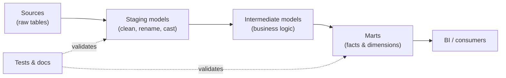

# dbt (data build tool) Cheat Sheet

> Quick reference for dbt Core: project structure, the CLI, materializations, Jinja, tests, sources, and the typical build flow.

## How dbt Fits Together



## CLI Commands

| Command | What it does |
|---|---|
| `dbt init <project>` | Scaffold a new dbt project |
| `dbt debug` | Check connection and config |
| `dbt deps` | Install packages from `packages.yml` |
| `dbt run` | Build all models |
| `dbt run --select my_model` | Build one model |
| `dbt run --select my_model+` | Build a model and everything downstream |
| `dbt run --select +my_model` | Build a model and everything upstream |
| `dbt run --select tag:daily` | Build models with a given tag |
| `dbt test` | Run all data tests |
| `dbt build` | Run + test + snapshot + seed in DAG order |
| `dbt seed` | Load CSV seed files |
| `dbt snapshot` | Capture slowly changing dimensions |
| `dbt compile` | Compile Jinja to raw SQL without running |
| `dbt docs generate` | Build documentation site |
| `dbt docs serve` | Serve docs locally |
| `dbt source freshness` | Check source data freshness |

## Node Selection Syntax

| Syntax | Meaning |
|---|---|
| `model_name` | Just that model |
| `model_name+` | Model and all descendants |
| `+model_name` | Model and all ancestors |
| `+model_name+` | Full lineage both directions |
| `tag:nightly` | All models with a tag |
| `path:models/staging` | All models in a path |
| `state:modified` | Models changed vs a deferred state |
| `--exclude model_name` | Remove nodes from a selection |

## Materializations

| Type | Behavior | Use when |
|---|---|---|
| `view` | Recreated as a view each run (default) | Light transforms, always-fresh |
| `table` | Rebuilt as a physical table | Expensive logic queried often |
| `incremental` | Only processes new/changed rows | Large, append-heavy datasets |
| `ephemeral` | Inlined as a CTE, no object created | Reusable logic, not queried directly |

```sql
-- Set in the model file
{{ config(materialized='incremental', unique_key='id') }}

select * from {{ source('raw', 'events') }}

  where loaded_at > (select max(loaded_at) from {{ this }})

```

## Common Jinja

| Snippet | Purpose |
|---|---|
| `{{ ref('model') }}` | Reference another model (builds the DAG) |
| `{{ source('src', 'table') }}` | Reference a declared source |
| `{{ config(...) }}` | Set model config inline |
| `{{ var('my_var') }}` | Read a project variable |
| `{{ this }}` | The current model's relation |
| `` | Guard incremental-only logic |
| `{{ dbt_utils.star(...) }}` | Utility macros (needs dbt_utils) |

## Tests

| Test | Declared in schema.yml | Checks |
|---|---|---|
| `unique` | column-level | No duplicate values |
| `not_null` | column-level | No nulls |
| `accepted_values` | column-level | Values within a set |
| `relationships` | column-level | Foreign-key integrity |
| Singular test | `tests/*.sql` | Any custom SQL returning failing rows |

```yaml
# models/schema.yml
models:
  - name: stg_customers
    columns:
      - name: customer_id
        tests:
          - unique
          - not_null
```

## Recommended Project Structure

```text
models/
  staging/      # 1:1 with sources, cleaned
  intermediate/ # reusable business logic
  marts/        # facts & dimensions for consumption
seeds/          # static CSV lookups
snapshots/      # SCD tracking
macros/         # reusable Jinja/SQL
tests/          # singular tests
dbt_project.yml # project config
packages.yml    # dependencies
```

## Common Mistakes & Fixes

- **Hard-coded table names** instead of `ref()`/`source()` — breaks lineage and environments.
- **Incremental model missing `is_incremental()` guard** — reprocesses everything every run.
- **No tests on keys** — silent duplicates and broken joins downstream.
- **Business logic in staging** — keep staging thin; put logic in intermediate/marts.
- **Forgetting `dbt deps`** after adding packages — macros resolve as undefined.

## Red Flags

- Models with no description or tests.
- Marts that query raw sources directly, skipping staging.
- Full-refresh runs on huge tables during business hours.
- `SELECT *` in staging without explicit column contracts.

## Beginner-to-Pro Notes

| Level | Focus |
|---|---|
| Beginner | `dbt run`, `dbt test`, understand `ref()`. |
| Advanced Beginner | Sources, staging models, schema.yml tests. |
| Intermediate Practitioner | Incremental models, macros, packages. |
| Advanced Practitioner | Snapshots, custom generic tests, exposures. |
| Enterprise Professional | CI/CD, state-based deploys, environments. |
| Architect / Strategic Lead | Layered modeling standards, contracts, governance. |
