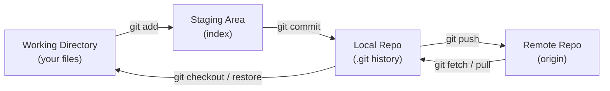
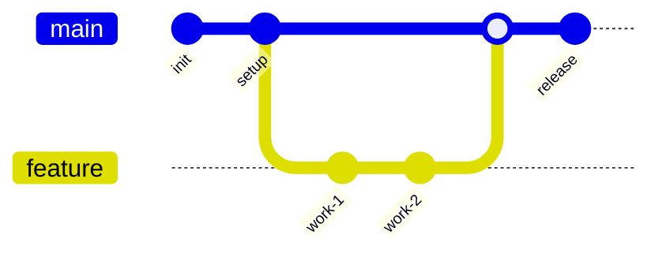

# Git Commands Cheat Sheet

> A practical, categorized quick reference for everyday Git. Covers setup, the core add/commit/push loop, branching, merging vs rebasing, inspecting history, undoing mistakes, and remote collaboration.

## Mental Model

Git tracks your work across four "areas". Most commands move changes between them.

## Setup & Configuration

| Command | What it does |
|---|---|
| `git config --global user.name "Name"` | Set the name attached to your commits |
| `git config --global user.email "you@example.com"` | Set the email attached to your commits |
| `git config --global init.defaultBranch main` | Make `main` the default branch name |
| `git config --list` | Show all effective config settings |
| `git init` | Create a new repo in the current folder |
| `git clone <url>` | Copy a remote repo locally |
| `git clone <url> <dir>` | Clone into a specific directory name |

## The Core Loop

| Command | What it does |
|---|---|
| `git status` | Show changed, staged, and untracked files |
| `git add <file>` | Stage a specific file |
| `git add .` | Stage everything in the current directory tree |
| `git add -p` | Stage changes interactively, hunk by hunk |
| `git commit -m "message"` | Commit staged changes with a message |
| `git commit -am "message"` | Stage tracked files and commit in one step |
| `git commit --amend` | Rewrite the most recent commit |
| `git push` | Send local commits to the remote |
| `git push -u origin <branch>` | Push and set upstream tracking |
| `git pull` | Fetch and merge remote changes |
| `git fetch` | Download remote changes without merging |

## Branching & Merging

| Command | What it does |
|---|---|
| `git branch` | List local branches |
| `git branch <name>` | Create a new branch |
| `git switch <name>` | Switch to an existing branch |
| `git switch -c <name>` | Create and switch to a new branch |
| `git checkout <name>` | Older way to switch branches |
| `git merge <branch>` | Merge a branch into the current one |
| `git rebase <branch>` | Replay current branch commits onto another |
| `git branch -d <name>` | Delete a merged branch |
| `git branch -D <name>` | Force-delete a branch |

### Typical Feature-Branch Workflow

## Merge vs Rebase (Quick Decision)

| Situation | Prefer |
|---|---|
| Shared/public branch others use | **Merge** (never rewrite shared history) |
| Local branch, want clean linear history | **Rebase** before merging |
| Bringing latest `main` into your feature | Rebase locally, or merge if already pushed |

## Inspecting History

| Command | What it does |
|---|---|
| `git log --oneline --graph --all` | Compact visual history of all branches |
| `git log -p <file>` | Show commit history with diffs for a file |
| `git show <commit>` | Show details and diff of a commit |
| `git diff` | Unstaged changes vs working directory |
| `git diff --staged` | Staged changes vs last commit |
| `git blame <file>` | Show who last changed each line |

## Undoing Things (Recovery)

| Goal | Command | Danger |
|---|---|---|
| Unstage a file (keep changes) | `git restore --staged <file>` | Safe |
| Discard working changes to a file | `git restore <file>` | Loses local edits |
| Undo last commit, keep changes staged | `git reset --soft HEAD~1` | Safe-ish |
| Undo last commit, keep changes unstaged | `git reset HEAD~1` | Safe-ish |
| Undo last commit AND discard changes | `git reset --hard HEAD~1` | Destructive |
| Revert a commit with a new commit | `git revert <commit>` | Safe (history preserved) |
| Recover a "lost" commit/branch | `git reflog` then `git checkout <hash>` | Safe lifesaver |

## Stashing

| Command | What it does |
|---|---|
| `git stash` | Shelve current changes and clean the working dir |
| `git stash -u` | Include untracked files |
| `git stash list` | List stashes |
| `git stash pop` | Reapply and remove the latest stash |
| `git stash apply` | Reapply but keep the stash |
| `git stash drop` | Delete a stash |

## Remotes

| Command | What it does |
|---|---|
| `git remote -v` | List remotes and their URLs |
| `git remote add origin <url>` | Add a remote named origin |
| `git remote set-url origin <url>` | Change a remote's URL |
| `git push origin --delete <branch>` | Delete a remote branch |

## Tags

| Command | What it does |
|---|---|
| `git tag` | List tags |
| `git tag -a v1.0 -m "message"` | Create an annotated tag |
| `git push origin v1.0` | Push a specific tag |
| `git push origin --tags` | Push all tags |

## Common Mistakes & Fixes

- **Committed to the wrong branch?** `git reset --soft HEAD~1`, switch to the right branch, then commit.
- **Wrong commit message?** `git commit --amend` (only before pushing to a shared branch).
- **Pushed a secret?** Rotate the secret immediately; removing it from history alone is not enough.
- **Merge conflict?** Edit the conflicted files, `git add` them, then `git commit` (or `git rebase --continue`).
- **Detached HEAD?** `git switch -c <new-branch>` to keep your work, or `git switch main` to leave.

## Red Flags

- Force-pushing (`--force`) to shared branches without `--force-with-lease`.
- Committing generated files, secrets, or large binaries.
- Long-lived branches that rarely sync with `main`.
- Vague commit messages ("fix", "stuff", "wip").

## Beginner-to-Pro Notes

| Level | Focus |
|---|---|
| Beginner | Clone, add, commit, push, pull. |
| Advanced Beginner | Branch, switch, merge; read `git status` fluently. |
| Intermediate Practitioner | Rebase, stash, resolve conflicts, use `reflog`. |
| Advanced Practitioner | Interactive rebase, cherry-pick, bisect. |
| Enterprise Professional | Branching strategy, protected branches, hooks. |
| Architect / Strategic Lead | Monorepo vs polyrepo, release/versioning strategy. |
