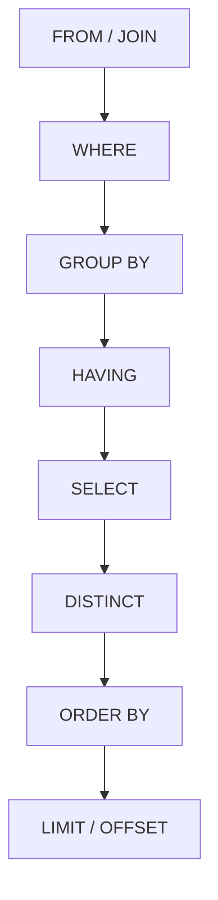
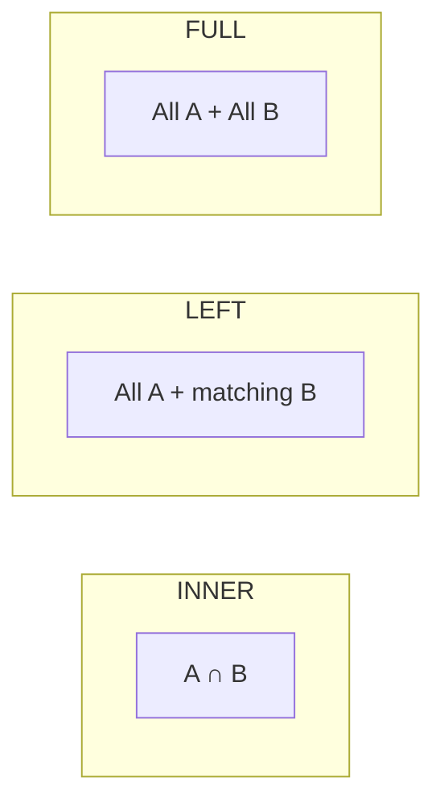

# SQL Cheat Sheet

> Quick reference for everyday SQL: query structure, joins, aggregation, window functions, CTEs, and common patterns. Syntax is ANSI-leaning; dialect notes called out where useful.

## Logical Order of Execution

SQL is written in one order but evaluated in another. Knowing this explains why aliases and `WHERE` vs `HAVING` behave the way they do.



## Core Query Skeleton

```sql
SELECT   col_a, COUNT(*) AS n
FROM     schema.table t
JOIN     other o ON o.id = t.other_id
WHERE    t.status = 'active'
GROUP BY col_a
HAVING   COUNT(*) > 5
ORDER BY n DESC
LIMIT    100;
```

## Joins

| Join | Returns |
|---|---|
| `INNER JOIN` | Rows with a match in both tables |
| `LEFT JOIN` | All left rows; nulls where no right match |
| `RIGHT JOIN` | All right rows; nulls where no left match |
| `FULL OUTER JOIN` | All rows from both; nulls where no match |
| `CROSS JOIN` | Cartesian product of both tables |
| `SELF JOIN` | Table joined to itself (via aliases) |



## Filtering

| Pattern | Example |
|---|---|
| Range | `WHERE amount BETWEEN 10 AND 20` |
| Set membership | `WHERE status IN ('a','b')` |
| Pattern match | `WHERE name LIKE 'A%'` |
| Null check | `WHERE deleted_at IS NULL` |
| Negation | `WHERE id NOT IN (...)` |
| Existence | `WHERE EXISTS (SELECT 1 FROM ...)` |

## Aggregation

| Function | Purpose |
|---|---|
| `COUNT(*)` / `COUNT(col)` | Row count / non-null count |
| `SUM(col)` | Total |
| `AVG(col)` | Mean |
| `MIN` / `MAX` | Extremes |
| `STRING_AGG` / `GROUP_CONCAT` | Concatenate grouped values (dialect-specific) |

## Window Functions

Aggregate without collapsing rows. The `OVER()` clause defines the window.

```sql
SELECT
  customer_id,
  order_date,
  amount,
  ROW_NUMBER()  OVER (PARTITION BY customer_id ORDER BY order_date)      AS order_seq,
  SUM(amount)   OVER (PARTITION BY customer_id ORDER BY order_date)      AS running_total,
  LAG(amount)   OVER (PARTITION BY customer_id ORDER BY order_date)      AS prev_amount,
  RANK()        OVER (PARTITION BY customer_id ORDER BY amount DESC)     AS amount_rank
FROM orders;
```

| Function | Use |
|---|---|
| `ROW_NUMBER()` | Unique sequential number per partition |
| `RANK()` / `DENSE_RANK()` | Ranking (with / without gaps) |
| `LAG()` / `LEAD()` | Previous / next row's value |
| `SUM()/AVG() OVER` | Running or windowed aggregates |
| `NTILE(n)` | Split rows into n buckets |

## CTEs (Common Table Expressions)

```sql
WITH recent_orders AS (
  SELECT * FROM orders WHERE order_date >= '2026-01-01'
),
by_customer AS (
  SELECT customer_id, SUM(amount) AS total
  FROM recent_orders
  GROUP BY customer_id
)
SELECT * FROM by_customer WHERE total > 1000;
```

## Modifying Data

| Statement | Purpose |
|---|---|
| `INSERT INTO t (cols) VALUES (...)` | Add rows |
| `UPDATE t SET col = x WHERE ...` | Change rows (always use WHERE) |
| `DELETE FROM t WHERE ...` | Remove rows (always use WHERE) |
| `MERGE` / `UPSERT` | Insert-or-update (dialect-specific) |
| `TRUNCATE t` | Fast full-table wipe (no WHERE, not logged per row) |

## Handy Patterns

```sql
-- De-duplicate keeping the latest row
SELECT * FROM (
  SELECT *, ROW_NUMBER() OVER (PARTITION BY key ORDER BY updated_at DESC) rn
  FROM t
) s WHERE rn = 1;

-- Conditional aggregation (pivot-style)
SELECT
  SUM(CASE WHEN status = 'paid'   THEN 1 ELSE 0 END) AS paid,
  SUM(CASE WHEN status = 'unpaid' THEN 1 ELSE 0 END) AS unpaid
FROM invoices;

-- Safe division
SELECT total / NULLIF(count, 0) AS avg_value FROM t;
```

## Common Mistakes & Fixes

- **`UPDATE`/`DELETE` without `WHERE`** — affects the whole table. Preview with `SELECT` first.
- **Filtering aggregates in `WHERE`** — use `HAVING` for post-aggregation filters.
- **Assuming join order returns all rows** — use `LEFT JOIN` when the right side may be missing.
- **`NULL` comparisons with `=`** — use `IS NULL` / `IS NOT NULL`.
- **`SELECT *` in production queries** — list columns explicitly for stability and performance.

## Red Flags

- Queries with no `WHERE` on large tables (accidental full scans).
- Correlated subqueries where a join or window would be faster.
- `DISTINCT` used to mask a broken join producing duplicates.
- Implicit type coercion in join/filter conditions.

## Beginner-to-Pro Notes

| Level | Focus |
|---|---|
| Beginner | SELECT, WHERE, ORDER BY, basic joins. |
| Advanced Beginner | GROUP BY, aggregation, HAVING. |
| Intermediate Practitioner | CTEs, window functions, subqueries. |
| Advanced Practitioner | Query plans, indexing, performance tuning. |
| Enterprise Professional | Partitioning, materialized views, governance. |
| Architect / Strategic Lead | Data modeling, dialect strategy, standards. |
