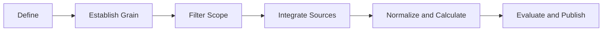
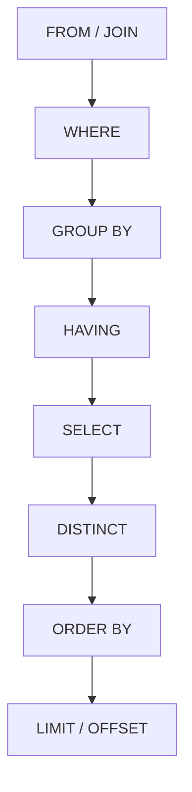
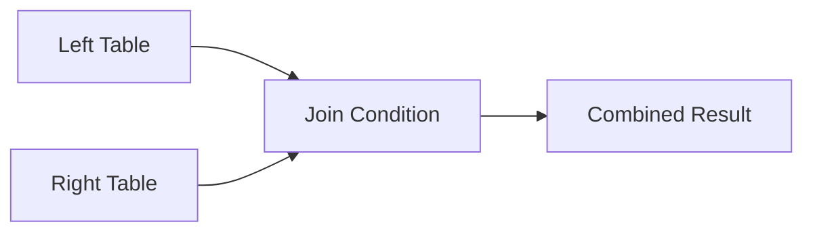
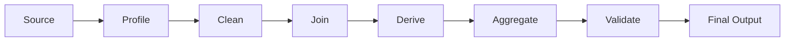

# SQL and Data Analytics Cheat Sheet
---

* quick-reference-sheets
* commands
* sql
* analytics
* data-quality
* reporting
* dbt
  related:
* ../


> Quick reference for everyday SQL and practical data analytics: query structure, joins, aggregation, window functions, CTEs, profiling, KPI design, time-series analysis, funnels, cohorts, segmentation, validation, and reusable workflow patterns.
>
> Syntax is ANSI-leaning. Dialect-specific notes are identified where useful.

---

## Quick Mental Model

A reliable analytics query usually answers six questions:

1. **What business question are we answering?**
2. **What does one row represent?**
3. **Which records are in scope?**
4. **Which calculations or classifications are required?**
5. **How will we validate the result?**
6. **How will the result be consumed?**


The most common reason an analytics query produces incorrect results is not bad SQL syntax. It is an unclear **grain** or an incorrect join.

---

# Reusable Analytics Workflow Pattern

Use this pattern for ad hoc analysis, dashboards, automation lookups, dbt models, and recurring reports.

## The DEFINE Pattern

| Step                            | Meaning                                           | Key Question                                       |
| ------------------------------- | ------------------------------------------------- | -------------------------------------------------- |
| **D — Define**                  | Define the business question and output           | What decision will this support?                   |
| **E — Establish Grain**         | State what one row represents                     | One row per customer, policy, transaction, or day? |
| **F — Filter Scope**            | Set time, status, geography, and business filters | Which records belong in the analysis?              |
| **I — Integrate Sources**       | Join and enrich required data                     | Which tables provide the needed attributes?        |
| **N — Normalize and Calculate** | Standardize values and calculate metrics          | Which transformations and business rules apply?    |
| **E — Evaluate and Publish**    | Validate results and expose the final output      | Are totals correct, and how will this be consumed? |



## Reusable CTE Structure

```sql
WITH source_data AS (

    -- 1. Select only required source columns.
    SELECT
        transaction_id,
        customer_id,
        transaction_date,
        status,
        amount
    FROM raw.transactions

),

filtered AS (

    -- 2. Apply source-level scope filters early.
    SELECT
        transaction_id,
        customer_id,
        transaction_date,
        status,
        amount
    FROM source_data
    WHERE transaction_date >= DATE '2026-01-01'
      AND status <> 'cancelled'

),

standardized AS (

    -- 3. Clean and standardize values.
    SELECT
        transaction_id,
        customer_id,
        CAST(transaction_date AS DATE) AS transaction_date,
        LOWER(TRIM(status)) AS status,
        COALESCE(amount, 0) AS amount
    FROM filtered

),

enriched AS (

    -- 4. Join required descriptive or classification data.
    SELECT
        s.transaction_id,
        s.customer_id,
        c.customer_segment,
        s.transaction_date,
        s.status,
        s.amount
    FROM standardized s
    LEFT JOIN conformed.customers c
        ON s.customer_id = c.customer_id

),

calculated AS (

    -- 5. Add reusable calculations and classifications.
    SELECT
        transaction_id,
        customer_id,
        customer_segment,
        transaction_date,
        status,
        amount,
        CASE
            WHEN amount >= 10000 THEN 'high'
            WHEN amount >= 1000  THEN 'medium'
            ELSE 'low'
        END AS value_band
    FROM enriched

),

validated AS (

    -- 6. Apply final business validity rules.
    SELECT
        transaction_id,
        customer_id,
        customer_segment,
        transaction_date,
        status,
        amount,
        value_band
    FROM calculated
    WHERE customer_id IS NOT NULL
      AND amount >= 0

),

final AS (

    -- 7. Publish at the intended grain.
    SELECT
        customer_id,
        customer_segment,
        COUNT(*) AS transaction_count,
        SUM(amount) AS total_amount,
        AVG(amount) AS average_amount
    FROM validated
    GROUP BY
        customer_id,
        customer_segment

)

SELECT
    customer_id,
    customer_segment,
    transaction_count,
    total_amount,
    average_amount
FROM final;
```

## Why This Pattern Is Efficient

* Each transformation step has one main purpose.
* Business rules are easier to review.
* Errors can be isolated to a specific CTE.
* Filters are applied early to reduce unnecessary processing.
* Final grain is visible.
* The pattern maps naturally to layered dbt models.
* Validation can be added without mixing it into source logic.
* Individual CTEs can later become reusable models.

---

# Logical Order of SQL Execution

SQL is written in one order but logically evaluated in another.



| Logical Step       | Purpose                          |
| ------------------ | -------------------------------- |
| `FROM` / `JOIN`    | Identify and combine source rows |
| `WHERE`            | Filter individual rows           |
| `GROUP BY`         | Form groups                      |
| `HAVING`           | Filter grouped results           |
| `SELECT`           | Calculate and return columns     |
| `DISTINCT`         | Remove duplicate result rows     |
| `ORDER BY`         | Sort the final result            |
| `LIMIT` / `OFFSET` | Restrict returned rows           |

## Why Aliases Often Fail in `WHERE`

This may fail in many SQL dialects:

```sql
SELECT
    amount * 1.10 AS adjusted_amount
FROM transactions
WHERE adjusted_amount > 1000;
```

`WHERE` is evaluated before `SELECT`, so the alias may not yet exist.

Use a CTE:

```sql
WITH calculated AS (
    SELECT
        amount,
        amount * 1.10 AS adjusted_amount
    FROM transactions
)

SELECT
    amount,
    adjusted_amount
FROM calculated
WHERE adjusted_amount > 1000;
```

---

# Core Query Skeleton

```sql
SELECT
    t.category,
    COUNT(*) AS record_count,
    SUM(t.amount) AS total_amount
FROM schema.transactions t
INNER JOIN schema.customers c
    ON t.customer_id = c.customer_id
WHERE t.status = 'active'
  AND t.transaction_date >= DATE '2026-01-01'
GROUP BY
    t.category
HAVING COUNT(*) > 5
ORDER BY
    total_amount DESC
LIMIT 100;
```

## Recommended Formatting Order

```text
SELECT
FROM
JOIN
WHERE
GROUP BY
HAVING
QUALIFY
ORDER BY
LIMIT
```

`QUALIFY` is available in platforms such as Databricks, Snowflake, and BigQuery, but is not universal ANSI SQL.

---

# Analytics Grain

**Grain** means what one row represents.

Examples:

| Dataset              | Grain                                     |
| -------------------- | ----------------------------------------- |
| Customer table       | One row per customer                      |
| Policy table         | One row per policy                        |
| Policy-version table | One row per policy version                |
| Transaction table    | One row per transaction                   |
| Coverage table       | One row per policy, version, and coverage |
| Daily dashboard      | One row per date and business unit        |
| Automation output    | One row per automation transaction        |

Always write the grain before building a complex query.

```sql
-- Grain: one row per customer per calendar month
```

## Grain Validation

```sql
SELECT
    customer_id,
    month_start,
    COUNT(*) AS row_count
FROM analytics.customer_monthly
GROUP BY
    customer_id,
    month_start
HAVING COUNT(*) > 1;
```

A correctly grained model should return zero rows unless duplicates are intentionally allowed.

---

# Selecting Columns

## Prefer Explicit Columns

```sql
SELECT
    policy_id,
    policy_number,
    effective_date,
    expiration_date,
    status
FROM policies;
```

Avoid production use of:

```sql
SELECT *
FROM policies;
```

Explicit columns improve:

* stability
* readability
* lineage
* performance
* schema-change safety
* downstream contract clarity

## Rename Columns Clearly

```sql
SELECT
    id AS transaction_id,
    created_at AS transaction_created_at,
    status AS transaction_status
FROM raw_transactions;
```

Avoid vague names such as:

```text
id
name
date
value
status
```

when multiple joined tables contain similar attributes.

---

# Filtering

| Pattern             | Example                                    |
| ------------------- | ------------------------------------------ |
| Equality            | `WHERE status = 'active'`                  |
| Multiple conditions | `WHERE status = 'active' AND amount > 100` |
| Range               | `WHERE amount BETWEEN 10 AND 20`           |
| Set membership      | `WHERE status IN ('active', 'pending')`    |
| Pattern match       | `WHERE customer_name LIKE 'A%'`            |
| Null check          | `WHERE deleted_at IS NULL`                 |
| Negation            | `WHERE status <> 'cancelled'`              |
| Existence           | `WHERE EXISTS (SELECT 1 FROM ...)`         |
| Date filter         | `WHERE created_at >= DATE '2026-01-01'`    |

## Inclusive Range Warning

`BETWEEN` includes both endpoints.

```sql
WHERE amount BETWEEN 10 AND 20
```

is equivalent to:

```sql
WHERE amount >= 10
  AND amount <= 20
```

## Safer Timestamp Filtering

Avoid:

```sql
WHERE created_at BETWEEN
    TIMESTAMP '2026-07-01 00:00:00'
    AND TIMESTAMP '2026-07-31 23:59:59';
```

Prefer a half-open range:

```sql
WHERE created_at >= TIMESTAMP '2026-07-01 00:00:00'
  AND created_at <  TIMESTAMP '2026-08-01 00:00:00';
```

This avoids precision problems with milliseconds or microseconds.

---

# Null Handling

`NULL` means missing, unknown, or not applicable. It is not equal to zero or an empty string.

## Null Checks

```sql
WHERE email_address IS NULL
```

```sql
WHERE email_address IS NOT NULL
```

Do not use:

```sql
WHERE email_address = NULL
```

## Replace Null Values

```sql
SELECT
    COALESCE(phone_number, 'Not Provided') AS phone_number
FROM customers;
```

## Null-Safe Calculation

```sql
SELECT
    COALESCE(premium_amount, 0)
    + COALESCE(fee_amount, 0) AS total_amount
FROM policies;
```

## Null Analytics

```sql
SELECT
    COUNT(*) AS total_rows,
    COUNT(email_address) AS populated_email_rows,
    SUM(CASE WHEN email_address IS NULL THEN 1 ELSE 0 END) AS missing_email_rows,
    100.0 * SUM(CASE WHEN email_address IS NULL THEN 1 ELSE 0 END)
        / NULLIF(COUNT(*), 0) AS missing_email_pct
FROM customers;
```

---

# Joins

| Join              | Returns                                      |
| ----------------- | -------------------------------------------- |
| `INNER JOIN`      | Rows with a match in both tables             |
| `LEFT JOIN`       | All left rows and matching right rows        |
| `RIGHT JOIN`      | All right rows and matching left rows        |
| `FULL OUTER JOIN` | All rows from both tables                    |
| `CROSS JOIN`      | Every left row combined with every right row |
| `SELF JOIN`       | A table joined to itself                     |



## Inner Join

```sql
SELECT
    o.order_id,
    o.customer_id,
    c.customer_name
FROM orders o
INNER JOIN customers c
    ON o.customer_id = c.customer_id;
```

## Left Join

```sql
SELECT
    c.customer_id,
    c.customer_name,
    o.order_id
FROM customers c
LEFT JOIN orders o
    ON c.customer_id = o.customer_id;
```

This retains customers even when they have no orders.

## Anti-Join: Find Missing Matches

```sql
SELECT
    c.customer_id,
    c.customer_name
FROM customers c
LEFT JOIN orders o
    ON c.customer_id = o.customer_id
WHERE o.customer_id IS NULL;
```

Using `NOT EXISTS` is often clearer:

```sql
SELECT
    c.customer_id,
    c.customer_name
FROM customers c
WHERE NOT EXISTS (
    SELECT 1
    FROM orders o
    WHERE o.customer_id = c.customer_id
);
```

## Semi-Join: Return Rows That Have a Match

```sql
SELECT
    c.customer_id,
    c.customer_name
FROM customers c
WHERE EXISTS (
    SELECT 1
    FROM orders o
    WHERE o.customer_id = c.customer_id
);
```

## Join Cardinality

Before joining, identify the relationship:

| Relationship | Example                                        | Risk                        |
| ------------ | ---------------------------------------------- | --------------------------- |
| One-to-one   | Customer to customer profile                   | Low                         |
| One-to-many  | Customer to orders                             | Left-side values repeat     |
| Many-to-one  | Orders to customer                             | Usually expected enrichment |
| Many-to-many | Policies to contacts through multiple mappings | High duplication risk       |

## Detect Join Multiplication

```sql
WITH before_join AS (
    SELECT COUNT(*) AS row_count
    FROM policies
),

after_join AS (
    SELECT COUNT(*) AS row_count
    FROM policies p
    LEFT JOIN policy_contacts pc
        ON p.policy_id = pc.policy_id
)

SELECT
    b.row_count AS before_count,
    a.row_count AS after_count,
    a.row_count - b.row_count AS additional_rows
FROM before_join b
CROSS JOIN after_join a;
```

A higher row count may be correct, but it must be intentional.

## Pre-Aggregate Before Joining

Instead of joining all transactions and then aggregating:

```sql
WITH transaction_totals AS (
    SELECT
        customer_id,
        SUM(amount) AS total_amount
    FROM transactions
    GROUP BY customer_id
)

SELECT
    c.customer_id,
    c.customer_name,
    COALESCE(t.total_amount, 0) AS total_amount
FROM customers c
LEFT JOIN transaction_totals t
    ON c.customer_id = t.customer_id;
```

This often prevents duplication and reduces processing.

---

# Aggregation

| Function                      | Purpose                      |
| ----------------------------- | ---------------------------- |
| `COUNT(*)`                    | Count rows                   |
| `COUNT(column)`               | Count non-null values        |
| `COUNT(DISTINCT column)`      | Count unique non-null values |
| `SUM(column)`                 | Total                        |
| `AVG(column)`                 | Arithmetic mean              |
| `MIN(column)`                 | Minimum                      |
| `MAX(column)`                 | Maximum                      |
| `STRING_AGG` / `GROUP_CONCAT` | Combine grouped text values  |

## Basic Aggregation

```sql
SELECT
    customer_segment,
    COUNT(*) AS customer_count,
    SUM(annual_revenue) AS total_revenue,
    AVG(annual_revenue) AS average_revenue
FROM customers
GROUP BY
    customer_segment;
```

## Group at the Intended Grain

```sql
SELECT
    DATE_TRUNC('month', transaction_date) AS transaction_month,
    business_unit,
    COUNT(*) AS transaction_count,
    SUM(amount) AS total_amount
FROM transactions
GROUP BY
    DATE_TRUNC('month', transaction_date),
    business_unit;
```

## Filter Aggregates With `HAVING`

```sql
SELECT
    customer_id,
    SUM(amount) AS total_amount
FROM transactions
GROUP BY
    customer_id
HAVING SUM(amount) > 10000;
```

---

# Conditional Logic

## CASE Expression

```sql
SELECT
    customer_id,
    annual_revenue,
    CASE
        WHEN annual_revenue >= 1000000 THEN 'enterprise'
        WHEN annual_revenue >= 100000  THEN 'mid-market'
        WHEN annual_revenue IS NULL    THEN 'unknown'
        ELSE 'small-business'
    END AS customer_segment
FROM customers;
```

## Conditional Aggregation

```sql
SELECT
    COUNT(*) AS total_transactions,
    SUM(CASE WHEN status = 'completed' THEN 1 ELSE 0 END) AS completed_count,
    SUM(CASE WHEN status = 'failed' THEN 1 ELSE 0 END) AS failed_count,
    SUM(CASE WHEN status = 'pending' THEN 1 ELSE 0 END) AS pending_count
FROM automation_transactions;
```

## Completion Rate

```sql
SELECT
    100.0
    * SUM(CASE WHEN status = 'completed' THEN 1 ELSE 0 END)
    / NULLIF(COUNT(*), 0) AS completion_rate_pct
FROM automation_transactions;
```

---

# CTEs: Common Table Expressions

CTEs help divide a query into named steps.

```sql
WITH recent_orders AS (
    SELECT
        order_id,
        customer_id,
        order_date,
        amount
    FROM orders
    WHERE order_date >= DATE '2026-01-01'
),

by_customer AS (
    SELECT
        customer_id,
        COUNT(*) AS order_count,
        SUM(amount) AS total_amount
    FROM recent_orders
    GROUP BY customer_id
)

SELECT
    customer_id,
    order_count,
    total_amount
FROM by_customer
WHERE total_amount > 1000;
```

## Good CTE Responsibilities

Use separate CTEs for:

* source selection
* filtering
* standardization
* deduplication
* joins
* derivations
* aggregation
* validation
* final output

Avoid deeply nested queries when named steps would make the logic clearer.

---

# Window Functions

Window functions calculate across related rows without collapsing them.

```sql
SELECT
    customer_id,
    order_date,
    amount,
    ROW_NUMBER() OVER (
        PARTITION BY customer_id
        ORDER BY order_date
    ) AS order_sequence,
    SUM(amount) OVER (
        PARTITION BY customer_id
        ORDER BY order_date
        ROWS BETWEEN UNBOUNDED PRECEDING AND CURRENT ROW
    ) AS running_total,
    LAG(amount) OVER (
        PARTITION BY customer_id
        ORDER BY order_date
    ) AS previous_amount,
    RANK() OVER (
        PARTITION BY customer_id
        ORDER BY amount DESC
    ) AS amount_rank
FROM orders;
```

| Function         | Use                          |
| ---------------- | ---------------------------- |
| `ROW_NUMBER()`   | Unique sequence              |
| `RANK()`         | Ranking with gaps after ties |
| `DENSE_RANK()`   | Ranking without gaps         |
| `LAG()`          | Previous row value           |
| `LEAD()`         | Next row value               |
| `FIRST_VALUE()`  | First value in a window      |
| `LAST_VALUE()`   | Last value in a window       |
| `SUM() OVER`     | Running or partition total   |
| `AVG() OVER`     | Moving or partition average  |
| `NTILE(n)`       | Split rows into buckets      |
| `PERCENT_RANK()` | Relative rank from 0 to 1    |

## Latest Row per Business Key

```sql
WITH ranked AS (
    SELECT
        policy_id,
        policy_version,
        updated_at,
        status,
        ROW_NUMBER() OVER (
            PARTITION BY policy_id
            ORDER BY updated_at DESC, policy_version DESC
        ) AS row_number
    FROM policy_versions
)

SELECT
    policy_id,
    policy_version,
    updated_at,
    status
FROM ranked
WHERE row_number = 1;
```

## Databricks `QUALIFY`

```sql
SELECT
    policy_id,
    policy_version,
    updated_at,
    status
FROM policy_versions
QUALIFY ROW_NUMBER() OVER (
    PARTITION BY policy_id
    ORDER BY updated_at DESC, policy_version DESC
) = 1;
```

## Running Total

```sql
SELECT
    transaction_date,
    amount,
    SUM(amount) OVER (
        ORDER BY transaction_date
        ROWS BETWEEN UNBOUNDED PRECEDING AND CURRENT ROW
    ) AS running_total
FROM transactions;
```

## Rolling Seven-Day Average

```sql
SELECT
    activity_date,
    daily_count,
    AVG(daily_count) OVER (
        ORDER BY activity_date
        ROWS BETWEEN 6 PRECEDING AND CURRENT ROW
    ) AS rolling_7_day_average
FROM daily_activity;
```

---

# Date and Time Analytics

## Common Date Operations

```sql
SELECT
    CURRENT_DATE AS today,
    DATE_TRUNC('month', CURRENT_DATE) AS month_start,
    DATE_TRUNC('year', CURRENT_DATE) AS year_start;
```

## Extract Date Parts

```sql
SELECT
    EXTRACT(YEAR FROM transaction_date) AS transaction_year,
    EXTRACT(MONTH FROM transaction_date) AS transaction_month,
    EXTRACT(DAY FROM transaction_date) AS transaction_day
FROM transactions;
```

## Monthly Trend

```sql
SELECT
    DATE_TRUNC('month', transaction_date) AS month_start,
    COUNT(*) AS transaction_count,
    SUM(amount) AS total_amount
FROM transactions
GROUP BY
    DATE_TRUNC('month', transaction_date)
ORDER BY
    month_start;
```

## Month-Over-Month Change

```sql
WITH monthly AS (
    SELECT
        DATE_TRUNC('month', transaction_date) AS month_start,
        SUM(amount) AS total_amount
    FROM transactions
    GROUP BY
        DATE_TRUNC('month', transaction_date)
),

compared AS (
    SELECT
        month_start,
        total_amount,
        LAG(total_amount) OVER (
            ORDER BY month_start
        ) AS previous_month_amount
    FROM monthly
)

SELECT
    month_start,
    total_amount,
    previous_month_amount,
    total_amount - previous_month_amount AS amount_change,
    100.0 * (
        total_amount - previous_month_amount
    ) / NULLIF(previous_month_amount, 0) AS pct_change
FROM compared
ORDER BY
    month_start;
```

## Year-Over-Year Comparison

```sql
WITH monthly AS (
    SELECT
        DATE_TRUNC('month', transaction_date) AS month_start,
        SUM(amount) AS total_amount
    FROM transactions
    GROUP BY
        DATE_TRUNC('month', transaction_date)
)

SELECT
    month_start,
    total_amount,
    LAG(total_amount, 12) OVER (
        ORDER BY month_start
    ) AS prior_year_amount,
    100.0 * (
        total_amount
        - LAG(total_amount, 12) OVER (ORDER BY month_start)
    ) / NULLIF(
        LAG(total_amount, 12) OVER (ORDER BY month_start),
        0
    ) AS year_over_year_pct
FROM monthly
ORDER BY
    month_start;
```

## Date Spine Concept

A date spine is a complete series of dates used to prevent missing days or months from disappearing from a report.

```sql
WITH date_spine AS (
    SELECT EXPLODE(
        SEQUENCE(
            DATE '2026-01-01',
            DATE '2026-12-31',
            INTERVAL 1 DAY
        )
    ) AS calendar_date
),

daily_activity AS (
    SELECT
        CAST(created_at AS DATE) AS activity_date,
        COUNT(*) AS activity_count
    FROM automation_transactions
    GROUP BY
        CAST(created_at AS DATE)
)

SELECT
    d.calendar_date,
    COALESCE(a.activity_count, 0) AS activity_count
FROM date_spine d
LEFT JOIN daily_activity a
    ON d.calendar_date = a.activity_date
ORDER BY
    d.calendar_date;
```

`EXPLODE(SEQUENCE())` is a Databricks/Spark SQL pattern.

---

# Data Profiling

Profiling helps you understand a dataset before applying business logic.

## Basic Table Profile

```sql
SELECT
    COUNT(*) AS total_rows,
    COUNT(DISTINCT customer_id) AS distinct_customers,
    MIN(created_at) AS earliest_created_at,
    MAX(created_at) AS latest_created_at,
    MIN(amount) AS minimum_amount,
    MAX(amount) AS maximum_amount,
    AVG(amount) AS average_amount
FROM transactions;
```

## Column Completeness

```sql
SELECT
    COUNT(*) AS total_rows,
    SUM(CASE WHEN customer_id IS NULL THEN 1 ELSE 0 END) AS missing_customer_id,
    SUM(CASE WHEN email_address IS NULL THEN 1 ELSE 0 END) AS missing_email,
    SUM(CASE WHEN amount IS NULL THEN 1 ELSE 0 END) AS missing_amount
FROM transactions;
```

## Value Distribution

```sql
SELECT
    status,
    COUNT(*) AS row_count,
    100.0 * COUNT(*) / SUM(COUNT(*)) OVER () AS percentage_of_rows
FROM transactions
GROUP BY
    status
ORDER BY
    row_count DESC;
```

## Duplicate Detection

```sql
SELECT
    transaction_id,
    COUNT(*) AS duplicate_count
FROM transactions
GROUP BY
    transaction_id
HAVING COUNT(*) > 1;
```

## Composite-Key Duplicate Detection

```sql
SELECT
    policy_id,
    policy_version,
    coverage_code,
    COUNT(*) AS duplicate_count
FROM policy_coverage
GROUP BY
    policy_id,
    policy_version,
    coverage_code
HAVING COUNT(*) > 1;
```

## Invalid Value Detection

```sql
SELECT
    status,
    COUNT(*) AS row_count
FROM transactions
WHERE status NOT IN (
    'pending',
    'processing',
    'completed',
    'failed'
)
   OR status IS NULL
GROUP BY
    status;
```

---

# Data Quality Checks

## Uniqueness

```sql
SELECT
    COUNT(*) AS total_rows,
    COUNT(DISTINCT transaction_id) AS distinct_ids
FROM transactions;
```

Expected:

```text
total_rows = distinct_ids
```

## Not Null

```sql
SELECT *
FROM transactions
WHERE transaction_id IS NULL;
```

## Referential Integrity

```sql
SELECT
    t.customer_id,
    COUNT(*) AS orphaned_transactions
FROM transactions t
LEFT JOIN customers c
    ON t.customer_id = c.customer_id
WHERE c.customer_id IS NULL
GROUP BY
    t.customer_id;
```

## Accepted Values

```sql
SELECT
    status,
    COUNT(*) AS row_count
FROM transactions
WHERE status NOT IN (
    'pending',
    'completed',
    'failed'
)
GROUP BY
    status;
```

## Valid Date Range

```sql
SELECT *
FROM policies
WHERE expiration_date < effective_date;
```

## Reconciliation

```sql
WITH source_total AS (
    SELECT
        COUNT(*) AS row_count,
        SUM(amount) AS total_amount
    FROM source.transactions
),

target_total AS (
    SELECT
        COUNT(*) AS row_count,
        SUM(amount) AS total_amount
    FROM analytics.transactions
)

SELECT
    s.row_count AS source_row_count,
    t.row_count AS target_row_count,
    s.total_amount AS source_total_amount,
    t.total_amount AS target_total_amount,
    t.row_count - s.row_count AS row_count_difference,
    t.total_amount - s.total_amount AS amount_difference
FROM source_total s
CROSS JOIN target_total t;
```

---

# Descriptive Analytics

Descriptive analytics answers:

> What happened?

## Summary Statistics

```sql
SELECT
    COUNT(*) AS transaction_count,
    SUM(amount) AS total_amount,
    AVG(amount) AS average_amount,
    MIN(amount) AS minimum_amount,
    MAX(amount) AS maximum_amount,
    STDDEV(amount) AS amount_standard_deviation
FROM transactions;
```

## Percentiles

Databricks example:

```sql
SELECT
    PERCENTILE_APPROX(amount, 0.50) AS median_amount,
    PERCENTILE_APPROX(amount, 0.75) AS percentile_75,
    PERCENTILE_APPROX(amount, 0.90) AS percentile_90,
    PERCENTILE_APPROX(amount, 0.95) AS percentile_95
FROM transactions;
```

Percentiles are often more useful than averages when values are heavily skewed.

## Distribution by Band

```sql
SELECT
    CASE
        WHEN amount < 100 THEN '01. Under 100'
        WHEN amount < 500 THEN '02. 100–499'
        WHEN amount < 1000 THEN '03. 500–999'
        WHEN amount < 5000 THEN '04. 1,000–4,999'
        ELSE '05. 5,000+'
    END AS amount_band,
    COUNT(*) AS transaction_count,
    SUM(amount) AS total_amount
FROM transactions
GROUP BY
    CASE
        WHEN amount < 100 THEN '01. Under 100'
        WHEN amount < 500 THEN '02. 100–499'
        WHEN amount < 1000 THEN '03. 500–999'
        WHEN amount < 5000 THEN '04. 1,000–4,999'
        ELSE '05. 5,000+'
    END
ORDER BY
    amount_band;
```

---

# Diagnostic Analytics

Diagnostic analytics answers:

> Why did it happen?

## Failure Breakdown

```sql
SELECT
    error_category,
    COUNT(*) AS failure_count,
    100.0 * COUNT(*) / SUM(COUNT(*)) OVER () AS failure_percentage
FROM automation_transactions
WHERE status = 'failed'
GROUP BY
    error_category
ORDER BY
    failure_count DESC;
```

## Failure by Source System

```sql
SELECT
    source_system,
    error_category,
    COUNT(*) AS failure_count
FROM automation_transactions
WHERE status = 'failed'
GROUP BY
    source_system,
    error_category
ORDER BY
    failure_count DESC;
```

## Compare Successful and Failed Records

```sql
SELECT
    status,
    AVG(processing_seconds) AS average_processing_seconds,
    AVG(input_record_count) AS average_input_record_count,
    AVG(retry_count) AS average_retry_count
FROM automation_runs
GROUP BY
    status;
```

## Contribution Analysis

```sql
WITH by_category AS (
    SELECT
        error_category,
        COUNT(*) AS failure_count
    FROM automation_transactions
    WHERE status = 'failed'
    GROUP BY
        error_category
)

SELECT
    error_category,
    failure_count,
    100.0 * failure_count
        / SUM(failure_count) OVER () AS contribution_pct,
    100.0 * SUM(failure_count) OVER (
        ORDER BY failure_count DESC
        ROWS BETWEEN UNBOUNDED PRECEDING AND CURRENT ROW
    ) / SUM(failure_count) OVER () AS cumulative_contribution_pct
FROM by_category
ORDER BY
    failure_count DESC;
```

This supports Pareto-style analysis: identifying the small number of causes responsible for most failures.

---

# KPI Design

A useful KPI needs:

* clear business meaning
* defined numerator
* defined denominator
* defined grain
* defined time period
* documented exclusions
* target or threshold
* accountable owner

## KPI Definition Template

| Field       | Example                                  |
| ----------- | ---------------------------------------- |
| KPI         | Automation completion rate               |
| Purpose     | Measure successful processing            |
| Numerator   | Completed transactions                   |
| Denominator | All eligible attempted transactions      |
| Exclusions  | Test records and user-cancelled requests |
| Grain       | One row per day and automation           |
| Target      | At least 98%                             |
| Owner       | Intelligent Automation Operations        |

## Completion Rate

```sql
SELECT
    automation_name,
    COUNT(*) AS attempted_count,
    SUM(CASE WHEN status = 'completed' THEN 1 ELSE 0 END) AS completed_count,
    100.0
        * SUM(CASE WHEN status = 'completed' THEN 1 ELSE 0 END)
        / NULLIF(COUNT(*), 0) AS completion_rate_pct
FROM automation_transactions
WHERE is_test_record = FALSE
GROUP BY
    automation_name;
```

## Straight-Through Processing Rate

```sql
SELECT
    automation_name,
    100.0
        * SUM(
            CASE
                WHEN status = 'completed'
                 AND manual_intervention_required = FALSE
                THEN 1
                ELSE 0
            END
        )
        / NULLIF(COUNT(*), 0) AS straight_through_processing_pct
FROM automation_transactions
GROUP BY
    automation_name;
```

## Average Handling Time Saved

```sql
SELECT
    automation_name,
    SUM(successful_transactions) AS successful_transactions,
    SUM(successful_transactions * manual_minutes_per_transaction)
        / 60.0 AS estimated_hours_saved
FROM automation_value_metrics
GROUP BY
    automation_name;
```

Avoid presenting estimated time savings as measured savings unless the methodology supports that claim.

---

# Segmentation

Segmentation divides records into meaningful groups.

## Customer Segmentation

```sql
SELECT
    customer_id,
    annual_revenue,
    CASE
        WHEN annual_revenue >= 1000000 THEN 'enterprise'
        WHEN annual_revenue >= 100000 THEN 'mid-market'
        WHEN annual_revenue >= 10000 THEN 'small-business'
        ELSE 'micro'
    END AS revenue_segment
FROM customers;
```

## Quartile Segmentation

```sql
SELECT
    customer_id,
    total_revenue,
    NTILE(4) OVER (
        ORDER BY total_revenue DESC
    ) AS revenue_quartile
FROM customer_revenue;
```

## Recency, Frequency, Monetary Pattern

```sql
WITH customer_metrics AS (
    SELECT
        customer_id,
        DATEDIFF(CURRENT_DATE, MAX(order_date)) AS recency_days,
        COUNT(DISTINCT order_id) AS frequency,
        SUM(amount) AS monetary_value
    FROM orders
    GROUP BY
        customer_id
)

SELECT
    customer_id,
    recency_days,
    frequency,
    monetary_value,
    NTILE(5) OVER (
        ORDER BY recency_days DESC
    ) AS recency_score,
    NTILE(5) OVER (
        ORDER BY frequency
    ) AS frequency_score,
    NTILE(5) OVER (
        ORDER BY monetary_value
    ) AS monetary_score
FROM customer_metrics;
```

Dialect behavior for `DATEDIFF` varies. Validate argument order in your platform.

---

# Funnel Analysis

Funnels measure progression through ordered process stages.

Example:

```text
Request received
    ↓
Validated
    ↓
Processed
    ↓
Document generated
    ↓
Email sent
```

```sql
SELECT
    COUNT(DISTINCT CASE
        WHEN request_received_at IS NOT NULL
        THEN transaction_id
    END) AS requests_received,

    COUNT(DISTINCT CASE
        WHEN validation_completed_at IS NOT NULL
        THEN transaction_id
    END) AS validated,

    COUNT(DISTINCT CASE
        WHEN processing_completed_at IS NOT NULL
        THEN transaction_id
    END) AS processed,

    COUNT(DISTINCT CASE
        WHEN document_generated_at IS NOT NULL
        THEN transaction_id
    END) AS documents_generated,

    COUNT(DISTINCT CASE
        WHEN email_sent_at IS NOT NULL
        THEN transaction_id
    END) AS emails_sent

FROM automation_transactions;
```

## Stage Conversion

```sql
WITH funnel AS (
    SELECT
        COUNT(DISTINCT CASE
            WHEN request_received_at IS NOT NULL
            THEN transaction_id
        END) AS received,

        COUNT(DISTINCT CASE
            WHEN validation_completed_at IS NOT NULL
            THEN transaction_id
        END) AS validated,

        COUNT(DISTINCT CASE
            WHEN email_sent_at IS NOT NULL
            THEN transaction_id
        END) AS sent

    FROM automation_transactions
)

SELECT
    received,
    validated,
    sent,
    100.0 * validated / NULLIF(received, 0) AS received_to_validated_pct,
    100.0 * sent / NULLIF(validated, 0) AS validated_to_sent_pct,
    100.0 * sent / NULLIF(received, 0) AS end_to_end_conversion_pct
FROM funnel;
```

---

# Cohort Analysis

A cohort groups entities by a shared starting period.

Examples:

* customer signup month
* first purchase month
* first automation use month
* policy effective month

## Monthly Customer Cohort

```sql
WITH first_order AS (
    SELECT
        customer_id,
        DATE_TRUNC('month', MIN(order_date)) AS cohort_month
    FROM orders
    GROUP BY
        customer_id
),

customer_activity AS (
    SELECT DISTINCT
        customer_id,
        DATE_TRUNC('month', order_date) AS activity_month
    FROM orders
),

cohort_activity AS (
    SELECT
        f.cohort_month,
        a.activity_month,
        MONTHS_BETWEEN(
            a.activity_month,
            f.cohort_month
        ) AS months_since_start,
        COUNT(DISTINCT a.customer_id) AS active_customers
    FROM first_order f
    INNER JOIN customer_activity a
        ON f.customer_id = a.customer_id
    GROUP BY
        f.cohort_month,
        a.activity_month,
        MONTHS_BETWEEN(
            a.activity_month,
            f.cohort_month
        )
)

SELECT
    cohort_month,
    activity_month,
    months_since_start,
    active_customers
FROM cohort_activity
ORDER BY
    cohort_month,
    activity_month;
```

`MONTHS_BETWEEN` behavior is dialect-specific. For reporting, it may be safer to calculate an integer month index using year and month components.

---

# Retention Analysis

```sql
WITH first_activity AS (
    SELECT
        user_id,
        DATE_TRUNC('month', MIN(activity_date)) AS cohort_month
    FROM user_activity
    GROUP BY
        user_id
),

activity AS (
    SELECT DISTINCT
        user_id,
        DATE_TRUNC('month', activity_date) AS activity_month
    FROM user_activity
),

cohort_size AS (
    SELECT
        cohort_month,
        COUNT(*) AS cohort_users
    FROM first_activity
    GROUP BY
        cohort_month
),

retained AS (
    SELECT
        f.cohort_month,
        a.activity_month,
        COUNT(DISTINCT a.user_id) AS retained_users
    FROM first_activity f
    INNER JOIN activity a
        ON f.user_id = a.user_id
    GROUP BY
        f.cohort_month,
        a.activity_month
)

SELECT
    r.cohort_month,
    r.activity_month,
    r.retained_users,
    c.cohort_users,
    100.0 * r.retained_users
        / NULLIF(c.cohort_users, 0) AS retention_pct
FROM retained r
INNER JOIN cohort_size c
    ON r.cohort_month = c.cohort_month
ORDER BY
    r.cohort_month,
    r.activity_month;
```

---

# Process and Automation Analytics

## Automation Run Summary

```sql
SELECT
    automation_name,
    CAST(started_at AS DATE) AS run_date,
    COUNT(*) AS total_runs,
    SUM(CASE WHEN status = 'completed' THEN 1 ELSE 0 END) AS successful_runs,
    SUM(CASE WHEN status = 'failed' THEN 1 ELSE 0 END) AS failed_runs,
    AVG(processing_seconds) AS average_processing_seconds,
    MAX(processing_seconds) AS maximum_processing_seconds
FROM automation_runs
GROUP BY
    automation_name,
    CAST(started_at AS DATE);
```

## SLA Compliance

```sql
SELECT
    automation_name,
    COUNT(*) AS total_transactions,
    SUM(
        CASE
            WHEN processing_seconds <= sla_seconds
            THEN 1
            ELSE 0
        END
    ) AS transactions_within_sla,
    100.0
        * SUM(
            CASE
                WHEN processing_seconds <= sla_seconds
                THEN 1
                ELSE 0
            END
        )
        / NULLIF(COUNT(*), 0) AS sla_compliance_pct
FROM automation_transactions
GROUP BY
    automation_name;
```

## Exception Aging

```sql
SELECT
    exception_id,
    exception_type,
    created_at,
    DATEDIFF(CURRENT_DATE, CAST(created_at AS DATE)) AS age_days,
    CASE
        WHEN DATEDIFF(CURRENT_DATE, CAST(created_at AS DATE)) >= 10
            THEN '10+ days'
        WHEN DATEDIFF(CURRENT_DATE, CAST(created_at AS DATE)) >= 5
            THEN '5–9 days'
        WHEN DATEDIFF(CURRENT_DATE, CAST(created_at AS DATE)) >= 2
            THEN '2–4 days'
        ELSE '0–1 days'
    END AS aging_band
FROM automation_exceptions
WHERE resolved_at IS NULL;
```

## Retry Analysis

```sql
SELECT
    retry_count,
    COUNT(*) AS transaction_count,
    SUM(CASE WHEN status = 'completed' THEN 1 ELSE 0 END) AS completed_count,
    SUM(CASE WHEN status = 'failed' THEN 1 ELSE 0 END) AS failed_count
FROM automation_transactions
GROUP BY
    retry_count
ORDER BY
    retry_count;
```

---

# Efficiency Patterns for Workflow Development

## 1. Filter Early

Apply high-value filters before large joins.

```sql
WITH recent_transactions AS (
    SELECT
        transaction_id,
        customer_id,
        amount
    FROM transactions
    WHERE transaction_date >= DATE '2026-01-01'
)

SELECT
    t.transaction_id,
    c.customer_name,
    t.amount
FROM recent_transactions t
LEFT JOIN customers c
    ON t.customer_id = c.customer_id;
```

## 2. Select Only Required Columns

Avoid carrying unused columns through every transformation.

## 3. Aggregate Before Joining

Reduce a many-row dataset to the required join grain first.

## 4. Calculate Once

If a complex expression is reused, calculate it in a CTE.

```sql
WITH calculated AS (
    SELECT
        policy_id,
        written_premium + fee_amount AS total_amount
    FROM policies
)

SELECT
    policy_id,
    total_amount,
    total_amount * 0.05 AS estimated_change
FROM calculated;
```

## 5. Separate Business Rules From Source Cleanup

```text
Source cleanup
    ↓
Reusable conformed attributes
    ↓
Business calculations
    ↓
Use-case filter
```

This prevents use-case-specific logic from becoming embedded in foundational data models.

## 6. Use Incremental Processing

Process only new or changed records when the platform and business process support it.

```sql
SELECT
    transaction_id,
    updated_at,
    status
FROM source_transactions
WHERE updated_at > :last_successful_watermark;
```

Use a reliable watermark and account for:

* late-arriving records
* clock differences
* updates to old records
* failed batches
* overlap windows
* idempotency

## 7. Use Idempotent Logic

An idempotent process can run more than once without creating unintended duplicates.

```sql
MERGE INTO target_transactions AS target
USING staged_transactions AS source
    ON target.transaction_id = source.transaction_id

WHEN MATCHED THEN
    UPDATE SET
        target.status = source.status,
        target.updated_at = source.updated_at

WHEN NOT MATCHED THEN
    INSERT (
        transaction_id,
        status,
        updated_at
    )
    VALUES (
        source.transaction_id,
        source.status,
        source.updated_at
    );
```

`MERGE` syntax varies by platform.

## 8. Use Control Tables

A control table can track:

* last successful execution
* last processed timestamp
* source batch ID
* target row count
* processing status
* error message
* retry count

```sql
SELECT
    workflow_name,
    last_successful_run_at,
    last_processed_watermark,
    status
FROM workflow_control
WHERE workflow_name = 'auto-renewal';
```

## 9. Separate Expected Exceptions From System Failures

```sql
CASE
    WHEN email_address IS NULL
        THEN 'business_exception'
    WHEN source_system_unavailable = TRUE
        THEN 'system_failure'
    ELSE 'processable'
END AS processing_classification
```

Business exceptions often require operational handling. System failures usually require technical recovery.

## 10. Publish Automation-Ready Outputs

An automation-facing output should generally have:

* stable grain
* stable column names
* explicit eligibility flag
* explicit exception reason
* no unexpected duplicates
* no ambiguous nulls
* deterministic ordering where needed
* freshness metadata
* source traceability

```sql
SELECT
    policy_id,
    policy_version,
    is_eligible,
    eligibility_reason,
    recipient_email,
    document_template_code,
    source_updated_at,
    CURRENT_TIMESTAMP AS model_built_at_utc
FROM curated.auto_renewal_candidates;
```

---

# Reusable Analytics Output Pattern

A reusable analytics model often follows this structure:



## Recommended Layer Responsibilities

| Layer                  | Responsibility                        | Example                      |
| ---------------------- | ------------------------------------- | ---------------------------- |
| Source/Staging         | Rename, cast, basic cleanup           | Standardize source fields    |
| Conformed/Intermediate | Reusable joins and derived attributes | Customer-policy relationship |
| Curated/Final          | Use-case filters and final grain      | Automation-ready candidates  |
| Reporting              | KPI aggregation and trend analysis    | Daily completion dashboard   |

## Join–Derive–Filter Pattern

```text
Join:
Combine reusable entities.

Derive:
Calculate reusable attributes and classifications.

Filter:
Apply use-case-specific eligibility or reporting scope.
```

This pattern prevents filtering too early and makes shared logic easier to reuse.

---

# Subqueries

## Scalar Subquery

```sql
SELECT
    customer_id,
    total_amount
FROM customer_totals
WHERE total_amount > (
    SELECT AVG(total_amount)
    FROM customer_totals
);
```

## Correlated Subquery

```sql
SELECT
    c.customer_id,
    c.customer_name
FROM customers c
WHERE EXISTS (
    SELECT 1
    FROM orders o
    WHERE o.customer_id = c.customer_id
      AND o.amount > 1000
);
```

Correlated subqueries can be useful, but review performance on large datasets.

---

# Set Operations

| Operation          | Meaning                                            |
| ------------------ | -------------------------------------------------- |
| `UNION`            | Combine and remove duplicates                      |
| `UNION ALL`        | Combine and retain duplicates                      |
| `INTERSECT`        | Return rows present in both queries                |
| `EXCEPT` / `MINUS` | Return rows from the first query not in the second |

## Prefer `UNION ALL` When Deduplication Is Not Required

```sql
SELECT customer_id, source_system
FROM source_a

UNION ALL

SELECT customer_id, source_system
FROM source_b;
```

`UNION` adds a deduplication step and may remove valid repeated rows.

## Compare Two Datasets

```sql
SELECT
    policy_id,
    status
FROM expected_results

EXCEPT

SELECT
    policy_id,
    status
FROM actual_results;
```

Run the reverse comparison as well to detect rows missing from either side.

---

# Modifying Data

| Statement                | Purpose                           |
| ------------------------ | --------------------------------- |
| `INSERT`                 | Add rows                          |
| `UPDATE`                 | Change existing rows              |
| `DELETE`                 | Remove selected rows              |
| `MERGE`                  | Insert or update based on a match |
| `TRUNCATE`               | Remove all rows from a table      |
| `CREATE TABLE AS SELECT` | Create a table from query output  |

## Preview Before Updating

```sql
SELECT *
FROM customers
WHERE status = 'inactive';
```

Then:

```sql
UPDATE customers
SET archive_flag = TRUE
WHERE status = 'inactive';
```

## Transaction Pattern

Where supported:

```sql
BEGIN;

UPDATE customers
SET status = 'inactive'
WHERE last_activity_date < DATE '2024-01-01';

SELECT COUNT(*)
FROM customers
WHERE status = 'inactive';

COMMIT;
```

Use `ROLLBACK` instead of `COMMIT` if validation fails.

Transaction behavior varies by database and operation.

---

# De-Duplication Patterns

## Keep Latest Record

```sql
WITH ranked AS (
    SELECT
        *,
        ROW_NUMBER() OVER (
            PARTITION BY business_key
            ORDER BY updated_at DESC
        ) AS row_number
    FROM source_table
)

SELECT *
FROM ranked
WHERE row_number = 1;
```

## Deterministic Tie-Breaking

Do not rely only on a timestamp if ties are possible.

```sql
ROW_NUMBER() OVER (
    PARTITION BY business_key
    ORDER BY
        updated_at DESC,
        source_sequence DESC,
        record_id DESC
) AS row_number
```

A deterministic order ensures the same record is selected each time.

---

# Safe Division and Percentage Calculations

```sql
SELECT
    completed_count * 1.0
        / NULLIF(total_count, 0) AS completion_rate
FROM metrics;
```

Percentage:

```sql
SELECT
    100.0 * completed_count
        / NULLIF(total_count, 0) AS completion_rate_pct
FROM metrics;
```

Use decimal literals such as `100.0` where needed to prevent integer division.

---

# Pivot-Style Analysis

## Conditional Aggregation

```sql
SELECT
    business_unit,
    SUM(CASE WHEN status = 'completed' THEN 1 ELSE 0 END) AS completed,
    SUM(CASE WHEN status = 'failed' THEN 1 ELSE 0 END) AS failed,
    SUM(CASE WHEN status = 'pending' THEN 1 ELSE 0 END) AS pending
FROM automation_transactions
GROUP BY
    business_unit;
```

Conditional aggregation is portable and often easier to maintain than dialect-specific `PIVOT` syntax.

---

# Anomaly Detection Patterns

## Compare With Recent Average

```sql
WITH daily AS (
    SELECT
        CAST(created_at AS DATE) AS activity_date,
        COUNT(*) AS daily_count
    FROM transactions
    GROUP BY
        CAST(created_at AS DATE)
),

scored AS (
    SELECT
        activity_date,
        daily_count,
        AVG(daily_count) OVER (
            ORDER BY activity_date
            ROWS BETWEEN 7 PRECEDING AND 1 PRECEDING
        ) AS previous_7_day_average
    FROM daily
)

SELECT
    activity_date,
    daily_count,
    previous_7_day_average,
    daily_count - previous_7_day_average AS difference
FROM scored
WHERE previous_7_day_average IS NOT NULL
  AND daily_count > previous_7_day_average * 1.5;
```

This is a simple threshold, not a formal statistical anomaly model.

## Z-Score Pattern

```sql
WITH statistics AS (
    SELECT
        AVG(amount) AS mean_amount,
        STDDEV(amount) AS standard_deviation
    FROM transactions
),

scored AS (
    SELECT
        t.transaction_id,
        t.amount,
        (t.amount - s.mean_amount)
            / NULLIF(s.standard_deviation, 0) AS z_score
    FROM transactions t
    CROSS JOIN statistics s
)

SELECT
    transaction_id,
    amount,
    z_score
FROM scored
WHERE ABS(z_score) >= 3;
```

A z-score threshold is most meaningful when the underlying distribution is reasonably compatible with the technique.

---

# Query Performance Basics

## General Practices

* Filter early.
* Select only required columns.
* Avoid repeated scans of the same large source.
* Aggregate before joining when appropriate.
* Join on compatible data types.
* Avoid functions on indexed or partition columns when they prevent pruning.
* Review many-to-many joins.
* Prefer `UNION ALL` when deduplication is unnecessary.
* Avoid `DISTINCT` as a repair for duplicate joins.
* Use partition filters.
* Inspect the query plan.
* Materialize expensive reusable transformations when justified.
* Keep statistics current where the platform requires them.

## Partition-Friendly Filter

Less efficient in some platforms:

```sql
WHERE YEAR(transaction_date) = 2026
```

Usually more pruning-friendly:

```sql
WHERE transaction_date >= DATE '2026-01-01'
  AND transaction_date <  DATE '2027-01-01'
```

## Avoid Implicit Type Conversion

Risky:

```sql
ON numeric_customer_id = text_customer_id
```

Better:

* standardize types upstream
* cast once in a preparation layer
* avoid repeated runtime conversion

## Review Query Plan

Common commands include:

```sql
EXPLAIN
SELECT ...;
```

or:

```sql
EXPLAIN PLAN FOR
SELECT ...;
```

Look for:

* full scans
* unexpected shuffles
* cartesian joins
* repeated scans
* large sorts
* poor join strategies
* filters applied late

---

# dbt-Friendly Analytics Patterns

## Model Responsibilities

| dbt Layer           | Typical Purpose                 |
| ------------------- | ------------------------------- |
| `source`            | Declare upstream objects        |
| `staging`           | Rename, cast, and standardize   |
| `intermediate`      | Reusable joins and calculations |
| `marts` / `curated` | Business-facing final models    |
| `reporting`         | KPI and dashboard aggregates    |

## Model Documentation

Document:

* purpose
* grain
* primary key
* source models
* business rules
* freshness
* owner
* downstream consumers

## Example Tests

```yaml
version: 2

models:
  - name: fact_automation_transaction
    description: >
      One row per automation transaction.

    columns:
      - name: automation_transaction_id
        description: Unique transaction identifier.
        tests:
          - not_null
          - unique

      - name: automation_name
        tests:
          - not_null

      - name: status
        tests:
          - not_null
          - accepted_values:
              values:
                - pending
                - processing
                - completed
                - failed
```

## Source Freshness

```yaml
sources:
  - name: automation
    schema: raw_automation

    freshness:
      warn_after:
        count: 6
        period: hour
      error_after:
        count: 12
        period: hour

    tables:
      - name: automation_transaction
        loaded_at_field: source_loaded_at
```

---

# Common Mistakes and Fixes

| Mistake                                  | Why It Is a Problem                    | Better Approach                         |
| ---------------------------------------- | -------------------------------------- | --------------------------------------- |
| `UPDATE` or `DELETE` without `WHERE`     | Changes the full table                 | Preview with `SELECT`; use transactions |
| Filtering aggregates in `WHERE`          | Aggregate does not yet exist           | Use `HAVING`                            |
| Comparing null with `=`                  | Returns unknown rather than true       | Use `IS NULL`                           |
| Using `DISTINCT` to hide duplicates      | Masks a join or grain problem          | Correct join cardinality                |
| Joining before defining grain            | Produces accidental row multiplication | Write the grain first                   |
| Using `SELECT *` in production           | Fragile and harder to optimize         | Select explicit columns                 |
| Filtering a left-joined table in `WHERE` | Can turn the join into an inner join   | Move condition to `ON` when appropriate |
| Averaging averages                       | Produces incorrect weighted results    | Recalculate from totals                 |
| Counting rows instead of entities        | Inflates KPIs                          | Use correct distinct business key       |
| Mixing timestamps and dates              | Creates missing or duplicate periods   | Standardize time grain                  |
| Using local time inconsistently          | Creates reporting boundary errors      | Define reporting timezone               |
| Hardcoding dates                         | Makes recurring workflows stale        | Use parameters or relative dates        |
| No deterministic order in `ROW_NUMBER()` | Latest-row result can vary             | Add tie-breaker columns                 |
| Ignoring late-arriving data              | Incremental output becomes incomplete  | Use overlap or restatement logic        |
| Treating missing as zero                 | Changes business meaning               | Define null handling explicitly         |
| Building one massive query               | Difficult to test and maintain         | Use staged CTEs or models               |

---

# Important Join Filtering Example

This query effectively behaves like an inner join:

```sql
SELECT
    c.customer_id,
    o.order_id
FROM customers c
LEFT JOIN orders o
    ON c.customer_id = o.customer_id
WHERE o.status = 'completed';
```

Customers without orders have `NULL` for `o.status` and are removed by `WHERE`.

To retain customers without completed orders:

```sql
SELECT
    c.customer_id,
    o.order_id
FROM customers c
LEFT JOIN orders o
    ON c.customer_id = o.customer_id
   AND o.status = 'completed';
```

---

# Analytics Red Flags

* A query has no documented grain.
* `DISTINCT` appears after several joins without explanation.
* A metric uses `COUNT(*)` when a business entity should be counted.
* A percentage has no documented denominator.
* A KPI excludes records without documenting the exclusion.
* An average is calculated from previously averaged data.
* A date trend omits periods with zero activity.
* An incremental process has no late-arriving-data strategy.
* A “latest record” query has no deterministic tie-breaker.
* A left join is followed by a right-table filter in `WHERE`.
* A model mixes source cleanup, reusable logic, and final filtering.
* A workflow depends on `SELECT *`.
* Test data contains real sensitive information.
* A business exception is counted as a system failure.
* A dashboard total cannot be reconciled to a source total.
* An automation-facing table contains multiple rows per transaction without documenting why.

---

# Analytics Validation Checklist

Before publishing a result:

## Business Definition

* [ ] Business question is documented.
* [ ] Metric definitions are documented.
* [ ] Numerators and denominators are clear.
* [ ] Exclusions are documented.
* [ ] Timezone and reporting period are defined.

## Grain

* [ ] One-row meaning is documented.
* [ ] Business key is identified.
* [ ] Duplicate test is complete.
* [ ] Aggregation matches the expected grain.

## Joins

* [ ] Join relationship is understood.
* [ ] Row counts were checked before and after joins.
* [ ] Missing matches were reviewed.
* [ ] Many-to-many joins are intentional.
* [ ] Join keys use compatible data types.

## Data Quality

* [ ] Required values are not null.
* [ ] Accepted values are validated.
* [ ] Date logic is valid.
* [ ] Source and target totals reconcile.
* [ ] Late-arriving records are handled.

## Performance

* [ ] Filters are applied early.
* [ ] Only required columns are selected.
* [ ] Partition filters are used.
* [ ] Repeated large scans are minimized.
* [ ] Query plan was reviewed for large workloads.

## Consumption

* [ ] Column names are stable and clear.
* [ ] Freshness metadata is available.
* [ ] Sensitive data is appropriately protected.
* [ ] Downstream consumers are identified.
* [ ] Failure and exception behavior is documented.

---

# Quick SQL Review Checklist

```text
1. What is one row?
2. What is the business key?
3. Which records are in scope?
4. Could any join multiply rows?
5. Are nulls handled intentionally?
6. Are calculations performed at the correct grain?
7. Is the denominator correct?
8. Are dates and timezones handled consistently?
9. Can totals be reconciled?
10. Can the query run efficiently at production volume?
```

---

# Beginner-to-Pro Learning Path

| Level                         | Focus                                                  | Practical Outcome                       |
| ----------------------------- | ------------------------------------------------------ | --------------------------------------- |
| Beginner                      | `SELECT`, `WHERE`, `ORDER BY`, aliases                 | Retrieve and filter data                |
| Advanced Beginner             | Joins, `GROUP BY`, aggregation, `HAVING`               | Build basic summaries                   |
| Intermediate Practitioner     | CTEs, subqueries, window functions                     | Build readable multi-step analysis      |
| Analytics Practitioner        | KPIs, trends, funnels, cohorts, segmentation           | Answer business questions reliably      |
| Advanced Practitioner         | Query plans, partitioning, incremental logic           | Improve performance and scalability     |
| Data Engineering Professional | Data quality, contracts, dimensional models, dbt       | Build reusable governed data products   |
| Enterprise Professional       | Security, lineage, SLAs, observability, governance     | Operate analytics reliably              |
| Architect / Strategic Lead    | Platform strategy, modeling standards, workload design | Guide enterprise analytics architecture |

---

# Final Mental Model

Use SQL analytics as a controlled transformation pipeline:

```text
Business Question
    ↓
Defined Grain
    ↓
Scoped Source Data
    ↓
Standardized Fields
    ↓
Intentional Joins
    ↓
Reusable Derivations
    ↓
Correct Aggregation
    ↓
Data-Quality Validation
    ↓
Stable Analytics or Automation Output
```

Remember:

> A query is not complete when it runs. It is complete when its grain is clear, its totals are validated, its logic is understandable, and its output can be used safely.
