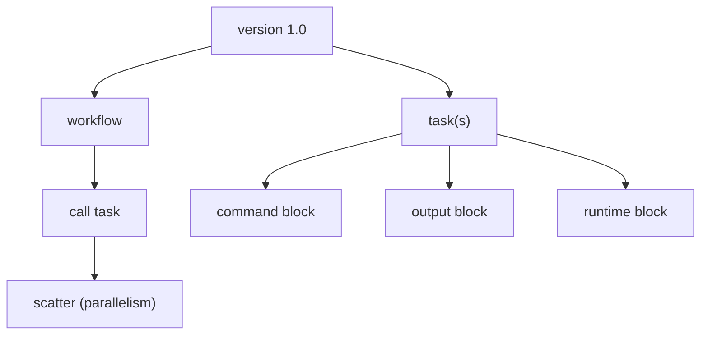

# WDL (Workflow Description Language) Expressions Cheat Sheet

> Quick reference for WDL syntax and expressions: workflow/task structure, types, string interpolation, standard-library functions, scatter/gather, and conditionals. Aligned with WDL 1.0+.

## Document Structure



## Minimal Workflow + Task

```wdl
version 1.0

workflow hello {
  input {
    String name
  }
  call greet { input: who = name }
  output {
    String message = greet.out
  }
}

task greet {
  input {
    String who
  }
  command <<<
    echo "Hello, ~{who}!"
  >>>
  output {
    String out = read_string(stdout())
  }
  runtime {
    docker: "ubuntu:22.04"
    memory: "2 GB"
    cpu: 1
  }
}
```

## Types

| Type | Example |
|---|---|
| `Int` | `Int count = 5` |
| `Float` | `Float ratio = 0.5` |
| `Boolean` | `Boolean flag = true` |
| `String` | `String s = "abc"` |
| `File` | `File ref = "genome.fa"` |
| `Array[T]` | `Array[Int] nums = [1,2,3]` |
| `Map[K,V]` | `Map[String, Int] m = {"a": 1}` |
| `Pair[X,Y]` | `Pair[Int, String] p = (1, "a")` |
| `T?` | Optional (may be undefined) |
| `T+` | Non-empty array constraint |

## String Interpolation (Placeholders)

| Syntax | Context | Notes |
|---|---|---|
| `~{expr}` | Preferred everywhere | Recommended since WDL 1.0 |
| `${expr}` | Legacy | Still valid in command blocks |
| `~{sep="," arr}` | Join an array | Custom separator |
| `~{default="x" opt}` | Optional fallback | Value if undefined |
| `~{true="--yes" false="" flag}` | Boolean flag | Emit flag conditionally |

## Common Standard-Library Functions

| Function | Purpose |
|---|---|
| `read_string(File)` | File contents as a trimmed String |
| `read_lines(File)` | File as `Array[String]` |
| `read_int` / `read_float` / `read_boolean` | Typed single-value reads |
| `write_lines(Array[String])` | Write array to a File |
| `stdout()` / `stderr()` | Task standard streams as File |
| `length(Array)` | Element count |
| `select_first([a, b])` | First non-null value |
| `select_all(Array[T?])` | Drop nulls |
| `defined(x)` | True if optional is set |
| `basename(File[, suffix])` | File name without path (and suffix) |
| `sub(str, pattern, repl)` | Regex replace |
| `range(n)` | `[0, 1, ..., n-1]` |
| `zip(a, b)` | `Array[Pair[X,Y]]` |
| `flatten(Array[Array[T]])` | Collapse one nesting level |

## Scatter (Parallelism) & Gather

```wdl
scatter (sample in samples) {
  call align { input: reads = sample }
}
# Outputs auto-gather into an array:
Array[File] bams = align.bam
```

## Conditionals

```wdl
if (do_qc) {
  call run_qc { input: bam = align.bam }
}
# Result is optional because the block may not run:
File? qc_report = run_qc.report
```

## Operators

| Operators | Notes |
|---|---|
| `+ - * / %` | Arithmetic (`+` also concatenates Strings) |
| `== != < <= > >=` | Comparison |
| `&& || !` | Logical |
| `x.field` | Member access (Pair.left, struct fields) |
| `arr[i]` / `map[key]` | Indexing |

## Common Mistakes & Fixes

- **Missing `version` statement** — assume legacy draft-2 rules; always declare `version 1.0`.
- **Using `${}` outside command blocks** — prefer `~{}` everywhere in modern WDL.
- **Forgetting outputs are optional after `if`/`scatter`** — wrap with `select_first`/`select_all`.
- **Un-quoted paths with spaces in command** — quote `"~{file}"` in shell commands.
- **Assuming array order after scatter** — order is preserved, but don't rely on timing.

## Red Flags

- Tasks with no `runtime` block (non-portable across engines).
- Hard-coded absolute paths instead of `File` inputs.
- Large `command` blocks with untested shell logic.
- No `docker` image pinned to a specific tag/digest.

## Beginner-to-Pro Notes

| Level | Focus |
|---|---|
| Beginner | Read a workflow; understand tasks, inputs, outputs. |
| Advanced Beginner | Write a single task with command + runtime. |
| Intermediate Practitioner | Scatter/gather, conditionals, optionals. |
| Advanced Practitioner | Structs, imports, sub-workflows, reusable tasks. |
| Enterprise Professional | Engine portability, resource tuning, testing. |
| Architect / Strategic Lead | Pipeline standards, versioning, reproducibility. |
